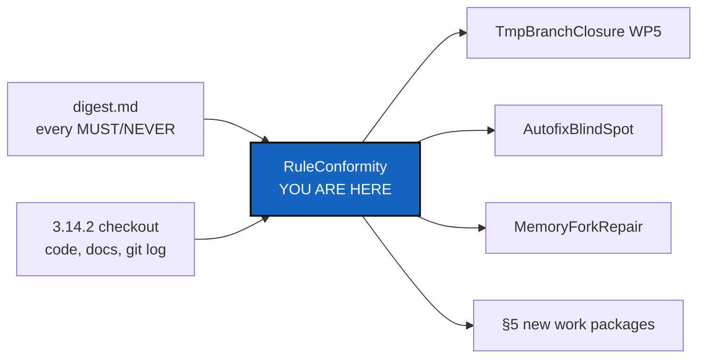

# RuleConformity — an independent audit of 3.14.2 against every MUST/NEVER rule

*Created: 2026-10-02*

*Branch: main*

> **Owner's decisions — 2026-10-02.**
> - **B3, done.** An archived ticket now has two forms: the history ticket
>   in `archive/`, whose only allowed edit is a corrected link, and an
>   immutable deep-archived copy in `archive/.deepArchive/`, from 2026-10-02
>   on (`DevTickets/README.md` §3a, one digest line). The 2026-10-01 link
>   repairs are allowed edits to history tickets.
> - **B5, done in 3.14.3.** Examples use `vendor-name` and `model-name`:
>   the `self-history add` help, `api_python.tex` and the test fixtures.
>   The rule is in `CLAUDE.md` *Attribution* and the digest.
> - **B5, scope refined — 2026-10-02, from the owner's short ticket
>   `archive/.closedUserTicket/20261002_parametric-names.md`.** The
>   placeholders hold for the public front only: the `project`-scope
>   repositories `ComplexGitSync` and `DocComplexGitSync`. Private
>   repositories are not anonymous, because they hold the values the
>   placeholders stand for: this ticket, the other specs and tickets, the
>   self-history records and the agent contracts keep the real vendor and
>   model. Checked: the 3.14.3 change touched only `src/`, `tests/` and
>   `docs/Text/`, all public, so nothing private was anonymised. The rule
>   is in `CLAUDE.md` *Attribution* and two digest lines.
> - **G7, PDF part done in 3.14.3.** Every `c_*.pdf` was rebuilt.
> - **B1, done in 3.14.4.** `ledger_store.py` names its temporary files with
>   the injected clock's `token_hex`, and `git_runner.py`'s throwaway
>   directory comes from `SystemClock.scratch_directory`. The clock check
>   now also forbids `uuid`, `os.urandom`, `random` and `tempfile` (G4).
> - **B2, done in 3.14.4.** `memory adopt` stays: it is the only way a
>   local memory gets published, and `memory setup` ends with it. It no
>   longer deletes `.git`: the local memory's commits are kept, joined to
>   the remote's base by one merge commit, and a merge that does not apply
>   cleanly is aborted, the adoption's own steps undone, and refused.
> - **B4, done.** The root `README.md` is the one document exempt from the
>   abstract rule, as the user's front page (`CLAUDE.md` *Document
>   conventions*, one digest line). `AdditionalSpecs.md` and `Versioning.md`
>   now open with an abstract and graph, and `digest.md` has its graph.
> - **WP2, WP6 (§2 correction), WP7, WP8, WP9 and WP11, done in 3.14.5.**
>   TmpBranchClosure WP5 lists the extra routes; AutofixBlindSpot §2 is
>   corrected; `tests/unit/test_rewrites_nothing.py` guards `git_runner.py`;
>   `check-build-version` runs in CI's `versioning` job; every PDF shows
>   3.14.5; the PR template points at `CLAUDE.md`. Still open on purpose:
>   G1 and G5 (AutofixBlindSpot), G3's deny list and G9 (owner), G8
>   (MemoryForkRepair; `verify` read `verified` on 2026-10-02 at the
>   second audit, to be confirmed by that ticket).
> - **All five breakages are fixed.** The gaps in §3 stay open; this
>   ticket stays at `main_1-1` until they are carried into tickets or done.

## Abstract — read this first

**The one-line version.** Version 3.14.2 breaks five rules today, none of
them by rewriting history, and ten more rules are stated but not enforced.
This ticket lists each one with its evidence and says which ticket fixes it.

**What this document is.** The report of a read-only conformity audit of
the `main` checkout and its writable mounted repositories, done by an agent
that wrote none of the code. It is written as a planning ticket so the
fixes have a home.

**Why it exists.** The owner added hard rules on 2026-10-02: ComplexGitSync
rewrites nothing, `autofix` repairs only by adding a commit, Pixi covers the
user install too, and every build is released. A rule nobody checks drifts.
This audit checks each `digest.md` line against the code, the docs and
`git log`, rather than against what the documents say about themselves.

**What you will find.** §1 how the audit was done. §2 the five breakages.
§3 the ten gaps. §4 what was checked and conforms, and the history that
predates the rules. §5 the work packages, pointing to existing tickets
where one already covers the work. §6 acceptance.

**Who it is for.** The owner, who rules on §2 and §3, and the worker and
orchestrator who carry out §5.

**What you need to do with it.** Owner: rule on the items marked "owner
rules". Worker: take the work packages in §5 in order. Nothing here asks
for a commit to be rewritten; the history in §4.2 stays as it is.

---

## 1. Method

**Version audited.** `pyproject.toml` 3.14.2, `__build__` 0003.45, root
`main` at `10f3f0e`. Every mounted repository was clean and synced.

**Read first.** `CLAUDE.md`, `digest.md`, `AgentConduct.md`, `DevSpecs.md`,
`Versioning.md`, `AdditionalSpecs.md` (*The hard prohibitions*, *Module
shape*, *The conformity score*), `TICKETLIFECYCLE.md`, `DevTickets/README.md`.

**Commands run** (all read-only):

| Command | Result |
|---|---|
| `pixi run lint` | pass |
| `pixi run test` | 1977 passed, 2 skipped |
| `pixi run check-ceilings` | pass |
| `pixi run check-spectree` | pass (two broken links reported inside the read-only `.ticketing` mount) |
| `pixi run python scripts/spec_tree.py --check-digest` | pass |
| `pixi run cgitsync status` | `errors=0`, 12 repositories, all clean and synced |
| `pixi run cgitsync verify` | `status=corrupt`, 33 findings (see G8) |
| `pixi run cgitsync branch --list` | three `tmp` branches still open on origin |
| `git grep`, `git log -p`, `git diff` | over `src/`, `scripts/`, `.github/`, `README.md`, `tutorials/`, `docs/`, and the writable mounts |

Commit messages were checked by a script over `git log` on the root and on
`docs`, `.claude`, `.localSpec`, `.dev`, `.versioning`, `.auto`, `.memory`
and `.self-history`. The cut-off for the commit-message rule is
`8ffecce` (2026-09-30 12:10), the commit that added `commit_message.py`
(AgentGuardrails). The cut-off for "every build is released" is `.versioning`
`0e24463` (2026-10-02 13:36).

**Not checked.** The pair rule (it needs the private record, which this
ticket must not quote). "One concern per commit across agents" (no
mechanical signal). "Never push without being asked" (no signal in Git).

## 2. Breakages

| # | Rule | Evidence | Fix proposed |
|---|---|---|---|
| **B1** | `universal_clock.py` is the only reader of an entropy source (`digest.md`, `CLAUDE.md` §Architecture boundary) | `src/ComplexGitSync/memory/ledger_store.py:54` `import uuid`; `:314` and `:389` `uuid.uuid4().hex` for temporary file names. `SystemClock.token_hex` already exists for this. `check-ceilings` passes because its clock list does not name `uuid` (G4). | Use the injected clock's `token_hex`. WP1. |
| **B2** | ComplexGitSync rewrites nothing, "even for a commit no remote has seen" (`digest.md`, `AdditionalSpecs.md` §The hard prohibitions) | `memory adopt` on a defaulted memory calls `DefaultMemory.retire` (`orchestre/memory_commands.py:596`), which runs `shutil.rmtree(<mount>/.git)` (`orchestre/default_memory.py:101-102`), then `git init` a new repository. Every commit `memory push` made into the defaulted memory is destroyed. The files survive; the commits do not. It is not in TmpBranchClosure WP5's list. | Owner rules. Either keep the history (adopt in place, adding the remote and a merge commit), or WP5 lists it next to `pull-force`. WP2. |
| **B3** | An archived ticket is a historical record, never edited again (`TICKETLIFECYCLE.md` §4 and its graph) | `.localSpec` commits after archiving: `20260920_UniversalClock` edited in `c6bbb45` (2026-10-01); `20260930_MemoryArchitecture` edited in `2074cb4`, `fe49825`, `ef6a6c9`, `0b4fb42` (2026-10-01). All five only repair links to renamed open tickets, which `TICKETLIFECYCLE.md` §5 asks for ("fix any link that pointed at the old path"). The two sections disagree. | Owner rules the conflict. Stop editing archived tickets; cite open tickets from them by short name (§2.2), so no link needs repair. The five edits stay. WP3. |
| **B4** | Every Markdown document opens with an abstract carrying a mermaid graph (`digest.md`, `DOCSTYLE.md` §1, §2) | Documents changed today: `README.md` has no abstract; `AdditionalSpecs.md` has neither abstract nor graph; `digest.md` has an abstract but no graph; `Versioning.md` has neither, and no `*Created:*` line (`DevSpecs.md` §Document Conventions). | Add them. WP4. |
| **B5** | The agent is named in README's *LLM assistance* section "and in no other public place" (`CLAUDE.md` §Attribution, publication rule) | Public repositories name a real vendor and model as example values: `src/ComplexGitSync/cli/help_text.py:149-150` (`--worker-vendor Anthropic --worker-model claude-opus-5-5`), `docs/Text/api_python.tex:661-662`, `tests/unit/test_agent_contract.py:14-18`, `tests/integration/test_self_history_pipeline.py:48-49`, `tests/unit/test_cli_expert.py:1215`. They are examples, not credit, but the rule as written has no exception for examples. | Neutral placeholders, or the owner writes an exception for example values into the rule. WP5. |

No code path, script, CI step, document or tutorial on `main` amends,
rebases, squashes, cherry-picks to replace, filters or force-pushes (§4.1).

## 3. Gaps

| # | Rule | What is missing | Where it is fixed |
|---|---|---|---|
| **G1** | `autofix`, for a bad commit message, names the commit and the rule and proposes ways to extract it (`digest.md`) | Not implemented on `main`: `autofix/` has no commit-message repair. The `tmpAutoFix` version is not merged, and it amends. AutofixBlindSpot §2 also says `commit()` "never validates its own message"; that has been false since `8ffecce` added `commit_message.py`. | AutofixBlindSpot WP1–WP3; correct its §2. WP6. |
| **G2** | Commands that move a branch are audited against the prohibitions (`AdditionalSpecs.md` §The hard prohibitions) | TmpBranchClosure WP5 names `close-branch`, `memory reboot`, `pull-force` and the install `checkout -B`. It misses other routes to the same code: `freeze-release-force` (runs `pull-force`); `--force-gitignore-sync` (falls back to `force_pull`, `orchestre/gitignore_sync.py:123`); `--force-reclone` and `clean-init` (delete clones that may hold unpushed commits, `orchestre/client.py:1366`); `GitRunner.reset_hard` (`git_runner.py:1376`, no caller in `src/`); and B2. | Add them to TmpBranchClosure WP5. WP2. |
| **G3** | ComplexGitSync rewrites nothing; an agent must not run such a step (`digest.md`) | Nothing checks it. No test stops `git_runner.py` building `--amend`, `rebase`, `--force`, `--force-with-lease`, `filter-branch`, `filter-repo` or a `+` push refspec. `.agent/.local/.claude/settings.json` has an allow list and no deny list. | A unit test over `git_runner.py`; a deny list is the owner's call. WP7. |
| **G4** | `universal_clock.py` is the only entropy reader (`digest.md`) | `scripts/check_module_ceilings.py:85-91` forbids only `datetime.now`/`utcnow`, `time.time_ns`, `os.getpid`, `secrets.token_hex`. It misses `uuid.uuid4`, `os.urandom`, `random`, and `tempfile` (used at `git_runner.py:1123`, whose names are random). That is why B1 passes. | Widen the list; name `tempfile` as exempt with its reason, or route it. WP1. |
| **G5** | The commit-message rule (`AgentConduct.md` §2) | Checked only inside `cgitsync commit`. A plain `git commit` in any repository is never checked, and nothing reads `git log` afterwards. | AutofixBlindSpot WP1 covers the tip commit only. WP6. |
| **G6** | Every `bump-build` is followed by `bump-version`, `patch` at least (`digest.md`, `Versioning.md`) | Nothing checks it. Build numbers are also reused across branches: `0003.37` is 3.9.2 on `main` (`cb81422`) and 3.9.1 on `tmpPyPi`; `0003.15` is 3.1.8 on `main` (`c75ef7a`) and 3.1.7 on `tmp-main-1-2_DiscoverRoundTrip`; `tmpAutoFix` reuses 3.12.0. | A CI check (CI verifies, never decides): a commit that moves `__build__` also moves `__version__`, upwards. The branches: TmpBranchClosure. WP8. |
| **G7** | Rebuild the PDFs after `bump-version` (`CLAUDE.md` step 5, `Versioning.md`) | `docs/c_architecture.pdf` and `docs/c_getting_started.pdf` show 3.11.0 on their title page; the version is 3.14.2. `Versioning.md` says rebuild "each `c_*.tex`"; `CLAUDE.md` says each one "you touched". Two files state one rule two ways (`DOCSTYLE.md` §7). | Owner picks one wording; rebuild both PDFs. WP9. |
| **G8** | A chain that verifies (`AdditionalSpecs.md` ledger) | `cgitsync verify`: `status=corrupt`, 33 findings: `seq=130 SEQ_GAP` (126–129 missing), `seq=130 BROKEN_LINK`, then 31 "chain already broken upstream". MemoryForkRepair counted 31; two entries were recorded since. `status` still shows `errors=0`. | MemoryForkRepair, unchanged. WP10. |
| **G9** | Keep README's *LLM assistance* section current (`CLAUDE.md` §Attribution) | README names Claude Opus 5 and Claude Sonnet 5. A comparison with the private record suggests the list may not be current. This ticket does not quote that record. | Owner checks against the private record. WP5. |
| **G10** | One authoritative file per purpose (`DOCSTYLE.md` §7) | `.github/PULL_REQUEST_TEMPLATE.md` points at `cli.py` and `_PLANNED_COMMANDS` "in `cli.py`" (now the `cli/` package) and has no `bump-build`/`bump-version` step. | Point it at `CLAUDE.md`'s checklist instead of restating it. WP11. |

## 4. Checked and conforming

### 4.1 Conforming today

- **A. Rewrites.** No `--amend`, `rebase`, squash, `cherry-pick`,
  `filter-branch`/`filter-repo`, `--force`/`--force-with-lease` push, or `+`
  push refspec in `src/`, `scripts/`, `.github/`, `README.md`,
  `tutorials/`, `docs/`. `push_ref_as` pushes without `+` and fails on a
  collision (`git_runner.py:764`). The `+` in `_WIDE_FETCH_REFSPEC`
  (`git_runner.py:58`) is a fetch refspec for remote-tracking refs, Git's
  own default, not a branch rewrite.
- **Commands that move a ref, classified** (for TmpBranchClosure WP5, none
  a breakage):

  | Git call | Caller | Kind |
  |---|---|---|
  | `branch -m`, `push <ref>:<new>`, `push --delete` | `close-branch` (`operations/branch.py:413-415`) | Move: pushes the new name first, so the commits stay reachable |
  | same, then `checkout --orphan` and a push | `memory reboot` (`orchestre/memory_commands.py:1256-1302`) | Move: old history kept as `<branch>.archived-<date>`; origin's branch name then holds unrelated history |
  | `checkout -B <b> FETCH_HEAD`, `clean -fd` | `pull-force`, `freeze-release-force`, `--force-gitignore-sync` | Move: drops local commits on explicit request |
  | `checkout -B <b> <sha>` | install pin (`orchestre/installer.py:809,814`) | Move: a fresh clone, nothing local to lose |
  | `reset --hard` | no caller in `src/` | Unused |

- **B. autofix.** `DivergentUserRepair` repairs by `merge --no-ff`, splices
  the chain, verifies, then adds one merge commit, and aborts the merge on
  any failure (`autofix/repair_divergent_user.py:95-124`).
  `MergeConflictRepair` only asks `can_merge_cleanly`. The help text
  proposes no rewrite.
- **C. Pixi only.** No `pip`, `pipx`, `python -m pip`, `venv`, `uv` or
  `conda` instruction in code, CLI output, README, `docs/`, tutorials, CI
  or scripts. The only mentions say it is unsupported (`README.md:56`,
  `user_guide.tex:16`). CI uses `setup-pixi`. The `pipx` route lives only
  on the unmerged `tmpPyPi`, and its ticket says "Do not implement".
- **D. Versioning since the rule.** All five commits on `main` dated
  2026-10-02 move `__version__` whenever `__build__` moves. The five targets
  agree at 3.14.2. CI has `contents: read` and never bumps.
- **E. Commit messages since AgentGuardrails.** Every hand-written message
  after `8ffecce` in the root, `docs`, `.claude`, `.localSpec`,
  `.versioning` and `.auto` has the prefix, at most three lines, no
  backtick, no `$(`, no credit trailer. `.memory`/`.self-history` messages
  are generated by `memory/repository.py:192,204`, which `CLAUDE.md`
  exempts. No credit trailer on any branch of any repository since
  2026-09-18. `cgitsync commit` refuses a bad message
  (`commit_message.py`, called at `orchestre/tree_commands.py:374`).
- **F. Privacy.** Neither public repository tracks any file under
  `.cgitsync/`. Long lines from every private self-history record were
  searched for in the root and `docs`: no match.
- **G. Architecture.** `subprocess` is imported only in `git_runner.py`.
  `check-oo`'s baseline holds only `cli/expert.py`, the exempt file.
- **H. Open tickets.** All 16 have a `*Created:*` line and a `*Branch:*`
  line that matches the filename prefix.
- **I. Docs.** Every CLI command and subcommand is in the README table and
  `user_guide.tex`. `CLAUDE.md` and `AGENT.md` are symlinks into `.claude`.

### 4.2 History that predates the rules (no action)

These are recorded so nobody "fixes" them. Fixing them would mean rewriting
history, which is forbidden.

- **Versions reused on `main`.** 3.8.0 (`7810c11`, `c95a499`, `df32d21`),
  3.2.0 (`cc5e541`, `2b33399`), 3.1.0 (six commits, `5e2c751` to
  `f518d3e`). `__build__` moved without `__version__` in `df32d21`,
  `c95a499`, `cd2659a`, `2b33399`, and five 3.1.0 commits. 3.9.1 is used by
  `a904cb4` and `976664a`; the second is docs-only, which is allowed today.
- **Prefix against the manifest.** `cd2659a` says `cgitsync3.3.0` while its
  own `pyproject.toml` says 3.2.0; it is also five lines long.
- **Messages before AgentGuardrails.** Many messages lack the prefix in
  every repository. Credit trailers last appear on 2026-09-18 (root
  `786a668`, `.localSpec`), 2026-09-09 (`docs`, `.claude`).
- **Short ticket.** `20260918_checkoutMemoryUpstream` was edited the day it
  was closed (`c0f33da`).

## 5. Work packages

| WP | Fixes | What | Done when |
|---|---|---|---|
| **WP1** | B1, G4 | Replace `uuid.uuid4()` in `LedgerStore` with the injected clock's `token_hex`. Add `uuid`, `os.urandom` and `random` to the clock-seam list in `check_module_ceilings.py`; route or exempt `tempfile` by name, with the reason. `bump-build`, then `bump-version patch`. | `grep uuid src/` is empty; a planted `uuid.uuid4()` fails `check-ceilings` |
| **WP2** | B2, G2 | Add to **TmpBranchClosure** WP5: `DefaultMemory.retire`, `freeze-release-force`, `--force-gitignore-sync`, `--force-reclone`/`clean-init`, and the unused `reset_hard`. For `retire`, propose keeping the history: adopt the existing repository in place, add the remote, and join it to the remote base with a merge commit. | The owner's ruling on each is in `AdditionalSpecs.md` |
| **WP3** | B3 | Owner rules `TICKETLIFECYCLE.md` §4 against §5. It is a shared, read-only mount, so the change goes upstream in `.ticketing`. Here, an archived ticket cites open tickets by short name, never by ranked path. Cross-reference **TicketTreeMove** (citation by name). | No archived ticket is edited after its archiving commit |
| **WP4** | B4 | Add an abstract and a graph to `README.md` (for users, plain), `AdditionalSpecs.md`, `digest.md` (graph only) and `Versioning.md` (plus its `*Created:*` line). Optionally make `spec_tree.py --check` fail on a spec without both (`DOCSTYLE.md` §8). | The four files open with an abstract and a graph |
| **WP5** | B5, G9 | Replace the real vendor and model in the help example, `api_python.tex` and the test fixtures with neutral placeholders, or the owner writes an exception for example values into the publication rule. The owner checks README's list against the private record. | `git grep -i anthropic` in the root and `docs` hits only README's section, or the exception is written |
| **WP6** | G1, G5 | **AutofixBlindSpot** as planned (report, never repair). Correct its §2, which says `commit()` does not check the message. | AutofixBlindSpot's own acceptance |
| **WP7** | G3 | A unit test that fails if `git_runner.py` builds any forbidden argument (`--amend`, `rebase`, `--force`, `--force-with-lease`, `filter-branch`, `filter-repo`, a `+` push refspec). A deny list in `.claude/settings.json` is the owner's call. | The test is in `pixi run test` |
| **WP8** | G6 | A CI check over the pushed range: a commit that moves `__build__` also moves `__version__`, and the version only goes up. It reads, never writes. The `tmp` branches are **TmpBranchClosure**'s. | CI fails on a planted build-only commit |
| **WP9** | G7 | Owner picks one wording for the PDF rule; the other file points to it. Rebuild `c_architecture.pdf` and `c_getting_started.pdf`. | Every tracked PDF shows the current version |
| **WP10** | G8 | **MemoryForkRepair**, unchanged. Its §1 count is now 33, not 31. | `cgitsync verify` shows the chain intact |
| **WP11** | G10 | Point the PR template at `CLAUDE.md`'s checklist; drop the stale `cli.py` paths. | The template names no file that is gone |

Order: WP1 and WP2 first (they touch code under the hard rules), then
WP10 (it gates TmpBranchClosure), then the rest. **PackageHygiene** needs
no change from this audit: nothing on `main` breaks Pixi-only.

## 6. Acceptance

- Every breakage in §2 is fixed, or the owner has ruled it allowed and the
  ruling is written in the spec it belongs to.
- No work package amends, rebases, squashes, filters, force-pushes or
  rewrites a commit message. The history in §4.2 is left as it is.
- `pixi run lint`, `pixi run test`, `pixi run check-ceilings` and
  `pixi run check-spectree` pass; `cgitsync status` shows `errors=0`.
- Each work package that changes `src/` or a script carries its
  `bump-build` and `bump-version` (`patch` at least).
- A second audit, run the same way as §1, finds no breakage.
