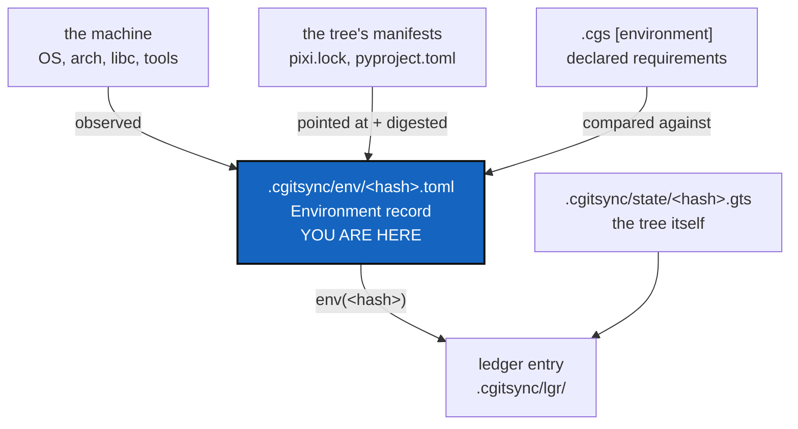

# TreeEnvironment — what a machine must have before a `.gts` can be restarted

*Created: 2026-09-19*

*Branch: main*

> **Ticket review — 2026-09-19, same day it was opened.** Moved from
> `memory-dev_1-1` to `main_1-1` on the owner's decision, and it is now
> the only prioritary ticket in the tree. Two reasons it belongs on
> `main`. First, precedent: the 2026-09-18 review already moved
> [MemoryArchitecture](main_2-1_MemoryArchitecture_DevPlanTicket.md) and
> [StateLocking](main_2-3_StateLocking_DevPlanTicket.md) onto `main`
> because their work is "scoped to the State area and ledger, not to
> anything still exclusive to `memory-dev`" — this ticket is the same kind
> of work. Second, the reason `memory-dev` exists at all is to keep a
> half-migrated memory format away from users; this ticket migrates no
> format. Its ledger field is additive and absent on older entries, so
> every chain already written verifies byte for byte with nothing to
> migrate (§3, §7). See §6.1 for how it sits against the three priority-2
> tickets on `main`.

> **Owner ticket — `shortTickets/dependencies.md`, 2026-09-19:** *"all
> dependencies must be listed in lgr and their version. They are of
> multiple type: os : environnement or/and kernel / cgitsync version /
> python + packages (including version ???) / software + version pixi,
> git, dvc, git-lfs, gh / + what is needed to reconstruct the
> environnement and the tools needed, for instance compilers if needed.
> Here we need to think carefully what is redundant from pixi.toml and
> pyproject.toml of the project being rebuilt. Anyway, dependencies must
> be acknowledge on readme.md at the end ?"*
>
> **Owner direction, same day, in conversation:** audit the repo and
> produce the checklist of what it takes to rebuild the environment that
> restarts a `.gts`; a `tree-env.py` class managing that job is probably
> the right shape — *"a sort of pixi ledger for now, that may become the
> basis for a self env builder for gitTree"*. Priority very high: it is a
> part of memory that has never been addressed, and it belongs to the
> private/local side.

## Abstract — read this first

**The one-line version.** A State says what tree you had; nothing says
what machine you needed to rebuild it. This ticket records that, beside
the State and never inside it, and gives it a class of its own.

**What this document is.** The design for an **Environment record**: the
observed facts about the machine that produced a State, content-addressed
like a State, pointed at by one new ledger field, and built by a new
`tree_env.py`.

**Why it exists.** `cgitsync initialise <state.gts>` restores every
repository at the right commit and stops there. Getting from that tree to
a tree you can actually *work in* takes a Python, a pixi, a platform the
lock file resolves for, a provider CLI, and sometimes a compiler — and
not one of those is written down anywhere. A memory that cannot say what
it ran on answers "what did I have" and not "what do I need", and the
second question is the one somebody asks two years later.

**What you will find.** §1 what restarting a `.gts` really takes, step by
step, and where it breaks. §2 **the checklist** — six groups, every row
marked recorded or missing. §3 where the record lives, and why not in the
State. §4 `tree_env.py`. §5 eight decisions, with a recommendation each.
§6 work packages, and §6.1 why this runs ahead of the three priority-2
tickets on `main`. §7 acceptance. §8 what this refuses to do.

**Who it is for.** Whoever builds it, and the owner, who owns D1, D6, D7
and D8.

**What you need to do with it.** Read §2 — it is the deliverable the short
ticket asked for. Then answer §5's four owner decisions; §6 can start on
WP1 without them.



---

## 1. What restarting a `.gts` actually takes

Four steps. The State covers one of them.

| # | Step | What it needs | Recorded today |
|---|---|---|---|
| 1 | Get `cgitsync` itself: `git clone`, `cd`, `pixi install` | git, pixi, and a platform `pixi.lock` was solved for | **nothing** |
| 2 | `pixi run cgitsync initialise <state.gts>` | network, a credential per remote, the right protocol | **the State — this step is well covered** |
| 3 | Make the restored tree workable: `pixi install` in the repository that owns the environment | pixi, the same platform, and knowing *which* repository that is | **nothing** |
| 4 | Build anything that is not a pure-Python package | compilers, system libraries, a TeX installation for `docs/` | **nothing** |

Step 2 is the one this project already solved, and it is the one everybody
thinks of when they say "restore a tree". Steps 1, 3 and 4 are the reason
a restored tree is not a working tree.

Step 3 hides the sharpest gap: **nothing in a `.cgs` or a `.gts` says
which repository in the tree owns the environment.** In this project it
happens to be the root one, because the root repository is the tool. In a
tree of nineteen repositories where the build lives in one of them, a
person restoring the State has to guess.

## 2. The checklist

This is what the short ticket asked for. Six groups. "Where today" names
the file that holds the fact now; **missing** means nothing holds it.

### Group A — the machine, which nothing can restore

| Fact | Why a rebuild needs it | Where today |
|---|---|---|
| CPU architecture (`x86_64`, `aarch64`) | Decides which half of a lock file applies. A lock solved for `linux-64` does not install on `osx-arm64` | **missing — load-bearing** |
| Pixi platform token (`linux-64`, `osx-arm64`, `win-64`) | The one string pixi itself resolves against. Derived from the OS and the architecture, and worth storing rather than re-deriving | **missing — load-bearing** |
| OS identity and version (`ID`/`VERSION_ID` from `/etc/os-release`, or the macOS/Windows equivalent) | Conda-forge builds carry a minimum platform; a restore onto an older one fails at install, not at runtime | **missing** |
| libc flavour and version (glibc vs musl) | Same reason, and it is the usual cause of a lock that installs everywhere except one machine | **missing** |
| Kernel release | Cheap, and it is what distinguishes a container from its host when two records disagree and nothing else does | **missing — low value, record anyway** |

### Group B — the tools `cgitsync` drives

| Tool | Why | Where today |
|---|---|---|
| `cgitsync` | ✓ | ledger entry `toolchain` |
| `git` | ✓ | ledger entry `toolchain` |
| `pixi` | ✓ | ledger entry `toolchain` |
| `dvc` | ✓ (recorded `none` unless a data backend was touched) | ledger entry `toolchain` |
| `git-lfs` | ✓ (same rule) | ledger entry `toolchain` |
| **Python** — the interpreter running `cgitsync` | **The largest single gap.** The whole tool is a Python program and no record says which Python ran it. `pixi.toml` pins `3.11.*`; `pyproject.toml` allows anything `>=3.11`. The two disagree by design, and only the record can say which one was true | **missing — load-bearing** |
| **`gh` / `glab` / `tea`** | `create-repo` — and therefore `memory onboard` — cannot run without the one that matches the provider (`provider.py`'s `PROVIDER_TOOLS`). The README never names them | **missing** |
| SSH client / agent | Every `access_protocol = "ssh"` remote needs one. Recording that it was present is the difference between "the remote is gone" and "this machine cannot speak SSH" | **missing** |
| `latexmk` / TeX | Only `docs/` needs it, and only a developer. Belongs in Group E (declared), not here (observed) | **missing — by design, see Group E** |

**A second finding, from reading a real entry.** Versions are stored as
the tool's own prose:

```toml
git = "git version 2.43.0"
pixi = "pixi 0.66.0"
```

A human reads that fine. Anything asking "is git at least 2.43" has to
re-parse a different prefix per tool. See D4.

### Group C — the tree's own manifests

This is where the short ticket's *"what is redundant from pixi.toml and
pyproject.toml"* is answered, and the answer is a rule:

> **Never copy a manifest. Always point at it, and digest it.**

The State already pins every repository's `commit_sha`. Checking out that
State restores every `pixi.toml`, `pixi.lock`, `pyproject.toml` and
`requirements.txt` in the tree, byte for byte, for free. Copying their
contents into a memory would duplicate what Git already guarantees, on
every command, for ever — and the copy could drift from the commit beside
it, which is worse than not having it.

What the memory must add is the part Git does not answer on its own:

| Fact | Why | Where today |
|---|---|---|
| **Which repository owns the environment root** — where `pixi install` is run | §1's step 3. Nothing says it | **missing — load-bearing** |
| Which manifests each repository carries, by tree-relative path | So a rebuild knows there are three environments and not one, without walking a tree it has not cloned yet | **missing** |
| A digest of each manifest at the recorded commit | Proof that what the State restores is what was in force. Cheap, and it turns "probably" into "yes" | **missing** |
| Which platforms `pixi.lock` was solved for | A lock lists its platforms; a record that the tree was only ever *observed* on one of them is a different fact, and the useful one | **missing** |
| The manifests' **contents** | — | **in Git. Do not record** |

So `python + packages (including version ???)` from the short ticket is
covered entirely by a pointer, for any repository that has a `pixi.lock`:
the lock pins every package and its exact build. The question mark in the
owner's words is the right instinct — recording a package list would be
the redundancy, and the pointer is not.

### Group D — what `pixi.lock` does not give

Worth stating so the pointer is not mistaken for a complete answer:

- Nothing installed outside pixi — a system package, a hand-built tool, a
  `~/.local/bin` script — appears in no lock file.
- A repository with no manifest at all still has an environment; it is
  just undeclared. The record should say "none found", not stay silent.
- The interpreter that ran `cgitsync` is not necessarily the one the lock
  describes, which is Group B's Python row again from the other side.

### Group E — requirements that cannot be observed

Observation says what a machine *had*. Only the author can say what the
tree *needs*. Compilers are the owner's own example: a machine that
compiled nothing still has `cc`, and a machine that needs `gfortran`
cannot be asked about it after the fact.

These belong in the `.cgs`, hand-authored, as an optional `[environment]`
table: required tools with minimum versions, compilers, system libraries,
and any service the tree assumes. Nothing validates them until a rebuild
compares them against an Environment record — which is exactly the drift
report in §4.

| Fact | Where it goes |
|---|---|
| Compilers and build toolchains | `.cgs` `[environment]` — declared |
| System libraries outside conda | `.cgs` `[environment]` — declared |
| Minimum version of an observed tool | `.cgs` `[environment]` — declared |
| `latexmk` / TeX for `docs/` | `.cgs` `[environment]`, developer spec only |

### Group F — credentials

**Recorded as facts, never as values.** A memory gets pushed; this is the
same rule that already keeps absolute paths out of a State.

| Fact | Recorded |
|---|---|
| Which protocol each remote used | Already in the `.gts` as metadata (`access_protocol`) ✓ |
| Whether the provider CLI was authenticated at the time | A yes/no. Useful, because "not installed" and "not logged in" need different fixes — `provider.py` already draws that distinction for the user |
| A token, a key, a user name, a key path | **Never.** Not hashed, not scrubbed, not present |

## 3. Where the Environment record lives

**Beside the State, content-addressed, pointed at by the ledger.**

```
.cgitsync/env/<hash>.toml        the Environment record
.cgitsync/state/<hash>.gts       the State            (unchanged)
.cgitsync/lgr/<seq>.toml         the entry, now carrying environment = "env(<hash>)"
```

### Why not inside the `.gts`

Because the State's name is computed from what the workspace **is**, and
an environment is what one machine **had**. `AdditionalSpecs.md`'s
*Identity, or metadata* table already puts toolchain versions on the
metadata side, and already records what happens when that line is crossed:
canonicalisation version 2 hashed the running package's own version, and
two machines on two builds computed two names for one tree. Hashing an
environment into a State would do the same thing, harder — every OS
upgrade would rename every State in the workspace.

### Why not inline in the ledger entry

Size. The five version strings cost about a hundred bytes and are written
by every command, which is why D6 of
[MemoryArchitecture](main_2-1_MemoryArchitecture_DevPlanTicket.md) could
say "all five, every time". A record carrying a per-repository manifest
table is kilobytes. Content-addressing collapses a hundred identical
observations into one file and one repeated hash — the same trick, and the
same reasoning, that already names a State by its content.

### What changes in the entry schema

One additive field, following `commit_log`'s precedent exactly:

| Field | Meaning |
|---|---|
| `environment` | `env(<hash>)` — the Environment record in force. **Absent** when none was observed, so an entry written before this field existed hashes to exactly what it hashed to then |

`toolchain` stays as it is, five tools in every entry. It is not
duplication worth removing: it is what lets a single entry, cut out of a
chain whose `env/` directory did not travel with it, still say what made
the record. `tree_env.py` calls `toolchain.py` for those five, so the two
can never disagree.

## 4. `tree_env.py`

Two modules, because observing and storing are different rings.

### `tree_env.py` — Ring 2

Observes the machine and the tree, and compares what it found against what
a `.cgs` declared. Every subprocess question goes through `git_runner`
(`tool_version`, `run_tool`), so the one-`import subprocess` rule holds.
Imports `toolchain`, `git_runner`, `cgs_format`.

| Name | Does |
|---|---|
| `TreeEnvironment` | Frozen dataclass: the machine (Group A), the tools (Group B), the manifests (Group C), the credential facts (Group F) |
| `observe(git_runner, tree)` | Builds one. Cached per process, exactly as `toolchain.py` caches — an environment does not change mid-command |
| `TreeEnvironment.digest()` | `sha256` over an explicit, sorted field list. Same canonicalisation discipline as `ledger_entry` and `GtsDocument`, and versioned the same way, so a future field cannot silently rename yesterday's records |
| `Requirements.from_cgs(document)` | Group E's declared table, or empty |
| `compare(observed, required)` | A `Drift`: what is missing, what is older than declared, what the tree has that nothing declared. Data, not a verdict — the caller decides whether that is a warning |
| `rebuild_plan(record)` | **WP6, stand-by.** The commands that would reproduce it. This is the "self env builder" the owner named; the shape above exists so it can be added without redesigning anything |

### `memory/environment.py` — Ring 1

Writes and reads `.cgitsync/env/<hash>.toml`: temp file, `fsync`, one
rename, exactly as a State is written. Mirrors `states.py` closely enough
that it should be read alongside it.

### Why not extend `toolchain.py`

`toolchain.py` is 113 lines with one job — the five strings that go inside
a hashed entry field — and that job is finished and load-bearing.
Growing it into a machine profiler would put a field that must never
change beside a set of fields that will keep growing. `tree_env.py`
imports it.

## 5. Decisions

| D | Question | Recommendation | Whose call |
|---|---|---|---|
| **D1** | Where does the record live? | Beside the State, content-addressed (§3) | **Owner** |
| **D2** | Does the entry schema change? | Yes — one additive `environment` field, absent when unobserved, like `commit_log` | Owner, with D1 |
| **D3** | What does observing cost, per command? | Observe once per process and cache, as `toolchain.py` does. Roughly five cheap subprocesses plus one `/etc/os-release` read. `dvc` stays behind the same `backends` flag it has now, for the same reason | Implementer |
| **D4** | Raw version strings or parsed? | **Both.** Keep `raw` exactly as the tool printed it — never rewrite what a tool said — and add a parsed `version` beside it, `none` when the tool is absent and `unparsed` when the prose did not yield one. Today's `"git version 2.43.0"` is unusable by anything asking a minimum-version question | Implementer |
| **D5** | Which manifests are recognised? | A fixed list — `pixi.toml`, `pixi.lock`, `pyproject.toml`, `requirements*.txt`, `environment.yml`, `package.json`, `Makefile`, `.tool-versions` — extensible per tree through `[environment]`. Recognising everything makes the record noise; recognising nothing makes it useless | Implementer |
| **D6** | Does the `.cgs` declare an environment root? | Yes: `environment_root = "<repo>"` plus the `[environment]` table of Group E. It is the answer to §1's step 3 and it cannot be observed | **Owner** |
| **D7** | Where do dependencies go in the README? | The owner asked "at the end?". **Recommendation: both, and the important half is not at the end.** A short *Prerequisites* table in §1.2, where a user meets `pixi install` and finds out git, pixi and a provider CLI are assumed; a full table near *Further reading* for the complete picture. Prerequisites discovered at the end of a document are discovered after the failure they would have prevented | **Owner** |
| **D8** | What does a mismatch do? | Warn, never refuse. `initialise` and `pull` name the drift and continue; a separate `cgitsync env check` exits non-zero for CI. A record is evidence, and evidence that blocks a command turns a useful observation into an obstacle the user learns to bypass | **Owner** |

## 6. Work packages

| WP | Does | Depends on |
|---|---|---|
| **WP1** | `tree_env.py` observing Groups A, B and F; `cgitsync env` prints it. Nothing is stored yet — the smallest thing that works and can be shown | — |
| **WP2** | The README and `docs/Text/user_guide.tex` prerequisites tables (D7). **Rides WP1 and could go first**: the gap it closes — a user never being told they need `gh` — hurts people today, and needs no design | D7 |
| **WP3** | `memory/environment.py`, content-addressed storage, and the `environment` ledger field. `memory show` prints the record for a State | WP1, D1, D2 |
| **WP4** | Group C: manifest discovery across the restored tree and per-manifest digests | WP3 |
| **WP5** | Group E: the `.cgs` `[environment]` table and `environment_root`; `compare()`; `cgitsync env check` with D8's exit rule | WP4, D6, D8 |
| **WP6** | `rebuild_plan()` — the self env builder. **Stand-by**, its own ticket when WP5 has run for a while | WP5 |

[Versioning](main_1-2_Versioning_DevPlanTicket.md) waits on WP3 too, and
for the same reason: a version record is provenance about a State, the
same shape of thing as an Environment record, and it should reuse this
ticket's content-addressed store and additive ledger field rather than
build a parallel one.

[AgentReport](main_1-5_AgentReport_DevPlanTicket.md) waits on WP3 of this
ticket: it records which agent moved a project between two States, and the
owner's own framing is that the link becomes possible "once 1-1 is
implemented". Its WP1 needs nothing from here and can run alongside.

### 6.1 Why this goes before the three priority-2 tickets on `main`

It supersedes none of them — they are about three different things — but
it outranks all three, and the reason is not that it is more interesting.

**It is the only one of the four where waiting costs information.** Every
command run today writes a ledger entry that could have carried an
Environment record and does not. Entries are hash-chained and never
rewritten, so that is not a feature arriving late: it is history being
accumulated right now with a permanent hole in it. The other three are
absences of a capability, and an absent capability costs nothing by
waiting.

| Ticket | Relationship | Order |
|---|---|---|
| [MemoryArchitecture](main_2-1_MemoryArchitecture_DevPlanTicket.md) | **Neither blocks the other.** Since the 2026-09-18 review it is the architecture reference the landed code implements, not open build work. This ticket cites it — for the identity/metadata rule and for D6 — the way any memory ticket does | Independent |
| [UserInstallPath](main_2-2_UserInstallPath_DevPlanTicket.md) | **This one first, and it helps.** UserInstallPath removes Pixi as the only route in, which means an installed `cgitsync` runs under some Python nothing in this project pinned — it makes Group B's unrecorded-interpreter gap wider, not narrower. Recording the interpreter before the installs diversify is the cheap order. `cgitsync env` (WP1) is also exactly the diagnostic UserInstallPath's §5 clean-environment check wants to print | Before |
| [StateLocking](main_2-3_StateLocking_DevPlanTicket.md) | **This one first, so locking covers the final shape.** WP3 adds `.cgitsync/env/` to the state area. A concurrency design written now would be written against a directory layout about to grow a third member. The new writes are the least race-prone kind — content-addressed and write-once, so two processes observing one machine produce one file with one name — but they are still surface, and StateLocking should scope it | Before |

Specs to update when each lands, per CLAUDE.md's before-committing
checklist: `AdditionalSpecs.md`'s entry-schema table and ring table (WP3),
its `.cgs` authoring contract (WP5), CLAUDE.md's module table (WP1, WP3),
and the README command table plus `user_guide.tex` for every new command
(WP1, WP5).

## 7. Acceptance

- `cgitsync env` on this tree names the architecture, the pixi platform,
  the OS, the libc, and a version for Python, git, pixi and `gh` — or
  `none` where a tool is absent, never an empty string.
- Two runs on an unchanged machine produce the same digest. A `pixi
  self-update` between them produces a different one.
- Running the same tree on two machines produces two Environment records
  and **one** State hash. This is the test that proves the environment
  never leaked into identity, and it is the one that must never be
  removed.
- A ledger entry written before this field exists still verifies, byte for
  byte, with no migration.
- No record anywhere contains a token, a key path, a user name, or an
  absolute path outside `$CGSTREE`.
- `pixi run lint` and `pixi run test` pass, and `cgitsync status` on this
  tree shows `errors=0`.

## 8. What this refuses to do

- **It does not copy a manifest.** Git holds `pixi.lock`; the record holds
  a path and a digest.
- **It does not enter a State's name.** An environment is metadata for
  ever. Two machines holding one tree must agree on what they hold.
- **It does not record a secret**, nor a path that would identify the
  person who ran the command.
- **It does not block a command** on a mismatch (D8).
- **It does not install anything.** WP6 plans a rebuild; running it is a
  later decision and a different ticket.
