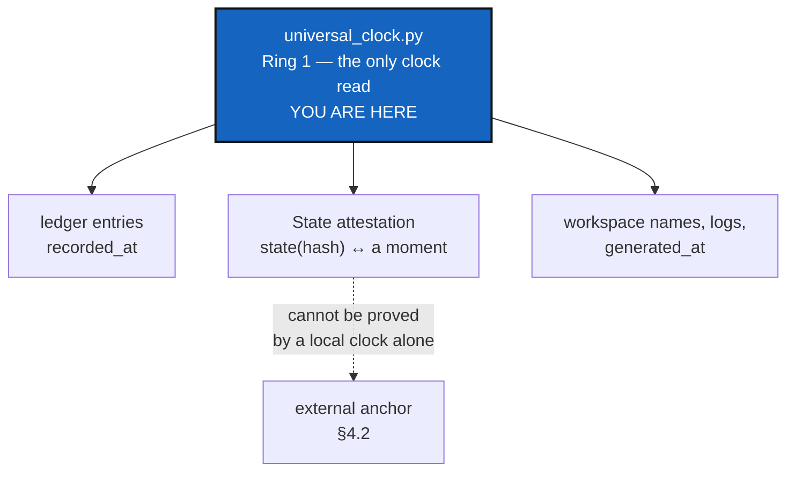

# UniversalClock — one owner for "what time is it", and what that can prove about a State

*Created: 2026-09-20*

*Branch: main*

> **Owner ticket — `shortTickets/universal-clock.md`, 2026-09-20:**
> *"universal-clock.py must be an independent script that will be the one
> in charge of timestamping too. For now it serves to securise the gts."*

> **Ranked 1-1, ahead of [TreeEnvironment](main_1-2_TreeEnvironment_DevPlanTicket.md),
> which the owner had called very high.** Not a demotion of that ticket —
> a dependency claim, and the owner should overrule it if they disagree.
> Everything queued behind this writes timestamped records: an environment
> record, a release row, a `.self-history` entry. Each one built before the
> clock has an owner is another set of call sites to migrate afterwards.
> This module is small and it is the seam those records should be written
> through from their first line.
>
> It also finishes what [ClockSeam](../archive/20260920_ClockSeam_DevPlanTicket.md)
> started and deliberately left: that ticket fixed the two sites a test had
> an opinion about and listed the rest *"so that the next person adding a
> dated assertion knows the seam exists"*. This is that next person.

## Abstract — read this first

**The one-line version.** Time is meant to be the backbone of a cgitsync
memory, and today nine modules read the wall clock independently, nothing
checks that the recorded moments make sense, and no question can be asked
in terms of them.

**What this document is.** The design for `universal_clock.py`: one module
owning every read of time, the check that makes a recorded moment
trustworthy, and the way a State becomes findable *by* time.

**Why it exists.** A State's name says *what* a tree was and — by a rule
this project has defended twice — never *when*. That is correct and it is
not the end of it: "when" then has to be carried by the memory instead,
rigorously enough to be relied on. Today it is carried by nine scattered
`datetime.now()` calls that nothing validates.

**What you will find.** §1 what ClockSeam left. §2 the module and where it
sits. §3 two defects found in the existing anchor code. §4 time as the
backbone — the three properties "trackable by time" needs, and which are
missing. §5 decisions. §6 work packages. §7 acceptance. §8 what this
refuses.

**Who it is for.** Whoever builds it, and the owner for §5.

**What you need to do with it.** Read §4.1's three properties, then §4.2.
The second one is small, local, costs a comparison per entry, and is what
turns a recorded date into a checked one — it is the piece that makes the
rest worth having.



---

## 1. What ClockSeam left

It closed two sites and named the rest. Those rest are still open, and the
count is exact:

| Module | Reads | What for |
|---|---|---|
| `orchestre.py` | 3 | a run-log filename, a `moment` field, a log filename |
| `settings.py` | 2 | a workspace directory name, `generated_at` |
| `memory/store.py` | 2 | register timestamps |
| `paths.py` | 1 | a workspace directory name |
| `registry.py` | 1 | the `.gts`'s own `generated_at` |

Plus the real implementation itself, `SystemClock`, which lives in
`orchestre.py` — **Ring 3**. That placement is the reason the others never
used it: a Ring-1 or Ring-2 module cannot import Ring 3, so `settings.py`
and `memory/store.py` had no choice but to read `datetime.now(UTC)`
themselves. The seam was unreachable from most of the code that needed it.

`ComplexGitSyncClient` now holds a `clock` field (ClockSeam WP2), and
`build_next_entry` takes one. Everything else still reads the module-level
`datetime`.

## 2. The module

### 2.1 Its name

`universal_clock.py`, underscored. The owner wrote `universal-clock.py`;
Python cannot import a module with a hyphen in its name, and every module
in `src/ComplexGitSync/` is already snake_case.

### 2.2 "Independent script" — a module, not a `scripts/` entry

`scripts/` holds `bump_version.py`, `check_module_ceilings.py` and
`tikz2mermaid.py`: standalone programs run by a person, never imported by
`src/`. A clock that everything imports cannot live there.

So "independent" is read as **a module that owns this concern alone and
depends on nothing else** — which is exactly what it should be, and what
`SystemClock` failed to be by living inside a 5000-line orchestration
module. D1 confirms the reading.

### 2.3 Ring 1, and why it cannot be Ring 0

The natural instinct is Ring 0 — a clock looks pure. **The ring rules
forbid it explicitly**: *"Ring 0 performs no I/O at all — no `subprocess`,
no `open()`, no `pathlib` writes, no `os.environ`, no clock reads."*
Reading a clock is the named example.

So the split already in the code is the right one and only needs moving:

| Piece | Ring | Where |
|---|---|---|
| `ClockProtocol` — the interface | 0 | stays pure; it reads nothing |
| The real implementation | **1** | moves down from `orchestre.py`'s Ring 3 |

Ring 1 is the lowest a clock read may sit, and it is reachable by Rings
1–4 — every module in §1's table. That single move is most of the value
here: it turns a seam nobody could reach into one everybody can.

`ClockProtocol` currently lives in `memory/ledger_entry.py`, which is a
memory-specific home for something about to become universal. D2.

## 3. Two defects in the anchor code, found while planning this

`memory/ledger_entry.py` carries `new_time_l0_anchor`, `TimeL0State` and
`hash_time_l0_anchor`, inherited from a deleted `L0.py`. They are unit
tested. **Nothing in `src/` calls them** — the only non-test references are
the re-export in `memory/__init__.py` and a docstring mention. If
universal-clock is to do timestamping, this is the code it would build on,
so both defects matter now.

### 3.1 The anchor throws away the thing that would make it provable

```python
private_anchor = f"TIME-L0:{instant}:{time_ns}:{pid}:{token_hex(16)}"
return TimeL0State(state_hash=hash_time_l0_anchor(private_anchor))
```

`private_anchor` is a local variable. Only its hash is returned; the
pre-image is discarded when the function returns.

A commitment scheme works by publishing a hash *and keeping the secret*,
so you can reveal it later and let anyone recompute the hash. **Destroy the
pre-image and there is nothing left to reveal.** As built, the anchor
produces a unique opaque identifier and can attest nothing at all — which
is fine if identification was the intent, and fatal if timestamping was.

### 3.2 A time anchor is shaped exactly like a tree State

`TimeL0State.state_id` returns `state(<64 hex>)`. `memory/states.py`
matches State ids with `^state\(([0-9a-f]{64})\)$` and builds them with
`_format_state_id`. **The two are indistinguishable**: an anchor id parses
as a State id and vice versa.

Nothing collides today because nothing emits anchors. The moment this
ticket does, a reader — human or `_STATE_ID_RE` — cannot tell a snapshot
of a tree from a moment in time. Whatever this module emits needs a
distinct form.

## 4. Time as the backbone

> **Owner direction — 2026-09-20:** *"time anchoring is fundamental for
> the project. a snapshot in the tree must be trackable by time. Time is
> the backbone of any memory of cgitsync projects."*
>
> So anchoring is not a §5 option to be weighed against its cost. It is a
> requirement, and the question is only how each layer of it is built.
> §4.1 splits it into three, of which **two are cheap, local and missing
> today** — those are the ones this ticket delivers.

### 4.1 What "trackable by time" actually requires

Three separate properties, usually collapsed into one word:

| # | Property | Status today |
|---|---|---|
| 1 | **Order** — this State came before that one | **Have it.** The hash chain proves it outright |
| 2 | **A time that cannot silently go backwards** — the recorded moments agree with that order | **Missing.** Nothing checks, and §4.2 says why that bites |
| 3 | **An outside witness** — the date means something to someone who does not trust the machine | Missing. §4.3 |

A backbone needs all three, and they are independent: the chain can be
perfect while every timestamp on it is nonsense, which is exactly the
state the project is in now.

### 4.2 The local half: the chain and the clock check each other

**This is the cheap, decisive piece, and it needs no third party.**

The chain fixes the order of entries beyond dispute. Each entry also
carries `recorded_at`. Put those together and each validates the other:
**along a chain, `recorded_at` must never decrease.** Entry *N+1* was
written after entry *N* — the chain proves that — so a timestamp that
moves backwards is not a matter of opinion. It is a detected fault.

That turns a local clock from an unchecked claim into a checked one. It
catches, without any network:

- an NTP correction or a manual `date` set in the middle of a session
- a VM or container snapshot restored to an earlier moment
- a dual-boot machine with a different idea of the hour
- **a backdated entry**, which is the tampering case — you cannot forge a
  date downward without contradicting the chain that surrounds it

It costs one comparison per entry and one new member in `Finding`
(`memory/integrity.py`, which already carries ten and is the declared home
for this taxonomy): a `TIME_REGRESSION` beside `BROKEN_LINK` and
`SEQ_GAP`, reported by `verify` like any other. `AdditionalSpecs.md`'s
register section lists that taxonomy and is updated in the same change.

**Monotonic time is what makes time a backbone rather than a decoration.**
Property 1 without property 2 gives an order with meaningless labels;
property 2 makes every label consistent with the order, which is most of
what anyone asking "when was this tree like that?" actually needs.

### 4.3 The honest limit, and the external witness

§4.2 makes local time *consistent*. It cannot make it *true*: a machine
whose clock was wrong from the start, consistently, produces a perfectly
monotonic chain of wrong dates. **Anyone who can write the files can set
the clock, and the same party writes both.** That is not an argument
against anchoring — it is the reason property 3 exists as its own layer.

This project already draws that line twice and should draw it a third
time: the register is *"tamper-evident, not tamper-proof"*, and a
conformity score says `asserted` where it is not measured. A date with no
outside witness is recorded as a claim, and labelled as one.

| Claim | After §4.2 | How |
|---|---|---|
| This State came before that one | **Yes** | The hash chain |
| Nobody edited this State afterwards | **Yes** | Its name is its content digest |
| The dates are consistent with the order | **Yes** | Monotonicity, checked by `verify` |
| This State existed by this date | Only where witnessed | §4.3's anchor |

**A timestamp must never enter the State's name.** Hashing `generated_at`
would give one tree two names on two machines — precisely the failure
canonicalisation version 3 exists to fix. Time is the backbone of the
*memory*, not of a State's identity: the ledger carries it, the name never
does.

#### The external anchor this project already has

The last row becomes provable only if something outside the machine
witnesses the State. The options, cheapest first:

| Anchor | What it gives | Cost |
|---|---|---|
| **The memory's own push** — recommended | The forge records when it received a push, and a local clock cannot backdate someone else's server. The memory is already pushed to a private remote | Nearly free: record which push carried which State, and the remote's receipt is the witness |
| RFC 3161 timestamp authority | A signed token from a third party, verifiable offline, the standard answer | A network dependency and a trust choice, on a tool whose core is offline-safe |
| OpenTimestamps / blockchain anchoring | No trusted party at all | A second network dependency and hours of confirmation latency |

The first one is worth stating plainly because it costs almost nothing:
**this project already sends its memory somewhere it does not control.**
That push is an observation it can cite. It is weaker than a TSA — it
proves "no later than", it needs the forge to be honest, and it proves
nothing about a State that was never pushed — but it is the difference
between *no* external witness and *one*.

### 4.4 Tracking a snapshot *by* time, not only recording one

*"A snapshot in the tree must be trackable by time"* is a reading
requirement as much as a writing one. Recording a moment is useless if
nothing can be asked in terms of it.

The pieces are nearly all there. States are content-addressed, the ledger
orders them, and `memory/pending.py`'s `memory_timeline` already returns
every entry in ledger order — it is what `memory explore --timeline`
prints. What is missing is the question itself:

> **What was this tree at time *T*?** — walk the chain to the last entry
> whose `recorded_at` is at or before *T*, and read its `state_id`.

That is a few lines on top of `memory_timeline`, and it is only correct
**because** of §4.2: an as-of query over non-monotonic timestamps returns
a confident wrong answer, silently. The monotonicity check is what makes
time answerable rather than merely present.

Worth stating as the shape of the capability, not the command surface —
whether it is `memory show --as-of`, a flag on `explore`, or something
else is the implementer's call, and the CLI mirror rule applies either way
(a client method carrying the semantics, a thin CLI pair, the README table
and `user_guide.tex` updated).

## 5. Decisions

| D | Question | Recommendation | Whose call |
|---|---|---|---|
| **D1** | Module under `src/ComplexGitSync/`, or a `scripts/` program? | **A module** (§2.2). `scripts/` is not importable by the package, and every caller in §1 is inside it | **Owner** |
| **D2** | Does `ClockProtocol` move out of `memory/ledger_entry.py`? | Yes — the interface belongs with the clock, not with the ledger. `ledger_entry.py` is Ring 0 and self-contained by rule, so it keeps a structurally identical Protocol of its own or imports the Ring-0 half. Protocols are structural; nothing breaks either way | Implementer |
| **D3** | All nine call sites at once, or only the ones that matter? | **All nine.** They are one-line changes, and the point of a universal clock is that there is no tenth. A module named "universal" that owns six of nine reads is worse than none | Implementer |
| **D4** | What happens to the TIME-L0 anchor code (§3)? | **Decide, do not inherit.** Either it becomes this module's attestation primitive — and §3.1 is fixed by retaining the pre-image, §3.2 by giving it its own id form — or it is deleted as a tested-but-unused leftover. Carrying it forward unchanged is the one option that helps nobody | **Owner** |
| **D5** | How far does time anchoring go (§4)? | **Not a question of whether — the owner settled that on 2026-09-20.** Properties 1 and 2 (order, monotonicity) are required and land in this ticket; they are local and cheap. Property 3's first anchor is the push, for the same reason. **What is still open is only whether a TSA follows**, and that is a roadmap call, not a scoping one | **Owner** |
| **D7** | Does a time regression fail `verify`, or only report? | **Report as a finding, exit non-zero like any other** — `verify`'s contract is that "corrupt" means the chain does not hold, and a backwards timestamp is the chain disagreeing with itself. But it must be its own finding (`TIME_REGRESSION`), never folded into `BROKEN_LINK`: the two have different causes and different fixes, and a clock correction is not history rewriting | **Owner** |
| **D6** | Is the attestation part of the State file, or beside it? | **Beside it**, cited by hash. `generated_at` may stay in the `.gts` as the unverified local claim it already is; the attestation is a separate record that points at `state(<hash>)`. Nothing time-related enters the canonical payload, ever (§4.1) | Implementer |

## 6. Work packages

**WP1 and WP2 depend on nothing and are the whole "one owner" half.**

| WP | Does | Depends on |
|---|---|---|
| **WP1** | `universal_clock.py` at Ring 1, holding the real implementation moved out of `orchestre.py`. `AdditionalSpecs.md`'s ring table and CLAUDE.md's module table updated in the same change, as the architecture rule requires | D1, D2 |
| **WP2** | All nine direct reads (§1) go through it. A test asserts there is no tenth — a grep-style check in `check_module_ceilings.py`, beside the Ring-0 purity check it already runs | WP1, D3 |
| **WP3** | **Monotonic time (§4.2)**: `TIME_REGRESSION` added to `Finding`, checked by `verify_chain`, reported by `verify`, and written into `AdditionalSpecs.md`'s register taxonomy. Local, cheap, no network — and the piece that makes every later one mean something | WP1, D7 |
| **WP4** | The TIME-L0 decision (D4) carried out: fixed and adopted, or deleted with its tests | D4 |
| **WP5** | Attestation: a record binding `state(<hash>)` to a moment, beside the State, never inside it (D6) | WP1, WP4 |
| **WP6** | **As-of retrieval (§4.4)**: "what was this tree at time *T*", built on `memory_timeline`, as a client method with a thin CLI pair | WP3 |
| **WP7** | The push anchor (§4.3): record which push carried which State, so the remote's receipt is citable | WP5, D5 |

## 7. Acceptance

- **`datetime.now`, `time.time_ns`, `os.getpid` and `secrets.token_hex`
  appear in exactly one module** of `src/ComplexGitSync/`, and a check
  fails if a tenth call site appears.
- A test can run the whole suite at any fixed instant by injecting one
  clock, with no `monkeypatch` of a module-level `datetime` anywhere.
- Two machines holding the same tree at different moments still compute
  **the same State hash** — the attestation never touched the name.
- An attestation names the State it attests, and a reader can tell an
  attestation id from a State id at a glance (§3.2).
- **A chain whose timestamps move backwards is reported as
  `TIME_REGRESSION`, by name, and is not confused with a rewritten
  history** (§4.2, D7). Set the clock back mid-session and `verify` says
  so.
- **"What was this tree at time *T*?" is answerable** from the memory
  alone, and the answer is a State hash (§4.4).
- The documentation says what each layer proves: order and consistency
  from the chain, absolute time only where something outside the machine
  witnessed it (§4.3).
- `pixi run lint`, `pixi run test` and `pixi run check-ceilings` pass;
  `cgitsync status` shows `errors=0`.

## 8. What this refuses to do

- **It does not put time into a State's name.** Not `generated_at`, not an
  anchor, not a serial. The name is what the tree is.
- **It does not call a local timestamp proof.** Where the only witness is
  the machine that wrote the record, the record says so.
- **It does not add a network dependency to an offline path.** Anchoring
  happens when something is already going to the network — a push — or not
  at all until a TSA is chosen deliberately (D5).
- **It does not keep the TIME-L0 code merely because it exists** (D4).
