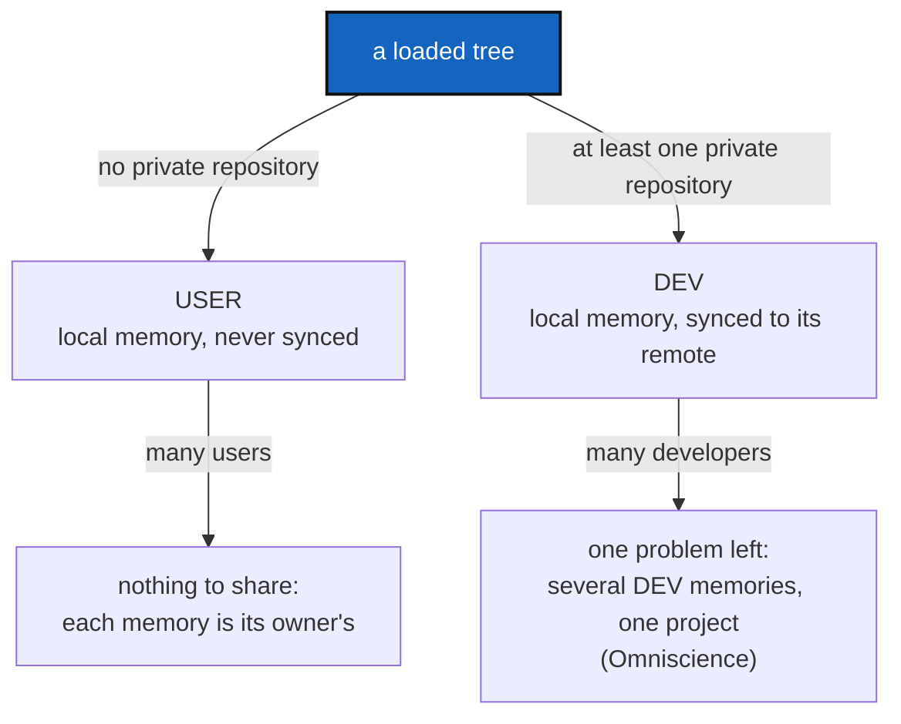

# UserDevProfile — a memory is always local; a tree holding private repositories is a developer's, and only a developer's memory is synced

*Created: 2026-09-30*

*Branch: main*

> **Ticket review — 2026-09-30, MemoryArchitecture closed.** Renumbered `main_1-2` → `main_1-1`: [MemoryArchitecture](../archive/20260930_MemoryArchitecture_DevPlanTicket.md) was archived, so the priority-1 ranks were compacted.

> Opened from the owner's short ticket `ReorderPriority-mem-multiUser.md`
> (closed 2026-09-30, `archive/.closedUserTicket/20260930_ReorderPriority-mem-multiUser.md`):
> *"One idea for unifying the strategy for answering would be 1. treat always
> the .memory as local for user and DEV. 2 Identified DEV from User, a USER
> holds no private at all. DEV does, so the local memory is synced. 3. This
> way it may be easier to treat the multi-user and multi-Dev case."*
>
> The idea makes sense, and most of its first half is already true:
> [DefaultUserMemory](../archive/20260930_DefaultUserMemory_DevPlanTicket.md)
> gave every user install a local memory that is never published. What is
> missing is the rule the owner names in point 2 — a stated, checked
> difference between a USER tree and a DEV tree — and what follows from it
> for syncing and for the multi-person case. This ticket builds that;
> `AdditionalSpecs.md`'s *Memory architecture* section (formerly the MemoryArchitecture ticket) carries
> the strategy as architecture.

## Abstract — read this first

**The one-line version.** Every workspace's memory is a local repository
first, for everyone. A tree whose `.cgs` holds no private repository is a
**USER** tree, and its memory stays on that disk. A tree that holds at least
one private repository is a **DEV** tree, and its memory is synced to a
remote. The tool says which one it is looking at.

**What this document is.** The rule (§1), what it changes (§2), how it
narrows the multi-user problem (§3), work packages (§4), decisions (§5),
acceptance (§6).

**Why it exists.** Today "is this memory published?" is answered by one
fact — whether the `.cgs` declares a memory entry — and "is this a
developer?" is answered nowhere. The two questions are really one, and
answering it once, from what the tree already declares, makes every later
memory question (who syncs, who shares, what conflicts) smaller.

**Who it is for.** Whoever implements it; the owner for §5.

**What you need to do with it.** Read §1 and §3, decide D1–D4, then §4 in
order.

---

## 1. The rule

1. **A memory is always local first.** Every command records into
   `.cgitsync` on the machine it runs on and folds into a local repository
   at `.cgitsync/.memory`. That is true for both profiles; syncing is an
   extra step on top, never a replacement.
2. **USER or DEV is read off the tree, not configured.** A tree is **DEV**
   when at least one of its repositories is effectively private
   (`WorkingRepo.effective_private`, after `propagate_privacy`), and **USER**
   otherwise. `install.cgs` mounts no private repository, so a user install
   is USER by construction; `examples/complexgitsync4dev.cgs` mounts nine (the `.memory` entry included),
   so this project's own tree is DEV.
3. **Only a DEV memory is synced.** A USER memory is never pushed — the rule
   DefaultUserMemory already enforces. A DEV memory is pushed by `memory
   push` and by the fold `push`/`tag`/`freeze` already run.
4. **The `.cgs` still names the remote.** Being DEV says the memory *should*
   be synced; the declared `.memory` entry says *where*. A DEV tree with no
   memory entry has nowhere to sync to, and is told so (D2).

This is a second axis, independent of the install frontier. `UseCase`
(`STANDALONE`/`NESTED`, `settings.py`) says where the running ComplexGitSync
sits relative to the workspace; the profile says what the workspace holds.
A standalone install can be DEV and a nested one USER.

## 2. What changes

| Today | After |
|---|---|
| "Published" means "the `.cgs` declares a memory" (`DefaultMemory.declared`) | Unchanged as the *where*; the profile adds the *whether* |
| Nothing says whether a tree is a user's or a developer's | `status` prints `profile=user` or `profile=dev` in its summary line, and `status --json` carries it (additive field) |
| A DEV tree without a memory entry silently gets a local-only default | It still gets one (the record is never lost), and `status`/`memory status` say it is a DEV tree whose memory is not synced, with the entry to add |
| A USER tree that declares a memory entry is impossible to tell apart | Impossible by construction: a memory entry is itself private, so declaring one makes the tree DEV |

## 3. Why this makes the multi-person case easier

The open design in [MemoryArchitecture](../archive/20260930_MemoryArchitecture_DevPlanTicket.md)
§2.3 and [Omniscience](memory-dev_2-1_Omniscience_DevPlanTicket.md) is
*several people's memories of one project meeting in one journal*. The rule
removes half of it:

- **Many users** share nothing. Each user's memory is theirs, local, and
  never leaves the disk, so no two user memories ever meet. There is no
  multi-user problem left to design.
- **Many developers** is the whole of what remains: several DEV memories,
  each local first, each syncing to the same project's memory. Two
  developers on the same project branch push to the same `.memory` branch
  today, and a divergence is repaired by `autofix`'s
  `repair_divergent_user`, which re-sequences the two chains. Whether that
  stays the model, or each developer gets a branch of their own and
  Omniscience's journal merges them, is D3.

## 4. Work packages

| WP | Touches | Deliverable |
|---|---|---|
| **WP1** | `git_repo.py` or `git_tree.py` (D1) | One place that answers USER or DEV for a loaded tree, from `effective_private`. No second copy of the rule anywhere. |
| **WP2** | `status_render.py`, `json_render.py`, `orchestre/` | `profile=user|dev` in the `status` summary line and an additive `profile` field in `status --json`. |
| **WP3** | `orchestre/default_memory.py`, `memory status` | On a DEV tree with no declared memory, `memory status` says the memory is not synced and prints the entry to add (D2). On a USER tree, today's notice is unchanged. |
| **WP4** | `AdditionalSpecs.md`, `CLAUDE.md`, README, `tutorials/05_memory.md`, `docs/Text/user_guide.tex` | State the rule once in `AdditionalSpecs.md` (a section beside *The install frontier*), point at it from the others. |
| **WP5** | `tests/` | A tree from `install.cgs` is USER; this project's developer tree is DEV; a tree whose only private repository is read-only is DEV; `--json` carries the field; a USER memory is never pushed and a DEV memory with an entry is. |

**Order.** WP1 → WP2 → WP3 → WP4 → WP5. WP1 is the whole rule; everything
else only reports it.

## 5. Decisions

| D | Question | Recommendation | Whose call |
|---|---|---|---|
| **D1** | Where does the rule live? | `git_tree.py`, beside `propagate_privacy`: the profile is a fact about the whole tree, computed from the privacy state that module already owns. `git_repo.RepoScope` is about which repositories one command may write, a different question. | Owner |
| **D2** | A DEV tree with no memory entry: warn, or refuse to record? | **Warn.** Refusing would lose the record, which is worse than an unsynced one; the default local memory keeps it until the entry is added and `memory adopt` runs. | Owner |
| **D3** | Two developers on one project branch: one shared `.memory` branch (today, repaired by `autofix`), or one branch per developer? | **Keep one shared branch for now**; the per-developer question belongs to Omniscience, which this ticket narrows but does not answer. | Owner |
| **D4** | Does a read-only private repository alone (a `distant` mount) make a tree DEV? | **Yes.** The owner's words are "a USER holds no private at all"; any private repository, writable or not, is configuration only a developer mounts. | Owner |

## 6. Acceptance

- `cgitsync status` on a tree installed from `install.cgs` prints
  `profile=user`; on this project's developer tree, `profile=dev`, with
  `errors=0`.
- `status --json` carries `profile`, and no existing field changed.
- A USER memory is never pushed; a DEV memory with a declared entry is
  pushed exactly as today; a DEV tree without one is warned, not refused.
- The rule is stated once, in `AdditionalSpecs.md`, and the digest carries
  one line for it.
- `pixi run lint`, `pixi run test`, `pixi run bump-build` per `src/` change;
  version is the orchestrator's call (new user-visible field: `minor`).
