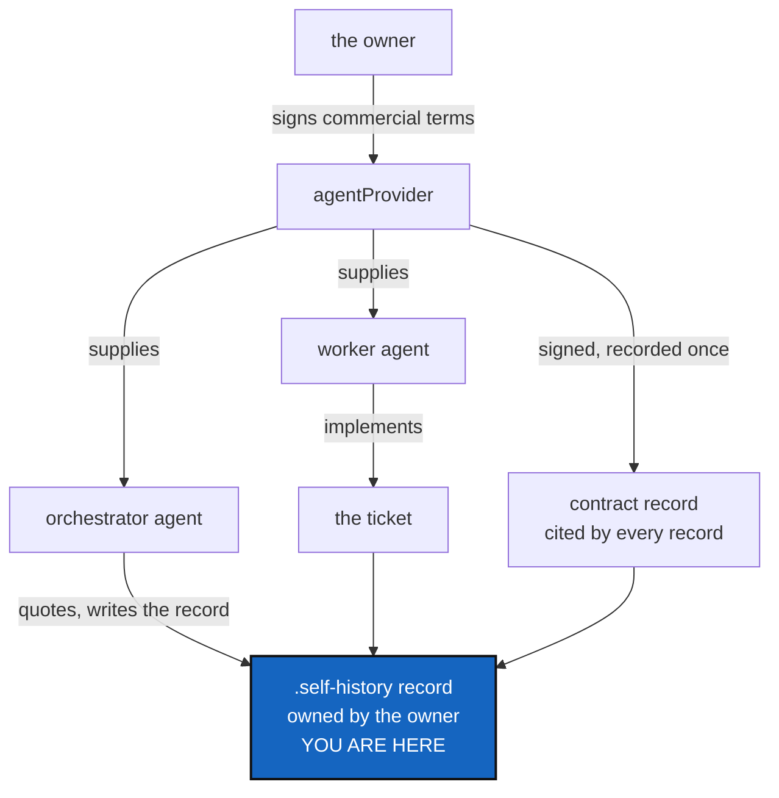

# AgentContract — two agents per task, and whose data this is

*Created: 2026-09-20*

*Branch: main*

> **Ticket review — 2026-09-22, part 3.** Renumbered again, `main_1-1` →
> `main_1-2`: [Autofix](main_1-1_Autofix_DevPlanTicket.md) — merged from
> two memory-dev tickets into one, on `main` — is queued first, on the
> owner's explicit instruction. Everything below is otherwise unchanged.

> **Ticket review — 2026-09-22, part 2.** Renumbered again, `main_1-2` →
> `main_1-1`: [ProjectSpecSplit](../archive/20260922_ProjectSpecSplit_DevPlanTicket.md)
> finished and archived in the same pass (WP2/WP3 both verified done), so
> this ticket is now first in the pile it always led on merit — agentic
> conduct rules, right behind the layout work that just closed.

> **Ticket review — 2026-09-22.** Renumbered from `main_1-4` to `main_1-2`
> — still priority 1, moved up two places — on the owner's request to
> reorganise the backlog with "finalize the agentic" leading the queue.
> This ticket is agentic-conduct rules, so it sits second, right behind
> ProjectSpecSplit (the layout half of the same theme) and ahead of
> [AgentReport](main_1-3_AgentReport_DevPlanTicket.md), which depends on
> it settling who writes and owns a self-history record.

> **Owner direction — 2026-09-20, two requests in one.**
>
> **The pair rule:** *"If a ticket is implemented by one agent it must
> call an independent orchestrator to quote the work. The orchestrator
> writes the report. The logical conclusion is that a task always involves
> at least two agents: orchestrator and worker."*
>
> **The data contract:** *"implement a contract between agentProviders and
> private/local and distant that every records and data linked to the
> project are private data that belongs to the human agent orchestrator,
> ie the owner of the agentProvider contract. It locks the content of a
> .self-history record of a state mutation private with respect to the
> owner. The agent must sign a contract that is also recorded in the
> agentProvider memory that specifies that the agentProvider cannot use
> the material for any other purpose than developping the project. It is a
> conformity with the contract the owner signed with the agentProvider
> that stipulates he can lock his material from being used by the
> agentProvider."*

## Abstract — read this first

**The one-line version.** Two rules about how agents work here: a task
takes two of them, and everything they touch belongs to the person who
commissioned it.

**What this document is.** The conduct half of the agent work, split out
of [AgentReport](main_1-3_AgentReport_DevPlanTicket.md) so that one ticket
builds a mechanism and this one states rules. Mostly documents and one
signed record; almost no code.

**Why it exists.** AgentReport designs a record of what an agent did and
how well it followed the specs. That record is only worth writing if two
things are settled first: who writes it (not the agent being scored), and
who owns what it contains (the person paying, not the provider supplying
the agent).

**What you will find.** §1 the pair rule. §2 the data contract, and
honestly what it can and cannot do. §3 where the signature lives. §4
decisions. §5 work packages. §6 acceptance. §7 what this refuses.

**Who it is for.** The owner, for §4 — and §2.2 in particular, which is
the part I would want checked by someone who has read the actual
commercial terms.

**What you need to do with it.** §2.2 first. It says where the strength
of this really comes from, and it is not from this repository.

---

## 1. The pair rule

**A task involves at least two agents.** One implements; a second,
independent one quotes the work and writes the report. The worker never
scores itself.

| Role | Does |
|---|---|
| **Worker** | Implements the ticket |
| **Orchestrator** | Quotes the work against the three criteria, writes the record, and **cuts the release** — see below |

**The orchestrator also owns the version bump.**
[Versioning](../archive/20260921_Versioning_DevPlanTicket.md) §5.2 settles that CI
never bumps and the local orchestrator agent does. That is the same role
for a good reason rather than by accident: choosing MAJOR over MINOR means
judging what a change did to the public contract, which *is* a conformity
judgement — the same kind this ticket already asks the orchestrator to
make. A machine cannot do it, because no diff distinguishes a renamed flag
from a new one.

**What "independent" must mean, minimally:** the orchestrator is not the
process that did the work. It reads the diff, the ticket and the checks
and forms its own view. It does not accept the worker's account of what
happened as fact — that account is a claim, and testing it is the whole
job.

**What it is not.** Not a third-party audit. The orchestrator is another
agent, commissioned by the same owner, often from the same provider and
the same model family. What the split removes is the *direct* conflict of
interest, which is the one that would have made a conformity score
worthless. It does not remove correlated blind spots, and this ticket
should not pretend otherwise.

**Scope.** The rule governs *implementing a ticket*. Drafting, ranking and
closing tickets is orchestration work already and does not call for a
second orchestrator to quote the first. Whoever writes the rule into the
spec must say so, or it reads as requiring two agents to file a one-line
short ticket.

**Where it lands.** The general project spec, since it is a rule for any
cgitsync project — see [ProjectSpecSplit](../archive/20260922_ProjectSpecSplit_DevPlanTicket.md).
Until that split happens, `CLAUDE.md`.

## 2. The data contract

### 2.1 What it says

**Everything an agent touches here belongs to the owner.** Every record
and every piece of data linked to the project — private/local and
private/distant alike — is the private data of the human who commissioned
the work, who is the party to the contract with the agentProvider. A
`.self-history` record of a state mutation is locked private to them.

The provider may use that material for **developing this project and for
nothing else**. The agent signs a statement to that effect, and the
statement is recorded (§3).

This mirrors, and claims conformity with, the commercial terms the owner
signed with the provider — the terms under which an owner may lock their
material out of a provider's other uses.

### 2.2 What it can and cannot do — read this before building it

**This repository cannot prevent an agentProvider from using data.** No
file written here constrains what happens on someone else's
infrastructure. The actual obligation comes from the commercial contract
the owner signed and from the provider's own systems and settings. A
record in a git repository is not a control.

Saying so plainly is not a reason to drop it. It is the difference
between a record that is honest about its weight and one that invites
someone to rely on it for something it cannot do — and this project has
been careful about exactly that distinction twice already: the ledger is
"tamper-evident, not tamper-proof", and a conformity score says
`asserted` where it is not measured.

**What it genuinely delivers, and this is worth having:**

| It does | It does not |
|---|---|
| State the claim explicitly, in a place that travels with the project | Enforce it |
| Record **which terms were in force** for each piece of work — provider, contract reference, version, date | Verify the provider honoured them |
| Make a later question answerable: "under what terms was this written?" | Detect a breach |
| Put the obligation in front of every agent that reads the spec | Bind an agent that does not read it |

That is provenance of the legal basis, standing beside the provenance of
the toolchain the ledger already records. It is the same kind of evidence,
and it is useful for the same reason: when terms change, the record says
which work was done under which.

**One consequence worth stating.** If the terms in force are what matters,
then a terms *change* is an event this project should be able to notice.
A contract record with a version and a date makes that possible; a
contract record with neither does not. D3.

## 3. Where the signature lives

The owner's words: *"recorded in the agentProvider memory"* — not the
project's. That is the right separation, and it falls out cleanly:

| Record | Scope | Why there |
|---|---|---|
| The signed contract, once per provider | **private/distant** — shared across every project this owner runs with that provider | The terms are not per-project. Signing them once per ticket would be noise, and would let two projects disagree about what was signed |
| Each `.self-history` record | **private/local** — this project | It is about this project's work, and it *cites* the contract rather than restating it |

So a `.self-history` record carries a reference — the contract record's
hash — and the contract record carries the terms. One statement, many
citations, and a citation that cannot drift from what it cites because a
hash names content.

`.agent/.distant` (ProjectSpecSplit §1) is the natural home for the
contract record. Until that exists, `.agentSpec` is already private/distant
and already shared.

**Tamper-evidence comes free.** A contract record named by its own content
hash, cited by hash from every `.self-history` record, cannot be quietly
edited afterwards: changing the terms changes the name, and every record
citing the old name still names the old terms. That is the same property
the State and the ledger already have, applied to a document instead of a
tree.

## 4. Decisions

| D | Question | Recommendation | Whose call |
|---|---|---|---|
| **D1** | Does the signature attest, or actually sign? | **Attest, hash-anchored.** A cryptographic signature needs a key an agent would have to hold, and an agent holding a signing key is a worse problem than the one it solves. A statement named by its content hash and cited by hash is tamper-evident, which is what this needs | Implementer |
| **D2** | Signed once per provider, or once per ticket? | **Once per provider** (§3), cited per record. Per-ticket signing is ceremony that adds no information | Owner |
| **D3** | Does the record pin the provider's terms *version*? | **Yes.** Without it the record says "terms were agreed" and cannot say which — and §2.2's whole value is answering that later | **Owner** |
| **D4** | Does an unsigned provider block work? | **No, but it is visible.** A record whose contract reference is missing says so, and `memory status` reports it. A gate here would be bypassed the first time it fired at an inconvenient moment | **Owner** |
| **D5** | Who is "the owner" in a project with several people? | Undefined today, and [Omniscience](memory-dev_2-1_Omniscience_DevPlanTicket.md) is where several people meet one project. **Recommend: this ticket assumes one owner and says so**, rather than inventing a multi-party answer that Omniscience will have to redo | **Owner** |

## 5. Work packages

| WP | Does | Depends on |
|---|---|---|
| **WP1** | The pair rule written into `CLAUDE.md` (§1), with the scoping note. Conduct, not a feature — it is in force the moment it is written, so it can land before anything else here | — |
| **WP2** | The contract text itself (§2.1), with §2.2's limits stated *in* it rather than only in this ticket. A contract that overstates its own reach is the failure mode | D1, D3, D5 |
| **WP3** | The contract record: content-addressed, stored private/distant, with provider, terms version and date | WP2, D2 |
| **WP4** | `.self-history` records cite the contract by hash; a missing citation is reported rather than fatal (D4). **This is the one piece that needs AgentReport's record to exist first** | WP3, AgentReport WP1 |
| **WP5** | The contract record's terms version joins a release row as `artefact:agent_contract`, the same way `artefact:src` already does — [Versioning](../archive/20260921_Versioning_DevPlanTicket.md) §3 designed the `release` field on the ledger entry with exactly this artefact in mind (`.localSpec/AdditionalSpecs.md`'s entry-schema table already reserves the key) but left it unfilled pending this ticket's contract record. `ComplexGitSyncClient.freeze_release()` gains the pair once WP3 exists to read a terms version from | WP3, Versioning (done) |

## 6. Acceptance

- `CLAUDE.md` states the pair rule, and states which work it governs.
- The contract record exists once, names the provider and the terms
  version, and is reachable from a project that mounts the distant spec.
- A `.self-history` record names the contract that was in force when the
  work was done, by hash.
- Editing the contract after the fact produces a different hash, and every
  record written earlier still cites the earlier terms.
- The contract text says what it cannot do (§2.2). A reader finishes it
  knowing where the real obligation lives.
- A `freeze_release()` release row carries `artefact:agent_contract`
  alongside `artefact:src`, naming the terms version in force for that
  release (WP5).
- `pixi run lint` and `pixi run test` pass; `cgitsync status` shows
  `errors=0`.

## 7. What this refuses to do

- **It does not claim to enforce anything** about a provider's conduct. It
  records terms and citations; the obligation lives in the commercial
  contract.
- **It does not put contract text in a public repository.** The record is
  private, and privacy propagates to everything nested inside a private
  parent.
- **It does not hold a signing key**, and no agent is given one (D1).
- **It does not block work** on a missing or unsigned contract (D4).
- **It does not settle multi-party ownership** (D5). One owner, said out
  loud, until Omniscience answers the general case.
