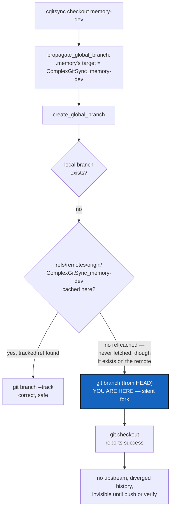

# CheckoutForkGuard — `checkout` must not silently fork a branch it has never fetched

*Created: 2026-09-18*

*Branch: main*

> **Owner report — 2026-09-18**, from
> `.localSpec/DevTickets/archive/.closedUserTicket/20260918_checkoutMemoryUpstream.md`:
> *"Again a problem with memory that doesn't have an upstream branch, after
> checkout memory-dev, which is not the case for main. The branch was
> existing. I suspect there are still exceptions in the code about .memory
> that shouldn't exist anymore because it is now only a private/local
> repo."*

## Abstract — read this first

**The one-line version.** `checkout`'s `create_global_branch` step trusts
whatever remote-tracking refs this clone already happens to have; when it
does not have the one it needs, it silently creates a brand-new,
untracked local branch of the same name instead of refusing — and on
`ComplexGitSync`'s own `.cgitsync/.memory`, that is exactly what just
happened, forking a real, already-pushed `ComplexGitSync_memory-dev` under
a local branch that shares nothing with it but its name.

**What this document is.** An audit that found no `.memory`-specific
leftover code — the owner's suspicion pointed at the right symptom but the
wrong cause. The actual defect is generic to `checkout`/`branch`, already
partly known (`.localSpec/DevTickets/archive/20260911_UpstreamBranchDisplay_DevPlanTicket.md`),
and reproduced live on this project's own workspace with real shas, kept
in §1.

**Why it exists.** A private/local repository's branch name is *derived*
(`git_branch.py`'s `private_local_branch`) rather than typed by the user,
so the user has no way to know, before running `checkout`, whether this
clone has ever seen that derived name's remote branch. `.memory` forks one
such name per project branch, which is why it is the repo most likely to
hit this — not because it carries special-case code, but because it
carries none.

**What you will find.** §1 the live reproduction on this project's own
tree. §2 the cause, traced to one fallback branch in one function. §3 why
this is not a `.memory`-only bug, and why `.memory` finds it first. §4
decisions the owner must make about the fix. §5 work packages. §6
acceptance. §7 what this does not cover.

**Who it is for.** Whoever fixes `checkout`'s silent-fork gap, and the
owner, for §4.

**What you need to do with it.** Read §1 and §2 — the whole defect is one
fallback call with no guard — then answer §4.



---

## 1. What was observed, live, on this project's own tree

`ComplexGitSync`'s own `.cgitsync/.memory` — the workspace this ticket was
written in — had, at the moment of the report:

```console
$ git branch -vv
  ComplexGitSync            21f9703 [origin/ComplexGitSync] cgs-mem-dev memory, ...
* ComplexGitSync_memory-dev 21f9703 cgs-mem-dev memory, ...     # no [origin/...] — no upstream

$ git branch -r
  origin/ComplexGitSync                              # only one — never fetched the others

$ git config --get-all remote.origin.fetch
+refs/heads/*:refs/remotes/origin/*                  # already wide; not a narrow-refspec case

$ git ls-remote --heads origin
21f97030c6192906856cf730c06fc6ded5350122  refs/heads/ComplexGitSync
670d6e86cb527c60d38dc6585b579e8f029f40cf  refs/heads/ComplexGitSync_memory-dev   # exists, and differs
ee601f22905339e51f02c87d95eb437b27ea59f3  refs/heads/main
```

`ComplexGitSync_memory-dev` is real, pushed, and at `670d6e8` — a
different commit from what this clone's `ComplexGitSync_memory-dev` sits
at (`21f9703`, identical to `ComplexGitSync`, i.e. wherever `.memory`
happened to be checked out before). `checkout memory-dev` created a
second, unrelated branch under the real branch's name, gave it no
upstream, and reported success as if it had joined it.

This is not a narrow-refspec problem (§3 of the archived
UpstreamBranchDisplay ticket) — the refspec here is already the wide one.
It is that nothing has ever run an actual `git fetch` against this
`.memory` clone since it last saw only `ComplexGitSync`, and `checkout`
does not run one either.

## 2. The cause, traced to one fallback

`operations.py::create_global_branch`
([`operations.py:130`](../../../src/ComplexGitSync/operations.py#L130)) is
the one function both `checkout_tree` and `branch_tree` delegate branch
creation to:

```python
if git_runner.local_branch_exists(repo.absolute_path, target):
    continue
remote = repo.remote_name or "origin"
if git_runner.remote_tracking_branch_exists(repo.absolute_path, target, remote=remote):
    git_runner.create_branch(repo.absolute_path, target, start_point=f"{remote}/{target}")
    continue
git_runner.create_branch(repo.absolute_path, target)   # <-- the fallback that just fired
```

The comment immediately above this code already names the exact failure
mode ("forked a second history under a name the user believed they were
joining") and cites the archived ticket — the guard was written
*knowing* about this danger. What it does not do is establish its own
precondition: `remote_tracking_branch_exists`
([`git_runner.py:548`](../../../src/ComplexGitSync/git_runner.py#L548))
is offline by contract, reading only `refs/remotes/<remote>/<branch>` as
this clone already has it. Nothing upstream of `create_global_branch`
guarantees that ref is current, or even present, before the fallback
decides "never heard of it, must be new."

`checkout_tree`
([`operations.py:382`](../../../src/ComplexGitSync/operations.py#L382))
and `branch_tree`
([`operations.py:429`](../../../src/ComplexGitSync/operations.py#L429))
are both, by their own docstrings and `git_runner.py`'s `branch_known`
docstring, deliberately offline: "must keep working with no network."
`pull` is the one command that fetches first
(`_fetch_all_refs`/`_repair_fetch_refspec` in `_restart_tree`,
`.localSpec/DevTickets/archive/20260911_UpstreamBranchDisplay_DevPlanTicket.md`
WP-2) — and the project's own regression test for "checkout joins a
colleague's branch" proves this by calling `pull` immediately before
`checkout`:
[`test_upstream_tracking.py:288`](../../../tests/integration/test_upstream_tracking.py#L288),
`# A pull is what brings their ref here`. Nobody reading `checkout`'s own
output is told that.

## 3. Why this is not a `.memory`-only bug

The owner's suspicion was that leftover `.memory`-specific exceptions
remain from before WorkingTransitionState made it an ordinary
private/local repository. **This audit found none.** Grepping every
module outside `memory/` for a literal `.memory` reference turns up only
docstrings and comments; `create_global_branch`, `checkout_tree`,
`branch_tree` treat `.memory` exactly like `.localSpec` or `.claude` —
which is the point, and which is working as designed.

The defect is generic: **any** repository whose target branch this clone
has never fetched hits the same fallback, project repos included. A user
running `cgitsync checkout <colleague's branch>` without pulling first
forks it exactly the same way — `test_checkout_still_creates_a_brand_new_branch_at_head`
in the same test file documents this as *intended* behaviour for a name
"the remote has never heard of," and `create_global_branch` has no way to
tell that case apart from "the remote has heard of it, but this clone has
never asked."

`.memory` (and every private/local repo) is simply the shape of
repository most likely to trigger it in practice, for a reason that has
nothing to do with leftover code:

- Its branch name is **derived** (`git_branch.py`'s `private_local_branch`:
  `<project>` on the project's default branch, `<project>_<branch>`
  elsewhere) rather than typed by the user, so an ordinary
  `cgitsync checkout memory-dev` silently asks `.memory` to join or fork
  `ComplexGitSync_memory-dev` — a name the user never typed and has no way
  to reason about before running the command.
- It forks and rejoins on every project-branch switch, by design (D3 in
  `memory-dev_1-1_MemoryArchitecture_DevPlanTicket.md`) — so the ambiguous
  case (branch exists remotely, never fetched here) comes up on the very
  first `checkout` to a project branch this workspace has not visited
  before, which is an ordinary, expected workflow step, not an edge case.
- Nothing prompts a user to `pull` before switching project branches —
  `bootstrap`'s own instructions (`CLAUDE.md`, *Bootstrapping a working
  checkout*) go straight from clone to `pixi install` to running
  commands, and switching to a workstream's branch (`memory-dev`, in this
  project's own case) is naturally the very next thing typed.

So: right symptom, right instinct that something is off about `.memory`
and branches — wrong cause. There is nothing to delete; there is a guard
to finish.

## 4. Decisions — the owner's call

### D1. What should the fallback do when it cannot tell join from fork?

| Option | What happens | Cost |
|---|---|---|
| **Refuse for private/local repos only (recommended)** | When the target is a *derived* branch name (`repo.effective_private`) and neither a local nor a cached remote-tracking ref exists, raise `GitSyncError` naming `cgitsync pull` (or `memory clone --branch NAME` where a memory mount is involved) rather than guessing. Project repos keep today's behaviour — a name the user typed themselves creating fresh at HEAD is usually exactly what they meant, and is already tested (`test_checkout_still_creates_a_brand_new_branch_at_head`). | One new refusal path; zero network calls added |
| Live `ls-remote` check for every repo | Before falling back, ask `git_runner.remote_branch_exists(remote_url, target)` (already used by `memory_clone`/`memory_adopt`, `git ls-remote --heads`, no full fetch) for every repo about to fork. Fetch just that ref and track it when found; fall back to HEAD only when the remote truly has never heard of it. | Gives `checkout`/`branch` a real network dependency for the first time — a deliberate reversal of "must keep working with no network" |
| Warn only, change nothing | Print a warning naming the risk and suggesting `pull` first, still fork. | Cheapest, and does not fix the bug — a warning in `checkout`'s output is exactly as easy to miss as the missing `[origin/...]` in `branch -vv` already is, which is what led to this report |
| Do nothing; document "pull before checkout" | Add the warning to README/tutorials only. | Costs nothing to build and fixes nothing; the failure stays silent and this ticket recurs |

### D2. Does the refusal apply only to private/local repos, or to every repo?

Recommendation: **private/local only**, per D1. An ordinary project
branch name is one the user chose and typed; `checkout <name-I-just-made-up>`
creating it fresh is the common, correct case
(`test_checkout_still_creates_a_brand_new_branch_at_head`). A derived
private/local name is the one case where the user cannot tell, from the
command they typed, whether they are about to fork somebody's work.
Extending the refusal to project repos too is worth asking the owner
about explicitly, since it would change already-tested, arguably correct
behaviour.

### D3. What does the refusal actually tell the user to run?

Recommendation: name `cgitsync pull` when the repository is reachable by
an ordinary pull (every private/local repo, since WorkingTransitionState
made `pull` reach `.memory` like any other), so the message is one
command, not a diagnosis exercise.

## 5. Work packages

| # | Depends on | Touches | Delivers |
|---|---|---|---|
| **WP-1** | D1, D2 | `operations.py` | `create_global_branch`'s fallback refuses, naming `cgitsync pull`, when `repo.effective_private` is true and neither a local nor a cached remote-tracking ref exists for the derived target. Project repos are unchanged. |
| **WP-2** | WP-1 | `tests/integration/test_upstream_tracking.py` or a new file | A regression test shaped exactly like the live incident in §1: a private/local repo's branch pushed from *another* clone, this clone never fetching it, `checkout <project-branch>` refuses by name instead of forking. A second test confirms an ordinary project repo's brand-new branch name still creates at HEAD, unchanged. |
| **WP-3** | WP-1 | `README.md`, `docs/Text/user_guide.tex` | Document the refusal and the fix (`cgitsync pull`) wherever `checkout` and private/local repos are already explained. |

## 6. Acceptance

- Reproducing §1's exact shape — a private/local repo whose derived
  branch exists on the remote but has never been fetched into this
  clone — `checkout <project-branch>` refuses by name (`cgitsync pull`)
  instead of creating a divergent local branch.
- `checkout <brand-new-name-nobody-has-used>` on an ordinary project repo
  still creates it at HEAD, exactly as before — `test_checkout_still_creates_a_brand_new_branch_at_head`
  passes unchanged.
- `checkout <colleague's branch>` on an ordinary project repo, preceded by
  `pull`, still joins it — `test_checkout_joins_a_colleagues_branch_instead_of_forking_its_name`
  passes unchanged.
- `pixi run lint` and `pixi run test` pass.
- This project's own `.cgitsync/.memory`, once repaired by hand (§7), no
  longer reproduces §1 on a subsequent `checkout` to a branch this clone
  has not fetched.

## 7. What this does not cover

- **Repairing this project's own already-forked `.memory`.** The
  divergent local `ComplexGitSync_memory-dev` on this workspace's own
  `.cgitsync/.memory` needs a manual fix (delete the forked local branch,
  fetch, recreate tracking the real remote branch) — a one-time
  operational cleanup, not a code change, and not blocked on this ticket.
- **Extending the refusal to ordinary project repos.** Left to D2 if the
  owner wants it; not assumed here.
- **A live network check as the default (`ls-remote` before every
  fork).** Listed in D1 and not recommended, but the owner's call to make
  either way — it is a bigger philosophy change than a refusal message.
- **`branch_known()`'s own duplication of these two checks.** Noticed in
  passing (`create_global_branch` inlines the same
  local-then-remote-tracking check `branch_known` already names), not
  fixed here — a reuse cleanup with no behaviour change, worth its own
  pass if anyone touches this function again.
