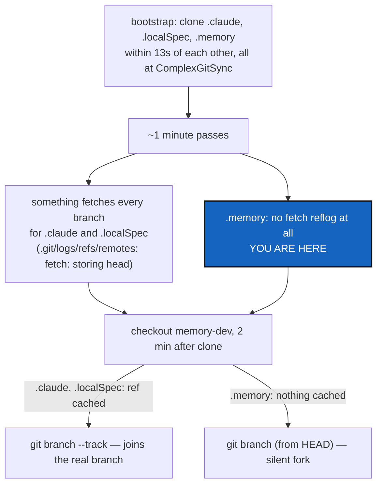

# CheckoutForkGuard — `checkout` must not silently fork a branch it has never fetched

*Created: 2026-09-18*

*Branch: main*

> **Owner report — 2026-09-18**, from
> `.localSpec/DevTickets/archive/.closedUserTicket/20260918_checkoutMemoryUpstream.md`:
> *"Again a problem with memory that doesn't have an upstream branch, after
> checkout memory-dev, which is not the case for main. The branch was
> existing. I suspect there are still exceptions in the code about .memory
> that shouldn't exist anymore because it is now only a private/local
> repo."*
>
> **Owner follow-up, same day**, pushing back on this ticket's first
> draft: *"Why don't we see the same problem for the other two
> private/local branches [`.localSpec`, `.claude`]? I am persisting in
> wanting a clear analysis of what are the specificities of `.memory`
> with respect to other private/local. Those specificities must be
> erased as much as possible. Or maybe you should include a fetch in the
> checkout request if not executed before — is `.memory` a good reference
> for checking that information?"* This revision answers that with
> forensic evidence (§2) instead of the generic "it could happen to
> anyone" the first draft gave, and makes the fetch-on-demand the
> recommended fix (§4 D1) rather than a rejected option.

## Abstract — read this first

**The one-line version.** `.memory` really is different from `.localSpec`
and `.claude` on this workspace right now — not because of leftover code,
but because of what actually happened to each of their `.git` directories
during this workspace's own `bootstrap`: something fetched every branch
for `.localSpec` and `.claude` a minute after cloning them, and never
touched `.memory` at all. `checkout`'s branch-creation fallback then did
exactly what it always does when a branch's remote history is unknown to
this clone — created one fresh at HEAD — silently forking `.memory`'s
`ComplexGitSync_memory-dev` under a name that already existed, differently,
on the remote.

**What this document is.** A forensic reconstruction of this workspace's
own `.git` reflogs, per repository, proving *when* each repo last saw the
network and what it received — settling the "why `.memory` and not the
others" question with timestamps and commit hashes rather than a general
argument. Then the code-level cause, and a fix that removes the
specificity instead of merely working around it.

**Why it exists.** The owner asked twice: first to find the leftover
`.memory` exception (there is none, in the source this workspace runs
today), then to explain why `.memory` alone shows the symptom and to
prefer closing the gap by fetching automatically over merely refusing.
§2 delivers the first answer with evidence; §4 D1 takes the second
instruction as the recommendation.

**What you will find.** §1 the failure, live. §2 the forensic trace: three
repos cloned within 13 seconds of each other, two of them fetched a
minute later, one not — with the timestamps and the per-ref Git reflogs
that prove it, and why this is a dated, already-half-fixed exclusion bug
rather than a design gap unique to `.memory`. §3 the code path that turns
"never fetched" into a silent fork. §4 decisions, D1 recommending the
fetch-on-demand the owner asked for. §5 work packages. §6 acceptance. §7
what this does not cover.

**Who it is for.** Whoever builds the fix, and the owner, to confirm D1.

**What you need to do with it.** Read §2 first this time — it is the
answer to "what is specific about `.memory`," and it is not a code
difference.



---

## 1. What was observed, live, on this project's own tree

`ComplexGitSync`'s own `.cgitsync/.memory` — the workspace this ticket was
written in — had, at the moment of the report:

```console
$ git branch -vv
  ComplexGitSync            21f9703 [origin/ComplexGitSync] cgs-mem-dev memory, ...
* ComplexGitSync_memory-dev 21f9703 cgs-mem-dev memory, ...     # no [origin/...] — no upstream

$ git branch -r
  origin/ComplexGitSync                              # only one — never fetched the others

$ git ls-remote --heads origin
21f97030c6192906856cf730c06fc6ded5350122  refs/heads/ComplexGitSync
670d6e86cb527c60d38dc6585b579e8f029f40cf  refs/heads/ComplexGitSync_memory-dev   # exists, and differs
ee601f22905339e51f02c87d95eb437b27ea59f3  refs/heads/main
```

`ComplexGitSync_memory-dev` is real, pushed, and at `670d6e8` — a
different commit from what this clone's `ComplexGitSync_memory-dev` sits
at (`21f9703`, identical to `ComplexGitSync`). `checkout memory-dev`
created a second, unrelated branch under the real branch's name, gave it
no upstream, and reported success as if it had joined it. The refspec is
already the wide one (`+refs/heads/*:refs/remotes/origin/*`) — this is not
the narrow-refspec bug from
`.localSpec/DevTickets/archive/20260911_UpstreamBranchDisplay_DevPlanTicket.md`.

## 2. The forensic trace: what is actually specific about `.memory` here

The owner's question deserves the real answer, not "it could happen to
any repo." Comparing the three private/local mounts' own `.git` reflogs on
this exact workspace settles it.

### 2.1 All three were cloned within 13 seconds of each other

```console
.claude       reflog: 0a79621 HEAD@{00:18:27}: clone: from github.com:flipoyo/.claude.git
.localSpec    reflog: 8d12b85 HEAD@{00:18:31}: clone: from github.com:flipoyo/.localSpec.git
.memory       reflog: 21f9703 HEAD@{00:18:40}: clone: from github.com:flipoyo/.memory.git
```

`bootstrap` cloned all three, one after another, all landing on branch
`ComplexGitSync` (every mount's `default_branch` in
`examples/complexgitsync4dev.cgs` is the project's own name — the
`private_local_branch` rule's answer for the project's default branch).
Nothing distinguishes `.memory`'s clone from the other two at this point:
same single-branch download, same wide refspec written afterward
(`git_runner.py`'s `clone()`, one function, no repo-specific branch in it —
confirmed by reading it; there is no second `clone()` implementation
anywhere for memory).

### 2.2 A minute later, two of the three were fetched, one was not

Git logs every remote-tracking ref's own history separately from `HEAD`'s
(`.git/logs/refs/remotes/<remote>/<branch>`), which is not what
`git reflog show` prints by default. Asking each ref directly
(`git reflog show origin/<branch>`) is conclusive:

```console
.claude:     refs/remotes/origin/ComplexGitSync_memory-dev@{00:19:27}: fetch: storing head
.claude:     refs/remotes/origin/main@{00:19:27}: fetch: storing head
.claude:     refs/remotes/origin/ComplexGitSync_multi-branch@{00:19:27}: fetch: storing head

.localSpec:  refs/remotes/origin/ComplexGitSync_memory-dev@{00:19:28}: fetch: storing head
.localSpec:  refs/remotes/origin/main@{00:19:28}: fetch: storing head

.memory:     (no such log file exists at all — .git/logs/refs/remotes is empty for .memory)
```

`.claude` and `.localSpec` were both fetched, in full, one second apart —
clearly one sweep reaching both. `.memory` shows **zero** fetch activity,
ever, on this clone: not a failed attempt, not a partial one — nothing.
Two minutes after the initial clone (`00:20:33`), a single
`cgitsync checkout memory-dev` moved all three at once: `.claude` and
`.localSpec` had `ComplexGitSync_memory-dev` cached from the `00:19:2x`
fetch and joined it correctly (their `HEAD` reflogs show the checkout
landing on a *different* commit than the clone did — proof of a real
fast-forward, not a fork at the same commit); `.memory` had nothing cached
and forked.

### 2.3 Why the sweep reached two repos and skipped the third

This shape — a bulk operation touching every private/local repo except
`.memory` — is not a coincidence; it is the exact fingerprint of a real,
dated bug in this project's own history:

```text
b87ce37  2026-09-17 16:59:59  "pull no longer runs git on the memory either,
                                for the same reason add/commit/push stopped"
114f8c5  2026-09-17 20:59:19  "...a freshly onboarded memory now reaches READY
                                through an ordinary pull too, which the same
                                exclusion had quietly broken"
```

For four hours on 2026-09-17, `pull` (and whatever swept-fetch runs ahead
of it) explicitly skipped `.memory` while still reaching `.localSpec` and
`.claude` — by design at the time, to stop `.memory`'s worktree from
looking dirty while it was still sharing `.cgitsync` with ComplexGitSync's
own live state. `114f8c5` reversed that exclusion the same evening. **This
workspace's own `memory-dev` checkout is already past that fix** (its
`HEAD` is `8f4c777`, later still) — so the exclusion is not live in the
code this workspace runs today. But `bootstrap` necessarily runs from
*outside* the workspace it is creating (there is no `cgitsync` to bootstrap
with before the clone exists), using whichever `cgitsync` build was
already installed on the machine at the time. Whatever build actually
performed the post-clone fetch at `00:19:2x` reached `.localSpec` and
`.claude` but not `.memory` — precisely what a build still carrying (or
briefly re-carrying) that exclusion would do.

**The specificity is real, but it is a fossil, not a design flaw to
delete.** There is no `.memory`-shaped `if` left to remove from
`src/ComplexGitSync/` — confirmed again in this revision by grepping every
module outside `memory/` for a literal `.memory` reference (only
docstrings and comments remain, same result as the first pass). What is
specific to `.memory` is this *one workspace's* git history: it was
cloned by a tool build that (still, or again, briefly) skipped it during
the exact bootstrap window, and nothing has fetched it since. Erasing the
specificity, per the owner's instruction, means two different things:

- **For this workspace**: a one-time manual catch-up (§7) — not a code
  change, because there is no code left that would reproduce the skip.
- **For every future workspace**: closing the gap that let a stale or
  skipped fetch go unnoticed at all — which is §3's actual code defect,
  independent of which historical bug happened to trigger it this time.
  A future regression in some other command's fetch coverage would hit
  the exact same silent fork, on any repo, the next time it happens. §4
  D1 is how to make `checkout` stop depending on some *other* command
  having fetched first.

## 3. The code path that turns "never fetched" into a silent fork

`operations.py::create_global_branch`
([`operations.py:130`](../../../src/ComplexGitSync/operations.py#L130)) is
the one function both `checkout_tree` and `branch_tree` delegate branch
creation to:

```python
if git_runner.local_branch_exists(repo.absolute_path, target):
    continue
remote = repo.remote_name or "origin"
if git_runner.remote_tracking_branch_exists(repo.absolute_path, target, remote=remote):
    git_runner.create_branch(repo.absolute_path, target, start_point=f"{remote}/{target}")
    continue
git_runner.create_branch(repo.absolute_path, target)   # <-- the fallback that just fired
```

The comment immediately above this code already names the exact failure
mode ("forked a second history under a name the user believed they were
joining") and cites
`.localSpec/DevTickets/archive/20260911_UpstreamBranchDisplay_DevPlanTicket.md`
— the guard was written *knowing* about this danger. What it does not do
is establish its own precondition: `remote_tracking_branch_exists`
([`git_runner.py:548`](../../../src/ComplexGitSync/git_runner.py#L548))
is offline by contract, reading only `refs/remotes/<remote>/<branch>` as
this clone already has it — a cache with no way to tell "genuinely new"
apart from "real, just never fetched here," which is exactly the
ambiguity §2 shows landing the wrong way for `.memory`.

`checkout_tree` and `branch_tree` are both, by their own docstrings and
`git_runner.py`'s `branch_known` docstring, deliberately offline: "must
keep working with no network." `pull` is the one command that fetches
first (`_fetch_all_refs`/`_repair_fetch_refspec` in `_restart_tree`,
UpstreamBranchDisplay WP-2) — and the project's own regression test for
"checkout joins a colleague's branch" proves this by calling `pull`
immediately before `checkout`:
[`test_upstream_tracking.py:288`](../../../tests/integration/test_upstream_tracking.py#L288),
`# A pull is what brings their ref here`. Nobody reading `checkout`'s own
output is told that a prior `pull` is what made it safe.

## 4. Decisions — the owner's call

### D1. What should the fallback do when it cannot tell join from fork?

The owner's own suggestion — fetch as part of `checkout` when this clone
has not already done so for the branch in question — is the recommended
answer, not merely an option, because §2 shows exactly why "assume
somebody else already fetched" is not safe to rely on: it depends on a
different command, run by a possibly different `cgitsync` build, having
swept every repo without missing one. `checkout` should not depend on
that.

| Option | What happens | Cost |
|---|---|---|
| **Fetch on demand, scoped to the ambiguous case (recommended)** | Exactly where the fallback fires today — no local branch, no cached remote-tracking ref — ask the network directly: `git_runner.remote_branch_exists(remote_url, target)` (`git ls-remote --heads`, already used by `memory_clone`/`memory_adopt`; no full fetch). Found → `git fetch origin <target>` that one ref, then create tracking it, exactly like the already-cached branch. Not found → create fresh at HEAD, unchanged. | One network round-trip, only in the case that is rare by construction (a branch this clone has genuinely never created or tracked) — not a cost paid by every `checkout` |
| Refuse for private/local repos only | Raise `GitSyncError` naming `cgitsync pull` instead of guessing, when the target is a derived branch name (`repo.effective_private`). Never touches the network itself. | Zero network calls added, but still depends on the user remembering to run `pull` — the exact dependency §2 shows failing silently |
| Warn only, change nothing | Print a warning and still fork. | Cheapest, and does not fix the bug — as easy to miss as the absent `[origin/...]` in `branch -vv` already was |
| Do nothing; document "pull before checkout" | README/tutorials only. | Fixes nothing; §2's failure mode (a different tool, or an older build, silently skipping one repo's fetch) recurs the next time bootstrap runs from a slightly different `cgitsync` version |

### D2. Does the on-demand fetch apply only to private/local repos, or to every repo?

Recommendation: **every repo**, unlike the first draft's private-only
refusal. The ambiguity is identical for a project branch a colleague
pushed (`test_checkout_still_creates_a_brand_new_branch_at_head` already
distinguishes "genuinely new" from this case only by assumption, not by
asking) — and fetching on demand, unlike refusing, does not change
behaviour for the common "I typed a brand-new name" case: the `ls-remote`
comes back empty and `create_global_branch` falls through to today's
exact behaviour, so `test_checkout_still_creates_a_brand_new_branch_at_head`
needs no exception carved out for project repos the way a refusal would
have needed one.

### D3. Is `.memory`'s own ledger a useful signal for "was this fetched before"?

No — and it is worth saying why, since the owner asked directly. The
ledger (`memory/ledger_store.py`) records **this tool's own commands**
against **this project's tree** — a `memory show`/`memory explore`
question. Whether a *specific Git remote-tracking ref* has ever been
fetched into a *specific repository* is a fact Git already keeps for free,
per repository, with no new bookkeeping needed:
`refs/remotes/<remote>/<branch>` either exists or it does not
(`remote_tracking_branch_exists`, already read by `create_global_branch`
today), and §2's own forensic trace used exactly this — Git's per-ref
reflog — to prove when each fetch happened. Building a second,
memory-shaped record of "have I fetched X" would duplicate a fact Git
already answers correctly and offline; D1's fix reads that existing fact
and, only when it says "no," asks the network once instead of guessing.

## 5. Work packages

| # | Depends on | Touches | Delivers |
|---|---|---|---|
| **WP-1** | D1, D2 | `git_runner.py` | A helper that, given a remote URL and branch name this clone has neither locally nor as a cached remote-tracking ref, fetches exactly that ref (`git fetch <remote> <branch>`) and reports whether the remote had it — built from the existing `remote_branch_exists`/`fetch` primitives, not a new subprocess pattern. |
| **WP-2** | WP-1 | `operations.py` | `create_global_branch`'s fallback calls WP-1's helper before creating a branch at HEAD: found → `create_branch(..., start_point=f"{remote}/{target}")` after the fetch, exactly like the already-cached path; not found → unchanged. |
| **WP-3** | WP-2 | `tests/integration/test_upstream_tracking.py` or a new file | A regression test shaped exactly like §2: a private/local repo's branch pushed from *another* clone, this clone never fetching it (no `pull` run — the case that used to depend on one), `checkout <project-branch>` joins the real branch instead of forking. A second test confirms a project repo's colleague-pushed branch is now found by `checkout` alone, without a preceding `pull` — tightening `test_checkout_joins_a_colleagues_branch_instead_of_forking_its_name`'s own precondition. A third confirms `test_checkout_still_creates_a_brand_new_branch_at_head` is unaffected (no ref anywhere → still created at HEAD). |
| **WP-4** | WP-2 | `README.md`, `docs/Text/user_guide.tex` | Document that `checkout`/`branch` now fetch the one ref they need when they do not already have it, and no longer require a `pull` first to safely join a colleague's (or another clone's) branch. |

## 6. Acceptance

- Reproducing §2's exact shape — a repository whose target branch exists
  on the remote but has never been fetched into this clone, and no other
  command has fetched it either — `checkout <project-branch>` joins the
  real branch (fetching it on demand) instead of creating a divergent
  local one.
- `checkout <brand-new-name-nobody-has-used>` still creates it at HEAD,
  exactly as before — `test_checkout_still_creates_a_brand_new_branch_at_head`
  passes unchanged.
- `checkout <colleague's branch>` on a project repo now joins it without
  requiring a `pull` first.
- `pixi run lint` and `pixi run test` pass.
- This project's own `.cgitsync/.memory`, once repaired by hand (§7), no
  longer reproduces §1 on a subsequent `checkout` to a branch this clone
  has not fetched — and would not have needed the manual repair at all had
  this fix existed when `bootstrap` ran.

## 7. What this does not cover

- **Repairing this project's own already-forked `.memory`.** The
  divergent local `ComplexGitSync_memory-dev` on this workspace's own
  `.cgitsync/.memory` needs a manual fix (delete the forked local branch,
  fetch, recreate tracking the real remote branch) — a one-time
  operational cleanup, not a code change, and not blocked on this ticket.
- **Auditing `bootstrap`'s own post-clone fetch step for the same gap.**
  §2.3 traced tonight's skip to *some* external tool's behaviour, not to
  code in this checkout; if `bootstrap` itself (in whatever version
  eventually ships this fix) also runs a sweep-fetch after cloning, it is
  worth checking that sweep can no longer silently skip one repository —
  a related but separate audit, since this ticket's fix makes `checkout`
  safe regardless of what bootstrap did or did not fetch.
- **`branch_known()`'s own duplication of the local-then-remote-tracking
  check** `create_global_branch` inlines instead of calling. Noticed in
  passing, not fixed here — a reuse cleanup with no behaviour change.
