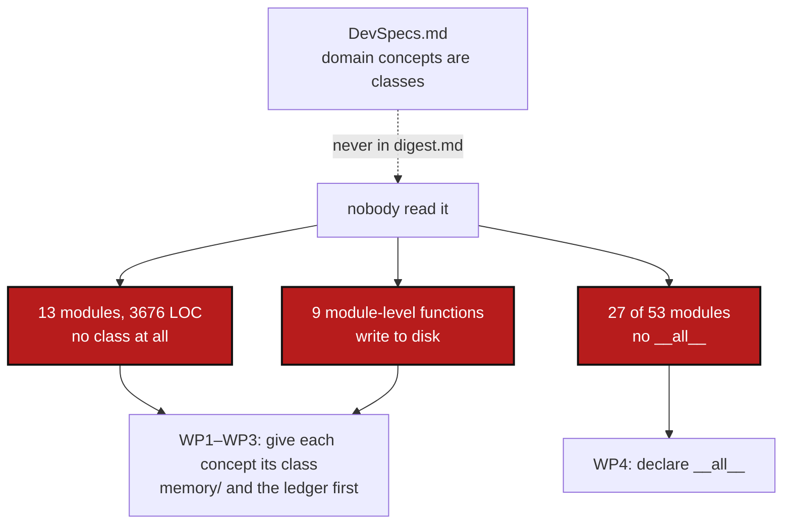

# ClassFirstPackage — 13 modules and 3676 lines carry a domain concept with no class at all

*Created: 2026-09-30*

*Branch: main*

> **Formed in the priority-1 reorganisation of 2026-09-30**, from the code
> half of `DevSpecsConformance` (opened from
> `shortTickets/DevSpecs-in-digest.md`). The documentation half — writing
> the rules into `AdditionalSpecs.md` and `digest.md` — is
> [AgentGuardrails](main_1-1_AgentGuardrails_DevPlanTicket.md), which must
> land first: this ticket is measured against the rule that ticket writes
> down. The two oversized modules are
> [ModulePackagisation](main_1-3_ModulePackagisation_DevPlanTicket.md).
>
> This ticket serves the owner's first structural goal: *package structure
> based on class first, with a universal CLI API-only public exposure of the
> classes.*

## Abstract — read this first

**The one-line version.** `DevSpecs.md` says domain concepts are classes
owning their own validation, serialisation and lifecycle. Measured: **13
modules, 3676 lines, have no class at all** — the ledger among them — 27 of
53 modules declare no `__all__`, and nine module-level functions write to
disk.

**What this document is.** The audit (§1), what conforms (§2), six work
packages (§3), three decisions (§4), acceptance (§5).

**Why it exists.** The rule was in `DevSpecs.md` and never in `digest.md`, so
no session read it — [AgentGuardrails](main_1-1_AgentGuardrails_DevPlanTicket.md)
§1 is that story, and this ticket is the bill. The correction is finite and
mechanical, which is exactly why it is worth doing as one pass rather than
one module at a time whenever somebody notices.

**What you will find.** §1 the audit, with how it was measured. §2 what
conforms and is deliberately left alone. §3 work packages, `memory/` first.
§4 decisions. §5 acceptance.

**Who it is for.** Whoever picks it up. Every work package here is a pure
refactor: same behaviour, no test edited.

**What you need to do with it.** Read §1.1, then D1 in §4 — the counting
rule decides what the other findings even are.



---

## 1. The audit

Measured with an AST pass over all 53 modules of `src/ComplexGitSync/`
(classes, module-level functions, `__all__`, and which module-level functions
call a filesystem mutator). The script lands in the repo as WP5, so these
numbers can be re-derived rather than trusted.

**How a class is counted.** A *behaviour class* has methods of its own beyond
dunders. Enums, exception types and method-less value dataclasses are not
counted against the two-or-three cap — they belong to the class they describe
(D1). This is the reading that makes the rule say something true:
`git_repo.py` looks like 11 classes and is really 8 enums around `GitRepo`,
`RepoAddress` and `WorkingRepo`.

### 1.1 Too few classes, not too many

**13 modules, 3676 lines, have no behaviour class at all** — a domain concept
expressed entirely as module-level functions:

| Module | LOC | Public functions | What is missing |
|---|---|---|---|
| `registry.py` | 625 | 3 (14 total) | the `.cgs`/`.gts` ↔ `WorkingGitTree` translation, the data-flow hinge named in `CLAUDE.md` |
| `memory/ledger_store.py` | 548 | 12 | **the ledger store itself** — 3 exception types and a `HeadPointer` dataclass, and no `LedgerStore` |
| `memory/repository.py` | 369 | 16 | what it takes for a memory to *be* a repository |
| `tree_env.py` | 355 | 5 | the environment observer |
| `memory/commit_log.py` | 310 | 12 | the commit/publish evidence log |
| `paths.py` | 272 | 4 | path/CGSHOME resolution |
| `memory/pending.py` | 242 | 14 | the pending area's lifecycle |
| `settings.py` | 242 | 7 | workspace settings |
| `json_render.py` | 226 | 5 | the machine-readable answer |
| `clone_guard.py` | 147 | 5 | the guard |
| `memory/environment.py` | 116 | 6 | the Environment record store |
| `toolchain.py` | 112 | 3 | the toolchain reader |
| `cli/suggest.py` | 112 | 4 | *exempt — `cli/`* |

`memory/ledger_store.py` is the sharpest: the owner's rule names the ledger
explicitly, and the module owning a hash-chained, append-only structure —
where *who writes, in what order* is the entire invariant — has no class to
own it. Six of the 13 are under `memory/`.

`operations.py` is a fourteenth in substance, escaping the table only because
`BranchTopologyReport` carries one method. It is over 2000 lines and goes to
[ModulePackagisation](main_1-3_ModulePackagisation_DevPlanTicket.md).

### 1.2 `__all__` — 27 of 53 modules have none

```
__main__.py            cli/_shared.py         memory/agent_contract.py
autofix/base.py        cli/configuration.py   memory/integrity.py
autofix/repair_divergent_user.py   cli/expert.py      memory/ledger_entry.py
autofix/repair_from_cli.py         cli/minimalist.py  memory/self_history.py
autofix/repair_merge_conflict.py   cli/suggest.py     memory/states.py
discovery.py           git_repo.py            memory/store.py
errors.py              git_runner.py          operations.py
master.py              git_tree.py            orchestre.py
paths.py               snapshot_resolver.py   status_render.py
```

Not random: **every Ring-3/4 module is missing it**, while `memory/` and the
Ring-0/1 value modules mostly have it. The largest public surfaces are the
ones that never declared it — which is the same finding as §1.4: nothing
states what is public, so everything is.

### 1.3 Free functions that mutate shared state

| Module | Functions |
|---|---|
| `memory/ledger_store.py` | `ensure_lgr_dir`, `write_entry`, `read_entry`, `read_head`, `verify_and_repair_head`, `_best_effort_chmod`, … (**7**) |
| `memory/store.py` | `write_state` |
| `memory/environment.py` | `write_environment` |
| `memory/self_history.py` | `write_record` |
| `memory/agent_contract.py` | `write_contract` |
| `memory/commit_log.py` | `_append` |
| `settings.py` | `write_empty_snapshot`, `_mint_default_workspace` |
| `orchestre.py` | `_write_file_atomically` |
| `paths.py` | `resolve_bootstrap_root` |

`paths.py::resolve_bootstrap_root` is the subtlest: a resolver that creates
`$HOME/.cgs` is a side effect its own name denies. Every one of these
disappears as a by-product of §1.1's classes — a writer becomes a method on
the thing it writes.

### 1.4 The other half of the rule: CLI-only public exposure

> *The public API surface is intentionally small and explicit. CLI behaviour
> must mirror Python API behaviour one-to-one.* — `DevSpecs.md`

`ComplexGitSyncClient` exposes **93 public methods**. Nothing checks that each
has a CLI command, or that a command exists for each — only
`test_readme_documents_every_cli_command`, which checks the README table, not
the client. So "the CLI is the only public exposure" is a rule with no
instrument, and a client method with no CLI surface is unreachable for users
without anything saying so. WP6.

### 1.5 Over the class cap

Only two, under D1's counting: `memory/self_history.py` (4 behaviour classes)
and `orchestre.py` (handled by 1-3). `git_repo.py`, `git_tree.py` and
`environment_spec.py` all *look* over the cap and are not.

## 2. What conforms

- **Monolithic canonical API.** `autofix/` looks like a plugin registry and
  is not one: one package, a registry of repair classes, all inside the
  deliverable.
- **Serialisation helpers.** Better than the rule asks:
  `ConfigDocumentIOMixin` gives `from_toml`/`from_json`/`to_toml`/`to_json`/
  `to_yaml` to every document class once, so `CgsDocument` and `GtsDocument`
  cannot diverge.
- **`pixi` only.** The two `pip install` strings in `README.md` and
  `user_guide.tex` both say it is *not* supported.
- **`cli/` having no classes.** Exempt by the owner's reasoning: it is
  derived from client methods implemented elsewhere.
- **Enum, exception and value-object modules.** `errors.py` (6 exceptions, 41
  lines) and `environment_spec.py` (7 value dataclasses) are the intended
  shape, not violations (D1).

## 3. Work packages

| WP | Touches | Deliverable |
|---|---|---|
| **WP1** | `memory/ledger_store.py` | **`LedgerStore`, first and alone.** All 12 public functions become its methods, so the hash-chained ledger has one door. The three exception types stay beside it; `HeadPointer` stays a value object. This is the module the owner's rule names, and the one where a second writer is a correctness bug rather than an untidiness. |
| **WP2** | `memory/repository.py`, `memory/pending.py`, `memory/commit_log.py`, `memory/environment.py`, `memory/store.py`, `memory/self_history.py` | **The rest of `memory/`, class-based**, one module per commit. Each of the writers in §1.3 becomes a method on the class that owns what it writes. `memory/self_history.py`'s fourth class (§1.5) is settled here if it falls out naturally. |
| **WP3** | `registry.py`, `tree_env.py`, `settings.py`, `paths.py`, `json_render.py`, `clone_guard.py`, `toolchain.py` | **The seven outside `memory/`**, one per commit. `paths.py::resolve_bootstrap_root` stops creating anything — the caller that needs the directory makes it. |
| **WP4** | the 27 modules of §1.2 | **Declare `__all__` everywhere.** Not blind: `__all__` is a public-API statement, decided by what other modules and the tests import, not by "everything without an underscore". Ring 0 first. After WP1–WP3 several of these lists are one class name. |
| **WP5** | `scripts/`, `pixi.toml`, CI | **Make §1 re-derivable and non-regrowing.** `scripts/check_oo_conformance.py --check`, baseline in the shape of `ceiling_baseline.json`: modules with no behaviour class, modules over the class cap, modules over 2000 lines, modules without `__all__`, module-level functions that mutate the filesystem. Each list may shrink and never grow. `cli/` exempt from the class checks only. Wire into CI. |
| **WP6** | `tests/`, `scripts/check_oo_conformance.py` | **The CLI mirror, checked.** A test that every public `ComplexGitSyncClient` method is reachable from exactly one CLI command and every CLI command calls exactly one client method — the rule `CLAUDE.md` states and nothing verifies (§1.4). Where the mapping cannot hold, the exception is listed by name in the test, so it is a decision rather than a silence. |

**Order.** WP5's baseline recorded at today's numbers → WP1 → WP2 → WP3 →
WP4 → WP6. Every WP touches `src/`, so each commit carries
`pixi run bump-build`.

**The safety property for every commit here:** behaviour does not change and
**no test is edited**. A test that has to change means behaviour changed,
which no work package here is allowed to do. If a class cannot be introduced
without editing a test, stop and write down why — that is a finding about the
design.

## 4. Decisions

| D | Question | Recommendation | Whose call |
|---|---|---|---|
| **D1** | Do enums, exception types and method-less value dataclasses count against the two-or-three cap? | **No.** They belong to the class they describe. Counting them would make `git_repo.py` (8 enums around 3 real classes) and `errors.py` (6 exceptions in 41 lines) violations, which helps nobody, and would hide the real finding — that the worst modules have *no* class rather than too many. | **Owner** |
| **D2** | Does a new class keep the module's free functions as thin wrappers, for compatibility? | **No.** Move the callers. A wrapper left behind is a second door, which is what §1.3 is about; and every caller is inside this repository, so there is nobody else to break. | **Owner** |
| **D3** | WP6 finds a client method with no CLI command. Add the command, or remove the method? | **Case by case, listed by name in the test.** Both answers are right for different methods, and the point of the test is to stop the question being answered by accident. | **Owner** |

## 5. Acceptance

- No module under `src/` outside `cli/` carries a domain concept without a
  behaviour class; `memory/` is class-based throughout, the ledger included.
- No module-level function anywhere writes to the filesystem.
- All 53 modules declare `__all__`.
- Every public `ComplexGitSyncClient` method maps to exactly one CLI command,
  or is named in WP6's list of decided exceptions.
- `check_oo_conformance.py --check` exits 0, its baseline records the new
  numbers, and CI runs it.
- **Every commit passes `pixi run test` unchanged.**
- `pixi run lint`, `pixi run test`, `cgitsync status` with `errors=0`;
  `pixi run bump-build` per commit. Version: `__all__` makes the public
  surface explicit for the first time and classes replace functions at the
  import boundary, so **`minor`** — the orchestrator's call, made once at the
  end.
