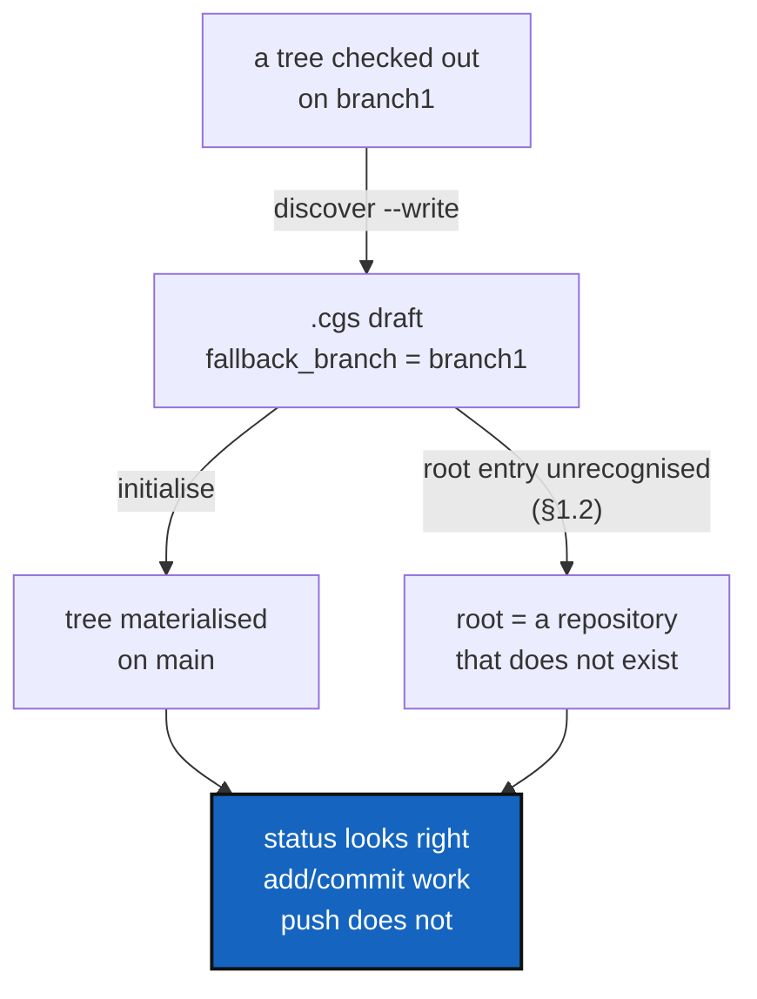

# DiscoverRoundTrip — the tree a `.cgs` describes must be the tree you get

*Created: 2026-09-21*

*Branch: main*

> **Ticket review — 2026-09-23.** Renumbered again, `main_1-3` → `main_1-2`:
> [AgentContract](../archive/20260923_AgentContract_DevPlanTicket.md)
> finished and archived, compacting the pile by one. Everything below is
> otherwise unchanged.

> **Ticket review — 2026-09-22, part 3.** Renumbered again, `main_1-3` →
> `main_1-4`: [Autofix](../archive/20260923_Autofix_DevPlanTicket.md) is queued first
> in the pile, on the owner's explicit instruction. Everything below is
> otherwise unchanged.

> **Ticket review — 2026-09-22, part 2.** Renumbered again, `main_1-4` →
> `main_1-3`: [ProjectSpecSplit](../archive/20260922_ProjectSpecSplit_DevPlanTicket.md)
> finished and archived in the same pass, compacting the pile by one.

> **Ticket review — 2026-09-22.** Promoted from `main_2-5` (stand-by) to
> `main_1-4` (pick up now), on the owner's request to reorganise the
> backlog into: finalize the agentic, then what's important before
> data-repo, then data-repo, then Omniscience. This ticket is squarely
> "important before data-repo": data-repo will add new `.cgs` entries and
> repository/branch relationships of exactly the kind §1's defects get
> wrong, `examples/molonari.cgs` ships broken today with `validate` calling
> it `ok`, and priority 1's own definition — "a wrong answer the user acts
> on" — already fit before this review; the pile assignment was just stale.

> **Owner ticket — `shortTickets/discover.md`, 2026-09-21:** adopting a
> project that sat on a branch other than `main`. `discover --write` did
> not record that branch the way the owner expected; the tree came back
> `READY` and `status` looked right; `add` and `commit` worked and `push`
> did not; and the owner noted, without confirming it, that *"for a
> nested config Project-name and root-repo-name must match"* and that
> something also went wrong in the standalone case when the two differed.
> The worked case was `examples/molonari.cgs`.
>
> **This is a debug ticket.** Everything in §1–§3 was reproduced against
> this checkout on 2026-09-21 before the ticket was written; §4 is the one
> reported symptom that is *not* yet reproduced and says what is needed to
> reproduce it.

## Abstract — read this first

**The one-line version.** Two rules the whole tool depends on — *which
entry is the root repository* and *which branch does this repository
target* — are each implemented more than once and disagree with
themselves, so a `.cgs` can describe one tree and materialise a different
one without a single warning.

**What this document is.** A debug plan: five confirmed defects with
runnable reproductions, one symptom still to reproduce, four work
packages, three decisions, and the documentation the owner asked for.

**Why it exists.** The owner's report reads as one confusing session.
It is not: it is five independent defects that compound. The root
repository's declared branch is silently ignored (§1.1). A `.cgs` with no
recognisable root entry is accepted and produces a tree whose root is a
repository that does not exist (§1.2) — `examples/molonari.cgs`, checked
in on 2026-09-20, is in exactly that state and `validate` calls it `ok`.
The nested-config path answers the same root question a second time, by a
different rule (§1.3). And `discover --write` records the branch it
observed as a *fallback*, which is consulted only when the target is
missing, so re-materialising a discovered tree lands it on `main`
wherever `main` also exists (§2).

**What you will find.** §1 the three root-identity defects. §2 the two
discover-fidelity defects. §3 how they compound into the reported
session. §4 the unreproduced `push` symptom. §5 the work packages. §6 the
decisions. §7 documentation. §8 acceptance.

**Who it is for.** Whoever picks it up. §1 and §2 are each a handful of
lines of code; §5's WP1 is the one that needs care, because it removes a
duplicated rule rather than patching two copies of it.

**What you need to do with it.** Read §1.1 and §1.2 first — they are the
sharp ones, and §1.2 is shipping broken in a checked-in example. Then §6,
which has one question that is the owner's.



---

## 1. Which entry is the root repository

Three defects, one cause: the question "which repository entry is the
project root, and what did it declare?" is answered in two places by two
different rules, and neither answer is carried through completely.

### 1.1 F1 — the root repository's declared branch is ignored

**Every entry in a `.cgs` gets its target branch from
`git_branch.resolve_declared_ref` — except the root.** `registry.py`'s
`build_registry_from_cgs_document` builds the root entry with
`target_ref_name=document.default_branch` before it has looked at any
repository entry, and `git_tree._apply_repo_identity`, which then applies
the root entry's declared values, sets `default_branch` and
`fallback_branch` but never revises `target_ref_name`. It does not read
`branch` or `tag` at all.

So the root ends up internally contradictory — it knows its declared
`default_branch` and still targets something else:

```bash
pixi run python -c "
from pathlib import Path
from ComplexGitSync.cgs_format import CgsDocument
from ComplexGitSync.registry import build_registry_from_cgs_document
d = CgsDocument.from_dict({'project':'P','repos':[
  {'repository':'github:o/P','relative_path':'.','default_branch':'X'},
  {'repository':'github:o/Q','relative_path':'q','default_branch':'X'},
]})
t = build_registry_from_cgs_document(d, Path('/tmp/P.cgs'))
for e in t.values(): print(f'{e.repo_id:10} target={e.target_ref_name!r:8} default={e.default_branch!r}')
"
```

```
root       target='main'   default='X'
root:q     target='X'      default='X'
```

`_select_clone_ref` reads `entry.target_ref_name or entry.default_branch`,
so the root clones `main`. The only way to move the root today is
`project.default_branch` — which is undocumented as the *only* way, and
which a reader has no reason to expect, since the same two keys work on
every other entry.

`branch` and `tag` on a root entry are worse than ignored: they are
accepted by validation, survive serialisation (`to_authoring_dict` passes
any non-canonical key through verbatim), and do nothing.

### 1.2 F2 — a `.cgs` with no root entry is accepted

`git_tree._is_root_repo_spec` accepts an entry as the root when its
`relative_path` is `"."` or `""`, **or**, failing that, when its
`project_name` equals the document's project name. When neither matches
any entry, nothing is reported: the root keeps the bare
`WorkingRepo(name=document.project_name)` it was constructed with, which
names no provider, no owner and no repository, and the real root
repository is mounted one level down at `<root>/<its own name>`.

`examples/molonari.cgs` — added 2026-09-20 in `175fc8a` — **was** in that
state; fixed 2026-09-21, per D3. The repro below is left as written, as
the record of the defect this file was found in. `project = "MOLONARI"`,
and its first entry was `github:flipoyo/MOLONARI1D` with no
`relative_path`:

```bash
pixi run python -c "
from pathlib import Path
from ComplexGitSync.cgs_format import CgsDocument
from ComplexGitSync.registry import build_registry_from_cgs_document
p = Path('examples/molonari.cgs')
d = CgsDocument.from_toml(p)
for e in build_registry_from_cgs_document(d, p).values():
    print(f'{e.repo_id:22} type={e.node_type.value:6} rel={str(e.relative_path):14} owner={e.project_owner_name!r}')
"
```

```
root                   type=root   rel=.              owner=None
root:MOLONARI1D        type=leaf   rel=MOLONARI1D     owner=None   <- wrong: this is the root
root:Molonaviz         type=leaf   rel=Molonaviz      owner='flipoyo'
...
```

`cgitsync validate examples/molonari.cgs` reports
`DECLARED ready=false complete=true`, writes a snapshot, and appends a
ledger entry. **`complete=true` on a tree whose root repository does not
exist** is the wrong answer to the only question `validate` is asked.

`examples/cawaqsviz.cgs` has the same name mismatch — project
`CaWaQS-Viz`, root repository `cawaqsviz` — and is correct, because it
writes `relative_path = "."`. That is the whole difference, and nothing
says so.

This is the owner's *"I also got a bug in standalone when the two were
different but i didn't confirm it was the cause of it"*. It is confirmed.

### 1.3 F3 — the nested-config path implements the same rule again

`discovery.discover_nested_configs` does not call `_is_root_repo_spec`.
It inlines a name-only test:

```python
if not root_identity_assigned and repo.get("project_name") == nested_document.project_name:
```

so the `relative_path = "."` escape that saves `cawaqsviz.cgs` does not
exist for a nested `.cgs`. Two outcomes, both silent:

| Nested `.cgs` root entry | What happens |
|---|---|
| `relative_path = "."`, name ≠ project name | The mount keeps the parent's declared values. The nested root's `fallback_branch`, `default_branch`, `nested_config` and `private` are **dropped**. |
| no `relative_path`, name ≠ project name | A **phantom child** is registered at `<mount>/<name>` — a second mount of the repository, inside itself. `initialise` will try to clone it there. |

Reproduced both ways; the dropped-branch case:

```
'root:child'  name='ChildRoot'  rel='child'  fallback='main'     <- declared branch1, lost
```

and with `relative_path` omitted:

```
'root:child'            name='ChildRoot'  rel='child'      fallback='main'
'root:child:ChildRoot'  name='ChildRoot'  rel='ChildRoot'  fallback='branch1'   <- phantom
```

This is the owner's *"for a nested config Project-name and root-repo-name
must match"*. Confirmed, and it is a rule nobody wrote down because
nobody meant to make it.

It is also exactly what `CLAUDE.md`'s architecture boundary forbids —
the same class of duplication that `parse_repo_id()` and `git_branch.py`
each exist to prevent. One rule, one implementation.

## 2. What `discover --write` records

### 2.1 F4 — the observed branch is drafted as a fallback, never as a target

`orchestre.discover_repos` writes `entry["fallback_branch"] = repo.branch`
for each repository, and passes the project to `configure()` as a bare
name string — so `project.default_branch` is never drafted and stays
`main`.

`fallback_branch` is not a target. `_select_clone_ref` tries
`target_ref_name or default_branch` **first** and only consults the
fallback when that branch is absent from the remote. So a tree scanned
entirely on `branch1` drafts a `.cgs` that targets `main` everywhere:

```bash
mkdir -p /tmp/rt/Root && cd /tmp/rt/Root && git init -q -b main . \
  && git remote add origin https://github.com/acme/Root.git \
  && echo a > a && git add . && git -c user.email=t@t -c user.name=t commit -qm i \
  && git checkout -qb branch1
cd - && pixi run cgitsync discover /tmp/rt/Root --write /tmp/rt/root.cgs
```

drafts `{ repository = "github:acme/Root", fallback_branch = "branch1" }`,
which reads back as `target='main' default='main' fallback='branch1'`.

The round trip therefore does not reproduce the tree it scanned. It
*appears* to work whenever the remote has no `main` — the fallback then
takes over — which is why this is confusing rather than obviously broken:
it depends on a remote's branch list, not on anything in the file.

Compounded with F1, a root repository cannot be moved off `main` by any
per-repository key at all.

### 2.2 F5 — a repository with no `origin` is dropped, and the warning stops there

Correct behaviour — a drafted address must never be guessed — but it is
what the owner hit first. A subproject created with `git init` and not
yet given a remote is silently absent from the draft's `repos`, with one
warning among the report's output, and the user's next move (hand-write
the entry) is the one thing the warning does not say how to do. In
`examples/molonari.cgs` the five hand-added entries carry no
`fallback_branch` at all, which is the fingerprint of exactly this.

The warning should name what to add, not only what was missing.

## 3. How they compound

Nothing in §1 or §2 produces an error message. Together they explain the
reported session without needing any further defect:

1. `discover --write` drops the remote-less split repositories (F5); the
   owner adds them by hand, without a branch.
2. The draft records `branch1` only as a fallback (F4), and the root's
   own declared branch would be ignored anyway (F1).
3. `initialise` clones `main` wherever the remote has it. The tree is
   `READY`, every repository is aligned with every other, and `status`
   has nothing to complain about — *"status displayed the branch
   properly"* is true and still not the branch that was wanted.
4. `add` and `commit` pass preflight, because alignment is measured
   against the root's branch and the whole tree agrees.
5. `push` is where a disagreement with the **remote** first matters.

## 4. S1 — the `push` failure, not yet reproduced

The owner's report — *"add, commit worked but not push … only the main
branch of the repo existed and then i was able to checkout the branch
everywhere in the distant repo"* — is the one symptom this ticket has not
reproduced, because it depends on the remote's branch list at the time.

`push_tree` (`operations.py`) has three places it can fail, and the fix is
different for each. Whoever picks this up should determine which, before
changing anything:

| Candidate | Where | How it would read |
|---|---|---|
| Branch misalignment | `_collect_branch_alignment_diagnostics` | `branch misalignment: expected 'X', found 'Y'` — blocking, and would have blocked `commit` too, so **unlikely** given the report |
| Behind/diverged upstream | `_collect_tracking_diagnostics` | `local branch is behind its upstream` — blocking |
| `git push` itself | `GitRunner.push` | `src refspec X does not match any`, when `resolved_ref_name` names a branch the local repository does not have |

**What is needed to reproduce it.** From the owner, for the failing
session: the `.cgs` used, the `push` output verbatim, and the run log
under `.cgitsync/logs/push-*.log`. Failing that, build it: local bare
remotes holding only `main`, a tree initialised from a `.cgs` declaring
`fallback_branch = branch1`, then `push` — the harness in
`tests/integration/test_upstream_tracking.py` already sets up bare remotes
and is the cheapest starting point.

Do not fix this one by inference. The three candidates above have
incompatible fixes.

> **Investigated, 2026-09-24 — not reproduced.** Built exactly the
> harness this section asks for: a bare remote holding only `main`, a
> real clone checked out on `branch1` with a real, un-pushed commit, and
> a hand-authored `.cgs` declaring only `fallback_branch = "branch1"` (no
> `branch`/`tag`/`default_branch` anywhere in its chain — the shape
> `discover --write` produced before F4, and the shape a human still
> gets today if they type only `fallback_branch` by hand). Loading it
> confirms the mismatch this section is about: `target_ref_name`
> resolves to `main` while the real checkout sits on `branch1`. Pushing
> from there does **not** fail: `test_push_succeeds_even_when_the_cgs_
> declares_a_branch_the_checkout_is_not_on`
> (`tests/integration/test_upstream_tracking.py`) is the test, and it
> passes.
>
> **Why not, and what it rules out.** `push` requires a `READY` tree, and
> the only path that brings a bare `load()` to `READY` is
> `operations.restart_tree` — which reads each repository's *actual*
> checked-out branch (`git_runner.current_branch`) and propagates it as
> the resolved target *before* `push` ever runs, correcting the very
> mismatch this section describes. There is no way to reach `push`
> through the client's own API without going through that correction
> first. This rules out **candidate 3** (`git push` itself, naming a
> branch the local repository does not have — the correction means it
> never gets the chance to) and, independently of that mechanism,
> **candidate 1** (branch misalignment — already argued unlikely in this
> section's own table, since it would have blocked `commit` too, which
> the owner's report says succeeded).
>
> **What is left.** Candidate 2 — behind/diverged upstream — is not ruled
> out, and this harness has no divergent upstream to reproduce it
> against: it needs a scenario where the *branch name* already resolves
> correctly (so `restart_tree`'s correction is not what is protecting
> against S1) but the local branch is genuinely behind or diverged from
> what the remote already has under that name — closer to an ordinary
> merge-conflict-adjacent failure than a root-identity one. That is a
> narrower, different reproduction than anything this ticket's own F1-F5
> describe, and the owner's own failing `push` output or
> `.cgitsync/logs/push-*.log` (per this section's original ask) is still
> the fastest way to confirm it rather than guessing at a second harness.

## 5. Work packages

**WP1 — one root test, used everywhere.** Fixes F1, F2 and F3 together.
**Done.**

- `_is_root_repo_spec` (`git_tree.py`) is the single implementation of "is
  this entry the project root", called from both
  `registry.build_registry_from_cgs_document` (the top-level document) and
  `discovery.discover_nested_configs` (a nested one) in place of the
  latter's inlined, name-only comparison.
- `_apply_repo_identity` now resolves the root's target through
  `git_branch.resolve_declared_ref`, the same call every other entry
  already goes through, so `branch`, `tag` and `default_branch` mean the
  same thing on the root entry as anywhere else.
- **D2 answered: an error.** A document whose entries contain no root
  raises `ConfigValidationError` naming the fix
  (`` relative_path = "." ``), at the top level. A **nested** `.cgs`
  naming no root is deliberately *not* an error (see §6's amendment to
  D2, below) — reusing `_is_root_repo_spec` fixed F3's *dropped-values*
  case (row 1 of its own table) directly; its *phantom-mount* case (row
  2, no `relative_path` at all) turned out to need a real design choice
  rather than a bug fix, and the choice made is documented there.
- A one-repository document is always the root, whatever that repo's own
  name or path say — `_is_root_repo_spec(..., is_sole_repo=...)`. Without
  this, `create-cgs --project X --repo owner/y` (`y` almost never equals
  `X`) drafted exactly the F2 shape this ticket set out to refuse, and
  `configure()`'s own earlier special-case for that (inject
  `` relative_path = "." `` onto a lone entry) was simplified away once
  the general rule covered it.
- `test_every_checked_in_example_cgs_resolves_a_root_with_a_declared_owner`
  (`tests/unit/test_root_repo_identity.py`) covers every checked-in
  `examples/*.cgs` (`examples/molonari.cgs` itself was already fixed
  ahead of this work package, per D3).
- No ring rule moved (`git_branch.py` is Ring 0; `git_tree.py`/
  `discovery.py` already imported it) — `.localSpec/AdditionalSpecs.md`'s
  table is updated regardless, since `_is_root_repo_spec` becoming the
  shared implementation is new information about where a rule lives.

**WP2 — `discover` drafts the tree it scanned.** Fixes F4 and F5. **Done.**

- The observed root branch is drafted as `project.default_branch`, per
  D1; a repository scanned on a *different* branch than the root also
  gets its own explicit `default_branch`, so it is not silently
  retargeted at the root's branch. `fallback_branch` is kept as before.
- The no-`origin` warning now prints a ready-to-edit entry — repository
  shorthand, `relative_path`, and `default_branch` when one was observed
  — not only which repository was left out.
- `test_discover_write_drafts_the_branch_it_scanned` and
  `test_discover_write_only_drafts_a_per_repo_branch_where_it_differs`
  (`tests/integration/test_cgsi_topology.py`) cover the round trip: scan
  on a non-`main` branch, write the draft, read it back, assert
  `target_ref_name` is the branch that was scanned.

**WP3 — reproduce S1**, per §4, then fix whichever of the three it is.
**Investigated; not reproduced.** See §4's own update, below, for the
finding and what it rules out.

**WP4 — documentation**, per §7. **Done** — see §7's own update.

## 6. Decisions

| D | Question | Recommendation | Whose call |
|---|---|---|---|
| **D1** | What should `discover --write` write for an observed branch — `branch`, `default_branch`, `project.default_branch`, or a fallback as today? | **ANSWERED, 2026-09-24 — done exactly as recommended.** `project.default_branch` from the root repository's branch, a per-repository `default_branch` only where a repository differs from it, and `fallback_branch` kept as well | Implementer |
| **D2** | Is a `.cgs` with no recognisable root entry an error, or a warning? | **ANSWERED — an error, at validation, for the *top-level* document.** Done exactly as recommended: `ConfigValidationError`, naming the fix. **Extended, 2026-09-24 — a *nested* `.cgs` is different, and not covered by this decision.** A nested document's `entry` (the parent mount) already has a full identity from the *outer* document; a nested file listing only children — no entry re-declaring the mount itself at all — is a normal, common shape, not a defect. Implementing WP1 surfaced this: a real test fixture (`shared-spec`, a nested `.cgs` naming only one child repository) would otherwise have been wrongly refused. The refusal applies only at the top level | Implementer, surfaced during WP1 |
| **D2b** | (New, surfaced by WP1.) F3's *phantom-mount* case — a nested root entry with **no** `relative_path` at all and a name that does not match the nested project's own — is it the mount re-declaring itself (apply `is_sole_repo`, as the top-level document now does) or a genuine, if unusually shaped, single child? | **Left as `relative_path = "."` required.** The two readings are genuinely indistinguishable from the document's shape alone — the `shared-spec` fixture above is a real example of the "single child" reading being correct — so `is_sole_repo` was **not** extended to the nested path. A nested `.cgs` meaning to re-declare its own mount states so explicitly (`` relative_path = "." `` or a matching `project_name`), same as before F3's fix for the case that *does* have a name mismatch with a path given | Implementer |
| **D3** | Fix `examples/molonari.cgs` now, or with WP1? | **Done, 2026-09-21** — the owner asked for it ahead of WP1. `relative_path = "."` added to the `MOLONARI1D` entry; the root now resolves with `owner='flipoyo'` instead of `owner=None`, and `cgitsync validate` no longer reports `complete=true` over a phantom root. WP1's own test (every `examples/*.cgs` resolves a root with a declared owner) still lands with the work package | **Owner** — closed |

D1 is about an *ordinary* repository's `default_branch`; the same field on
`examples/molonari.cgs`'s `private, writable` `ComplexGitSync` entry has a
different, still-open defect — it hand-encodes a naming rule
(`private_local_branch`) that `resolve_declared_ref`/`discover` never
compute, and the encoded value there has already gone stale. Out of this
ticket's scope; tracked as
[PrivateLocalBranchAtClone](main_1-5_PrivateLocalBranchAtClone_DevPlanTicket.md).

## 7. Documentation — what the owner asked for

> *"I didn't find the UX fluid and those warnings if not possible to
> counterbalance must be documented in the detailed user-guide with a
> warning in the tuto."*

**Done.**

- **`docs/Text/user_guide.tex`, `discover`.** Added: what the draft records
  for a branch (`project.default_branch` from the root, per-repo
  `default_branch` only where a repository differs), what
  `fallback_branch` is for, and why re-materialising the drafted tree now
  reproduces the tree that was scanned. The `origin` warning's own
  description updated to say it now names a ready-to-edit entry, not only
  what was missing.
- **`docs/Text/user_guide.tex`, "Branches in a `.cgs`".** Rewritten: the
  table and chain notation used to list `fallback_branch` as the
  *first*, highest-priority link in the same chain that decides a
  repository's target — which `git_branch.resolve_declared_ref` never
  actually consults it as part of. Split into two explicit questions
  ("the target" — `tag → branch → default_branch →
  project.default_branch → main`, the root included, same as everywhere
  else — and "the fallback" — consulted only when the target is absent
  from the remote), with a worked example of exactly the silent
  mismatch F4 was.
- **`tutorials/03_adopting_a_real_project.md`.** A warning box, right
  after step 1 of §3.1 (`discover`) where the draft is actually
  produced: check `project.default_branch` before running `initialise`
  when the checkout is not on `main`, and the "`fallback_branch` alone is
  not a target" mismatch, stated plainly with where it goes silent
  (`status`/`add`/`commit` all measure against what the tree already
  agrees on; only `push` against the *remote* first notices).
- **PDFs rebuilt** (`cd docs && latexmk -pdf MASTER.tex`).

## 8. Acceptance

- [x] `_is_root_repo_spec` is the only implementation of the root test;
  `discovery.py` calls it. A nested `.cgs` whose project name differs
  from its root repository's name resolves correctly with
  `relative_path = "."`, and registers no phantom child without it.
  (F3's *other* silent case — no `relative_path` at all, name mismatched
  — is D2b's own resolution: still requires `relative_path = "."` to be
  recognised, on purpose, since the shape is genuinely ambiguous without
  it.)
- [x] A root entry declaring `branch`, `tag` or `default_branch` targets
  that ref, exactly as a non-root entry does. No entry reports a
  `default_branch` it does not target.
- [x] A `.cgs` with no root entry is refused by name (D2), and
  `cgitsync validate` never reports `complete=true` for a tree whose root
  repository has no declared address. (Top-level document only — D2's
  own extension covers why a nested one is different.)
- [x] Every `examples/*.cgs` resolves a root repository with a declared
  owner, checked by a test
  (`test_every_checked_in_example_cgs_resolves_a_root_with_a_declared_owner`).
- [x] `discover --write` on a tree checked out on a non-`main` branch
  drafts a `.cgs` that reads back targeting that branch, checked by a
  test (`test_discover_write_drafts_the_branch_it_scanned`).
- [x] S1 is reproduced in a test before it is fixed, or the ticket
  records why it could not be and what was ruled out. **Not reproduced**
  — recorded in §4, with candidates 1 and 3 ruled out and candidate 2
  named as what would still need the owner's own failing-push evidence.
- [x] The user guide and Tutorial 3 say what §7 lists; the PDFs are
  rebuilt.
- [x] `pixi run lint` and `pixi run test` pass (1690 passed, 5 skipped);
  `pixi run bump-build` run for the `src/` change; `cgitsync status`
  shows `errors=0`.
