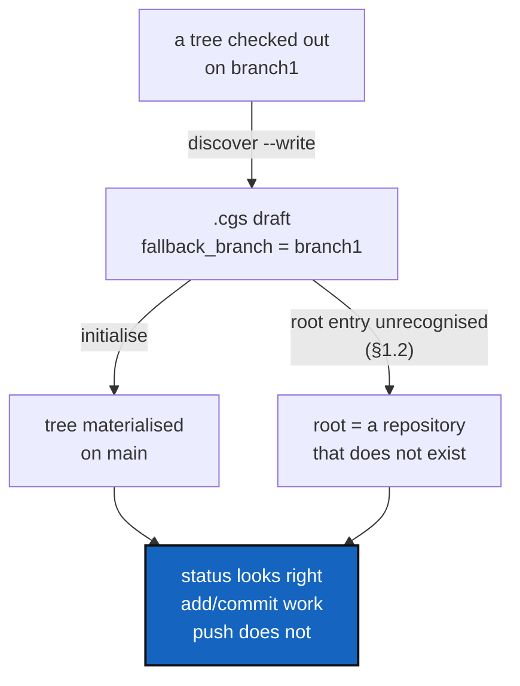

# DiscoverRoundTrip — the tree a `.cgs` describes must be the tree you get

*Created: 2026-09-21*

*Branch: main*

> **Ticket review — 2026-09-23.** Renumbered again, `main_1-3` → `main_1-2`:
> [AgentContract](../archive/20260923_AgentContract_DevPlanTicket.md)
> finished and archived, compacting the pile by one. Everything below is
> otherwise unchanged.

> **Ticket review — 2026-09-22, part 3.** Renumbered again, `main_1-3` →
> `main_1-4`: [Autofix](../archive/20260923_Autofix_DevPlanTicket.md) is queued first
> in the pile, on the owner's explicit instruction. Everything below is
> otherwise unchanged.

> **Ticket review — 2026-09-22, part 2.** Renumbered again, `main_1-4` →
> `main_1-3`: [ProjectSpecSplit](../archive/20260922_ProjectSpecSplit_DevPlanTicket.md)
> finished and archived in the same pass, compacting the pile by one.

> **Ticket review — 2026-09-22.** Promoted from `main_2-5` (stand-by) to
> `main_1-4` (pick up now), on the owner's request to reorganise the
> backlog into: finalize the agentic, then what's important before
> data-repo, then data-repo, then Omniscience. This ticket is squarely
> "important before data-repo": data-repo will add new `.cgs` entries and
> repository/branch relationships of exactly the kind §1's defects get
> wrong, `examples/molonari.cgs` ships broken today with `validate` calling
> it `ok`, and priority 1's own definition — "a wrong answer the user acts
> on" — already fit before this review; the pile assignment was just stale.

> **Owner ticket — `shortTickets/discover.md`, 2026-09-21:** adopting a
> project that sat on a branch other than `main`. `discover --write` did
> not record that branch the way the owner expected; the tree came back
> `READY` and `status` looked right; `add` and `commit` worked and `push`
> did not; and the owner noted, without confirming it, that *"for a
> nested config Project-name and root-repo-name must match"* and that
> something also went wrong in the standalone case when the two differed.
> The worked case was `examples/molonari.cgs`.
>
> **This is a debug ticket.** Everything in §1–§3 was reproduced against
> this checkout on 2026-09-21 before the ticket was written; §4 is the one
> reported symptom that is *not* yet reproduced and says what is needed to
> reproduce it.

## Abstract — read this first

**The one-line version.** Two rules the whole tool depends on — *which
entry is the root repository* and *which branch does this repository
target* — are each implemented more than once and disagree with
themselves, so a `.cgs` can describe one tree and materialise a different
one without a single warning.

**What this document is.** A debug plan: five confirmed defects with
runnable reproductions, one symptom still to reproduce, four work
packages, three decisions, and the documentation the owner asked for.

**Why it exists.** The owner's report reads as one confusing session.
It is not: it is five independent defects that compound. The root
repository's declared branch is silently ignored (§1.1). A `.cgs` with no
recognisable root entry is accepted and produces a tree whose root is a
repository that does not exist (§1.2) — `examples/molonari.cgs`, checked
in on 2026-09-20, is in exactly that state and `validate` calls it `ok`.
The nested-config path answers the same root question a second time, by a
different rule (§1.3). And `discover --write` records the branch it
observed as a *fallback*, which is consulted only when the target is
missing, so re-materialising a discovered tree lands it on `main`
wherever `main` also exists (§2).

**What you will find.** §1 the three root-identity defects. §2 the two
discover-fidelity defects. §3 how they compound into the reported
session. §4 the unreproduced `push` symptom. §5 the work packages. §6 the
decisions. §7 documentation. §8 acceptance.

**Who it is for.** Whoever picks it up. §1 and §2 are each a handful of
lines of code; §5's WP1 is the one that needs care, because it removes a
duplicated rule rather than patching two copies of it.

**What you need to do with it.** Read §1.1 and §1.2 first — they are the
sharp ones, and §1.2 is shipping broken in a checked-in example. Then §6,
which has one question that is the owner's.



---

## 1. Which entry is the root repository

Three defects, one cause: the question "which repository entry is the
project root, and what did it declare?" is answered in two places by two
different rules, and neither answer is carried through completely.

### 1.1 F1 — the root repository's declared branch is ignored

**Every entry in a `.cgs` gets its target branch from
`git_branch.resolve_declared_ref` — except the root.** `registry.py`'s
`build_registry_from_cgs_document` builds the root entry with
`target_ref_name=document.default_branch` before it has looked at any
repository entry, and `git_tree._apply_repo_identity`, which then applies
the root entry's declared values, sets `default_branch` and
`fallback_branch` but never revises `target_ref_name`. It does not read
`branch` or `tag` at all.

So the root ends up internally contradictory — it knows its declared
`default_branch` and still targets something else:

```bash
pixi run python -c "
from pathlib import Path
from ComplexGitSync.cgs_format import CgsDocument
from ComplexGitSync.registry import build_registry_from_cgs_document
d = CgsDocument.from_dict({'project':'P','repos':[
  {'repository':'github:o/P','relative_path':'.','default_branch':'X'},
  {'repository':'github:o/Q','relative_path':'q','default_branch':'X'},
]})
t = build_registry_from_cgs_document(d, Path('/tmp/P.cgs'))
for e in t.values(): print(f'{e.repo_id:10} target={e.target_ref_name!r:8} default={e.default_branch!r}')
"
```

```
root       target='main'   default='X'
root:q     target='X'      default='X'
```

`_select_clone_ref` reads `entry.target_ref_name or entry.default_branch`,
so the root clones `main`. The only way to move the root today is
`project.default_branch` — which is undocumented as the *only* way, and
which a reader has no reason to expect, since the same two keys work on
every other entry.

`branch` and `tag` on a root entry are worse than ignored: they are
accepted by validation, survive serialisation (`to_authoring_dict` passes
any non-canonical key through verbatim), and do nothing.

### 1.2 F2 — a `.cgs` with no root entry is accepted

`git_tree._is_root_repo_spec` accepts an entry as the root when its
`relative_path` is `"."` or `""`, **or**, failing that, when its
`project_name` equals the document's project name. When neither matches
any entry, nothing is reported: the root keeps the bare
`WorkingRepo(name=document.project_name)` it was constructed with, which
names no provider, no owner and no repository, and the real root
repository is mounted one level down at `<root>/<its own name>`.

`examples/molonari.cgs` — added 2026-09-20 in `175fc8a` — **was** in that
state; fixed 2026-09-21, per D3. The repro below is left as written, as
the record of the defect this file was found in. `project = "MOLONARI"`,
and its first entry was `github:flipoyo/MOLONARI1D` with no
`relative_path`:

```bash
pixi run python -c "
from pathlib import Path
from ComplexGitSync.cgs_format import CgsDocument
from ComplexGitSync.registry import build_registry_from_cgs_document
p = Path('examples/molonari.cgs')
d = CgsDocument.from_toml(p)
for e in build_registry_from_cgs_document(d, p).values():
    print(f'{e.repo_id:22} type={e.node_type.value:6} rel={str(e.relative_path):14} owner={e.project_owner_name!r}')
"
```

```
root                   type=root   rel=.              owner=None
root:MOLONARI1D        type=leaf   rel=MOLONARI1D     owner=None   <- wrong: this is the root
root:Molonaviz         type=leaf   rel=Molonaviz      owner='flipoyo'
...
```

`cgitsync validate examples/molonari.cgs` reports
`DECLARED ready=false complete=true`, writes a snapshot, and appends a
ledger entry. **`complete=true` on a tree whose root repository does not
exist** is the wrong answer to the only question `validate` is asked.

`examples/cawaqsviz.cgs` has the same name mismatch — project
`CaWaQS-Viz`, root repository `cawaqsviz` — and is correct, because it
writes `relative_path = "."`. That is the whole difference, and nothing
says so.

This is the owner's *"I also got a bug in standalone when the two were
different but i didn't confirm it was the cause of it"*. It is confirmed.

### 1.3 F3 — the nested-config path implements the same rule again

`discovery.discover_nested_configs` does not call `_is_root_repo_spec`.
It inlines a name-only test:

```python
if not root_identity_assigned and repo.get("project_name") == nested_document.project_name:
```

so the `relative_path = "."` escape that saves `cawaqsviz.cgs` does not
exist for a nested `.cgs`. Two outcomes, both silent:

| Nested `.cgs` root entry | What happens |
|---|---|
| `relative_path = "."`, name ≠ project name | The mount keeps the parent's declared values. The nested root's `fallback_branch`, `default_branch`, `nested_config` and `private` are **dropped**. |
| no `relative_path`, name ≠ project name | A **phantom child** is registered at `<mount>/<name>` — a second mount of the repository, inside itself. `initialise` will try to clone it there. |

Reproduced both ways; the dropped-branch case:

```
'root:child'  name='ChildRoot'  rel='child'  fallback='main'     <- declared branch1, lost
```

and with `relative_path` omitted:

```
'root:child'            name='ChildRoot'  rel='child'      fallback='main'
'root:child:ChildRoot'  name='ChildRoot'  rel='ChildRoot'  fallback='branch1'   <- phantom
```

This is the owner's *"for a nested config Project-name and root-repo-name
must match"*. Confirmed, and it is a rule nobody wrote down because
nobody meant to make it.

It is also exactly what `CLAUDE.md`'s architecture boundary forbids —
the same class of duplication that `parse_repo_id()` and `git_branch.py`
each exist to prevent. One rule, one implementation.

## 2. What `discover --write` records

### 2.1 F4 — the observed branch is drafted as a fallback, never as a target

`orchestre.discover_repos` writes `entry["fallback_branch"] = repo.branch`
for each repository, and passes the project to `configure()` as a bare
name string — so `project.default_branch` is never drafted and stays
`main`.

`fallback_branch` is not a target. `_select_clone_ref` tries
`target_ref_name or default_branch` **first** and only consults the
fallback when that branch is absent from the remote. So a tree scanned
entirely on `branch1` drafts a `.cgs` that targets `main` everywhere:

```bash
mkdir -p /tmp/rt/Root && cd /tmp/rt/Root && git init -q -b main . \
  && git remote add origin https://github.com/acme/Root.git \
  && echo a > a && git add . && git -c user.email=t@t -c user.name=t commit -qm i \
  && git checkout -qb branch1
cd - && pixi run cgitsync discover /tmp/rt/Root --write /tmp/rt/root.cgs
```

drafts `{ repository = "github:acme/Root", fallback_branch = "branch1" }`,
which reads back as `target='main' default='main' fallback='branch1'`.

The round trip therefore does not reproduce the tree it scanned. It
*appears* to work whenever the remote has no `main` — the fallback then
takes over — which is why this is confusing rather than obviously broken:
it depends on a remote's branch list, not on anything in the file.

Compounded with F1, a root repository cannot be moved off `main` by any
per-repository key at all.

### 2.2 F5 — a repository with no `origin` is dropped, and the warning stops there

Correct behaviour — a drafted address must never be guessed — but it is
what the owner hit first. A subproject created with `git init` and not
yet given a remote is silently absent from the draft's `repos`, with one
warning among the report's output, and the user's next move (hand-write
the entry) is the one thing the warning does not say how to do. In
`examples/molonari.cgs` the five hand-added entries carry no
`fallback_branch` at all, which is the fingerprint of exactly this.

The warning should name what to add, not only what was missing.

## 3. How they compound

Nothing in §1 or §2 produces an error message. Together they explain the
reported session without needing any further defect:

1. `discover --write` drops the remote-less split repositories (F5); the
   owner adds them by hand, without a branch.
2. The draft records `branch1` only as a fallback (F4), and the root's
   own declared branch would be ignored anyway (F1).
3. `initialise` clones `main` wherever the remote has it. The tree is
   `READY`, every repository is aligned with every other, and `status`
   has nothing to complain about — *"status displayed the branch
   properly"* is true and still not the branch that was wanted.
4. `add` and `commit` pass preflight, because alignment is measured
   against the root's branch and the whole tree agrees.
5. `push` is where a disagreement with the **remote** first matters.

## 4. S1 — the `push` failure, not yet reproduced

The owner's report — *"add, commit worked but not push … only the main
branch of the repo existed and then i was able to checkout the branch
everywhere in the distant repo"* — is the one symptom this ticket has not
reproduced, because it depends on the remote's branch list at the time.

`push_tree` (`operations.py`) has three places it can fail, and the fix is
different for each. Whoever picks this up should determine which, before
changing anything:

| Candidate | Where | How it would read |
|---|---|---|
| Branch misalignment | `_collect_branch_alignment_diagnostics` | `branch misalignment: expected 'X', found 'Y'` — blocking, and would have blocked `commit` too, so **unlikely** given the report |
| Behind/diverged upstream | `_collect_tracking_diagnostics` | `local branch is behind its upstream` — blocking |
| `git push` itself | `GitRunner.push` | `src refspec X does not match any`, when `resolved_ref_name` names a branch the local repository does not have |

**What is needed to reproduce it.** From the owner, for the failing
session: the `.cgs` used, the `push` output verbatim, and the run log
under `.cgitsync/logs/push-*.log`. Failing that, build it: local bare
remotes holding only `main`, a tree initialised from a `.cgs` declaring
`fallback_branch = branch1`, then `push` — the harness in
`tests/integration/test_upstream_tracking.py` already sets up bare remotes
and is the cheapest starting point.

Do not fix this one by inference. The three candidates above have
incompatible fixes.

## 5. Work packages

**WP1 — one root test, used everywhere.** Fixes F1, F2 and F3 together.

- Make `_is_root_repo_spec` the single implementation of "is this entry
  the project root", and call it from `discovery.py` in place of the
  inlined name comparison.
- Make `_apply_repo_identity` set the root's target through
  `git_branch.resolve_declared_ref`, the same call every other entry
  already goes through, so `branch`, `tag` and `default_branch` mean the
  same thing on the root entry as anywhere else.
- Refuse — or warn about, per D2 — a document whose entries contain no
  root, by name or by path, naming the fix (`relative_path = "."`).
- Add a test that every checked-in `examples/*.cgs` resolves a root
  repository with a declared owner (`examples/molonari.cgs` itself was
  already fixed ahead of this work package, per D3).
- `git_branch.py` is Ring 0 and `git_tree.py`/`discovery.py` import it
  already, so no ring rule moves. If any responsibility does move,
  `.localSpec/AdditionalSpecs.md`'s table is updated in the same change.

**WP2 — `discover` drafts the tree it scanned.** Fixes F4 and F5.

- Draft the observed branch as a target as well as a fallback, per D1.
- Say in the report, not only in the file, which branch the draft targets
  — `discover` prints each repository's branch today, and the drafted
  `.cgs` should be readable back as the same tree.
- Extend the no-`origin` warning to name the entry the user must write.
- A test that scans a tree on a non-`main` branch, writes the draft,
  reads it back, and asserts every `target_ref_name` is the branch that
  was scanned. That test is the whole point of the work package.

**WP3 — reproduce S1**, per §4, then fix whichever of the three it is.
Independent of WP1/WP2 and may land separately.

**WP4 — documentation**, per §7.

## 6. Decisions

| D | Question | Recommendation | Whose call |
|---|---|---|---|
| **D1** | What should `discover --write` write for an observed branch — `branch`, `default_branch`, `project.default_branch`, or a fallback as today? | **`project.default_branch` from the root repository's branch, a per-repository `default_branch` only where a repository differs from it, and keep `fallback_branch` as well.** It reads as what it is ("this tree is on branch1"), it round-trips, and keeping the fallback means a remote that never had the branch still clones. `branch` is the most precise key but pins a repository hardest, which is wrong for a draft the user is meant to edit | Implementer |
| **D2** | Is a `.cgs` with no recognisable root entry an error, or a warning? | **An error, at validation.** Today's outcome is a tree that cannot clone its own root and a `validate` that says `complete=true`; there is no reading under which that is better than a named refusal. The cost is that a spec someone is already using stops loading — which is the point, since it was never describing the tree they thought | **Owner** |
| **D3** | Fix `examples/molonari.cgs` now, or with WP1? | **Done, 2026-09-21** — the owner asked for it ahead of WP1. `relative_path = "."` added to the `MOLONARI1D` entry; the root now resolves with `owner='flipoyo'` instead of `owner=None`, and `cgitsync validate` no longer reports `complete=true` over a phantom root. WP1's own test (every `examples/*.cgs` resolves a root with a declared owner) still lands with the work package | **Owner** — closed |

D1 is about an *ordinary* repository's `default_branch`; the same field on
`examples/molonari.cgs`'s `private, writable` `ComplexGitSync` entry has a
different, still-open defect — it hand-encodes a naming rule
(`private_local_branch`) that `resolve_declared_ref`/`discover` never
compute, and the encoded value there has already gone stale. Out of this
ticket's scope; tracked as
[PrivateLocalBranchAtClone](main_1-5_PrivateLocalBranchAtClone_DevPlanTicket.md).

## 7. Documentation — what the owner asked for

> *"I didn't find the UX fluid and those warnings if not possible to
> counterbalance must be documented in the detailed user-guide with a
> warning in the tuto."*

- **`docs/Text/user_guide.tex`, `discover`.** The section documents the
  walk, the identifier grammar and the `origin` warning, and says nothing
  about branches. Add what the draft records for a branch and what that
  means when the tree is re-materialised — after WP2, so it documents the
  fixed behaviour, not today's.
- **`docs/Text/user_guide.tex`, "Branches in a `.cgs`".** State that the
  root entry obeys the same branch chain as every other entry (after WP1
  it does), and that `fallback_branch` is consulted only when the target
  branch is absent from the remote — the distinction that makes §2.1
  surprising.
- **`tutorials/03_adopting_a_real_project.md`.** A warning box: adopting a
  project that is not on `main`, and what to check in the draft before
  running `initialise`. Tutorial 3 is the adoption tutorial and is where
  a reader hitting this will be.
- **Rebuild the PDFs** (`cd docs && latexmk -pdf MASTER.tex` plus each
  `c_*.tex` touched) — `CLAUDE.md`, *Before committing*, step 5.

## 8. Acceptance

- `_is_root_repo_spec` is the only implementation of the root test;
  `discovery.py` calls it. A nested `.cgs` whose project name differs
  from its root repository's name resolves correctly with
  `relative_path = "."`, and registers no phantom child without it.
- A root entry declaring `branch`, `tag` or `default_branch` targets that
  ref, exactly as a non-root entry does. No entry reports a
  `default_branch` it does not target.
- A `.cgs` with no root entry is refused by name (D2), and
  `cgitsync validate` never reports `complete=true` for a tree whose root
  repository has no declared address.
- Every `examples/*.cgs` resolves a root repository with a declared
  owner, checked by a test.
- `discover --write` on a tree checked out on a non-`main` branch drafts a
  `.cgs` that reads back targeting that branch, checked by a test.
- S1 is reproduced in a test before it is fixed, or the ticket records why
  it could not be and what was ruled out.
- The user guide and Tutorial 3 say what §7 lists; the PDFs are rebuilt.
- `pixi run lint` and `pixi run test` pass; `pixi run bump-build` run for
  the `src/` change; `cgitsync status` shows `errors=0`.
