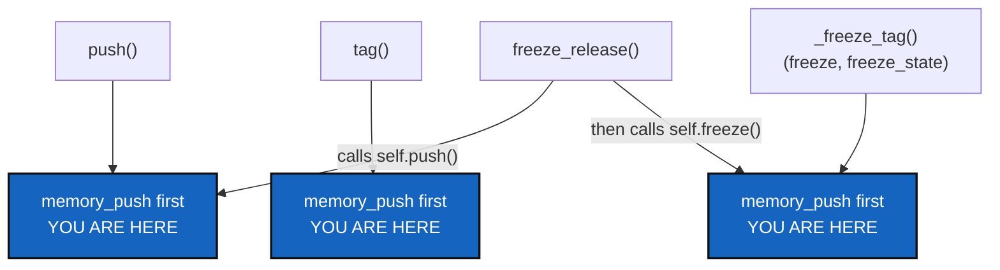

# PushFoldsMemory — every command that reaches a remote folds and sends the memory first

*Created: 2026-09-18*

*Branch: main*

> **Owner direction — 2026-09-18:** *"Extend push --all or --private. They
> push branches project/private accordingly but for the --private
> pipeline run first cgitsync memory push. This way the .memory management
> will fit with the frontier expected between what is and what will be."*
>
> **Owner revision, same day**, after the first draft scoped this to
> `--private`/`--all` only: *"it must be extended to tag / freeze and
> freeze-release. I also wonder if it wouldn't be more appropriate that it
> is extended to push independently of the option, because this is the
> project memory. So it is more logical that it is run first for push.
> This way it extends naturally to tag / freeze / freeze-release that all
> imply a push?"* Half right by construction, half not — §1 traces exactly
> which of the three inherit it "for free" from `push()` and which need
> their own call, since not all four route through the same code today.
>
> Filed the same day as
> [PendingAccumulation](../archive/20260918_PendingAccumulation_DevPlanTicket.md),
> whose finding this ticket acts on: nothing had run `memory push` in the
> thirteen hours before that investigation, not because the fold is broken
> but because nothing ever asks for it except a person remembering to.
> This ticket is the fix that does not depend on remembering.

## Abstract — read this first

**The one-line version.** `.cgitsync` is *what will be* — this project's
own record of what just happened, not yet sent anywhere.
`.cgitsync/.memory` is *what is* — the folded, committed, pushed record
a colleague or a second machine can actually see. Crossing that frontier
today is a person typing `cgitsync memory push` on their own initiative;
this ticket makes `push`, `tag`, and `freeze` (project-scoped or
`--private`, it no longer matters which) cross it automatically, as the
first thing each one does, before the rest of what it was already going
to do.

**What this document is.** The design for folding `memory_push` into
`push`, `tag`, `freeze`/`freeze-state`, unconditionally — not gated on
`--private`/`--all` — and a trace of exactly which of `tag`/`freeze`/
`freeze-release` inherit it automatically because they call `push()`
internally, and which need the same one line added to their own body
because they push through a different path entirely.

**Why it exists.** `PendingAccumulation` found thirteen ordinary commands
run over thirteen hours with no `memory push` in between — not a bug, but
exactly the gap this ticket closes. A memory that is only ever pushed
when someone remembers is a memory that is sometimes thirteen hours (or
more) behind what it claims to hold. Gating the fix on `--private`/`--all`
would have closed the gap only for people who already remember to type
the flag; tying it to *any command that reaches a remote* closes it for
everyone.

**What you will find.** §1 why this belongs on every push, not only the
private one, and exactly which of the four commands the owner named
already share `push()`'s own code path and which do not. §2 decisions —
when it triggers, and what a failure does to the rest of the command. §3
work packages. §4 acceptance. §5 what this refuses.

**Who it is for.** Whoever builds it; the owner, to confirm §2.

**What you need to do with it.** §1 is the whole idea, including the one
correction to the owner's own "it extends naturally" hope: two of the
four commands do not, on today's code, and need their own line.

---

## 1. Why every push, and which commands actually share code today

**Unconditional, not gated on `--private`/`--all`.** The owner's second
message reframes this correctly: `.memory` is not "a private configuration
repository" in the sense `--private` exists for (a repository shared
*with other projects*, on its own branch) — it is this project's own
record of itself, implemented as a private/local mount for reasons that
have nothing to do with whether *this particular command* happened to be
scoped to project or private repositories. A plain `cgitsync push`
publishes real work; the memory should settle exactly as much as a
`--private` push would. Gating this on a scope flag was the first draft's
mistake, not a feature to preserve.

**Which commands need the line, traced through the actual call graph:**

| Command | Client method | Pushes via | Gets the fold |
|---|---|---|---|
| `push` | `push()` ([`orchestre.py:3678`](../../../src/ComplexGitSync/orchestre.py#L3678)) | its own `git_tree.git.push(...)` | **directly — WP-2** |
| `tag` | `tag()` ([`orchestre.py:3726`](../../../src/ComplexGitSync/orchestre.py#L3726)) | its own `git_tree.git.tag(...)` (commit+tag+push combined) | **directly — WP-2**, a separate call site |
| `freeze` / `freeze-state` | `freeze()`/`freeze_state()` → `_freeze_tag()` ([`orchestre.py:3828`](../../../src/ComplexGitSync/orchestre.py#L3828)) | its own `git_tree.git.freeze(...)` (commit+tag+push combined) | **directly — WP-2**, `_freeze_tag` is the one shared body both go through |
| `freeze-release` | `freeze_release()` ([`orchestre.py:3876`](../../../src/ComplexGitSync/orchestre.py#L3876)) | calls `self.push()` once, then `self.freeze()` once | **inherited, twice over** — once from `push()`'s own fold, once from `freeze()`'s |

Neither `tag()` nor `_freeze_tag()` calls `self.push()` — each does its
own combined commit-tag-push at the `git_tree`/`operations.py` level, a
different code path from `push()`'s. So "it extends naturally to tag /
freeze / freeze-release" is exactly half true: `freeze-release` inherits
it for free, twice, because it is written in terms of `push()` and
`freeze()`; `tag` and `freeze`/`freeze-state` do not call `push()` at all
and need the identical one-line addition made to their own bodies. A
shared private helper (WP-1) is what keeps that one line identical in all
three places rather than three subtly different copies.

**First, not last, within each of those three bodies.** `.cgitsync`
should never carry more than what has accumulated since the *current*
command started — every entry older than that belongs to `.memory`
already. Folding before the command's own git operation and
`write_gts_snapshot` run means that operation's own ledger entry becomes
the *next* cycle's pending content, not this one's — the frontier moves
in one direction, once per command, and never carries a backlog forward.
`freeze-release` folding twice in one run (once via `push()`, once via
`freeze()`) is a harmless consequence of this being "first, every time,"
not a special case to guard against: a second fold with nothing new
pending commits nothing and only re-sends the branch, which `memory_push`
already treats as a normal, cheap no-op.

## 2. Decisions

### D1. Gated on `--private`/`--all`, or unconditional?

**Unconditional — settled by the owner's revision.** The fold runs first
in `push()`, `tag()`, and `_freeze_tag()` regardless of `private`/
`all_writable`/scope, provided a memory is mounted and adopted (D2). A
plain, project-scoped `push` folds and sends the memory exactly as a
`--private` one would; scope keeps deciding which *ordinary* repositories
a command reaches, and stops being asked anything about `.memory` at all.

### D2. What if no memory is mounted, or mounted but not yet adopted?

Recommendation: **skip silently when there is no mount at all** — most
trees declare none, and printing anything about a memory that does not
exist is noise. **Skip with one printed note when a mount is declared but
`memory adopt` was never run** (`.cgitsync/.memory/.git` absent) — this is
a real, nameable gap in onboarding, and `memory_push` already raises a
clear `GitSyncError` for it; catch that one specific error and print its
message rather than let it fail the command, since a private repository
sitting mid-onboarding must not block an otherwise ordinary push, tag, or
freeze.

### D3. What if `memory_push` fails for a reason other than "not adopted yet"?

Recommendation: **warn, and continue with the command.** Every
ledger-write path in this codebase already follows "recording must never
cost the command its work" (`orchestre.py::_append_ledger_entry`'s own
docstring); a memory that cannot reach its remote — offline, a conflict
like the one `ResolveMergeToolCrash`/this session's own `.memory` hit, a
revoked credential — is a real failure, but it is `.memory`'s own failure,
not the project's or `.localSpec`'s. Blocking an otherwise-successful
push, tag, or freeze because the memory could not send is a worse outcome
than one that printed a warning and moved on. The warning names the exact
remedy: `cgitsync memory push`, run again by hand.

### D4. Does `--dry-run` show it?

Recommendation: **yes, on every command that has one.** `push`'s and
`freeze`'s dry-run plans (`cli/expert.py::_print_dry_run_plan`) already
list the git commands they would run; when D2 says a memory would fold,
prepend `cgitsync memory push` to that listed plan, so the preview is
honest about what is about to happen. `tag` has no `--dry-run` today —
out of scope for this ticket to add one just to carry this line.

## 3. Work packages

| # | Depends on | Touches | Delivers |
|---|---|---|---|
| **WP-1** | D2 | `orchestre.py` | A private helper, `self._fold_memory_before_push()`: answers "is a memory mounted and adopted" (reusable — `push()`, `status`'s own dirty-note, and `_refresh_memory_mount_state` each ask a version of this today and none of them share one), and if so calls `self.memory_push(self._workspace_root())`, catching the "not adopted" `GitSyncError` and any other and printing a warning instead of raising either way (D3). |
| **WP-2** | WP-1, D1 | `orchestre.py` | Three call sites, each one line: `push()`, `tag()`, and `_freeze_tag()` (covering `freeze`/`freeze_state`) each call `self._fold_memory_before_push()` first, before their own existing git operation. `freeze_release()` needs no change — it already calls `self.push()` then `self.freeze()`, both now covered. |
| **WP-3** | WP-2 | `cli/expert.py` | `_execute_push`'s and `_execute_freeze`'s dry-run plans prepend `cgitsync memory push` under the same condition (D4); the real runs print what `memory_push` itself returned (folded count, committed, branch) ahead of their own outcome lines. |
| **WP-4** | WP-2 | `tests/`, `README.md`, `docs/Text/user_guide.tex`, `docs/Text/api_python.tex` | Integration tests against a real memory: pending records fold on a plain `push` (no `--private`), on `tag`, and on `freeze`; a memory that is declared but not adopted prints a note and does not block any of the three; a memory push failure for another reason warns and the command still succeeds. Documented wherever `push`, `tag`, `freeze`, `freeze-release`, and the memory are already explained. |

## 4. Acceptance

- A plain `cgitsync push` (no flags), run against a tree with pending
  records sitting in `.cgitsync` and an adopted memory, folds and pushes
  them first — no `--private`, no separate `memory push`, needed.
- `cgitsync tag <name>` and `cgitsync freeze <name>` do the same, each on
  their own — not only when combined with a push.
- `cgitsync freeze-release` folds once via its own `push()` call and once
  via its own `freeze()` call; both succeed and neither duplicate matters
  (a fold with nothing pending is a cheap no-op).
- A tree with no memory mounted at all sees no change in any of these
  commands' behaviour or output.
- A tree whose memory is declared but not yet adopted still completes
  every one of these commands, with one printed note naming `memory
  adopt`.
- A memory push that fails for any other reason does not prevent the
  command it was folding for from completing.
- `push --dry-run` and `freeze --dry-run` list `cgitsync memory push` in
  their plan under the same conditions the real run would perform it.
- `pixi run lint` and `pixi run test` pass.

## 5. What this refuses

- **To make this configurable.** No flag turns it off — `.memory`, once
  mounted and adopted, is folded and sent by every command in §1's table,
  the same way `checkout`/`merge`/`pull` already reach it unconditionally
  once it exists.
- **To push the memory on commands that do not themselves reach a
  remote.** `add`, `commit`, `checkout`, `merge`, `branch` are untouched —
  this ticket is exactly the commands that already publish something,
  never a reason to start publishing the memory from one that does not.
- **To make this a background service.** Every fold in this ticket still
  happens *inside* a command a person ran for an unrelated reason (to
  push their work, cut a tag, freeze a release) — "it must work offline"
  and "it is not a sync service"
  (`main_2-1_MemoryArchitecture_DevPlanTicket.md` §5) still hold:
  nothing here runs on a timer or without the person having typed
  something that was always going to touch the network anyway.
