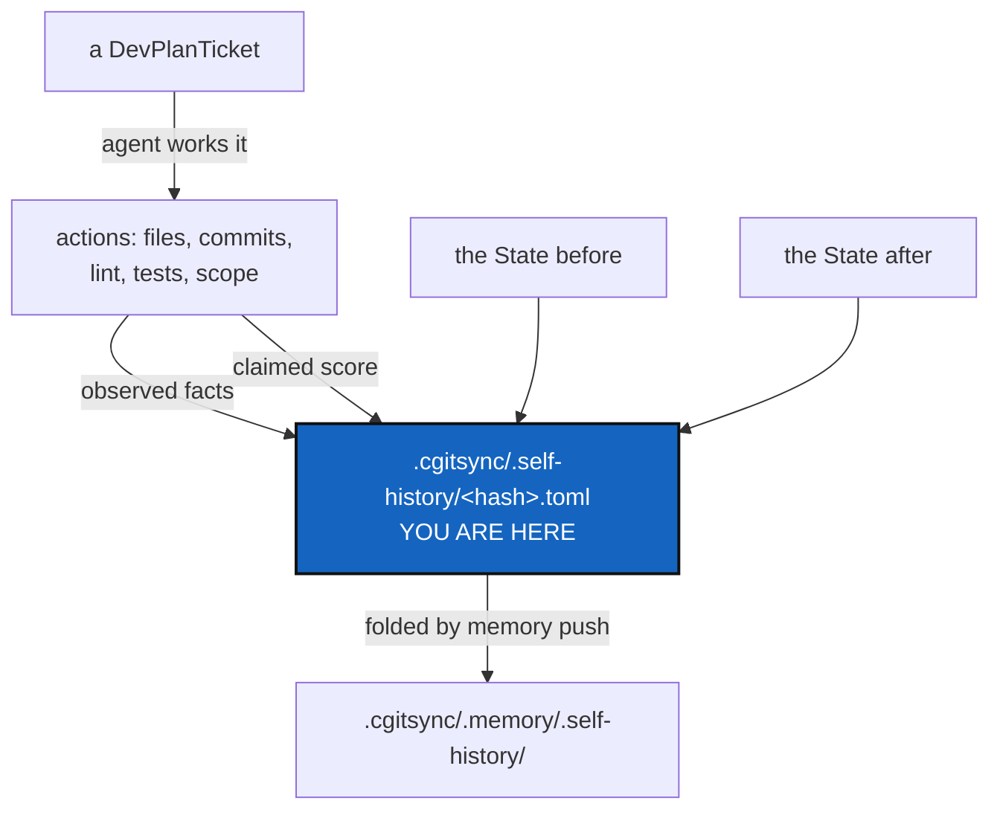

# AgentReport — what an agent did to this project, recorded beside what changed

*Created: 2026-09-20*

*Branch: main*

> **DRAFT — written for the owner to check and validate.** The short
> ticket asked for a draft, not an implementation. §5 lists every
> decision; **D1 and D4 are now answered** (below), four remain open.
> Read §5 before §6.

> **Owner direction — 2026-09-20.** Two decisions settled:
>
> - **D4 — the Attribution rule is split in two, and `CLAUDE.md` now says
>   so.** A **publication rule**, public, landing in `README.md` only; and
>   an **accounting rule**, private, landing in
>   `.cgitsync/.memory/.self-history` and never published. Credit and
>   accountability are different questions and do not share a home. The
>   amendment is written and in force; §4.1 below records the collision it
>   resolves.
> - **D1 — `.self-history` is a repository**, nested inside `.memory`,
>   with `nested_config = "config-memory.cgs"` naming its spec explicitly
>   rather than `auto`. This overrides §5's fold-subdirectory
>   recommendation; §2's *What changes in the `.cgs`* is the settled form.
>   The recommendation and its reasoning are kept in D1's row, because a
>   decision without the alternative it beat is a decision that gets
>   reopened.

> **Owner ticket — `shortTickets/agent-report.md`, 2026-09-20:** *"In
> memory, every agentic orchestration and implementation of a Ticket must
> be stored in `.cgitsync/.self-history`. It must document the transition
> between two project-state. What is the transition goal (DevPlanTicket or
> Ticket main objective in 3 lines proper english), the main action taken,
> by whom and a brief assessment on how deep the agent respected the specs
> in its actions. [...] The name of that is
> `.cgitsync/.memory/.self-history/<hash>.toml`. Note that `.memory`
> becomes this way a parent repos holding the private-local repo
> `.self-history`. in `.cgs` it becomes self-discoverable if a
> `config-memory.cgs` exists [...] It must be able to trace to which
> company the agents belong to, the version of the LLM used. And a
> conformity rates too the project agentic-rule. The quotation is 33% for
> Spec respect and 33% for the integrity of the `.PUBLIC|.PRIVATE` gating
> and 34% for quality of production. As for each .md, the report must
> contains a display of that at the beginning of the report."*

## Abstract — read this first

**The one-line version.** The ledger says what changed and what produced
the record. Nothing says *who decided*, against which ticket, or whether
they followed the rules — and for agent work that is most of the story.

**What this document is.** The design for a **self-history**: one record
per piece of agent work, naming the ticket it served, the action taken,
the agent and its vendor, and a three-part conformity score, stored in a
repository of its own nested inside `.memory`.

**Why it exists.** This project is largely built by agents working from
tickets, under rules written down in `CLAUDE.md`, `DevSpecs.md`,
`DOCSTYLE.md` and `TICKETLIFECYCLE.md`. Whether those rules were followed
is currently answerable only by reading the diff and remembering the
rules. A record that states it — and that can be checked against what
actually happened — turns a vague impression into evidence.

**What you will find.** §1 what one record holds. §2 where it lives and
why `.memory` becomes a parent. §3 the score, and the part of it a machine
can check. §4 the two rules this collides with. §5 the decisions. §6 work
packages. §7 acceptance. §8 what this refuses.

**Who it is for.** The owner, validating the draft. Every decision in §5
is theirs.

**What you need to do with it.** Read §4 first — it is where this ticket
contradicts something already written — then answer §5.



---

## 1. What one record holds

One record per piece of agent work — the owner's words are "every agentic
orchestration and implementation of a Ticket". It documents a
**transition between two project states**, so it names both.

| Field | What it is | Source |
|---|---|---|
| `ticket` | The ticket served, by its `<Name>` — never its path, which the lifecycle renames (see `CitationRot`) | The work |
| `goal` | The ticket's main objective, three lines of plain English | Written by the agent |
| `action` | The main action taken, in plain English | Written by the agent |
| `state_before` / `state_after` | The two States the work moved between | **Observed** |
| `agent` | Which agent role acted — `.localSpec/AGENT.md`'s roster: Orchestration, Dev, CI/CD, Editing | Declared |
| `vendor` | The company the agent belongs to | Declared |
| `model` | The LLM and its version | Declared |
| `conformity` | The three scores of §3, and one line of reasoning each | §3 |
| `repos_written` | Which repositories the work wrote to, and in which scope | **Observed** |
| `checks` | Did `lint` pass, did `test` pass, did `status` report `errors=0` | **Observed** |
| `pushed` | Whether anything reached a remote, and on whose instruction | **Observed** |

**The split between observed and declared is the load-bearing part**, and
§3 explains why.

`goal` and `action` are the one place the owner's three-line limit applies;
everything else is a field, not prose. `DOCSTYLE.md`'s plain-English rule
governs both — the reader is somebody months later asking what happened,
which is exactly the reader the commit-message rule already names.

## 2. Where it lives, and `.memory` as a parent

The owner gives two paths, and they are the two halves of one thing —
the frontier WorkingTransitionState already drew:

| Path | Which half |
|---|---|
| `.cgitsync/.self-history/<hash>.toml` | **Pending** — written as the work happens |
| `.cgitsync/.memory/.self-history/<hash>.toml` | **Folded** — what `memory push` committed |

So `.self-history` joins `lgr/`, `state/`, `logs/`, `commit-logs/` and
`.cgs/` as a sixth fold subdirectory (`orchestre.py`'s `_FOLD_SUBDIRS`),
and `memory/pending.py` composes both halves the way it already composes
the other five.

**D1 settled this on 2026-09-20: `.self-history` is a repository of its
own**, nested inside `.memory`, not a sixth fold subdirectory. So the two
paths above are not pending-and-folded halves of one directory — they are
the mount point and its own pending area, and WP2 owes them the same
frontier WorkingTransitionState built one level up. A mount has its own
history, its own branch and its own push, and `merge`/`checkout`/`tag`
expect its worktree to be clean; a record written mid-command must
therefore land on the pending side, exactly as a ledger entry does.

### What changes in the `.cgs`

`.memory`'s entry in `examples/complexgitsync4dev.cgs` currently reads:

```toml
{ repository = "github:flipoyo/.memory", relative_path = ".cgitsync/.memory", ..., nested_config = "disabled" }
```

`nested_config = "disabled"` is exactly what stops `.memory` being a
parent today. Making it self-discoverable means flipping that — and the
owner's `config-memory.cgs` is the file it would then find. Two notes for
validation:

- **Settled: `nested_config = "config-memory.cgs"`**, naming the file
  explicitly. `auto` globs `*.cgs` at the repository root and **fails if
  it finds more than one**; `.cgitsync/.memory/.cgs/` is a *directory* of
  exported reboot specs and the glob already excludes directories, so
  `auto` would work today — but it is one stray file away from breaking,
  and `memory reboot` writes into that repository on purpose. The explicit
  name also says what is meant.
- Privacy needs no new rule: `git_tree.propagate_privacy` pushes a
  parent's `private`/`writable` onto everything nested inside it, so
  `.self-history` inside `.memory` is private/local automatically. That is
  a genuine argument for nesting it there rather than mounting it at the
  tree root.

## 3. The score, and what a machine can check

The owner's weighting, unchanged:

| Criterion | Weight |
|---|---|
| Spec respect | 33 |
| Integrity of the `.PUBLIC`/`.PRIVATE` gating | 33 |
| Quality of production | 34 |

### The problem worth naming

**An agent scoring its own conformity is self-reported evidence.** The
project already draws this line for the ledger — `AdditionalSpecs.md`
calls it "tamper-evident, not tamper-proof". A self-assessment is weaker
than that: nothing about it is even evident. An agent that ignored a spec
is precisely the agent least likely to score itself down for it.

That is not a reason to drop the score. It is a reason to **build it out
of facts that can be checked**, and to mark clearly which parts are not.

### So each criterion splits in two

| Criterion | Machine-checked | Agent-asserted |
|---|---|---|
| **Spec respect** (33) | `lint` passed; `test` passed; `status` reported `errors=0`; the ticket was stamped and moved per TICKETLIFECYCLE; `bump-version` was run; every new CLI command appears in the README table (a test already enforces this) | Whether the *substance* of `AdditionalSpecs.md` — ring rules, one-parser rules, responsibility boundaries — was respected |
| **`.PUBLIC`/`.PRIVATE` gating** (33) | Which repositories were written, against their declared scope; whether anything private-read-only was written; whether a push happened and whether it was asked for; whether private planning content appears in a public repository | Almost nothing — **this criterion is nearly all checkable**, which is what makes it the most trustworthy third of the score |
| **Quality of production** (34) | Very little | Almost all of it |

**This is the recommendation worth arguing for.** Record the checkable
facts as facts, in their own fields, and let the score cite them. A score
of 33/33 on gating that sits next to `repos_written` and `pushed` is
verifiable by a reader; a bare 33 is a claim. Where a criterion is
asserted, the record should say `asserted` rather than dress it as
measurement.

### What `.PUBLIC`/`.PRIVATE` means here

The tokens are not in the codebase; the concept is, in two forms this
ticket must not conflate:

1. **Repository scope** — `private` / `writable` on a `.cgs` entry, and
   `RepoScope` deciding what a tree-wide command may write.
2. **The product/workshop separation** — the public `ComplexGitSync`
   repository versus the private `.localSpec`, `.claude`, `.agentSpec` and
   `.memory`. `DevTickets/README.md` is explicit that the planning surface
   is private *because* installing the tool must not hand a user sixty
   internal plans.

Both are gating an agent can violate, and the second is the one that
leaks. D3 asks whether the criterion covers one or both.

## 4. Two rules this collides with

Neither is a blocker. Both need the owner to say which way it goes,
because a ticket that quietly contradicts a written rule is how a spec
stops being true.

### 4.1 `CLAUDE.md`'s Attribution section

> *"The agent is named once, in README.md's LLM assistance section, and
> **nowhere else**."*

This ticket names the agent, its vendor and its model version on every
record. That is not credit — it is accountability, and the distinction the
Attribution section itself draws (paid assistance is acknowledged, not
co-signed) supports it: a private provenance record is neither a
by-line nor a co-signature. The ledger already records *what* produced
each entry via `toolchain`; this records *who*.

**Resolved 2026-09-20 (D4).** `CLAUDE.md`'s *Attribution* section now
carries two rules instead of one sentence. The **publication rule** is
public and unchanged in substance: the agent is named in `README.md`'s
*LLM assistance* section and in no other public place, naming the tools
used on the project rather than who did which piece of work. The
**accounting rule** is private: what each agent actually did goes to
`.cgitsync/.memory/.self-history` and is never published. The section
states explicitly that neither licenses the other — the accounting record
is not permission to sign a commit, and the README credit is not a summary
of the accounting.

Nothing is written under the accounting rule until this ticket lands;
`CLAUDE.md` says so, so the amendment does not describe a file that does
not exist yet as though it did.

### 4.2 The record is private, and it must stay that way

`.memory` is `private = true, writable = true` and it **gets pushed**.
Privacy propagation makes `.self-history` private too, so the record
itself is fine. The hazard is its *contents*: `goal` and `action` quote
DevPlanTickets, and the planning surface is private on purpose. A record
that is private is the right home for that; a record that ever became
public would carry it out.

So the record inherits the State's own rule without exception: **no
absolute path, no OS user name**, every path written against `$CGSTREE`.
§8 states it as a refusal.

## 5. Decisions — all of them the owner's

| D | Question | Recommendation |
|---|---|---|
| **D1** | Is `.self-history` a **nested repository** or a **sixth fold subdirectory** of `.memory`? The short ticket says both | **ANSWERED 2026-09-20: a nested repository**, with `nested_config = "config-memory.cgs"`. *The alternative, kept:* a fold subdirectory first, a repository only if it must be shared separately — a repository buys one thing, being cloned without the rest of the memory, and everything else it brings (a branch, a push, a merge, a clean-worktree rule) is cost. **What the answer therefore obliges**: `.self-history` gets its own branch and push, and its worktree must be clean when `merge`/`checkout`/`tag` reconcile the tree — the exact problem WorkingTransitionState solved for `.memory`. WP2 must apply the same folded/pending frontier one level deeper, not rediscover it |
| **D2** | Does the score display go at the top of the **record**, or at the top of **every `.md` an agent writes**? | The short ticket reads both ways. **Recommend: the record and the agent's finishing report.** Putting a conformity banner atop every spec and tutorial would put process metadata in a user's way, and `DOCSTYLE.md` gives the abstract that position |
| **D3** | Does the gating criterion cover repository scope only, or the product/workshop separation too? | **Both** (§3). The second is the one that leaks, and it is checkable |
| **D4** | Amend `CLAUDE.md`'s "nowhere else"? | **ANSWERED 2026-09-20: yes, and done.** Split into a publication rule (public, `README.md` only) and an accounting rule (private, `.cgitsync/.memory/.self-history`, never published). `CLAUDE.md`'s *Attribution* section carries both, and states that neither licenses the other |
| **D5** | Who writes the record — the agent, or the tool at the end of a command? | **The agent, through a `cgitsync` command that fills in the observed fields itself.** An agent writing the whole file by hand can write anything in the fact fields too, and the facts are the half worth trusting |
| **D6** | What happens when no record is written for a piece of work? | **Nothing enforces it at first.** A gate that blocks a commit for a missing report gets bypassed. Report the gap in `memory status` and let it be visible |

## 6. Work packages

Sequenced by dependency, not preference. **WP1 needs nothing from
[TreeEnvironment](main_1-1_TreeEnvironment_DevPlanTicket.md)** and can run
beside it; WP3 is the part the owner's "once 1-1 is implemented" names.

| WP | Does | Depends on |
|---|---|---|
| **WP1** | The record format and its fields (§1), and `cgitsync self-history add` writing one to the pending half, filling the observed fields itself | D1, D2, D5 |
| **WP2** | `.self-history` as a repository nested in `.memory`: its `config-memory.cgs`, `.memory`'s entry moving from `nested_config = "disabled"` to `"config-memory.cgs"`, and its own pending/folded frontier so `merge`/`checkout`/`tag` find a clean worktree. `memory show`/`explore` read it | WP1 |
| **WP3** | The link to state transitions: `state_before`/`state_after` resolved from the ledger, and the environment record beside them | WP2, **TreeEnvironment** |
| **WP4** | The score: the machine-checked fields computed rather than typed, and the display (§3, D3) | WP1, D3 |
| **WP5** | `AdditionalSpecs.md`'s record schema and the `.cgs` authoring note for the nested mount. **The `CLAUDE.md` Attribution amendment is already done** — landed 2026-09-20 with D4, ahead of the rest, because it is a rule about conduct rather than a feature and was in force the moment it was written | — |

## 7. Acceptance

- One agent-worked ticket produces one record, and `memory show` prints it
  with the score display at the top.
- Every observed field is computed, not typed: changing the record's
  `checks` by hand contradicts what `lint` and `test` actually did, and a
  reader can tell.
- The record names the two States the work moved between, and both resolve
  in the ledger.
- No record contains an absolute path outside `$CGSTREE`, an OS user name,
  or any credential.
- A workspace with no self-history still runs every command normally — this
  is additive, and a tree that never used it must not notice it exists.
- `pixi run lint` and `pixi run test` pass; `cgitsync status` shows
  `errors=0`.

## 8. What this refuses to do

- **It does not present an asserted score as a measurement.** Where a
  number is the agent's opinion, the record says so.
- **It does not block work.** No commit, push or merge fails for a missing
  or low-scoring record (D6).
- **It does not record a path, a user name or a credential** that a State
  would not record.
- **It does not become a second ledger.** The ledger orders what happened;
  this says who decided and why. A record that started duplicating entries
  would be the wrong shape.
