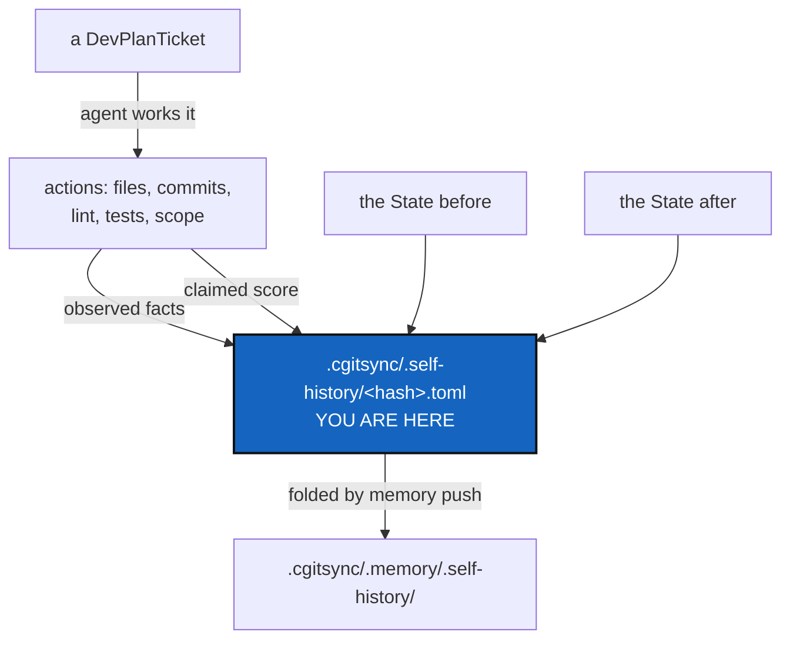

# AgentReport — what an agent did to this project, recorded beside what changed

*Created: 2026-09-20*

*Branch: main*

> **Ticket review — 2026-09-22.** Renumbered from `main_1-5` to `main_1-3`
> — still priority 1, moved up two places — on the owner's request to
> reorganise the backlog with "finalize the agentic" leading the queue.
> Kept behind [AgentContract](main_1-2_AgentContract_DevPlanTicket.md),
> whose pair rule and data contract this ticket's own abstract says it
> depends on settling first.

> **DRAFT — written for the owner to check and validate.** The short
> ticket asked for a draft, not an implementation. §5 lists every
> decision; **D1 and D4 are now answered** (below), four remain open.
> Read §5 before §6.

> **Owner direction — 2026-09-20.** Two decisions settled:
>
> - **D4 — the Attribution rule is split in two, and `CLAUDE.md` now says
>   so.** A **publication rule**, public, landing in `README.md` only; and
>   an **accounting rule**, private, landing in
>   `.cgitsync/.memory/.self-history` and never published. Credit and
>   accountability are different questions and do not share a home. The
>   amendment is written and in force; §4.1 below records the collision it
>   resolves.
> - **D1 — `.self-history` is a repository**, nested inside `.memory`,
>   with `nested_config = "config-memory.cgs"` naming its spec explicitly
>   rather than `auto`.
>
> **And, later the same day, the pipeline that makes D1 safe:**
> `.self-history` is managed exactly like `.memory` — a pending area at
> `.cgitsync/.self-history` that `memory push` folds into the mount. That
> resolves the objection the fold-subdirectory alternative was raised
> against: the mount stays clean between folds, so `merge`/`checkout`/`tag`
> reconcile it like any other private/local repository. §2 is the settled
> design.
>
> **D7 and D8 answered 2026-09-20.** `memory reboot` reboots the memory's
> branch only and leaves `.self-history` alone. `memory clone` brings back
> both, on the owner's principle: ***"a project state must be
> Replicable"*** — which makes the accounting record part of what a second
> machine must receive, not an optional extra.

> **Owner ticket — `shortTickets/agent-report.md`, 2026-09-20:** *"In
> memory, every agentic orchestration and implementation of a Ticket must
> be stored in `.cgitsync/.self-history`. It must document the transition
> between two project-state. What is the transition goal (DevPlanTicket or
> Ticket main objective in 3 lines proper english), the main action taken,
> by whom and a brief assessment on how deep the agent respected the specs
> in its actions. [...] The name of that is
> `.cgitsync/.memory/.self-history/<hash>.toml`. Note that `.memory`
> becomes this way a parent repos holding the private-local repo
> `.self-history`. in `.cgs` it becomes self-discoverable if a
> `config-memory.cgs` exists [...] It must be able to trace to which
> company the agents belong to, the version of the LLM used. And a
> conformity rates too the project agentic-rule. The quotation is 33% for
> Spec respect and 33% for the integrity of the `.PUBLIC|.PRIVATE` gating
> and 34% for quality of production. As for each .md, the report must
> contains a display of that at the beginning of the report."*

## Abstract — read this first

**The one-line version.** The ledger says what changed and what produced
the record. Nothing says *who decided*, against which ticket, or whether
they followed the rules — and for agent work that is most of the story.

**What this document is.** The design for a **self-history**: one record
per piece of agent work, naming the ticket it served, the action taken,
the agent and its vendor, and a three-part conformity score, stored in a
repository of its own nested inside `.memory`.

**Why it exists.** This project is largely built by agents working from
tickets, under rules written down in `CLAUDE.md`, `DevSpecs.md`,
`DOCSTYLE.md` and `TICKETLIFECYCLE.md`. Whether those rules were followed
is currently answerable only by reading the diff and remembering the
rules. A record that states it — and that can be checked against what
actually happened — turns a vague impression into evidence.

**What you will find.** §1 what one record holds. §1.1 the two agents
every task needs, and why the worker never scores itself. §2 where it
lives and why `.memory` becomes a parent. §3 the score, and the part of it
a machine can check. §4 the two rules this collides with. §5 the
decisions. §6 work packages. §7 acceptance. §8 what this refuses.

**Who it is for.** The owner, validating the draft. Every decision in §5
is theirs.

**What you need to do with it.** Read §4 first — it is where this ticket
contradicts something already written — then answer §5.



---

## 1. What one record holds

One record per piece of agent work — the owner's words are "every agentic
orchestration and implementation of a Ticket". It documents a
**transition between two project states**, so it names both.

| Field | What it is | Source |
|---|---|---|
| `ticket` | The ticket served, by its `<Name>` — never its path, which the lifecycle renames (see `CitationRot`) | The work |
| `goal` | The ticket's main objective, three lines of plain English | Written by the agent |
| `action` | The main action taken, in plain English | Written by the agent |
| `state_before` / `state_after` | The two States the work moved between | **Observed** |
| `worker` | The agent that implemented the ticket — its role from `.localSpec/AGENT.md`'s roster (Dev, CI/CD, Editing), its vendor, its model version | Declared |
| `orchestrator` | The independent agent that quoted the work and wrote this record — same three fields (§1.1) | Declared |
| `contract` | The agentProvider contract in force when the work was done, cited by hash — [AgentContract](main_1-2_AgentContract_DevPlanTicket.md) | Declared |
| `conformity` | The three scores of §3, and one line of reasoning each | §3 |
| `repos_written` | Which repositories the work wrote to, and in which scope | **Observed** |
| `checks` | Did `lint` pass, did `test` pass, did `status` report `errors=0` | **Observed** |
| `pushed` | Whether anything reached a remote, and on whose instruction | **Observed** |

**The split between observed and declared is the load-bearing part**, and
§3 explains why.

`goal` and `action` are the one place the owner's three-line limit applies;
everything else is a field, not prose. `DOCSTYLE.md`'s plain-English rule
governs both — the reader is somebody months later asking what happened,
which is exactly the reader the commit-message rule already names.

## 1.1 Two agents, never one — summarised; the rule lives elsewhere

> **Split out on 2026-09-20.** The pair rule and the data contract it
> travels with are now [AgentContract](main_1-2_AgentContract_DevPlanTicket.md).
> What stays here is what the *record* needs to know about them. That
> ticket is authoritative; if the two disagree, it wins.

> **Owner direction — 2026-09-20.** *"Actually is the orchestrator agent
> for complex DevPlanTicket. If a ticket is implemented by one agent it
> must call an independent orchestrator to quote the work. The
> orchestrator writes the report. The logical conclusion is that a task
> always involves at least two agents: orchestrator and worker."*

**A task involves at least two agents.** One implements; a second,
independent one quotes the work and writes the report. The worker never
scores itself, and never writes the record of its own conformity.

| Role | Does | Appears in the record as |
|---|---|---|
| **Worker** | Implements the ticket | `worker` — role, vendor, model version |
| **Orchestrator** | Quotes the work against the three criteria and writes the report | `orchestrator` — role, vendor, model version |

So the short ticket's *"by whom"* has two answers, and the record carries
both. `.localSpec/AGENT.md`'s roster already names Orchestration as the
role that owns specs and planning tickets, which is the same role wearing
this hat.

**What "independent" has to mean, minimally:** the orchestrator is not the
process that did the work. It reads the diff, the ticket and the checks,
and forms its own view. It does not inherit the worker's account of what
happened as fact — that account is a claim about the work, and the
orchestrator is there precisely to test it.

**Where the rule belongs.** This is a rule about how *any* cgitsync
project runs agentic work, not about ComplexGitSync specifically, so its
long-term home is the general project spec that
`shortTickets/project-spec.md` proposes splitting out of `CLAUDE.md` —
"a private-distant repo", possibly under an `.agent` parent. That short
ticket has not been planned yet. **Until it is, the rule goes in
`CLAUDE.md`**, and moves when the split happens. WP6 carries it.

**One scoping note for whoever writes it.** The rule as stated governs
*implementing a ticket*. Drafting, ranking and closing tickets is
orchestration work already, and does not call for a second orchestrator to
quote the first. Whoever writes WP6 should say so explicitly, or the rule
reads as requiring two agents to file a one-line short ticket.

## 2. Where it lives, and `.memory` as a parent

> **Owner direction — 2026-09-20.** *"sync the management of
> `.memory/.self-history` with the same pipeline than `.memory` and the
> memory commands that folds `.working` in `.memory`. You just have to
> replicate `.self-history` in `.working`."*
>
> `.working` is the owner's name for the pending area; on disk it is
> `.cgitsync` (see the WorkingAreaRename ticket, which holds the rename
> question). Everything below reads `.cgitsync` and means the same place.

**It is both**, and the two answers fit together rather than competing.
`.self-history` is a **repository** at `.cgitsync/.memory/.self-history`
(D1), and it gets a **pending area** at `.cgitsync/.self-history` that
folds into it — the same frontier, the same commands, one level deeper.

| Path | Which half | Is it a repository? |
|---|---|---|
| `.cgitsync/.self-history/<hash>.toml` | **Pending** — written as the work happens | No. An ordinary directory, gitignored, exactly like `.cgitsync/lgr/` |
| `.cgitsync/.memory/.self-history/<hash>.toml` | **Folded** — what `memory push` committed | **Yes** — a private/local mount with its own branch and push |

This is what settles the worry D1 raised. A nested repository's worktree
has to be clean when `merge`/`checkout`/`tag` reconcile the tree, and a
record written mid-command would dirty it — which is the exact bug
WorkingTransitionState was opened for. Giving `.self-history` a pending
area of its own means nothing is ever written *into* the mount except
during a fold, so it is clean between folds like every other mount.

### The pipeline, step by step

`memory push` gains one fold and one publish, and the publish is
**leaf-first** — the nested repository before its parent, the order
`operations.py` already uses for every tree-wide command:

1. Fold `.cgitsync/{lgr,state,logs,.cgs}` and `commit-logs/` into
   `.cgitsync/.memory/` — unchanged.
2. **Fold `.cgitsync/.self-history/` into
   `.cgitsync/.memory/.self-history/`** — new. A plain move is safe for
   the same reason it is safe for States: a record is named by its own
   content hash, so a name that repeats is identical content.
3. **Commit and push `.self-history`** — the leaf.
4. Commit and push `.memory` — the parent, which now records the leaf's
   new commit rather than its contents.

Two consequences worth stating, because both are easy to miss:

- **`.memory/.gitignore` must list `.self-history/`.** That is the
  ordinary rule for every child mount — the same line that keeps
  `.cgitsync/` out of the tree root's index — and `git_tree.sync_gitignore`
  writes it once `.self-history` is a real entry in the tree.
- **`_FOLD_SUBDIRS` is not simply extended.** The existing five fold into
  a directory of `.memory`; `.self-history` folds into a *different
  repository*. Adding it to that tuple and expecting step 4 to commit it
  would commit nothing — the parent does not track the leaf's files.
  Step 3 exists for that reason.

### What changes in the `.cgs`

`.memory`'s entry in `examples/complexgitsync4dev.cgs` currently reads:

```toml
{ repository = "github:flipoyo/.memory", relative_path = ".cgitsync/.memory", ..., nested_config = "disabled" }
```

`nested_config = "disabled"` is exactly what stops `.memory` being a
parent today. Making it self-discoverable means flipping that — and the
owner's `config-memory.cgs` is the file it would then find. Two notes for
validation:

- **Settled: `nested_config = "config-memory.cgs"`**, naming the file
  explicitly. `auto` globs `*.cgs` at the repository root and **fails if
  it finds more than one**; `.cgitsync/.memory/.cgs/` is a *directory* of
  exported reboot specs and the glob already excludes directories, so
  `auto` would work today — but it is one stray file away from breaking,
  and `memory reboot` writes into that repository on purpose. The explicit
  name also says what is meant.
- Privacy needs no new rule: `git_tree.propagate_privacy` pushes a
  parent's `private`/`writable` onto everything nested inside it, so
  `.self-history` inside `.memory` is private/local automatically. That is
  a genuine argument for nesting it there rather than mounting it at the
  tree root.

## 3. The score, and what a machine can check

The owner's weighting, unchanged:

| Criterion | Weight |
|---|---|
| Spec respect | 33 |
| Integrity of the `.PUBLIC`/`.PRIVATE` gating | 33 |
| Quality of production | 34 |

### The problem, and the owner's answer to it

**The draft's objection was that an agent scoring its own conformity is
self-reported evidence.** The project already draws that line for the
ledger — `AdditionalSpecs.md` calls it "tamper-evident, not
tamper-proof" — and a self-assessment is weaker still: nothing about it
is even evident. An agent that ignored a spec is precisely the agent
least likely to mark itself down for it.

**The owner answered it on 2026-09-20 by separating the two roles** (§2.1):
the worker implements, and an independent orchestrator quotes the work
and writes the report. That turns a self-assessment into a **second-party
assessment**, which is a different and much stronger thing. The agent with
the motive to score generously is no longer the agent holding the pen.

It is not a third-party audit, and the ticket should not claim to be one:
the orchestrator is another agent, commissioned by the same owner, often
the same model family. What it removes is the *direct* conflict of
interest, which is the one that would have made the score worthless.

So the two mitigations stack rather than compete. The role split removes
the conflict; building the score out of checkable facts — below — keeps
the remaining judgement honest, and lets the owner check a quote they did
not watch being made.

### So each criterion splits in two

| Criterion | Machine-checked | Agent-asserted |
|---|---|---|
| **Spec respect** (33) | `lint` passed; `test` passed; `status` reported `errors=0`; the ticket was stamped and moved per TICKETLIFECYCLE; **the worker incremented `__build__`** ([Versioning](../archive/20260921_Versioning_DevPlanTicket.md) §5.0 — a change that touched `src` and left the counter alone is a miss the diff shows plainly); every new CLI command appears in the README table (a test already enforces this) | Whether the *substance* of `AdditionalSpecs.md` — ring rules, one-parser rules, responsibility boundaries — was respected |
| **`.PUBLIC`/`.PRIVATE` gating** (33) | Which repositories were written, against their declared scope; whether anything private-read-only was written; whether a push happened and whether it was asked for; whether private planning content appears in a public repository | Almost nothing — **this criterion is nearly all checkable**, which is what makes it the most trustworthy third of the score |
| **Quality of production** (34) | Very little | Almost all of it |

**This is the recommendation worth arguing for.** Record the checkable
facts as facts, in their own fields, and let the score cite them. A score
of 33/33 on gating that sits next to `repos_written` and `pushed` is
verifiable by a reader; a bare 33 is a claim. Where a criterion is
asserted, the record should say `asserted` rather than dress it as
measurement.

### What `.PUBLIC`/`.PRIVATE` means here

The tokens are not in the codebase; the concept is, in two forms this
ticket must not conflate:

1. **Repository scope** — `private` / `writable` on a `.cgs` entry, and
   `RepoScope` deciding what a tree-wide command may write.
2. **The product/workshop separation** — the public `ComplexGitSync`
   repository versus the private `.localSpec`, `.claude`, `.agentSpec` and
   `.memory`. `DevTickets/README.md` is explicit that the planning surface
   is private *because* installing the tool must not hand a user sixty
   internal plans.

Both are gating an agent can violate, and the second is the one that
leaks. D3 asks whether the criterion covers one or both.

## 4. Two rules this collides with

Neither is a blocker. Both need the owner to say which way it goes,
because a ticket that quietly contradicts a written rule is how a spec
stops being true.

### 4.1 `CLAUDE.md`'s Attribution section

> *"The agent is named once, in README.md's LLM assistance section, and
> **nowhere else**."*

This ticket names the agent, its vendor and its model version on every
record. That is not credit — it is accountability, and the distinction the
Attribution section itself draws (paid assistance is acknowledged, not
co-signed) supports it: a private provenance record is neither a
by-line nor a co-signature. The ledger already records *what* produced
each entry via `toolchain`; this records *who*.

**Resolved 2026-09-20 (D4).** `CLAUDE.md`'s *Attribution* section now
carries two rules instead of one sentence. The **publication rule** is
public and unchanged in substance: the agent is named in `README.md`'s
*LLM assistance* section and in no other public place, naming the tools
used on the project rather than who did which piece of work. The
**accounting rule** is private: what each agent actually did goes to
`.cgitsync/.memory/.self-history` and is never published. The section
states explicitly that neither licenses the other — the accounting record
is not permission to sign a commit, and the README credit is not a summary
of the accounting.

Nothing is written under the accounting rule until this ticket lands;
`CLAUDE.md` says so, so the amendment does not describe a file that does
not exist yet as though it did.

### 4.2 The record is private, and it must stay that way

`.memory` is `private = true, writable = true` and it **gets pushed**.
Privacy propagation makes `.self-history` private too, so the record
itself is fine. The hazard is its *contents*: `goal` and `action` quote
DevPlanTickets, and the planning surface is private on purpose. A record
that is private is the right home for that; a record that ever became
public would carry it out.

So the record inherits the State's own rule without exception: **no
absolute path, no OS user name**, every path written against `$CGSTREE`.
§8 states it as a refusal.

## 5. Decisions — all of them the owner's

| D | Question | Recommendation |
|---|---|---|
| **D1** | Is `.self-history` a **nested repository** or a **sixth fold subdirectory** of `.memory`? The short ticket says both | **ANSWERED 2026-09-20: a nested repository**, with `nested_config = "config-memory.cgs"`. *The alternative, kept:* a fold subdirectory first, a repository only if it must be shared separately — a repository buys one thing, being cloned without the rest of the memory, and everything else it brings (a branch, a push, a merge, a clean-worktree rule) is cost. **How the cost is paid**: the owner's follow-up the same day gives `.self-history` the same pending/folded pipeline as `.memory` (§2), so the mount is clean between folds and `merge`/`checkout`/`tag` reconcile it like any other private/local repository. The frontier is reused one level deeper, not rediscovered |
| **D2** | Does the score display go at the top of the **record**, or at the top of **every `.md` an agent writes**? | **ANSWERED 2026-09-20: the agent's finishing report only.** Not every `.md` — a conformity banner atop each spec and tutorial would put process metadata in the reader's way, and `DOCSTYLE.md` gives the abstract that position. The finishing report is written by the orchestrator (§1.1), so the display sits at the top of the document whose whole subject is the quote |
| **D3** | Does the gating criterion cover repository scope only, or the product/workshop separation too? | **Both** (§3). The second is the one that leaks, and it is checkable |
| **D4** | Amend `CLAUDE.md`'s "nowhere else"? | **ANSWERED 2026-09-20: yes, and done.** Split into a publication rule (public, `README.md` only) and an accounting rule (private, `.cgitsync/.memory/.self-history`, never published). `CLAUDE.md`'s *Attribution* section carries both, and states that neither licenses the other |
| **D5** | Who writes the record — the agent, or the tool at the end of a command? | **Half-answered by §1.1: the orchestrator writes it, not the worker.** What remains is *how*: recommend a `cgitsync` command that fills the observed fields itself, so the orchestrator supplies judgement and the tool supplies facts. An agent writing the whole file by hand can write anything into the fact fields too, and the facts are what make a quote checkable |
| **D6** | What happens when no record is written for a piece of work? | **Nothing enforces it at first.** A gate that blocks a commit for a missing report gets bypassed. Report the gap in `memory status` and let it be visible |
| **D7** | What does `memory reboot` do with `.self-history`? | **ANSWERED 2026-09-20: reboot the memory's branch only; leave `.self-history` alone.** A reboot says "this project's shape changed, start the memory over"; the record of who did what to get there is exactly the thing that should survive it, and it is the only half that can answer "what happened across the reboot". So reboot touches one branch, as it does today, and `.self-history` carries across unbroken |
| **D8** | What does `memory clone` bring back on a new machine? | **ANSWERED 2026-09-20: both**, on the owner's principle that **a project state must be replicable**. A clone that omitted the accounting record would make a second machine look compliant when it is merely uninformed, and would give two machines two different answers to "what was done here" — the same failure the State's content-addressed name exists to prevent. `nested_config = "config-memory.cgs"` already makes `initialise` descend; `memory clone` is a separate path and must be taught it |

## 6. Work packages

Sequenced by dependency, not preference. **WP1 needs nothing from
[TreeEnvironment](../archive/20260920_TreeEnvironment_DevPlanTicket.md)** and can run
beside it; WP3 is the part the owner's "once 1-1 is implemented" names.

| WP | Does | Depends on |
|---|---|---|
| **WP1** | The record format and its fields (§1), and `cgitsync self-history add` writing one to the pending half, filling the observed fields itself | D1, D2, D5 |
| **WP2** | `.self-history` as a repository nested in `.memory`, with the §2 pipeline: `config-memory.cgs`; `.memory`'s entry moving from `nested_config = "disabled"` to `"config-memory.cgs"`; the pending area at `.cgitsync/.self-history`; the fold; the leaf-first commit and push; `.memory/.gitignore` listing the mount. `memory/pending.py` composes both halves, as it already does for the other five. `memory show`/`explore` read it | WP1 |
| **WP2b** | `memory reboot` and `memory clone` taught about the second mount: reboot leaves `.self-history` alone (D7), clone brings it back (D8). Separable from WP2 and easy to forget — both commands assume one mount today, and neither fails loudly when it meets two | WP2 |
| **WP3** | The link to state transitions: `state_before`/`state_after` resolved from the ledger, and the environment record beside them | WP2, **TreeEnvironment** |
| **WP4** | The score: the machine-checked fields computed rather than typed, and the display (§3, D3) | WP1, D3 |
| **WP5** | `AdditionalSpecs.md`'s record schema and the `.cgs` authoring note for the nested mount. **The `CLAUDE.md` Attribution amendment is already done** — landed 2026-09-20 with D4, ahead of the rest, because it is a rule about conduct rather than a feature and was in force the moment it was written | — |
**Moved out on 2026-09-20.** The two-agent rule and the data-ownership
contract are now [AgentContract](main_1-2_AgentContract_DevPlanTicket.md).
This ticket builds the mechanism; that one states the rules. Its WP4 —
records citing the contract by hash — needs WP1 here to exist first.

## 7. Acceptance

- One agent-worked ticket produces one record, and `memory show` prints it
  with the score display at the top.
- Every observed field is computed, not typed: changing the record's
  `checks` by hand contradicts what `lint` and `test` actually did, and a
  reader can tell.
- The record names the two States the work moved between, and both resolve
  in the ledger.
- No record contains an absolute path outside `$CGSTREE`, an OS user name,
  or any credential.
- **`.cgitsync/.memory/.self-history`'s worktree is clean except while a
  fold is running**, and `cgitsync status` reports it as an ordinary
  private/local repository. This is the test that proves the pipeline
  works; it is the bug WorkingTransitionState was opened for, one level
  deeper.
- `memory push` publishes the leaf before the parent, and a tree checked
  out afterwards has both.
- **A second machine cloning this project gets the same accounting record
  as the first, and the two agree.** This is D8's replicability test, and
  it is the one an omission would fail silently — an uninformed machine
  looks exactly like a compliant one.
- A reboot leaves `.self-history` intact and readable across the
  boundary: the records written before the reboot and after it sit in one
  unbroken history (D7).
- A workspace with no self-history still runs every command normally — this
  is additive, and a tree that never used it must not notice it exists.
- `pixi run lint` and `pixi run test` pass; `cgitsync status` shows
  `errors=0`.

## 8. What this refuses to do

- **It does not present an asserted score as a measurement.** Where a
  number is the agent's opinion, the record says so.
- **It does not block work.** No commit, push or merge fails for a missing
  or low-scoring record (D6).
- **It does not record a path, a user name or a credential** that a State
  would not record.
- **It does not become a second ledger.** The ledger orders what happened;
  this says who decided and why. A record that started duplicating entries
  would be the wrong shape.
