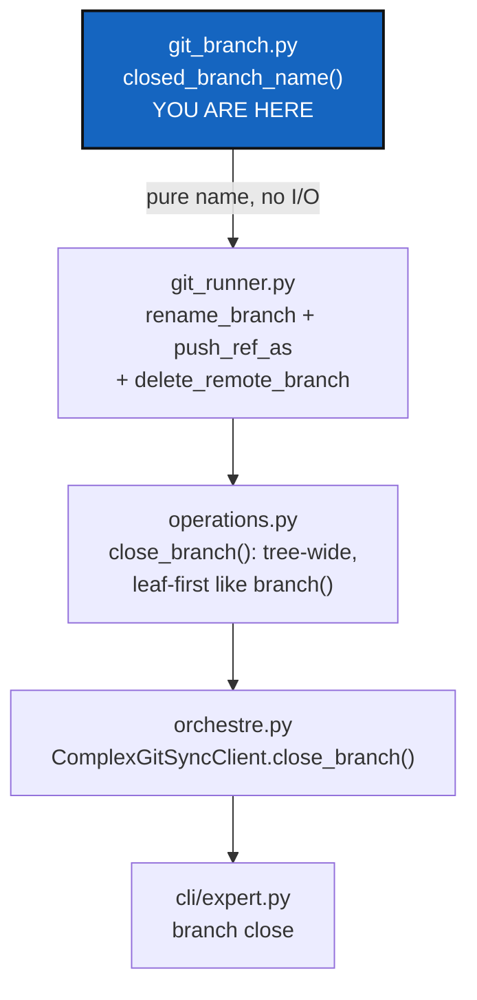

# BranchClosing — a branch whose work has landed gets a name that says so

*Created: 2026-09-18*

*Branch: main*

> **Owner direction — 2026-09-18, in conversation:** *"It may be also time
> for closing memory-dev branch, by implementing a branch closing command
> in git-branch.py of complexgitsync."* Asked back what "closing" should
> mean operationally, given `git_branch.py` is Ring-0 (pure, no I/O — see
> its own module docstring) and cannot itself rename or delete anything;
> the owner picked **naming rule only**: `git_branch.py` gains the pure
> rule for what a closed branch is called, the same way it already owns
> `private_local_branch`'s naming rule; the git mutation that acts on that
> name belongs in `git_runner.py`/`operations.py`, per the architecture
> boundary in `CLAUDE.md`. This ticket designs that split; it does not
> implement it.
>
> Filed the same day as the ticket reorganisation that moved
> [MemoryArchitecture](main_2-1_MemoryArchitecture_DevPlanTicket.md) and
> [StateLocking](main_2-3_StateLocking_DevPlanTicket.md) onto `main` — the
> reason "closing memory-dev" is on the table at all is that the memory
> work those tickets designed has substantially landed this session.

## Abstract — read this first

**The one-line version.** A branch whose work has landed still sits in
`git branch -a` looking exactly as active as `main`, with nothing in its
name saying otherwise. This ticket gives closing a branch a fixed,
inspectable name — computed once, in one place — and a command that
performs it: rename, not delete, so the history stays reachable and the
action is reversible.

**What this document is.** The naming rule (`git_branch.py`, Ring-0), the
execution path (`git_runner.py` primitives already added this session,
`operations.py` orchestration), and the CLI surface for a new
`branch close <name>` command — designed, not built.

**Why it exists.** `memory-dev` is the concrete case: its two active
design tickets moved to `main` on 2026-09-18 because the memory system
they designed now exists in code, and only
[Omniscience](memory-dev_2-1_Omniscience_DevPlanTicket.md) still has open
work scoped to that branch. Nothing today marks a branch as "done" short
of a person remembering which ones are safe to ignore in `git branch -a`,
or deleting it outright and losing the history of how the work happened.

**What you will find.** §1 the naming rule and why it is pure. §2
decisions the owner should confirm before this is built. §3 work
packages. §4 acceptance. §5 what this refuses.

**Who it is for.** Whoever builds it; the owner, to confirm §2 — in
particular D1 (rename vs. delete) and D4 (the exact naming scheme).

**What you need to do with it.** Read §1 and §2 first; §2's answers decide
what §3's work packages actually build.



---

## 1. The naming rule, and why it stays in `git_branch.py`

`git_branch.py`'s own docstring states its contract: pure, offline, no
tree and no privacy state — "a resolver, not a registry." It already owns
one naming transform of exactly this shape, `private_local_branch`:
given a project name and a branch, it returns the name a private/local
mount uses for that branch, and "its separator constant never leaves this
module." A closed-branch name is the same kind of fact — a deterministic
string computed from a branch name, with no filesystem or git access
required to compute it — so it belongs next to `private_local_branch`,
not in `operations.py` where the actual rename happens.

The new function:

```python
def closed_branch_name(branch_name: str) -> str:
    """The name a closed branch is renamed to. Pure — computes a string,
    touches nothing. ``operations.py`` performs the actual rename."""
```

Ring-0 purity means this function never sees a repository, a tree, or a
git process — the same discipline `resolve_declared_ref` and
`private_local_branch` already follow. Whatever executes the rename
(§1's diagram, `operations.py::close_branch`) calls this once per
repository to get the target name, then hands that name to
`git_runner.py`'s already-existing primitives
(`rename_branch`, `push_ref_as`, `delete_remote_branch` — all added this
session for `memory_reboot`, and general-purpose enough to reuse here
unchanged).

A second pure question belongs alongside it: **can this branch be
closed at all?** Two guards, both answerable from already-declared data,
with no I/O:

```python
def closeable(branch_name: str, *, project_default_branch: str) -> bool:
    """False for the project's own default branch (see DEFAULT_BRANCH /
    project.default_branch) — closing the branch a tree falls back to
    would break every fallback chain resolve_declared_ref computes."""
```

The tree's *current* branch is a separate guard operations.py must add on
its own (`git_tree_branch.py` owns that state, not `git_branch.py` — see
that module's own responsibility line in `CLAUDE.md`): a repository
standing on the branch being closed must check out its default branch
first, the same restart step `checkout`/`operations.py::_restart_tree`
already perform, or the command should simply refuse when any repository
in scope is currently on the branch being closed. §2 D5 asks the owner to
pick one.

## 2. Decisions

### D1. Rename, or delete?

**Recommendation: rename only, never delete.** `clone_guard.py`'s own
design principle — never destroy work that exists nowhere else — applies
here even though a closed branch is not a dirty worktree: a deleted
branch's commits become unreachable the moment the last ref pointing at
them is gone, and CLAUDE.md's "Executing actions with care" section
already treats branch deletion as the kind of hard-to-reverse action that
needs explicit confirmation every time, not a general command's default
behaviour. Renaming to a fixed, recognisable name is reversible (rename
back) and keeps the history exactly as reachable as before. A `--delete`
flag can be a later, separate ticket if the owner ever wants it; this one
does not build it.

### D2. Which repositories does it touch?

**Recommendation: the whole tree, leaf-first — the same shape as
`branch()`'s own create path** (`orchestre.py:3125`,
`self.orchestre.git_tree.git.branch(...)` with a `RepoScope`). A branch
exists identically across every mounted repository; closing it half of
the tree would leave the other half still resolving to a branch the
owner considers done. `--private` stays available for the case a branch
only ever existed on private/local mounts (per-project state directories,
for instance), the same flag `branch` (create) already accepts.

### D3. Local only, or local and remote?

**Recommendation: both, in one command.** `rename_branch` (local),
`push_ref_as` (push the renamed branch under its new name), then
`delete_remote_branch` (remove the old remote name) — all three already
exist in `git_runner.py`. A branch closed only locally still shows up in
`git branch -a` from the remote's own listing, which defeats the purpose;
a branch closed only remotely leaves every existing local checkout
pointing at a name nothing publishes any more.

### D4. The exact naming scheme

**Recommendation: `closed/<branch_name>`.** Git branch names permit `/`
freely and the convention already reads naturally (`git branch -a` groups
`closed/*` together the same way `feature/*` or `release/*` would in
other projects). It must not collide with `private_local_branch`'s own
scheme (`<project>_<branch>` on non-`main`) — a `/` separator can never
be confused with that module's `_`, which the module docstring already
promises never leaves the module. Needs the owner's sign-off since it is
a visible, permanent name once branches start using it.

### D5. A repository currently on the branch being closed

**Recommendation: refuse, with a clear message naming which repository
and what to run first (`checkout <project-default> <tree>`).** Silently
switching a repository's checkout out from under a command whose job is
"close a branch," not "move the tree," reaches further than this command
should — the same reasoning `clone_guard.py` already applies to a
different kind of implicit side effect. The owner types the checkout
themselves; the close command then proceeds.

## 3. Work packages

| # | Depends on | Touches | Delivers |
|---|---|---|---|
| **WP-1** | D1, D4 | `git_branch.py` | `closed_branch_name()` and `closeable()`, both pure, both added to `__all__`; unit tests need no repository or filesystem fixture at all. |
| **WP-2** | WP-1, D2, D3, D5 | `operations.py` | `close_branch(tree, runner, branch_name, *, scope)`: leaf-first like `branch()`'s create path; refuses (D5) if any repository in scope currently targets `branch_name`; per repository calls `closed_branch_name()`, then `rename_branch`, `push_ref_as`, `delete_remote_branch`. Returns one outcome per repository, matching the `RepoOutcome` shape `add_tree`/`commit_tree` already use. |
| **WP-3** | WP-2 | `orchestre.py`, `cli/expert.py` | `ComplexGitSyncClient.close_branch(branch_name, *, private=False)`, mirrored by a `branch close <name>` CLI subcommand next to the existing `branch` (create) command, per the CLI/API mirror rule in `CLAUDE.md`. |
| **WP-4** | WP-3 | `tests/`, `README.md`, `docs/Text/user_guide.tex`, `docs/Text/api_python.tex` | Integration test closing a real branch across a multi-repo tree (rename + push + old-remote-name gone); a refusal test for D5; a refusal test for D1's `closeable()` guard on the default branch. Documented in the README command table and both `.tex` files per the before-committing checklist. |

## 4. Acceptance

- `cgitsync branch close <name>` renames `<name>` to `closed/<name>`
  locally and on the remote, across every repository in scope, leaf-first.
- The project's own default branch cannot be closed; the command refuses
  with a message naming why.
- A repository currently checked out on the branch being closed stops the
  whole command before any repository is touched, naming which repository
  and what to run first.
- Nothing is deleted — `closed/<name>` remains a real, checked-out-able
  branch with its full history, on every repository the command touched.
- `pixi run lint` and `pixi run test` pass.

## 5. What this refuses

- **To delete anything.** See D1 — a later, explicitly separate ticket
  can add a `--delete` flag; this one only renames.
- **To move the tree.** This command never checks out a different branch
  on the caller's behalf (D5) — it either closes the named branch
  everywhere it is not currently checked out, or refuses outright.
- **To let `git_branch.py` touch git or the filesystem.** Every mutation
  in this ticket lives in `git_runner.py`/`operations.py`; `git_branch.py`
  contributes exactly two pure functions and nothing else, preserving the
  Ring-0 contract its own module docstring states.
