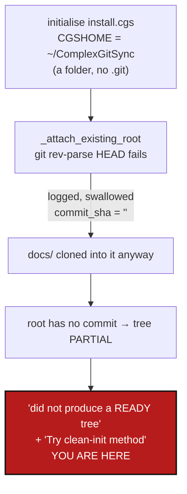

# InitialiseNonGitRoot — `initialise` on a folder that is not a git checkout half-builds a tree, then says nothing useful

*Created: 2026-09-29*

*Branch: main*

> **Diagnosis ticket**, opened from `shortTickets/install-bug-cgs.md`
> (owner, 2026-09-29): `pixi run cgitsync initialise install.cgs` from a
> plain clone in `~/Programmes/ComplexGitSync` ended in `Initialise did not
> produce a READY tree.`, and the owner's reading was that `install.cgs`
> lacks `relative_path = "."` on the project entry. §1–§2 are the diagnosis
> and it **refutes that reading**; §3 is the correction plan. No code
> changes accompany this ticket.

## Abstract — read this first

**The one-line version.** `install.cgs` is correct. The failure is that
`initialise` never clones the root repository — it assumes the root is
already checked out at CGSHOME — and when CGSHOME is not a git repository it
notices, writes one quiet log line, carries on cloning the other repositories
into it, and only then fails with a message that names none of this.

**What this document is.** The reproduction, the cause, and a plan of two
work packages and one owner decision.

**Why it exists.** The owner followed the natural path — a clone of the
project, then `initialise install.cgs` — and got a half-built tree
(`docs/` cloned, the root missing) plus a hint (`Try clean-init method`) that
cannot help. `install.cgs`'s own header and the README both say `bootstrap`
is the command for a user install; nothing stops `initialise` being run
instead, and nothing says why it failed.

**What you will find.** §1 the reproduction, including the test that clears
`install.cgs`. §2 the cause. §3 the work packages. §4 the decision that is the
owner's. §5 acceptance.

**Who it is for.** Whoever picks it up. WP1 is a few lines; the care is in
refusing *before* anything is cloned.

**What you need to do with it.** Read §1 (it is short), then D1 in §4.



---

## 1. Reproduction — and why it is not `relative_path`

The owner's log (`~/ComplexGitSync/.cgitsync/logs/initialise-20260929T114120Z.log`)
shows `attach_root_git_info_failed: not a git repository`, then `docs`
reaching `READY`, then `gitignore_pre_pull_skipped ... detached HEAD` for the
root, then `command_end status=error`. `~/ComplexGitSync` holds `docs/` (a
fresh clone), `.agent/`, `.cgitsync/` and a `.gitignore` — and **no `.git`**.

Two checks against this checkout, 2026-09-29:

1. `install.cgs` already resolves its root correctly, with no
   `relative_path`: `root  type=root  rel=.  owner='flipoyo'
   target='main'`. The project name equals the root repository's name, which
   is one of the two ways `_is_root_repo_spec` recognises a root
   ([archived DiscoverRoundTrip](../archive/20260928_DiscoverRoundTrip_DevPlanTicket.md)).
2. Running `initialise` against an empty, non-git CGSHOME with the entry
   written both ways gives the **same** failure, exit code 1, the same
   `attach_root_git_info_failed` event:

   ```bash
   T=$(mktemp -d); mkdir -p $T/ComplexGitSync
   printf 'project = { name = "ComplexGitSync", default_branch = "main" }\nrepos = [ { repository = "github:flipoyo/ComplexGitSync", fallback_branch = "main" } ]\n' > $T/x.cgs
   pixi run cgitsync initialise $T/x.cgs --output-path $T     # exit=1; same with relative_path = "."
   ```

Adding `relative_path = "."` to `install.cgs` therefore changes nothing for
this failure, which is why the file was left as it is.

## 2. Cause

- `initialise` clones **dependencies only**. `orchestre.py`'s comment in the
  initialise body says so: *"Root is already checked out at CGSHOME;
  initialise clones only the dependencies declared by the .cgs."* Cloning the
  root is `bootstrap`'s job.
- `_attach_existing_root` is where that assumption is checked, and it does not
  enforce it: on `GitSyncError` it logs `attach_root_git_info_failed`, sets
  `commit_sha = ""` and marks the root `READY` regardless.
- The run then clones every other repository into the folder, so the user's
  disk changes before anything is refused.
- The refusal, when it comes (`Initialise did not produce a READY tree.`), is
  generic, and `cli/_shared.py:227` appends `Try clean-init method` for every
  failed `initialise`. `clean-init` purges generated state and runs
  `initialise` again; it cannot clone a root, so here it repeats the failure.

## 3. Correction plan

| WP | Touches | Deliverable |
|---|---|---|
| **WP1** | `orchestre.py::_attach_existing_root` and its call in the initialise body | Ask "is CGSHOME a git repository?" **before** `_pending_clone_entries` runs, and refuse by name when it is not, changing nothing on disk: *`<path>` is not a git repository. `initialise` builds the dependencies of a project whose root is already checked out here. To clone the whole tree, root included, run `cgitsync bootstrap <spec> <name>`.* (Wording per D1.) A git repository that merely has a detached `HEAD` stays allowed — that case is the one the existing `gitignore_pre_pull_skipped` line was written for. |
| **WP2** | `cli/_shared.py:227`, `README.md` install section, `docs/Text/user_guide.tex` (`initialise`) | The `Try clean-init method` hint prints only when clean-init could plausibly help; for the WP1 refusal it is replaced by the `bootstrap` pointer. README and user guide state, next to the `initialise` entry, that the root must already be a checkout and that a user install is `bootstrap install.cgs <name>`. Rebuild the PDFs. |

Tests: a unit test that `initialise` on a non-git CGSHOME raises the named
refusal and that **no dependency directory was created** (the half-built tree
is the harm); one that a detached-`HEAD` root is still accepted.

## 4. Decision

| D | Question | Recommendation | Whose call |
|---|---|---|---|
| **D1** | Refuse, or clone the root when CGSHOME is empty or not a repository? | **Refuse and point at `bootstrap`.** Cloning a root into a folder that already holds `docs/`, `.agent/` and a `.cgitsync/` (as here) is exactly the situation `clone_guard.py` exists to be careful about, and `bootstrap` already does the clone. Auto-cloning would blur the two commands the README keeps distinct | **Owner** |

Open item to check while doing WP1, not asserted here: what `bootstrap` does
when its target folder already exists and is not empty — the owner's
`~/ComplexGitSync` is in that state.

## 5. Acceptance

- `initialise` against a CGSHOME that is not a git repository refuses before
  cloning anything, names the folder, and names `bootstrap`; no directory is
  created or modified by the refused run.
- A repository with a detached `HEAD` still initialises.
- A failed `initialise` no longer prints `Try clean-init method` when
  clean-init cannot help.
- README and `user_guide.tex` say the root must already be a checkout; PDFs
  rebuilt.
- `pixi run lint` and `pixi run test` pass; `pixi run bump-build` run;
  `cgitsync status` shows `errors=0`.
