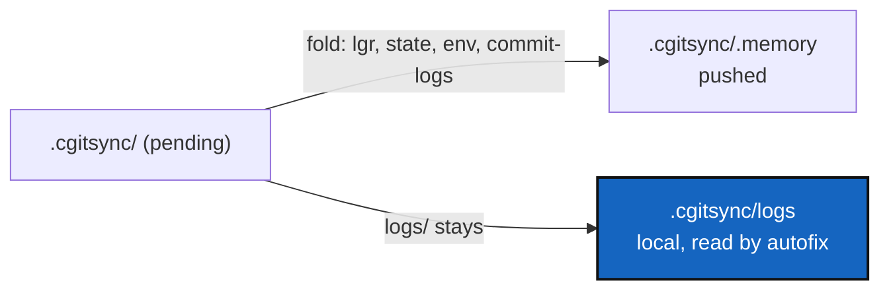

# LocalRunLogs — a memory push should not carry the run logs away

*Created: 2026-09-30*

*Branch: main*

> Opened from the owner's answer to MemoryArchitecture's D1 (2026-09-30),
> when that ticket was closed
> ([MemoryArchitecture](../archive/20260930_MemoryArchitecture_DevPlanTicket.md)):
> *"New ticket: stop pushing run logs."* The ledger, States, Environment
> records and commit logs keep being folded and pushed; the run logs stay on
> the machine that wrote them.
>
> **Branch `main`, not `memory-dev`** (`AdditionalSpecs.md`, *Branches and
> ticket topics*: the test is migration). Nothing already folded is moved or
> deleted (D1 below), so no stored memory is migrated; only what the next
> fold takes changes.

## Abstract — read this first

**The one-line version.** `memory push` moves `.cgitsync/logs/` into the
memory repository with everything else. Stop: run logs are per-run,
per-machine records, and once folded they are also out of `autofix`'s
reach.

**What this document is.** Why (§1), what changes (§2), work packages (§3),
decisions (§4), acceptance (§5).

**Why it exists.** Two reasons, one of them a real defect:

1. A run log is a record of one run on one machine — the command, its
   events, its failure. It is not part of what a project remembers, and a
   busy workspace writes one per command, so it is most of what a memory
   push sends.
2. `cgitsync autofix` reads the failing command from `.cgitsync/logs/*.log`
   (`orchestre/tree_commands.py`, `logs_dir = … / ".cgitsync" / "logs"`).
   A fold moves those files into `.cgitsync/.memory/logs/`, and `push`,
   `tag` and `freeze` fold before they publish. So a `push` that fails after
   its own memory fold leaves the log `autofix` needs somewhere `autofix`
   never looks.

**Who it is for.** Whoever picks it up; the owner for D1.

**What you need to do with it.** §2, then D1, then §3.

---

## 1. What happens today

`ComplexGitSyncClient._FOLD_SUBDIRS = ("lgr", "state", "logs", "env")`
(`orchestre/client.py`); commit logs are folded separately. Everything in
those directories moves into the mount on every `memory push`, and on every
`push`/`tag`/`freeze` of a tree that declares a memory.

## 2. What changes

- `logs` leaves the fold. Run logs stay in `.cgitsync/logs/` and are never
  committed into the memory repository.
- `.cgitsync/logs/` becomes a plain local directory with no history. How it
  is kept from growing without bound is D2.
- Nothing else changes: the ledger, States, Environment records and commit
  logs are folded and pushed exactly as today (MemoryArchitecture D1, as
  answered by the owner).

## 3. Work packages

| WP | Touches | Deliverable |
|---|---|---|
| **WP1** | `orchestre/client.py` | Remove `logs` from `_FOLD_SUBDIRS`. |
| **WP2** | `memory/pending.py`, `memory_commands.py` | Anything that reads run logs from the folded half as well as the pending one keeps working for the logs already folded, and stops expecting new ones there. |
| **WP3** | `tests/` | After `memory push`, `.cgitsync/logs/` still holds the run logs and the mount gains none; `autofix` still finds a failure logged before a `push` that folded the memory. |
| **WP4** | `AdditionalSpecs.md` (*Memory architecture*, *Memory vocabulary*), `tutorials/05_memory.md`, `docs/Text/user_guide.tex` | Say that run logs are local and never pushed. |

## 4. Decisions

| D | Question | Recommendation | Whose call |
|---|---|---|---|
| **D1** | The run logs already folded into a memory repository: leave them, or remove them in a commit? | **Leave them.** Removing them rewrites nothing, but it is a change to published content for no gain, and leaving them is what keeps this off `memory-dev`. | Owner |
| **D2** | Local run logs now accumulate with no fold to empty the directory. Bound them? | **Keep the last N (say 200) and delete older ones** on each new run, the same way a shell history is bounded. `autofix` only ever needs the most recent. | Owner |

## 5. Acceptance

- A `memory push` commits no new file under `logs/` into the memory
  repository; `.cgitsync/logs/` still holds every run log written since.
- `autofix` finds the failing command after a `push` that folded the memory.
- The ledger, States, Environment records and commit logs are folded and
  pushed exactly as before; `verify` passes on this project's own tree.
- `pixi run lint`, `pixi run test`, `cgitsync status` with `errors=0`,
  `bump-build` for the `src/` change; version is the orchestrator's call.
