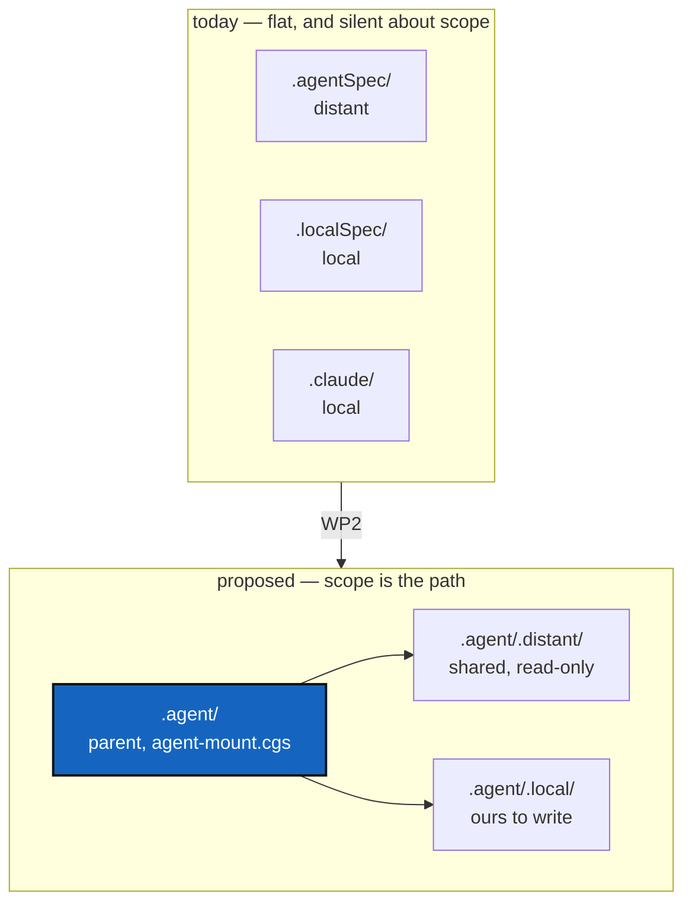

# ProjectSpecSplit — `.agent`, and separating the general spec from this project's own

*Created: 2026-09-20*

*Branch: main*

> **Owner ticket — `shortTickets/project-spec.md`, 2026-09-20:** *"From
> claude.md separated what are general projectSpec for a cgitsync further
> project and what is ComplexGitSync. It will be a private-distant repo.
> More generally, the agentic may be better organised as a parent-repo
> `.agent` that auto-discover itself with an appropriate
> `agent-mount.cgs`. It will be easier to clearely separate Private
> distant and private-local that way with `.agent/.local` and
> `.agent/.distant`."*

## Abstract — read this first

**The one-line version.** `CLAUDE.md` holds two documents in one — rules
any cgitsync project would want, and rules that are only about
ComplexGitSync — and the four agentic repositories sit loose at the tree
root with nothing saying which are shared and which are ours.

**What this document is.** A reorganisation in two halves that can land
independently: **the layout** (`.agent` as a parent repository, with
`.local` and `.distant` under it) and **the content split** (pulling the
general spec out of `CLAUDE.md`).

**Why it exists.** Today you cannot tell, from where a file sits, whether
editing it changes this project or every project that mounts the same
repository. `.agentSpec` is read-only and shared; `.localSpec` and
`.claude` are ours to write. That distinction is real, load-bearing, and
invisible in the directory listing.

**What you will find.** §1 the layout today and proposed. §2 the content
split and what makes a rule general. §3 the order, which matters more
than usual here. §4 decisions. §5 work packages. §6 acceptance.

**Who it is for.** The owner, for §4, and whoever does the move.

**What you need to do with it.** Read §3 before scheduling any of it —
the two halves have different risk, and one of them can break `bootstrap`
for everybody.

---

## 1. The layout

Four agentic repositories are mounted today, and their scope is visible
only by reading the `.cgs`:

| Mount | Scope today | Under `.agent` |
|---|---|---|
| `.agentSpec` (+ `DevSpec` nested inside it) | private/distant — shared, read-only | `.agent/.distant/.agentSpec` |
| `.localSpec` | private/local — ours | `.agent/.local/.localSpec` |
| `.claude` | private/local — ours | `.agent/.local/.claude` |
| *the new general spec* (§2) | private/distant | `.agent/.distant/` |

`.agent` itself is a repository holding `agent-mount.cgs`, discovered the
same way `.memory` will discover `config-memory.cgs` — an explicit
`nested_config = "agent-mount.cgs"` rather than `"auto"`, for the reason
the AgentReport ticket gives: `auto` globs `*.cgs` and fails on the second
one.

**What the layout buys.** `propagate_privacy` already pushes a parent's
privacy onto everything nested inside it, so `.agent/.distant` could
declare read-only once and have it hold for everything under it, instead
of each entry restating it. The path becomes the answer to "may I edit
this?", which today requires opening the spec.

**What it costs, and this is not small:**

- `CLAUDE.md` and `AGENT.md` at the tree root are **symbolic links into
  `.claude/`**. Moving `.claude` moves what they point at.
- Every path in every spec, ticket and docstring that reads `.localSpec/`
  or `.agentSpec/` changes. That is a large, mechanical, error-prone
  sweep, and `CitationRot` is the ticket that exists because this project
  already has stale paths from a much smaller rename.
- `examples/complexgitsync4dev.cgs` is what CI dogfoods. A tree shape that
  does not clone is a red build for everyone.

## 2. The content split

`CLAUDE.md` currently mixes two kinds of rule. The test for which is
which: **would another project, with different modules and a different
language, want this sentence?**

| General — belongs in the shared spec | ComplexGitSync's own |
|---|---|
| The before-committing checklist as a *shape* (lint, test, the tool's own status, version bump) | `pixi run lint` / `pixi run test`, and the `errors=0` rule for this tree |
| The commit-message rule: `<project><version>`, one message, plain English, three lines | That the project name is `cgitsync` |
| Attribution: the publication rule and the accounting rule | — |
| The two-agent rule (worker and orchestrator) — see [AgentContract](main_1-4_AgentContract_DevPlanTicket.md) | — |
| Document conventions, the `*Created:*` line, the finishing-report bar | Which files this project keeps them in |
| Ticket lifecycle pointers | The branch table: `main` / `memory-dev` / `data-repo` |
| — | The whole module responsibility table and the ring rules |
| — | File formats `.cgs` / `.gts` / `.lgr`, the layout section |

**The general half is roughly: conduct, documents, commits, tickets. The
specific half is: this codebase.** That is a clean cut, and it is worth
noticing that the general half is almost exactly the part that has been
edited most in the last week — which is an argument for getting it into a
repository other projects can pull from.

`.agentSpec/DevSpec/DevSpecs.md` already occupies this space: it is the
project-agnostic philosophy `AdditionalSpecs.md` and `CLAUDE.md` conform
to. **So the general spec may not need a new repository at all** — it may
be a new file in `DevSpec`, which is already private/distant and already
shared. D1.

## 3. The order, which matters here

**The content split (§2) is safe. The layout move (§1) is not.** They are
independent, and doing the safe one first is free.

A mount whose repository or branch does not exist **breaks `bootstrap`
for everyone using the spec, CI included**. MemoryArchitecture records
this exact lesson from `.memory`: the order was push first, declare the
mount second, because an empty repository with no refs broke the clone.
`.agent` is the same situation with three repositories instead of one.

So: create and populate `.agent` before any spec mentions it, move one
repository at a time, and keep the tree bootstrapping after each step.

## 4. Decisions

| D | Question | Recommendation | Whose call |
|---|---|---|---|
| **D1** | Does the general spec need a new repository, or a new file in `DevSpec`? | **A file in `DevSpec`.** It is already private/distant, already shared across projects, and already holds the project-agnostic philosophy this would sit beside. A new repository is a new thing to create, mount, brand and keep in sync, for content that has a natural home | **Owner** |
| **D2** | Is the `.agent` layout move worth its cost? | **Separable, and not first.** The content split delivers most of the value — knowing which rules are general — and carries none of the bootstrap risk. Do §2, live with it, then decide whether the directory move still feels necessary | **Owner** |
| **D3** | If the move happens: one `.agent` repository holding mounts, or a plain directory? | A repository, per the owner's words, so `agent-mount.cgs` travels with it and a project mounts one thing instead of four | Owner |
| **D4** | What happens to `CLAUDE.md`'s name and location? | Keep the root symlink working, whatever it points at. It is what every agent reads first, and a project whose entry point moved is a project agents stop reading | Implementer |

## 5. Work packages

| WP | Does | Depends on |
|---|---|---|
| **WP1** | The content split (§2): general rules moved to their home, `CLAUDE.md` keeping this project's own and pointing at the general one. No directory moves | D1 |
| **WP2** | `.agent` created and populated, mounts moved one at a time, `agent-mount.cgs`, the spec updated last. Tree bootstraps after every step | D2, D3, WP1 |
| **WP3** | The path sweep: every `.localSpec/`, `.agentSpec/`, `.claude/` reference in specs, tickets and docstrings. Pairs naturally with [CitationRot](main_2-4_CitationRot_DevPlanTicket.md), which is building the check that would catch what this breaks | WP2 |
| **WP4** | Move `scripts/bump_version.py` to the private/distant spec repository (`.agent/.distant` once WP2 lands, `.agentSpec` until then), so a public-only checkout of ComplexGitSync structurally cannot cut a release — carried over from Versioning's own §5.1, which stated the case but left the move to this ticket. `pixi.toml`'s `bump-version` task, `tests/unit/test_bump_version.py`, and the `bump_version` import path in that test all move or update with it. Versioning's other half of this item — the false "CI auto-increments" claim in `AdditionalSpecs.md` and `CLAUDE.md` — is already fixed as of Versioning's own implementation; this WP is the relocation alone | WP2 |

## 6. Acceptance

- `pixi run cgitsync bootstrap examples/complexgitsync4dev.cgs` produces a
  working tree after **each** work package, not only at the end.
- `CLAUDE.md` at the tree root still resolves and still reads as the first
  thing an agent should open.
- A rule in the general spec names no ComplexGitSync module, command or
  branch. If it does, it was not general.
- No path in `src/`, the specs or the tickets points at a directory that
  moved.
- A checkout of the public `ComplexGitSync` repository alone has no
  `bump_version.py` and no `bump-version` task that resolves, and says so
  clearly rather than failing obscurely (WP4).
- `pixi run lint` and `pixi run test` pass; `cgitsync status` shows
  `errors=0` on a freshly bootstrapped tree.
