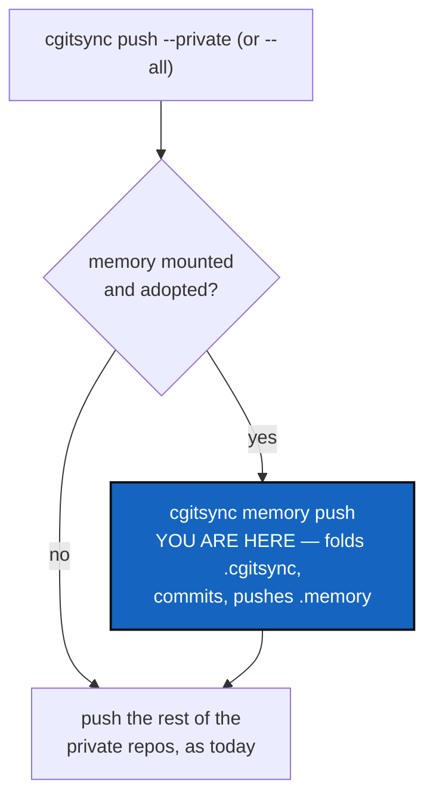

# PushFoldsMemory — `push --private`/`--all` fold and send the memory first

*Created: 2026-09-18*

*Branch: main*

> **Owner direction — 2026-09-18:** *"Extend push --all or --private. They
> push branches project/private accordingly but for the --private
> pipeline run first cgitsync memory push. This way the .memory management
> will fit with the frontier expected between what is and what will be."*
>
> Filed the same day as
> [PendingAccumulation](../archive/20260918_PendingAccumulation_DevPlanTicket.md),
> whose finding this ticket acts on: nothing had run `memory push` in the
> thirteen hours before that investigation, not because the fold is broken
> but because nothing ever asks for it except a person remembering to.
> This ticket is the fix that does not depend on remembering.

## Abstract — read this first

**The one-line version.** `.cgitsync` is *what will be* — this project's
own record of what just happened, not yet sent anywhere.
`.cgitsync/.memory` is *what is* — the folded, committed, pushed record
a colleague or a second machine can actually see. Every command that
crosses that frontier today is a person typing `cgitsync memory push` on
their own initiative; this ticket makes `push --private` and `push --all`
cross it automatically, as the first thing they do, before pushing any
other private repository.

**What this document is.** The design for folding `memory_push` into the
private half of `push`'s own pipeline: when it runs, when it does not,
and what happens when it fails.

**Why it exists.** `PendingAccumulation` found thirteen ordinary commands
run over thirteen hours with no `memory push` in between — not a bug, but
exactly the gap this ticket closes. A memory that is only ever pushed
when someone remembers is a memory that is sometimes thirteen hours (or
more) behind what it claims to hold.

**What you will find.** §1 where in `push`'s own pipeline this runs, and
why first. §2 decisions — when it triggers, and what a failure does to
the rest of the push. §3 work packages. §4 acceptance. §5 what this
refuses.

**Who it is for.** Whoever builds it; the owner, to confirm §2.

**What you need to do with it.** §1 is the whole idea; §2 is what makes
it safe.

---

## 1. Where this runs, and why first

`ComplexGitSyncClient.push()`
([`orchestre.py:3678`](../../../src/ComplexGitSync/orchestre.py#L3678))
computes its scope once (`self._write_scope(registry, "push", private,
all_writable)`) and then does exactly two things: the tree-wide git push
(`self.orchestre.git_tree.git.push(...)`) and a `write_gts_snapshot` that
records the operation and the commits it published. `.memory` is not part
of that tree-wide push today — it is excluded from the ordinary
`add`/`commit`/`push` sweep by design (`git_repo.py`'s `RepoScope.includes`
docstring), because sending it is not "stage, commit with a message, push"
but "fold what has accumulated, commit *that*, push it" — a different
shape of operation, already built as `memory_push`.

**When `scope` includes `PRIVATE`** (`--private` or `--all` —
`RepoScope.PRIVATE`/`RepoScope.WRITABLE`) **and this tree has a memory
mounted and adopted**, this ticket adds one step, *before* the existing
tree-wide push runs: call `self.memory_push(workspace)`.

**First, not last, is the point.** `.cgitsync` should never carry more
than what has accumulated since the *current* push started — every entry
older than that belongs to `.memory` already. Folding before this
operation's own git push and `write_gts_snapshot` run means those two
steps' own ledger entries become the *next* cycle's pending content, not
this one's — the frontier moves in one direction, once per push, and
never carries a backlog forward. Folding *after* would work arithmetically
the same way this time, but only because nothing else diagrams that
guarantee; putting the fold first makes it true by construction instead of
by accident, and it is the order the owner asked for.

## 2. Decisions

### D1. When does the fold run — every `--private`/`--all`, or only some?

Recommendation: **every time**, no flag. `.memory` already participates
in `checkout`/`merge`/`pull` without an opt-in flag — WorkingTransitionState's
whole point was that it needs no special handling once mounted. A push
that silently skips the memory some of the time reopens exactly the gap
`PendingAccumulation` found.

### D2. What if no memory is mounted, or mounted but not yet adopted?

Recommendation: **skip silently when there is no mount at all** — most
trees declare none, and printing anything about a memory that does not
exist is noise. **Skip with one printed note when a mount is declared but
`memory adopt` was never run** (`.cgitsync/.memory/.git` absent) — this is
a real, nameable gap in onboarding, and `memory_push` already raises a
clear `GitSyncError` for it; catch that one specific error and print its
message rather than let it fail the whole push, since a private repo
sitting mid-onboarding must not block every other private repo's push.

### D3. What if `memory_push` fails for a reason other than "not adopted yet"?

Recommendation: **warn, and continue with the rest of the private push.**
Every ledger-write path in this codebase already follows "recording must
never cost the command its work" (`orchestre.py::_append_ledger_entry`'s
own docstring); a memory that cannot reach its remote — offline, a
conflict like the one `ResolveMergeToolCrash`/this session's own `.memory`
hit, a revoked credential — is a real failure, but it is `.memory`'s own
failure, not `.localSpec`'s or `.claude`'s. Blocking every other private
repository's push because the memory could not send is a worse outcome
than a private push that printed a warning and moved on. The warning
names the exact remedy: `cgitsync memory push`, run again by hand.

### D4. Does `--dry-run` show it?

Recommendation: **yes.** `_execute_push`'s dry-run plan
(`cli/expert.py::_print_dry_run_plan`) already lists the git commands a
push would run; when scope includes `PRIVATE` and a memory is mounted and
adopted, add `cgitsync memory push` to that listed plan, so the preview is
honest about what is about to happen.

## 3. Work packages

| # | Depends on | Touches | Delivers |
|---|---|---|---|
| **WP-1** | D2 | `orchestre.py` | A small helper answering "does this registry declare a memory mount, and is it adopted" — reusable, since `push()`, `status`'s own dirty-note, and `_refresh_memory_mount_state` each ask a version of this question already and none of them share one. |
| **WP-2** | WP-1, D1–D3 | `orchestre.py` | `push()` calls `self.memory_push(self._workspace_root())` first when scope includes `PRIVATE` and WP-1 says adopted; catches the "not a repository yet" `GitSyncError` and any other and prints a warning instead of raising, in both cases continuing to the existing tree-wide push. |
| **WP-3** | WP-2 | `cli/expert.py` | `_execute_push`'s dry-run plan lists `cgitsync memory push` under the same condition (D4); the real run prints what `memory_push` itself returned (folded count, committed, branch) ahead of the ordinary `pushed ...` lines. |
| **WP-4** | WP-2 | `tests/`, `README.md`, `docs/Text/user_guide.tex`, `docs/Text/api_python.tex` | A real-memory integration test: pending records sitting in `.cgitsync`, `push --private` folds and pushes them without being asked twice, and a second test that a memory failure (not-adopted) does not stop `.localSpec` from pushing. Documented wherever `push --private`/`--all` and the memory are already explained. |

## 4. Acceptance

- `cgitsync push --private`, run against a tree with pending records
  sitting in `.cgitsync` and an adopted memory, folds and pushes them
  before pushing any other private repository — no separate `memory push`
  needed.
- `cgitsync push --all` does the same, in addition to pushing the
  project's own repositories.
- A tree with no memory mounted at all sees no change in `push`'s
  behaviour or output.
- A tree whose memory is declared but not yet adopted still pushes every
  other private repository, with one printed note naming `memory adopt`.
- A memory push that fails for any other reason does not prevent the rest
  of the private push from completing.
- `--dry-run` lists `cgitsync memory push` in its plan under the same
  conditions the real run would perform it.
- `pixi run lint` and `pixi run test` pass.

## 5. What this refuses

- **To make `push` (the plain, project-scoped form) touch the memory.**
  Only the private half of the pipeline changes; a plain `push` with no
  flag reaches exactly the repositories it always has.
- **To push the memory automatically on every command.** This is still
  one command choosing to fold and send — `push --private`/`--all` — not a
  background service. "It must work offline" and "it is not a sync
  service" (`memory-dev_1-1_MemoryArchitecture_DevPlanTicket.md` §5) still
  hold: nothing here runs unless a person runs `push --private`/`--all`.
- **To extend this to `tag`/`freeze`/`freeze-release` in this pass.** Not
  reported as a gap, not assumed here — worth asking about separately if
  the owner wants the same frontier guarantee there.
