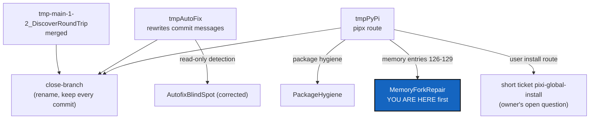

# TmpBranchClosure — CorrTicket: close the three `tmp` branches, take back what conforms

*Created: 2026-10-02*

*Branch: main*

> **Ticket review — 2026-10-02.** Renumbered `main_1-2` → `main_1-3`: RuleConformity found rule breakages in 3.14.2 and takes `main_1-1`, per the owner's instruction.

> **Correction ticket (CorrTicket)**, from the owner's short tickets
> `archive/.closedUserTicket/20261002_tmpBranch-decision.md` and the
> instruction that followed it in the session. Named like every planning
> ticket so the lifecycle tooling sees it.

## Abstract — read this first

**The one-line version.** The owner opened three branches named `tmp…`
whenever an agent's report contradicted a core rule. Two of them hold work
that breaks a core rule, and the third is already merged. Close all three
without losing a commit, and bring back to `main`, under separate tickets,
only the parts that conform.

**What this document is.** The correction plan: what each branch is, why
it closes, how to close it properly, and where its reusable work goes.

**Why it exists.** An agent that follows a wrong rule, or a gap where a
rule should be, produces work that looks finished. Here the core rules
broken were "ComplexGitSync never rewrites a commit message" and "Pixi
only". The first was not written down anywhere, and the second was not
explicit about how users install. WP0 writes both down; the rest cleans up
what was built without them.

**What you will find.** §1 the findings. §2 the work packages. §3 the
tickets that carry reintegration. §4 acceptance.

**Who it is for.** The worker and orchestrator who carry it out, and the
owner, who decides each `close-branch` run.

**What you need to do with it.** WP0 is done. Then WP1 → WP2 → WP3 in
order, each with the owner's go-ahead for the commands that touch a remote.

---

## 1. Findings (2026-10-02, after `cgitsync fetch`)

| Branch | State against `main` | Rule broken | Verdict |
|---|---|---|---|
| `tmp-main-1-2_DiscoverRoundTrip` | Merged in the root and `docs` (0 ahead). Leftovers: one `.localSpec` commit editing the ticket while it was open (the ticket is archived on `main` since 2026-09-28); two `.memory` commits | None that matters now | Close. Nothing to take back. |
| `tmpAutoFix` | 1 commit ahead in the root, `docs`, `.claude`, `.localSpec`; 2 in `.memory`, 1 in `.self-history` | `git commit --amend` on a tip commit, and on a pushed one with `force`. It also edits two archived tickets (AgentGuardrails, SpecTreeManifest), and reuses version 3.12.0 | Close. Take back the read-only detection only. |
| `tmpPyPi` | 1 commit ahead in the root, `docs`, `.claude`, `.localSpec`, `.memory`, `.self-history` | A `pipx` user install, `pipx` in CI and the release workflow, a README with no Pixi-only rule, and `bootstrap` no longer assuming Pixi. It also reuses version 3.9.1 | Close. Take back the package hygiene, and its four memory entries. |

**`main`'s memory chain is broken because of `tmpPyPi`.** `cgitsync
verify` reports `status=corrupt`: a sequence gap at 126–129 and a broken
link at 130. Entries 126–129 were recorded while the tree was on
`tmpPyPi`, and live only on `.memory`'s `ComplexGitSync_tmpPyPi`. Closing
the branch does not fix that, and rewriting the chain is forbidden.

**`close-branch` cannot close these branches properly today.**
`BranchOperation.close_branch` renames the literal name in every
repository, so `tmpPyPi` never reaches a private/local repository's
`ComplexGitSync_tmpPyPi`. It also skips a repository with no *local*
branch of that name, and all three branches exist only on origin here.

## 2. Work packages

| WP | What | Done when |
|---|---|---|
| **WP0** (done 2026-10-02) | **The agentic specs say ComplexGitSync rewrites nothing.** `AdditionalSpecs.md` *The hard prohibitions*: no amend, rebase, squash, filter or force-push; a commit message is never changed once made; `autofix` eases merges, repairs only by adding a commit, and for a bad message names it and proposes ways to extract it intact. Three NEVER lines in `digest.md`; the `autofix/` and `commit_message.py` rows of `CLAUDE.md`; AutofixBlindSpot's WP2 and acceptance rewritten. `digest.md` also states that Pixi-only covers the user install route (no `pipx`). | In this change |
| **WP1** | **MemoryForkRepair first** (its own ticket): bring entries 126–129 back to `main`'s memory by a merge, so `verify` passes, before any `.memory` branch is renamed. | `cgitsync verify` shows the chain intact |
| **WP2** | **`close-branch` closes a *project* branch.** Resolve each repository's own name through `GitTreeBranches.target` (`ComplexGitSync_<b>` in a private/local repository, nothing in a private/distant one). Close a branch that exists only on origin by pushing `refs/remotes/origin/<b>` as `closed/<b>` before removing the old remote name. Never delete a commit: the closed name holds the same sha, verified before the old name is removed. Tests for both cases, docs updated. A behaviour change: `bump-build`, then `bump-version patch` at least. | `cgitsync close-branch tmpX` renames the branch in every repository that has it, on origin included |
| **WP3** | **Close the three branches**, one `cgitsync close-branch` per branch, each run with the owner's go-ahead because it writes to remotes. Order: `tmp-main-1-2_DiscoverRoundTrip`, then `tmpAutoFix`, then `tmpPyPi` (after WP1). Then `cgitsync fetch` and `branch --list` show each under `closed:`. | `branch --list` lists all three as closed |
| **WP4** | **Archive the tickets the branches leave behind.** UserInstallPath (the `tmpPyPi_` ticket) moves to `archive/` as dropped, with a note naming PackageHygiene and the `pixi-global-install` short ticket as where its parts went. The AutofixBlindSpot archive copy that exists only on `tmpAutoFix` is not restored: the open ticket on `main` is the live one. | `openTickets/` holds no `tmpPyPi_` ticket |
| **WP5** | **Audit the commands that move a branch** against *The hard prohibitions*: `close-branch`, `memory reboot` (archives a branch and starts an orphan), `pull-force` (resets a local branch, discarding local commits on explicit request), and the install-time `checkout -B`. The owner rules on each: allowed as it is, needs a refusal, or goes. | The owner's ruling is written into `AdditionalSpecs.md` |

## 3. Reintegration tickets

Each is separate and has a single intent:

- **AutofixBlindSpot** (open, corrected in WP0). *`autofix` notices a bad
  tip commit message nobody logged an error for, and reports it with ways
  to extract it intact.* It takes back `tmpAutoFix`'s detection: the
  AgentConduct §2 checks, the shell-damage traces (double spaces, a space
  before punctuation, reported as suspected), and the "operation in
  progress" guard. It never takes `amend_head_message`, `head_is_published`
  as a gate for rewriting, or any `force`.
- **MemoryForkRepair** (new, WP1). *`main`'s memory verifies again,
  without a single commit rewritten.*
- **PackageHygiene** (new). *What this repository builds carries only what
  a user needs, whatever the install route turns out to be.* It takes
  back `tmpPyPi`'s source-archive include list, its package metadata, its
  `test_packaging.py` and the changelog, all built and tested through Pixi.
- **The user install route** is not a ticket yet. It is the owner's open
  question in the short ticket `pixi-global-install.md`. `tmpPyPi`'s
  `pipx` route, its `smoke_installed.sh` and its PyPI release workflow are
  not taken back.

## 4. Acceptance

- WP0's rules are in `AdditionalSpecs.md`, `digest.md` and `CLAUDE.md`,
  and `pixi run check-spectree` passes.
- `cgitsync verify` passes before any `.memory` branch is renamed.
- After WP3, every repository that held one of the three branches holds it
  as `closed/<its name>` at the same sha, locally and on origin, and no
  commit has become unreachable.
- No step of this ticket amends, rebases, filters or force-pushes.
- `pixi run lint`, `pixi run test`, `pixi run check-ceilings` pass and
  `cgitsync status` shows `errors=0`; WP2 carries its `bump-build` and
  `bump-version`.
