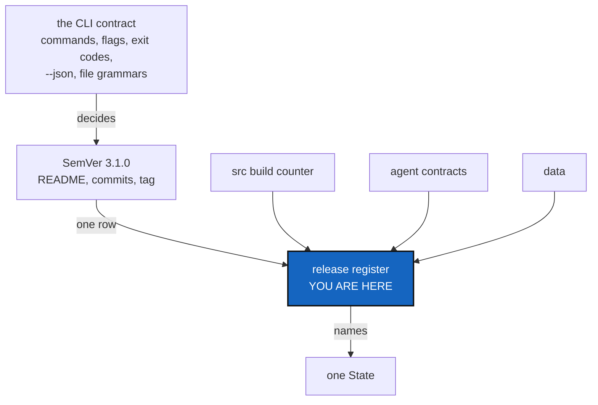

# Versioning — SemVer by the book, and a register that says what each release was made of

*Created: 2026-09-20*

*Branch: main*

> **Owner ticket — `shortTickets/versioning.md`, 2026-09-20:**
> *"Versioning has multiple artefacts under cover. `src` --> the core and
> only actual versioning of the public execution of cgitsync. We need now
> that it disappears from README.md, and that README.md exhibits the
> SemVer which gonna be linked to tag and freeze-release. It will be
> linked to src and new version numbers. For instance the agent-contracts
> are versioned as mentioned in 1-4 and 1-5. It will be tamper-evident in
> case a LLM overstep and we have to protect the project from the
> agentProvider, who can only use the public version of
> ComplexGitSync-Apache2 as everyone. data will also have a version
> number, so SemVer is a fusion of all of that structured as
> Version.DevStage.Patch. A Patch is an integer that links all version of
> the project. It must be recorded in .memory so cgitsync SemVer can be
> trackable to a ComplexGitSync state."*

> **Owner direction — 2026-09-20, after review:** *"you're right i must
> follow SemVer by the book. Can you adapt my scheme to SemVer. Yes commit
> and README must display SemVer but i must have a register that links
> SemVer to every versioned artefacts."*
>
> So: **real SemVer** (§2), shown in the README and in every commit
> message, and a **release register** (§3) that is where the fusion
> actually lives. §2.3 says which one part of the original sketch cannot
> survive the move, and where its job goes instead.

> **Reorganisation, 2026-09-20.** This ticket takes over
> [UserInstallPath](main_2-2_UserInstallPath_DevPlanTicket.md)'s **D1**,
> "The version scheme, which publishing forces". A decision that spans
> `src`, the agent contracts, the data layer and the memory no longer
> belongs inside a packaging ticket. Ranked 1-3 because the agent
> contracts carry versions that join the register, so the scheme must
> exist before they are given one.

## Abstract — read this first

**The one-line version.** The project takes a real SemVer version, and a
register records which set of artefact versions — and which State — each
release was made of.

**What this document is.** The mapping from the owner's sketch onto SemVer
as specified, plus the design of the register that carries what SemVer
deliberately cannot.

**Why it exists.** `src`'s number is the version of an executable, and it
is currently doing a second job: standing for the whole project. Those
come apart the moment a contract or a dataset changes without the code
changing.

**What you will find.** §1 what is versioned today. §2 the SemVer mapping,
including the one piece of the sketch that has to move. §3 the release
register. §4 the protection claim, honestly. §5 decisions. §6 work
packages. §7 acceptance.

**Who it is for.** Whoever implements it. The load-bearing decisions are
made; §5 holds what is left.

**What you need to do with it.** Read §2.1 — the public interface this
versions is already written down elsewhere, which makes the mapping
unusually concrete.



---

## 1. What is versioned today

One number, `0002.86` in `pyproject.toml`, mirrored into **six** files by
`pixi run bump-version` and auto-incremented by CI on every merge to
`main`. It surfaces in more places than that list suggests:

| Where | Today |
|---|---|
| `pyproject.toml` | the authoritative value |
| `pixi.toml`, `src/ComplexGitSync/__init__.py` | mirrors |
| `README.md` title — `# ComplexGitSync v0002.86` | **what the owner wants replaced** |
| `docs/Setup/Shortcuts.tex`, `docs/preamble.tex` | `\cgsversion` |
| every commit message | `cgitsync0002.86` |
| every ledger entry | `toolchain.cgitsync = "0002.86"` |

`CLAUDE.md` calls the scheme `YYYY.XX`, but `0002` is not a year — it is a
counter, and PEP 440 normalises `0002.86` to `2.86`, so a published
package would show a version this repository never writes.

## 2. The SemVer mapping

### 2.1 What "the public API" is here — already written down

SemVer's positions are defined against a public API, so the scheme is only
as clear as that definition. **This project already has one**: the README's
*What is stable, and what is not* table. Nothing needs inventing; it needs
connecting.

| Position | Increments when | From the CLI contract |
|---|---|---|
| **MAJOR** | The public interface breaks | A command or documented flag is removed or renamed; an exit code changes meaning; a `--json` field is repurposed or removed; a `.cgs`/`.gts` grammar change that an older reader cannot load |
| **MINOR** | Capability is added, compatibly | A new command, a new flag, a new `--json` field, a new provider — everything the contract calls "additive only" |
| **PATCH** | Behaviour is fixed, nothing added | A bug fix with no interface change |

Two clarifications the table makes for free, worth stating because they
narrow MAJOR a great deal:

- **`src/ComplexGitSync/` is not a public interface.** The contract says so
  outright. A refactor that moves every module is not a MAJOR change, and
  no deprecation is owed — so internal architecture work never forces a
  major bump.
- **`verify` is experimental**, so its output changing is not a break
  either, until it stops being.

### 2.2 `DevStage` becomes a pre-release identifier

SemVer already has the slot the owner's `DevStage` was reaching for, and
it is the by-the-book answer: a **pre-release identifier** after a hyphen.

```
3.1.0-alpha.1    3.1.0-beta.2    3.1.0-rc.1    3.1.0
```

It sorts correctly by specification — a pre-release always precedes its
release — it is what every tool already understands, and PEP 440 accepts
it (`3.1.0rc1`). A development stage that is a *phase of an upcoming
release* is exactly what this field is for.

### 2.3 The linking integer is dropped

The original sketch made `Patch` a monotonic integer linking every
artefact. **Dropped by the owner on 2026-09-20** — "forget about PATCH" —
and it is worth one paragraph saying why, so it is not reopened.

Under SemVer, `PATCH` resets to `0` on every MINOR bump: `1.2.7` is
followed by `1.3.0`. A field that resets cannot be a stable join key, so
the two ideas were never compatible. `PATCH` here means what the
specification says it means — a backward-compatible fix — and nothing
else.

**The job it was doing is real and is done by §3 instead.** A SemVer
version already names one release uniquely, so it is the key; the ledger
row keyed by it names the artefact set. Nothing needs a second number.

### 2.4 Two numbers, two cadences — keep both

The owner's *"`src` → the core and only actual versioning of the public
execution"* is preserved, and it is worth being explicit about why both
numbers exist:

| Number | Moves when | Says |
|---|---|---|
| **SemVer** `3.1.0` | A release is made, deliberately | What the project promises |
| **Build counter** `0002.86` | CI merges to `main`, automatically | Exactly which build is running |

They have genuinely different cadences, which is why collapsing them would
lose information: a build counter that only moved on releases could not
identify the build that produced a given ledger entry, and a SemVer that
moved on every merge would promise a release every time someone fixed a
typo.

**Where each lives** is D1. `pyproject.toml` can hold only one version and
PyPI requires it to be the release identity, so SemVer takes that slot and
the build counter needs a home of its own.

### 2.5 The build counter must advance on every change

> **Owner direction — 2026-09-20:** *"It is important not to forget to
> increment src version at every change. This may be a CI job. cause each
> time CI is ran is because a change was done."*

> **Corrected by the owner, same day:** *"no its not CI job, it's the
> agent worker job, the worker that works on src."*

**So versioning divides three ways, along the roles that already exist**
([AgentContract](main_1-5_AgentContract_DevPlanTicket.md) §1):

| Who | Does | Because |
|---|---|---|
| **Worker** — the agent that changes `src` | Increments `__build__` as part of the change | It is the party that knows a change happened, and the only one present when it happens |
| **Orchestrator** — independent | Decides MAJOR/MINOR/PATCH, runs `bump-version`, tags, writes the release row | The decision needs a reader (§5.2) |
| **CI** | Verifies. Writes nothing | It can check, but cannot judge — and it never needs credentials |

This is cleaner than putting the counter in CI, and the reason is worth
stating: **CI is not present at the change, it is present at the push.**
It runs on `push` *and* `pull_request`, several times per change, and not
at all for a local commit. A CI-driven counter would count builds; a
worker-driven one counts changes, which is what the owner asked for.

The two tasks still want separate names, so the rule stays unambiguous:

| Task | Does | Judgement? | Who |
|---|---|---|---|
| `bump-build` | `__build__` + 1 | No | The worker, with its change |
| `bump-version` | Sets SemVer across every manifest and doc | **Yes** | The orchestrator, never CI (§5.2) |

That split also resolves what would otherwise collide with §5.1:
`bump-version` moves to private/distant. The worker's `bump-build` stays
public, where the worker works.

## 3. The release register

> *"i must have a register that links SemVer to every versioned artefacts"*

> **Owner direction — 2026-09-20:** *"I guess Register is ledger that
> keeps record or `cgitsync<version>`."*
>
> **So there is no new store and no new word: the Ledger is the
> register.** That settles the vocabulary worry this section used to
> carry — `AdditionalSpecs.md`'s fixed-meanings table opens by noting that
> *three* things in the code are already called "the register", and this
> design adds no fourth.

The Ledger is defined as *"the ordered, hash-chained record of when each
State was seen"*. A release is exactly such an event: `tag` and
`freeze-release` already write a State and already append an entry. What
is missing is only that the entry does not yet say **which release it
was**.

**One release is one ledger entry carrying a `release` field**, holding
what that version was made of:

```toml
[entry.release]
semver      = "3.1.0"
git_tag     = "v3.1.0"

[entry.release.artefacts]
src            = "0002.86"         # the build counter
agent_contract = "…"               # AgentContract's contract record
data           = "…"               # the data layer
docs           = "…"               # if versioned separately
```

The entry already carries `state_id` and `recorded_at`, so the release
row needs neither: the State this version was cut from and the moment it
happened are fields the schema has had since the beginning. That is the
clearest sign this belongs in the ledger rather than beside it.

**It is additive, exactly like `commit_log` and `environment`.**
`AdditionalSpecs.md`'s entry schema says adding a field is a change to
that section first, and that a field absent from the payload hashes as it
always did. An entry that records no release simply omits it — which is
almost all of them.

**Tamper-evidence is then free**, and it is the real reason this is the
right home: the chain already covers every field of every entry, so a
release row cannot be edited afterwards without breaking the chain from
that point on. Nothing new has to be built to protect it.

### The one thing it still takes from TreeEnvironment

If the artefact set grows past a handful of fields, it becomes a
content-addressed record cited by hash from the entry — the pattern
[TreeEnvironment](main_1-2_TreeEnvironment_DevPlanTicket.md) is already
building for environment records. Start inline, because a release row is
small and rare; move it out only if it stops being either.

**Never hashed into a State's name.** `AdditionalSpecs.md` records what
happens when a version leaks into identity: canonicalisation version 2
hashed the running package's version, and one tree got two names on two
machines. A version describes what observed a tree, never what the tree is.

**Tamper-evidence comes free.** A content-addressed row cited from a
hash-chained ledger cannot be edited afterwards without every citation
disagreeing — the same property the State and the ledger already have.

## 4. The protection claim, honestly

> *"tamper-evident in case a LLM overstep and we have to protect the
> project from the agentProvider, who can only use the public version of
> ComplexGitSync-Apache2 as everyone."*

**What it gives you.** A dated, tamper-evident record of what was released
publicly under Apache-2, at which SemVer, from which State. That makes the
public boundary a matter of record rather than recollection — *"this
artefact was never public"* becomes provable. Paired with
[AgentContract](main_1-5_AgentContract_DevPlanTicket.md)'s contract
record, a `.self-history` entry can name both the terms in force and the
public version in force.

**What it does not give you.** It does not prevent misuse, detect it, or
constrain anything outside this repository. It is evidence, not a control
— the same limit AgentContract §2.2 states about itself. The protective
value is entirely in being able to *show* what was public and when; that
is worth building, and it is not a lock.

## 5. Decisions

Answered by the owner on 2026-09-20: **SemVer by the book** (§2), and
**SemVer in the README and in every commit message**. What is left:

| D | Question | Recommendation | Whose call |
|---|---|---|---|
| **D1** | Where does the build counter live, once `pyproject.toml` holds SemVer? | `__build__` beside `__version__` in `src/ComplexGitSync/__init__.py`, written by `bump-version` and auto-incremented by CI exactly as today. `pyproject.toml` and `pixi.toml` carry SemVer only | Implementer |
| **D2** | What is the register called, given "register" is already overloaded? | **ANSWERED 2026-09-20: it is the Ledger** (§3). No new store, no new word, and the vocabulary table is untouched | — |
| **D3** | Does a ledger entry record SemVer, the build counter, or both? | **`toolchain.cgitsync` keeps recording the build counter** — it answers "which executable wrote this entry", which is a build question. SemVer belongs to the release row. Changing `toolchain`'s meaning would also rewrite what every existing entry claims | Implementer |
| **D4** | What is the first SemVer, and how does it relate to `0002.86`? | **ANSWERED 2026-09-20: `3.0.0`, once this ticket is implemented** — not before, so the first SemVer the project ever publishes is one it can actually honour. State the mapping from `0002.86` once in the README rather than implying the sequence is continuous | — |
| **D7** | `bump-version` moves to private/distant — what breaks? | **The owner's call, taken 2026-09-20**, and §6's WP7 carries it. See §5.1: it makes an existing rule structural | **Owner** |
| **D8** | How does the build counter advance, so it is never forgotten? | **ANSWERED 2026-09-20: the worker increments it with its change**, and the orchestrator checks that it did (§5.0). Not CI, and not derived | — |
| **D5** | Does `bump-version` still write all six files? | Five plus wherever SemVer lives. **The all-or-nothing property must survive** — `AdditionalSpecs.md` is explicit that a partial bump leaves the package claiming a release its documentation never heard of | Implementer |
| **D6** | Who decides MAJOR vs MINOR vs PATCH at release time? | **ANSWERED 2026-09-20: the local orchestrator agent** (§5.2). The CLI contract supplies the criteria; a reader applies them. CI never does, because no diff distinguishes a renamed flag from a new one | — |

### 5.0 D8 — how the build counter cannot be forgotten

**Answered 2026-09-20: the worker increments it, as part of its change**
(§2.5). Two alternatives were considered and lost, and the reason the
winner wins is not the obvious one.

| Option | Why not |
|---|---|
| **CI increments and commits** | CI is `permissions: contents: read` and would need `contents: write` on `main`; its own commit retriggers it unless guarded; it fires on `pull_request` including forks, where pushing back is impossible. And it grants push rights on `main` to an automated actor, in a project whose rule is that pushing is an explicit human decision every time |
| **Derive it from git** (`rev-list --count`, or the SHA) | Genuinely unforgettable, because nobody writes it. **But nobody performs it either** — and that is the problem, see below |

**The guard against forgetting is the quote, not automation.** A derived
number cannot be forgotten, but it also cannot be *observed*: there is no
act, so there is nothing for an orchestrator to check and nothing the
worker can be said to have done well or badly. A counter the worker bumps
is an act that leaves a trace in the diff — and whether it happened is a
**machine-checkable fact**, exactly the kind
[AgentReport](main_1-6_AgentReport_DevPlanTicket.md) §3 puts on the
checked side of its *Spec respect* criterion.

So the loop closes: the worker bumps, the orchestrator checks it bumped,
a miss costs conformity score. In a project whose whole architecture is
about making agent work accountable, **a visible act beats an invisible
automatism** — and it is the only one of the three options that produces
evidence.

### 5.1 `bump-version` as private/distant tooling

> **Owner direction — 2026-09-20:** *"I think bump-version will be changed
> as belonging to private distant."*

**It fits, and it makes an existing rule structural rather than
advisory.** `AdditionalSpecs.md` already says: *"Working on this
repository from a standalone checkout is legitimate; releasing from one is
not."* Today that is a sentence people are asked to respect. Move
`bump_version.py` into the shared private/distant spec repository and it
becomes a fact — a public-only checkout has no release tooling, so it
cannot cut a release by accident. Versioning discipline is also
project-agnostic, which is precisely the test
[ProjectSpecSplit](main_1-4_ProjectSpecSplit_DevPlanTicket.md) §2 applies
to decide what is general.

### 5.2 The frontier: CI verifies, the orchestrator releases

> **Owner direction — 2026-09-20:** *"CI shouldn't bump but the local
> orchestrator agent yes. This is a very clean frontier. No CI makes the
> bump-version."*

**SemVer forces this frontier; it is not a preference.** A calendar
counter can be incremented by a machine because `0002.86 → 0002.87`
requires no judgement. A SemVer position cannot: deciding MAJOR from MINOR
means knowing whether a flag was *renamed* or *added*, and no diff says
which. That is D6, and this answers it — **the orchestrator decides,
because the decision needs a reader.**

So the three sides divide by what each is capable of and present for
(§2.5 adds the worker):

| | Does | Cannot |
|---|---|---|
| **Worker** | Increments `__build__` with the change it makes | Quote its own work |
| **Local orchestrator agent** | Classifies the change, runs `bump-version`, tags, writes the release row | — |
| **CI** | Verifies: lint, tests, and that the tree still reconstitutes | Judge what a change did to the public interface — and it is present at the push, not at the change |

This lands the release on the **orchestrator** role that
[AgentContract](main_1-5_AgentContract_DevPlanTicket.md) §1 already
defines — the independent agent that quotes the work and writes the
record. The same accountable party cuts the version and writes the
`.self-history` entry for it, which is the coherent outcome rather than a
coincidence: classifying a change against the public contract *is* a
conformity judgement.

It also confirms §5.1's placement. `bump_version.py` is orchestrator
tooling, the orchestrator's specs live private/distant, and CI never needs
the script — so the objection "CI cannot reach a private repository" never
arises.

### 5.3 A claim in three specs that was never true

`AdditionalSpecs.md`'s *Versioning* section says CI *"auto-increments it
on every push or merge to the main branch"*. **It does not, and never
did.** `.github/workflows/ci.yml` has four steps — install, reconstitute
the tree, lint, test — and not one of them touches a version.
`pixi run bump-version` is wired in `pixi.toml` and invoked by nobody but
a human.

The same claim is repeated in `CLAUDE.md`'s before-committing checklist,
step 3: run `bump-version` *"ahead of the auto-increment CI performs on
merge to main"*. A developer following that sentence believes a safety net
exists that does not, which is worse than having no sentence — it is the
exact "stale-by-design content" `DOCSTYLE.md` §6 forbids.

**Both are deleted as part of WP1.** Not softened, not made conditional:
the owner's decision is that CI never bumps, so the correct text says the
orchestrator bumps and CI does not.

`DevSpecs.md` — private/distant, shared with every project that mounts it
— says only *"Package versions follow `YYYY.XX` calendar versioning"*, and
makes no CI claim. It still needs revisiting, because this project is
leaving `YYYY.XX`, but that is a change to a **shared** spec affecting
other projects and belongs with
[ProjectSpecSplit](main_1-4_ProjectSpecSplit_DevPlanTicket.md) rather than
being done quietly here.

## 6. Work packages

**WP1–WP4 depend on nothing else and can start immediately.**

| WP | Does | Depends on |
|---|---|---|
| **WP1** | `AdditionalSpecs.md`'s *Versioning* section rewritten: the §2.1 mapping, pre-release identifiers, the two cadences, and the CI/orchestrator frontier. **Deletes the false auto-increment claim there and in `CLAUDE.md` step 3** (§5.3) | — |
| **WP2** | SemVer becomes `pyproject.toml`'s version; the build counter moves to `__build__`; `bump-version` and `tests/unit/test_bump_version.py` updated — the test asserts on the README title pattern today | WP1, D1, D5 |
| **WP2b** | A public `bump-build` task, kept apart from the private `bump-version` (§2.5), and `CLAUDE.md`'s before-committing checklist gaining it as a worker step beside lint and test — that checklist is where a worker looks | WP2 |
| **WP3** | The README title shows SemVer; `CLAUDE.md`'s commit-message rule says SemVer, so a message reads `cgitsync3.1.0` | WP2 |
| **WP4** | `tag` and `freeze-release` carry the SemVer | WP3 |
| **WP5** | The `release` field on the ledger entry (§3), additive, with `AdditionalSpecs.md`'s entry-schema table updated first as that section requires | WP1 |
| **WP6** | The agent contracts and the data layer take versions and join the release rows | WP5, AgentContract, data-repo |
| **WP7** | `bump_version.py` moves to the private/distant spec repository (§5.1), and the CI claim in `AdditionalSpecs.md` is made true or removed | WP1, ProjectSpecSplit |

## 7. Acceptance

- The README shows one version, it is a valid SemVer, and it is not the
  build counter.
- A commit message reads `cgitsync3.1.0` — project name, no space, no `v`,
  exactly as CLAUDE.md's rule already requires.
- `pixi run bump-version` writes every file carrying a version, or none.
- A MAJOR bump can be justified by naming the row in the README's
  stability table that it breaks. If no row breaks, it was not MAJOR.
- One SemVer resolves, from the ledger, to exactly one artefact set and
  one State — and the entry that carries it verifies as part of the chain.
- A ledger entry written before the `release` field existed still verifies
  byte for byte, with no migration.
- The first release is `3.0.0`, and the README says once how it relates to
  `0002.86`.
- A checkout of the public repository alone cannot cut a release, and says
  so clearly rather than failing obscurely (§5.1).
- **No workflow writes a SemVer**, and no spec claims one does (§5.3).
- A change that touches `src` and leaves `__build__` alone is visible in
  the diff, and costs conformity score when the orchestrator quotes it
  (§5.0).
- CI's permissions are unchanged: `contents: read`, no credentials, no
  writes.
- A MAJOR, MINOR or PATCH choice is recorded with the reason it was made,
  by the orchestrator that made it (§5.2).
- No version appears in any State's name: two machines holding one tree at
  different builds still agree on the State hash.
- A release row edited after the fact is detectable.
- `pixi run lint` and `pixi run test` pass; `cgitsync status` shows
  `errors=0`.
