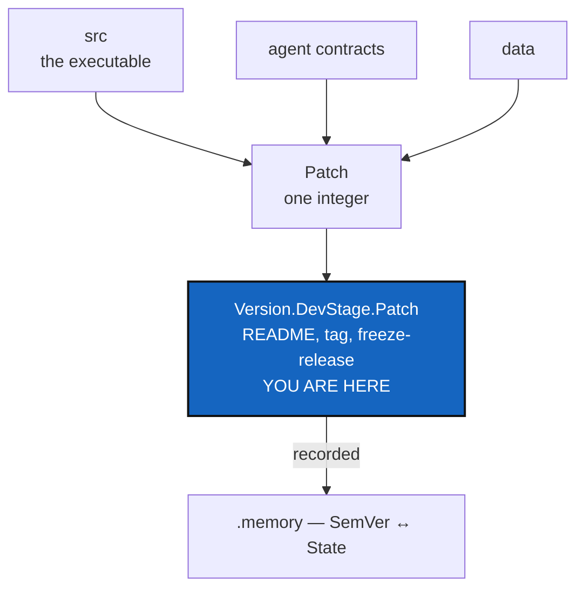

# Versioning — one number for the project, when the project is four things

*Created: 2026-09-20*

*Branch: main*

> **Owner ticket — `shortTickets/versioning.md`, 2026-09-20:**
> *"Versioning has multiple artefacts under cover. `src` --> the core and
> only actual versioning of the public execution of cgitsync. We need now
> that it disappears from README.md, and that README.md exhibits the
> SemVer which gonna be linked to tag and freeze-release. It will be
> linked to src and new version numbers. For instance the agent-contracts
> are versioned as mentioned in 1-4 and 1-5. It will be tamper-evident in
> case a LLM overstep and we have to protect the project from the
> agentProvider, who can only use the public version of
> ComplexGitSync-Apache2 as everyone. data will also have a version
> number, so SemVer is a fusion of all of that structured as
> Version.DevStage.Patch. A Patch is an integer that links all version of
> the project. It must be recorded in .memory so cgitsync SemVer can be
> trackable to a ComplexGitSync state."*

> **Reorganisation, 2026-09-20.** This ticket takes over
> [UserInstallPath](main_2-2_UserInstallPath_DevPlanTicket.md)'s **D1**,
> "The version scheme, which publishing forces". That decision offered
> three ways out and recommended one; this short ticket chooses the third
> — semantic versioning — and then goes considerably further than D1 had
> scope for. A decision that now spans `src`, the agent contracts, the
> data layer and the memory no longer belongs inside a packaging ticket.
> D1 there now points here.
>
> Ranked 1-3, ahead of ProjectSpecSplit, AgentContract and AgentReport,
> which each moved down one. The reason is dependency, not importance:
> the agent contracts carry version numbers that participate in the fusion
> (§2), so the scheme has to exist before they are given one. The version
> also appears in every commit message, the README, the docs and every
> ledger entry — so each week it stays unsettled is another week of
> artefacts written under the old scheme.

## Abstract — read this first

**The one-line version.** The project publishes one number today and is
about to have four things worth numbering. This decides what the public
number means, what it is made of, and how it points back at a State.

**What this document is.** The design for a composite project version —
`Version.DevStage.Patch` — that fuses the tool, the agent contracts and
the data layer, with the `Patch` integer as the key that joins them, and a
record in the memory tying the whole thing to one State.

**Why it exists.** `src`'s number is the version of the *executable*, and
it is currently doing a second job it was never meant for: standing as the
version of the *project*. Those come apart the moment a contract or a
dataset can change without the code changing.

**What you will find.** §1 what is versioned today and what is wrong with
it. §2 the composite, and the one thing about it that needs care. §3 the
`Patch` key and why it is the good idea here. §4 the memory record and
tamper-evidence. §5 the protection claim, honestly. §6 decisions. §7 work
packages. §8 acceptance.

**Who it is for.** The owner, for §6 — D1 and D2 in particular, which
change what the number *means* to everyone reading it.

**What you need to do with it.** §2.1 first. It is one paragraph and it is
where this design can go wrong.

---

## 1. What is versioned today

One number, `0002.86` in `pyproject.toml`, mirrored into **six** files by
`pixi run bump-version` and auto-incremented by CI on merge to `main`. It
appears in more places than that list suggests:

| Where | What it says today |
|---|---|
| `pyproject.toml` | the authoritative value |
| `pixi.toml`, `src/ComplexGitSync/__init__.py` | mirrors |
| `README.md` title — `# ComplexGitSync v0002.86` | **what the owner wants removed** |
| `docs/Setup/Shortcuts.tex`, `docs/preamble.tex` | `\cgsversion` |
| every commit message | `cgitsync0002.86` (CLAUDE.md's rule) |
| every ledger entry | `cgitsync = "0002.86"` |

**Two problems, one already found.** `CLAUDE.md` calls the scheme
`YYYY.XX`, but `0002` is not a year — it is a counter, and
UserInstallPath's D1 already recorded that publishing makes it worse:
PEP 440 normalises `0002.86` to `2.86`, so a package page would show a
version this repository never writes, and `2.86` sorts after `2.9`.

The second problem is the one this ticket exists for: **that number is the
version of the executable, and it is being asked to stand for the
project.** The moment a contract or a dataset can change without the code
changing, it cannot.

## 2. The composite

`Version.DevStage.Patch`, shown in the README and carried by `tag` and
`freeze-release`. `src` keeps its own number — the owner is explicit that
it stays "the core and only actual versioning of the public execution" —
and stops being what the README advertises.

### 2.1 The one thing that needs care: this is not SemVer

**`Version.DevStage.Patch` and `MAJOR.MINOR.PATCH` are not the same
contract, and calling the first one "SemVer" will mislead every tool and
most readers.** SemVer assigns meaning to each position: `MAJOR` changes
when compatibility breaks, `MINOR` when features are added compatibly,
`PATCH` for fixes. Here the middle position is a development stage and the
last is a cross-artefact join key — neither is what a reader expects.

This is not a detail, because the README **already makes promises against
major versions**: *"Command names and their documented flags — stable
within a major version"* and *"Exit codes — stable within a major
version."* If `Version` does not mean "breaks compatibility when it
changes", those two promises quietly stop meaning anything. And
UserInstallPath wants this on PyPI, where PEP 440 will impose its own
ordering regardless of intent.

Three honest ways forward — **D1**:

| Option | What happens |
|---|---|
| **Adopt real SemVer semantics** for the first position and keep the shape | The promises hold, the tooling agrees, and `DevStage` becomes the minor field with a project-specific meaning. Costs nothing but discipline |
| **Keep the owner's meanings and stop calling it SemVer** | Honest, and needs a name of its own plus a line in the README saying what each position means. The stability promises must then be reworded against something else |
| Call it SemVer and use it differently | The option this section exists to argue against |

### 2.2 What each position is made of

| Position | Proposed meaning | Changes when |
|---|---|---|
| `Version` | The project generation | Compatibility breaks (under D1's first option) |
| `DevStage` | **Undefined in the short ticket — D2.** A development stage needs its allowed values stated: a counter, or named phases | A stage completes |
| `Patch` | The join key of §3 | Any artefact in the set changes |

## 3. `Patch`, the join key — the good idea here

> *"A Patch is an integer that links all version of the project."*

This is the load-bearing invention and it is worth stating in full. `Patch`
is **not** a bug-fix counter. It is a monotonically increasing integer that
names one **coherent set** — this `src` version, with this agent-contract
version, with this data version — and the set is the thing a user actually
has.

That solves a real problem the project is about to acquire. Three artefacts
version independently, so "which contract was in force when the tool was at
`2.86`?" has no answer unless something records the combination. `Patch`
is that something: one integer, and a table in the memory saying what it
resolves to.

It also behaves well where the alternatives do not. It is monotonic, so it
sorts; it is a single integer, so it fits in a tag, a filename and a commit
message; and it is opaque, so adding a fourth versioned artefact later
changes what a `Patch` resolves to without changing its shape.

## 4. The memory record

> *"It must be recorded in .memory so cgitsync SemVer can be trackable to
> a ComplexGitSync state."*

So a release is not only a tag — it is a row saying: this `Patch` is this
`Version.DevStage`, made of these artefact versions, and it corresponds to
this State.

**Reuse the mechanism [TreeEnvironment](main_1-2_TreeEnvironment_DevPlanTicket.md)
is already building.** That ticket puts a content-addressed record beside
each State and adds one additive field to the ledger entry pointing at it.
A version record is the same shape of thing — provenance about a State,
not part of its identity — and building a second, parallel mechanism for
it would be the mistake. This is the main reason Versioning is ranked
directly behind TreeEnvironment.

**Never hashed into a State's name.** `AdditionalSpecs.md` already records
what happens when a version leaks into identity: canonicalisation version
2 hashed the running package's version and gave one tree two names on two
machines. A version belongs to the record, not the name.

**Tamper-evidence comes free** from that mechanism: content-addressed
records cited from a hash-chained ledger cannot be edited after the fact
without every citation disagreeing.

## 5. The protection claim, honestly

> *"It will be tamper-evident in case a LLM overstep and we have to
> protect the project from the agentProvider, who can only use the public
> version of ComplexGitSync-Apache2 as everyone."*

**What this genuinely gives you.** A dated, tamper-evident record of what
was released publicly under Apache-2, and at which `Patch`. That makes the
public boundary a matter of record rather than of recollection — so "this
artefact was never public" becomes *provable*, which is exactly the claim
worth being able to make. Paired with
[AgentContract](main_1-5_AgentContract_DevPlanTicket.md)'s contract
record, a `.self-history` entry can name both the terms in force and the
public version in force.

**What it does not give you.** It does not prevent misuse, detect it, or
constrain anything outside this repository. It is evidence, not a control
— the same limit AgentContract §2.2 states about itself, and for the same
reason. A record that overstates its reach invites someone to rely on it
for something it cannot do.

The distinction matters here more than usual: the protective value is
entirely in being able to *show* what was public and when. That is worth
building. It is not a lock.

## 6. Decisions

| D | Question | Recommendation | Whose call |
|---|---|---|---|
| **D1** | Real SemVer semantics, or the owner's meanings under another name? (§2.1) | **Real SemVer semantics.** The README's two stability promises are already written against major versions, PyPI will apply PEP 440 whatever we intend, and "our own scheme that looks like SemVer" is the version of this decision that costs the most later | **Owner** |
| **D2** | What is `DevStage`? | Undefined today. It needs its allowed values and the event that advances it, or `bump-version` cannot compute it | **Owner** |
| **D3** | Which number goes in a commit message? | CLAUDE.md requires `cgitsync<version>`. **Recommend `Patch`** — commits are about the project as a whole, `Patch` advances whenever any artefact does, and it is one short integer. The alternative, `src`'s version, leaves `git log` showing a number the README no longer displays | **Owner** |
| **D4** | Which number does a ledger entry record? | **Both, and they are different questions.** `toolchain.cgitsync` records the executable that wrote the entry and must stay `src`'s version. The `Patch` belongs in the version record of §4 | Implementer |
| **D5** | Does `bump-version` still write all six files? | It writes five (README's title loses the version) plus wherever SemVer now lives. **The all-or-nothing rule must hold** — `AdditionalSpecs.md` is explicit that a partial bump leaves the package claiming a release its docs never heard of | Implementer |
| **D6** | What happens to the existing `0002.86` sequence? | A discontinuity either way. Recommend stating the mapping once, in the README, rather than pretending the sequence is continuous | Owner |

## 7. Work packages

**WP1–WP3 depend on nothing and can start now.** WP4–WP5 need the other
artefacts to have versions at all.

| WP | Does | Depends on |
|---|---|---|
| **WP1** | D1 and D2 settled and written into `AdditionalSpecs.md`'s *Versioning* section, including what each position means | D1, D2 |
| **WP2** | `src`'s version removed from the README title; the SemVer shown there instead. `bump-version` and `tests/unit/test_bump_version.py` updated — the test asserts on the README title pattern today | WP1, D5 |
| **WP3** | `tag` and `freeze-release` carry the SemVer | WP2 |
| **WP4** | The version record in the memory (§4), reusing TreeEnvironment's mechanism; `Patch` resolves to its artefact set | WP1, **TreeEnvironment WP3** |
| **WP5** | The agent contracts (AgentContract, AgentReport) and the data layer take version numbers in this scheme and join the `Patch` set | WP4, AgentContract, data-repo |
| **WP6** | The commit-message rule in `CLAUDE.md` updated for D3 | D3 |

## 8. Acceptance

- The README shows one version, and it is not `src`'s.
- `pixi run bump-version` writes every file that carries a version, or
  none of them — the existing all-or-nothing property survives the change.
- A `Patch` integer resolves, from the memory, to exactly one set of
  artefact versions and one State.
- A published tag and its `freeze-release` snapshot agree on the version.
- The version appears in no State's name. Two machines holding one tree at
  different `Patch` values still agree on the State hash.
- Editing a version record after the fact is detectable.
- `pixi run lint` and `pixi run test` pass; `cgitsync status` shows
  `errors=0`.
