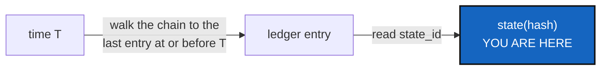

# AsOfRetrieval — what was this tree at time *T*?

*Created: 2026-09-20*

*Branch: main*

> **Ticket review — 2026-09-23.** Renumbered again, `main_1-5` → `main_1-4`:
> [AgentContract](../archive/20260923_AgentContract_DevPlanTicket.md)
> finished and archived, compacting the pile by one. Everything below is
> otherwise unchanged.

> **Ticket review — 2026-09-22, part 3.** Renumbered again, `main_1-5` →
> `main_1-6`: [Autofix](../archive/20260923_Autofix_DevPlanTicket.md) is queued first
> in the pile, on the owner's explicit instruction. Everything below is
> otherwise unchanged.

> **Ticket review — 2026-09-22, part 2.** Renumbered again, `main_1-6` →
> `main_1-5`: [ProjectSpecSplit](../archive/20260922_ProjectSpecSplit_DevPlanTicket.md)
> finished and archived in the same pass, compacting the pile to 1..5.
> Still last in it, for the same reason as before.

> **Ticket review — 2026-09-22.** Filename unchanged at the time of this
> note — `main`'s priority-1 pile ran 1..6 after that review — but three
> tickets ahead of it changed: [ProjectSpecSplit](../archive/20260922_ProjectSpecSplit_DevPlanTicket.md),
> [AgentContract](../archive/20260923_AgentContract_DevPlanTicket.md) and
> [AgentReport](../archive/20260924_AgentReport_DevPlanTicket.md) now lead as
> "finalize the agentic," and [DiscoverRoundTrip](main_1-2_DiscoverRoundTrip_DevPlanTicket.md)/
> [CitationRot](main_1-3_CitationRot_DevPlanTicket.md) were promoted ahead
> of this one. This ticket stays last in the pile: still ready, no owner
> decision needed, but nothing else is waiting on it the way the five
> ahead of it are waited on.

> **Split out of [UniversalClock](../archive/20260920_UniversalClock_DevPlanTicket.md)
> §4.4 on 2026-09-20**, when that ticket closed with WP1–WP4 landed. This
> is its WP6, unchanged, given a ticket of its own because it is the one
> piece of "what remains" that touches no external witness and needed no
> further owner decision — see that archived ticket's closing note for
> the two-way split (this ticket, and Omniscience §1.2, for the other
> half). Filed last in the `main` priority-1 pile per the owner's
> instruction: *"enqueue what remains at the end of the reorder
> priority1."*

## Abstract — read this first

**The one-line version.** Recording a moment is useless if nothing can be
asked in terms of it. `memory_timeline` already returns every entry in
order; what is missing is the query — "what was this tree at time *T*?"

**What this document is.** One command, built on two things that already
exist: the chain's own order, and the monotonicity check UniversalClock
WP3 landed on 2026-09-20.

**Why it exists.** The owner's short ticket that started UniversalClock
said a snapshot in the tree "must be trackable by time." Recording a
timestamp on write answers half of that; being able to look a tree up by
one answers the other half, and nothing does that yet.

**What you will find.** §1 the query, unchanged from UniversalClock §4.4.
§2 why it had to wait for monotonicity. §3 the one open question. §4
acceptance.

**Who it is for.** Whoever picks it up. No owner decision is needed.

**What you need to do with it.** Build it — the design is already
settled; only the command surface (§3) is open, and it is a small,
implementer-level choice.

---

## 1. The query

States are content-addressed, the ledger orders them, and
`memory/pending.py`'s `memory_timeline` already returns every entry in
ledger order — it is what `memory explore --timeline` prints. What is
missing is the question itself:

> **What was this tree at time *T*?** — walk the chain to the last entry
> whose `recorded_at` is at or before *T*, and read its `state_id`.

That is a few lines on top of `memory_timeline`. Read-only, local-only, no
network, no omniscience.

## 2. Why this waited for WP3

An as-of query over non-monotonic timestamps returns a confident wrong
answer, silently: if a clock moved backwards somewhere in the chain, "the
last entry at or before *T*" can name an entry that is not actually the
one the workspace held at *T*, and nothing about the answer looks
uncertain. `verify`'s `TIME_REGRESSION` finding (landed with UniversalClock
WP3, 2026-09-20) is what makes this trustworthy: a workspace whose chain
verifies clean is a workspace where "at or before" means what it says.

**Recommendation, not a requirement:** a query against a chain that
`verify` would currently call `time-inconsistent` should say so rather
than answer silently. Left to §3/acceptance rather than promoted to a
decision, since it is a small implementation choice with an obvious
answer.

## 3. The one open question

Whether this is `memory show --as-of`, a flag on `explore`, or a new
verb — the implementer's call, per the CLI mirror rule: a client method
carrying the semantics, a thin CLI pair, the README command table and
`user_guide.tex` updated in the same change.

## 4. Acceptance

- Given a workspace with a real chain and a time *T* between two recorded
  moments, the answer is the `state_id` recorded at or before *T* — not
  the nearest, not the latest, the last one at or before.
- A time before the chain's first entry answers "nothing recorded yet,"
  not the genesis entry by accident.
- A query against a chain `verify` would call `time-inconsistent` says so,
  rather than answering as if the chain were clean.
- Documented in the README command table, `user_guide.tex`, and
  `api_python.tex` if it gains a client method (which the CLI mirror rule
  requires it to).
- `pixi run lint` and `pixi run test` pass; `cgitsync status` shows
  `errors=0`.
