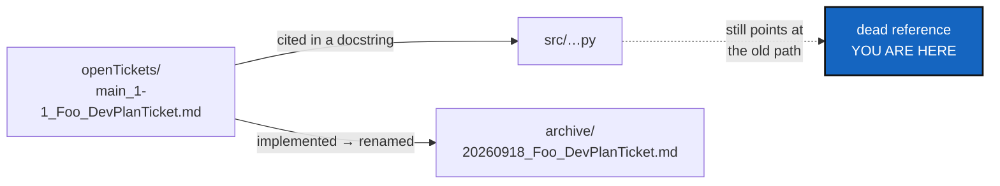

# CitationRot — source files citing tickets that have since been archived

*Created: 2026-09-19*

*Branch: main*

> **Ticket review — 2026-09-22, part 2.** Renumbered again, `main_1-5` →
> `main_1-4`: [ProjectSpecSplit](../archive/20260922_ProjectSpecSplit_DevPlanTicket.md)
> finished and archived in the same pass, compacting the pile by one, and
> its own WP3 path sweep corrected the `.agent/` prefix everywhere —
> including on the `universal_clock.py` citation below. It did **not**
> touch the citation's target, only its prefix: `universal_clock.py` still
> points at the dead `openTickets/main_1-1_UniversalClock_DevPlanTicket.md`
> path this ticket's §1 already names, which is this ticket's job to fix,
> not ProjectSpecSplit's — a stale prefix and a stale target are the two
> different defects these two tickets each own.

> **Ticket review — 2026-09-22.** Promoted from `main_2-4` (stand-by) to
> `main_1-5` (pick up now), on the owner's request to reorganise the
> backlog into: finalize the agentic, then what's important before
> data-repo, then data-repo, then Omniscience. Worth doing before
> data-repo specifically because that workstream is about to add seven
> more tickets that will themselves get archived and renamed over time —
> exactly the churn this rot check exists to catch — and because this
> same review already found a fresh instance of it:
> `universal_clock.py` still cites
> `.agent/.local/.localSpec/DevTickets/openTickets/main_1-1_UniversalClock_DevPlanTicket.md`,
> which is archived as `archive/20260920_UniversalClock_DevPlanTicket.md`.
> Add it to §1's table.

> **Found while auditing the planning surface on 2026-09-19.** Not
> reported by anyone: it was found by checking every ticket path cited in
> `src/` against the filesystem, which nothing does today.

## Abstract — read this first

**The one-line version.** Five docstrings in `src/` point at planning
tickets by their open path. Those tickets were archived, which renames
them — so the paths are dead, and nothing noticed.

**What this document is.** A small, verifiable maintenance ticket: fix
the five, and add the check that would have caught them.

**Why it exists.** This project's modules carry unusually heavy
docstrings that cite the ticket a design came from, and that habit is
worth keeping — it is how a reader finds the reasoning behind a module.
But TICKETLIFECYCLE guarantees the citation breaks: finishing a ticket
*renames* it, from `openTickets/<branch>_<p>-<r>_<Name>_DevPlanTicket.md`
to `archive/<YYYYMMDD>_<Name>_DevPlanTicket.md`. Every citation to an
open ticket is a reference with a known expiry date, and no step in the
lifecycle updates them.

**What you will find.** §1 the five. §2 why this recurs by design. §3 the
check. §4 the two ways to stop it. §5 acceptance.

**Who it is for.** Whoever picks it up; §4 has one owner decision, and a
recommendation that needs no decision at all.

**What you need to do with it.** §1 is a five-line fix. §3 is the part
worth having.



---

## 1. The five

Two tickets, archived, still cited by their open paths:

| Cited path | Now at |
|---|---|
| `openTickets/memory-dev_1-2_WorkingTransitionState_DevPlanTicket.md` | `archive/20260917_WorkingTransitionState_DevPlanTicket.md` |
| `openTickets/main_1-1_CheckoutForkGuard_DevPlanTicket.md` | `archive/20260918_CheckoutForkGuard_DevPlanTicket.md` |

Cited from `memory/pending.py`, `memory/repository.py`, `orchestre.py`,
`git_runner.py` and `operations.py`.

Three open tickets cite the same two stale paths in prose —
`main_2-1_MemoryArchitecture` (twice) and `main_2-3_StateLocking` — and
should be corrected in the same pass.

**A third archived ticket, found 2026-09-20**, cited the same way:
`openTickets/memory-dev_1-2_MemoryOnboarding_DevPlanTicket.md`, now
`archive/20260917_MemoryOnboarding_DevPlanTicket.md`, cited from
`main_2-1_MemoryArchitecture`. Note that both it and
`WorkingTransitionState` were filed at `memory-dev_1-2` — the rank was
reused after the first was archived, which is §1's retargeting hazard
happening a second time in the same pile.

**`main_1-1_CheckoutForkGuard` is the sharper one.** That path is not
merely dead: as of 2026-09-19 it names a *different live ticket*,
[TreeEnvironment](../archive/20260920_TreeEnvironment_DevPlanTicket.md), because
rank `1-1` on `main` was reused the moment the pile changed. A reader
following that citation lands on a real, current document about something
else entirely. A dead link is an inconvenience; a link that silently
retargets is a wrong answer.

**A fourth instance, found during the 2026-09-22 ticket review that
promoted this ticket:** `universal_clock.py` cites
`openTickets/main_1-1_UniversalClock_DevPlanTicket.md`, archived as
`archive/20260920_UniversalClock_DevPlanTicket.md`. That same rank,
`main_1-1`, was reused again in this very review — it now names
[ProjectSpecSplit](../archive/20260922_ProjectSpecSplit_DevPlanTicket.md), a
different ticket again — the retargeting hazard recurring for a third
time on the same rank.

## 2. Why it recurs by design

The lifecycle is working as specified. `TICKETLIFECYCLE.md` §5 requires
the rename, and it is what makes a directory listing answer "is this
still open?". The rank prefix is deliberately rewritten whenever the
queue is re-ranked, so even a ticket that stays open changes its path.

So a citation to an open ticket is guaranteed to break. There are only two
honest responses: stop citing paths that move, or check them. §4 takes
both.

## 3. The check

`scripts/check_module_ceilings.py` already walks every module in
`src/ComplexGitSync/` and already cross-checks a docstring claim — its
declared `Imports:` list — against reality. Adding one more check to the
same script and the same `pixi run check-ceilings` task is the cheap
option: extract every `.localSpec/DevTickets/...md` path in `src/` and
report the ones that do not exist.

Roughly the check, run today:

```bash
grep -rhoE "\.localSpec/DevTickets/[A-Za-z0-9_./-]+\.md" src/ | sort -u |
  while read p; do [ -f "$p" ] || echo "STALE: $p"; done
```

Two caveats for whoever implements it. It must run from the tree root
where `.localSpec` is mounted, and **it must not fail when `.localSpec`
is absent** — it is a private mount, and a user who installed from
`install.cgs` has no `DevTickets/` at all. Absent means skip, not fail.

## 4. The two ways to stop it

| D | Question | Recommendation | Whose call |
|---|---|---|---|
| **D1** | Cite tickets by path, or by name only? | **By name only, for a ticket still open.** `AdditionalSpecs.md` already states the principle for a different reason — "`src/` cites this section, not a ticket: an archived ticket is a historical record and is never edited, and a live schema must not sit inside one." A docstring saying "see the WorkingTransitionState ticket" survives every rename the lifecycle performs. An *archived* ticket's path is stable and may be cited in full | Implementer |
| **D2** | Does the check gate `pixi run lint`, or only `check-ceilings`? | `check-ceilings`, which is where the other docstring check lives and which is not on the commit path. A dead documentation link should not block a commit that fixes a bug | **Owner** |

## 5. Acceptance

- The five citations name their archived tickets, or name the ticket
  without a path.
- No path under `src/` matching `.localSpec/DevTickets/**.md` fails to
  resolve.
- `pixi run check-ceilings` reports stale citations, and passes cleanly in
  a checkout with no `.localSpec` mounted.
- `pixi run lint` and `pixi run test` pass; `cgitsync status` shows
  `errors=0`.
