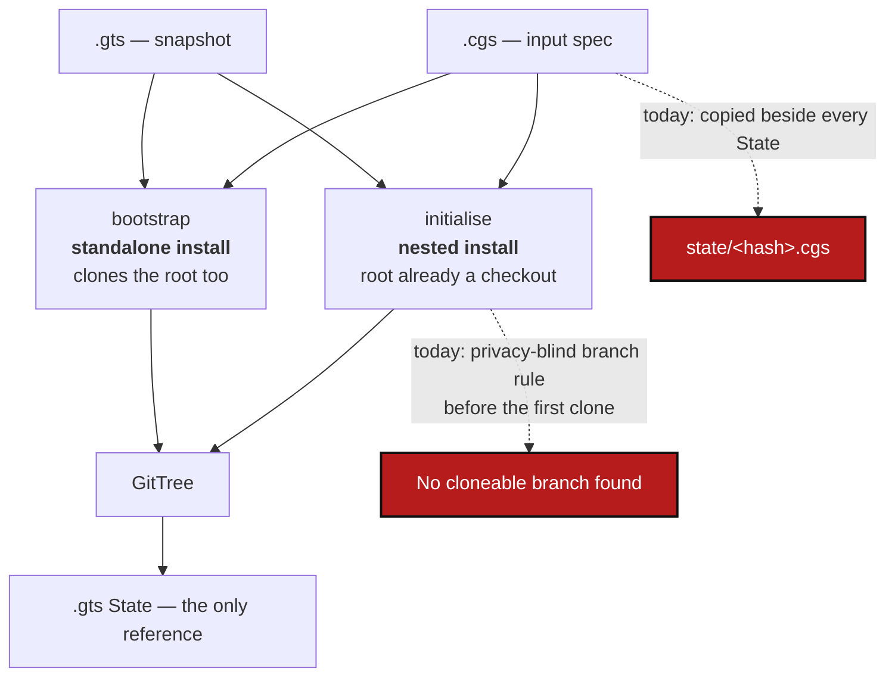

# InstallFrontier — nested and standalone are two installs, and neither works properly today

*Created: 2026-09-29 (as InitialiseNonGitRoot)*

*Branch: main*

> **Merged and renumbered in the priority-1 reorganisation of 2026-09-30**,
> from three tickets that were all the same subject seen from different
> sides: `InitialiseNonGitRoot` (owner, `shortTickets/install-bug-cgs.md`,
> 2026-09-29 — `initialise install.cgs` half-builds a tree),
> `ReinforceGitTreeState` (owner, 2026-09-30 — too many `.cgs` in the State
> area, and `initialise`/`bootstrap` overlap), and
> `PrivateLocalBranchAtClone` (owner, `shortTickets/bug-cgs.md` — `No
> cloneable branch found for ComplexGitSync`). The third turned out to be
> the same frontier from the inside: its own §2 concludes that *"standalone
> never shows this"* and that nested is the one shape where the branch rule
> has two answers.
>
> This ticket serves the owner's third structural goal: *a clear behavioural
> frontier between nested and standalone cgitsync config.*
>
> **Diagnosis first.** §2 is diagnosis, and it **refutes** the owner's first
> reading — `install.cgs` does not lack `relative_path = "."`. §3 onwards is
> the plan.

## Abstract — read this first

**The one-line version.** `initialise` is the nested install and `bootstrap`
the standalone one, and that line is drawn nowhere: `initialise` silently
half-builds a tree when the root is not a checkout, the branch rule has one
answer for nested and another for standalone so the first clone of a
private/writable repository fails outright, neither command can absorb a
`.gts`, and every State-writing command stores a `.cgs` beside the snapshot
as if a spec were a tree.

**What this document is.** The frontier as a rule (§1), three defects that
all come from its absence (§2), the target (§3), seven work packages (§4),
five decisions (§5), acceptance (§6).

**Why it exists.** Each defect was reported separately by the owner and each
was read as a local bug. They are one: nothing in the code or the docs says
which install mode a command belongs to, so every part of the install path
has been free to assume a different one.

**What you will find.** §1 the rule. §2.1 the half-built tree, reproduced.
§2.2 the branch rule's two implementations. §2.3 the stored `.cgs`. §3 the
target. §4 work packages. §5 decisions. §6 acceptance.

**Who it is for.** Whoever picks it up. §1 is the whole ticket in one table;
the rest is what it costs to make it true.

**What you need to do with it.** Read §1, then D1–D5 in §5.



---

## 1. The frontier — `initialise` is the nested install, `bootstrap` the standalone install

**The rule.** `initialise` is the nested install and nothing else;
`bootstrap` is the standalone install and nothing else. Which one applies is
a fact about *where the running ComplexGitSync sits relative to the
workspace*, not a choice between two ways of doing the same thing. Every
other difference between the two commands follows from that one fact.

| | `initialise` — **nested install** | `bootstrap` — **standalone install** |
|---|---|---|
| Where the running ComplexGitSync is | Inside the workspace (it is, or is nested in, the tree's root checkout) | Outside the workspace: installed once, used for many workspaces |
| `settings.resolve_use_case(CGSHOME)` | `NESTED` | `STANDALONE` |
| Install name | None — the workspace is already there | Required (`<name>`); forms the last segment of CGSHOME |
| CGSPATH | The default `../..` from the installation; `--output-path` overrides it | `--cgs-path`, else a fresh `$HOME/.cgs/CGS<timestamp>/` |
| CGSHOME | `$CGSPATH/<project name>` | `$CGSPATH/<name>` |
| The root repository | Already checked out at CGSHOME; never cloned, never deleted | Cloned, with everything else |
| Input | A `.cgs` or a `.gts` | A `.cgs` or a `.gts` |
| Refuses, before touching disk, when | CGSHOME is not a checkout, or the running installation is not inside it — and names `bootstrap` | The target already holds a tree — and names `initialise` (see the open item in §5) |

**What follows from it.**

- The two commands never fall back into each other. `initialise` does not
  clone a missing root; `bootstrap` does not adopt an existing one. Each
  refuses and names the other.
- `settings.UseCase` stops being "observed, never obeyed" for these two
  commands. Its own docstring says a flag that changes behaviour "needs its
  own ticket and its own tests"; this is that ticket (D5).
- A standalone install can administer a workspace that contains a nested
  ComplexGitSync — the nested copy is just one repository of the tree to the
  standalone one, and neither writes into the other's installation.
- The rule is written into the specs, not only into this ticket (WP7): a
  ticket stops being true once it is done; the frontier must stay true.


## 2. The three defects

### 2.1 A half-built tree, and why it is not `relative_path`

The owner's log (`~/ComplexGitSync/.cgitsync/logs/initialise-20260929T114120Z.log`)
shows `attach_root_git_info_failed: not a git repository`, then `docs`
reaching `READY`, then `gitignore_pre_pull_skipped ... detached HEAD` for the
root, then `command_end status=error`. `~/ComplexGitSync` holds `docs/` (a
fresh clone), `.agent/`, `.cgitsync/` and a `.gitignore` — and **no `.git`**.

Two checks against this checkout, 2026-09-29:

1. `install.cgs` already resolves its root correctly, with no
   `relative_path`: `root  type=root  rel=.  owner='flipoyo'
   target='main'`. The project name equals the root repository's name, which
   is one of the two ways `_is_root_repo_spec` recognises a root
   ([archived DiscoverRoundTrip](../archive/20260928_DiscoverRoundTrip_DevPlanTicket.md)).
2. Running `initialise` against an empty, non-git CGSHOME with the entry
   written both ways gives the **same** failure, exit code 1, the same
   `attach_root_git_info_failed` event:

   ```bash
   T=$(mktemp -d); mkdir -p $T/ComplexGitSync
   printf 'project = { name = "ComplexGitSync", default_branch = "main" }\nrepos = [ { repository = "github:flipoyo/ComplexGitSync", fallback_branch = "main" } ]\n' > $T/x.cgs
   pixi run cgitsync initialise $T/x.cgs --output-path $T     # exit=1; same with relative_path = "."
   ```

Adding `relative_path = "."` to `install.cgs` therefore changes nothing for
this failure, which is why the file was left as it is.

**Cause.**

- `initialise` clones **dependencies only**. `orchestre.py`'s comment in the
  initialise body says so: *"Root is already checked out at CGSHOME;
  initialise clones only the dependencies declared by the .cgs."* Cloning the
  root is `bootstrap`'s job.
- `_attach_existing_root` is where that assumption is checked, and it does not
  enforce it: on `GitSyncError` it logs `attach_root_git_info_failed`, sets
  `commit_sha = ""` and marks the root `READY` regardless.
- The run then clones every other repository into the folder, so the user's
  disk changes before anything is refused.
- The refusal, when it comes (`Initialise did not produce a READY tree.`), is
  generic, and `cli/_shared.py:227` appends `Try clean-init method` for every
  failed `initialise`. `clean-init` purges generated state and runs
  `initialise` again; it cannot clone a root, so here it repeats the failure.

### 2.2 The branch rule has two implementations, and the nested one never runs first

`cgitsync initialise ../molonari-light.cgs` fails with `No cloneable branch
found for ComplexGitSync: expected one of ['lMOLO', 'lMOLO']`. The duplicate
is the tell: two clone candidates that were supposed to be independent — a
target branch and a fallback — collapsed to one string, because both were
read from one hand-typed `.cgs` field instead of computed.

`git_branch.py` calls itself "the only implementation" of the branch
fallback chain and the privacy rule, and `CLAUDE.md` repeats it. For an
ordinary repository that is true. For a **private/local** one it is not:

| When | Function | Privacy-aware? |
|---|---|---|
| GT-LOAD (`initialise`, `registry.py`) and GT-DISCOVER (`discovery.py`) — the *first* time a target branch is decided | `resolve_declared_ref` | **No** — reads whatever the `.cgs` literally says |
| Every branch move after the tree exists (`git_tree_branch.py` via `operations.py`) | `resolve_propagated_ref` | Yes — returns `private_local_branch(project_name, ref_name)` |

`resolve_declared_ref` has no `private`/`writable` parameter, so it cannot
apply the rule even in principle. The only way its answer matches is for the
`.cgs` author to hand-compute `private_local_branch(...)` and type the result
into `default_branch`. That goes stale silently (`molonari.cgs` was copied
from `molonari-light.cgs` without updating it), and it cannot work the first
time anyway: a private/local branch is created lazily by a private
commit/push, so the first `initialise` of any new project using this pattern
targets a branch that by construction does not exist yet.

**This is the frontier, from the inside.** When ComplexGitSync is the tree's
own root — standalone — the entry is the project itself, not `private`, the
ordinary chain is the right answer, and there is no second implementation to
disagree with. Nested is the one shape where the two can differ, and today
only the privacy-blind one runs before the first clone.

### 2.3 A `.cgs` is stored beside every State

`write_gts_snapshot` copies the source `.cgs` to `state/<hash>.cgs` and to
`.cgitsync/.cgs/<project>-<branch>.cgs`; `_FOLD_SUBDIRS` then moves both into
the memory on `memory push`, so `.cgitsync/.memory/.state` fills with `.cgs`
files. A State is named by the hash of what the workspace *is*. A `.cgs` is
an input that may describe only part of the tree, and it is not attested —
storing it beside the snapshot gives the memory two sources of truth, one of
which the `.gts` is supposed to prevail over (`registry.py`). Possible
readers to check before removing the writer: `tree_env.source_document`, and
anything reading `document.source_cgs_path`.

## 3. Target

1. **`initialise` = nested, `bootstrap` = standalone**, exactly as §1 states,
   enforced rather than only documented.
2. **One branch rule, applied before the first clone.** `resolve_declared_ref`
   learns about privacy, or the callers that decide a first target branch
   route through the privacy-aware computation. `git_branch.py` becomes what
   it already claims to be.
3. **Both commands take a `.cgs` or a `.gts`.** From a `.cgs`: clone each
   repository at the branch the fallback chain names. From a `.gts`: clone
   each and check out the commit the snapshot records — the tree as it was,
   not as the spec would rebuild it today.
4. **A State is a `.gts`.** No `.cgs` under `state/`, none folded into the
   memory.
5. **A standalone install administers a nested one.** Neither installation
   writes into the other.

## 4. Work packages

| WP | Touches | Deliverable |
|---|---|---|
| **WP1** | `orchestre.py::_attach_existing_root` and the initialise body | **Refuse before touching disk.** Ask "is CGSHOME a git repository?" *before* `_pending_clone_entries` runs, and refuse by name when it is not: *`<path>` is not a git repository. `initialise` builds the dependencies of a project whose root is already checked out here. To clone the whole tree, root included, run `cgitsync bootstrap <spec> <name>`.* (Wording per D1.) A detached `HEAD` stays allowed. Per D5, also refuse when `settings.resolve_use_case(CGSHOME)` is `STANDALONE`, and make `bootstrap` refuse a target that already holds a tree, naming `initialise`. **This WP is a few lines and may land ahead of everything else in the pile** — it is the owner's reported failure. |
| **WP2** | `cli/_shared.py`, README install section, `docs/Text/user_guide.tex` | The `Try clean-init method` hint prints only when clean-init could plausibly help; for WP1's refusal it is replaced by the `bootstrap` pointer. Docs state the root-must-be-a-checkout rule and that a user install is `bootstrap install.cgs <name>`. |
| **WP3** | `registry.py::build_registry_from_cgs_document`, `discovery.py`'s nested loader, `git_branch.py` | **One branch rule.** Route a `private, writable` entry's *initial* target branch through the same computation `git_tree_branch.py` uses after load. No second copy: the privacy-aware answer moves into `git_branch.py` if it is not already the only one there. |
| **WP4** | `orchestre.py::_select_clone_ref` | **A real third rung.** When the computed `private_local_branch(...)` name is absent on the remote — the normal case for a first `initialise`, since that branch is created lazily — fall back to the shared repository's own active branch rather than reporting no cloneable branch. |
| **WP5** | `cgs_format.py`, `examples/molonari-light.cgs`, `examples/molonari.cgs`, `tutorials/04_private_repos.md` | Once WP3 makes a hand-typed `default_branch` unnecessary on a private/writable entry, settle what happens to the field (D3) and fix the examples. Defence in depth while it is still authored by hand: a `private, writable` entry whose declared `default_branch` disagrees with `private_local_branch(project_name, ...)` is a near-certain authoring error and is reported as one. |
| **WP6** | `orchestre.write_gts_snapshot`, `_FOLD_SUBDIRS`, `states.state_path` docstring, `tree_env.source_document` | **A State is a `.gts`.** Remove both `shutil.copy2` calls and drop `.cgs` from `_FOLD_SUBDIRS` (per D2 for the stable copy). Find every reader first and give each the `.gts` instead — `registry.to_cgs()`, as `memory reboot` already does; that export is deliberate and stays. Leftovers already pushed into memories stay where they are; `verify` must not report one as corruption. |
| **WP7** | `orchestre.initialise`/`initialise_cgs`/`bootstrap`/`clone_cgs`, `cli/minimalist.py`, `AdditionalSpecs.md`, `digest.md`, `settings.py`, README §2, `docs/`, `examples/` | **Both inputs, one clone path, and the rule written down.** Each command accepts `.cgs` or `.gts`; `.gts` mode reuses the snapshot loader and must respect `UnsupportedSnapshotFormatError` and tree-relative paths. One shared clone path, so the two commands differ only in how CGSHOME is derived and whether the root is cloned. §1's rule and table go into `AdditionalSpecs.md`, one line into `digest.md`, `settings.UseCase`'s docstring drops "never obeyed". Add the standalone-administers-nested test. Rebuild the PDFs. |

**Order.** WP1 → WP2 (the reported failure, small, independent) → WP3 → WP4
→ WP5 (the branch rule, one subject) → WP6 (independent of all of it) → WP7.

**Sequencing against the pile.** WP1–WP2 may go first, before anything else.
WP7 rewrites `initialise`/`bootstrap` substantially, and
[ModulePackagisation](main_1-3_ModulePackagisation_DevPlanTicket.md) moves
those same methods into `orchestre/installer.py` — **do WP7 after that
split**, where it edits a file of a few hundred lines instead of one of 6955.

Tests: `initialise` on a non-git CGSHOME raises the named refusal and **no
dependency directory is created** (the half-built tree is the harm); a
detached-`HEAD` root still initialises; a registry built from a `.cgs`
mounting a `private, writable` dependency with no pre-existing project
branch clones, once nested and once standalone; a tree rebuilt from a `.gts`
has the same State hash as the snapshot.

## 5. Decisions

| D | Question | Recommendation | Whose call |
|---|---|---|---|
| **D1** | Refuse, or clone the root when CGSHOME is empty or not a repository? | **Refuse and point at `bootstrap`.** Cloning a root into a folder that already holds `docs/`, `.agent/` and `.cgitsync/` is what `clone_guard.py` exists to be careful about, and auto-cloning would blur the two commands this ticket separates. | **Owner** |
| **D2** | Remove `.cgitsync/.cgs/` as well, and delete the `state/*.cgs` already pushed? | **Remove the stable copy too; leave pushed files in place, ignored by `verify`.** Nothing rewrites history in a pushed memory. | **Owner** |
| **D3** | After WP3, is a hand-typed `default_branch` on a `private, writable` entry ignored, rejected, or kept as documentation? | **Rejected with a named error.** A field that is read by nothing but looks authoritative is how `molonari.cgs` went stale; and the value is now computable, so a disagreeing one is always an error. | **Owner** |
| **D4** | In `.gts` mode, what happens to a commit the remote no longer holds? | **Refuse by name, listing the repositories, before cloning anything.** Falling back to the branch tip would build a tree with a different State name than the one asked for. | **Owner** |
| **D5** | Does `settings.UseCase` become *obeyed* by `initialise`/`bootstrap`? | **Yes** — it is what makes §1 a rule rather than advice. Risk for WP1: the suite runs `initialise` from the installed package against temporary directories, which is `STANDALONE`; those tests need a fixture that places a ComplexGitSync inside the workspace, or an injected use case — not an escape flag users can pass. | **Owner** |

Open item to check while doing WP1, not asserted here: what `bootstrap` does
when its target folder already exists and is not empty — the owner's
`~/ComplexGitSync` is in that state.

## 6. Acceptance

- §1's rule is stated in `AdditionalSpecs.md` and `digest.md`, and each
  command's `--help` opens with its role: *nested install* / *standalone
  install*.
- `initialise` from a standalone installation, or against a CGSHOME that is
  not a checkout, refuses before cloning anything and names `bootstrap`;
  `bootstrap` into an existing tree refuses and names `initialise`; neither
  touches disk when it refuses. A detached-`HEAD` root still initialises.
- A failed `initialise` no longer prints `Try clean-init method` when
  clean-init cannot help.
- `initialise` of a `.cgs` mounting a `private, writable` dependency succeeds
  with no pre-existing project branch, nested and standalone, and no
  hand-typed `default_branch`.
- One implementation of the branch rule, `git_branch.py`, used before the
  first clone as well as after.
- `initialise` and `bootstrap` each accept a `.cgs` or a `.gts`; from a
  `.gts` the tree's State hash equals the snapshot's.
- After `initialise`, `bootstrap`, `commit` and `memory push`, the memory's
  `state/` holds only `.gts` files; `env check`, `status` and `verify --json`
  behave as before, and `verify` is quiet about older leftovers.
- The standalone-administers-nested test passes.
- `pixi run lint`, `pixi run test`, `cgitsync status` with `errors=0`;
  `pixi run bump-build` per `src/` commit; README and `.tex` updated, PDFs
  rebuilt. Version: **`minor`** — the orchestrator's call.
