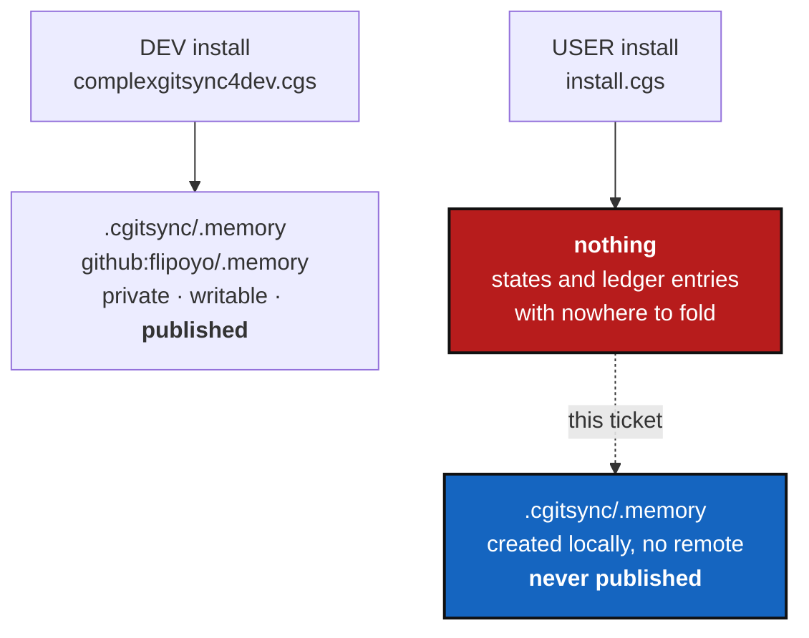

# DefaultUserMemory — a user who installs `cgitsync` gets no memory at all

*Created: 2026-09-30*

*Branch: main*

> Opened from `shortTickets/memory-install.md` (owner, 2026-09-30):
> *"For now memory is treated as a repo private local in `.cgs`. It is not
> compatible with the public user usage of cgitsync. `install.cgs` doesn't
> contain any `.memory` repo in its own `.cgs`, so a random user that uses
> cgitsync has no memory attached to its action. This is wrong. So `.memory`
> should be created automatically by ComplexGitSync under `.cgitsync` as a
> local repo if not specified in `.cgs`. The spec in `.cgs` overrides the
> defaulting behaviour. A branch name convention must be determined for a
> defaulting memory branch. As this is for users and not developers, I would
> suggest it remains local and be never published on a private repo — this
> is a DEV privilege."*
>
> Filed under the owner's third structural goal, beside
> [InstallFrontier](main_1-4_InstallFrontier_DevPlanTicket.md): *publishing a
> memory is a DEV privilege* is a behavioural difference between the two
> install configurations, which is what that goal is about. Kept separate
> because 1-4 already merges three tickets and seven work packages.
>
> **Branch `main`, not `memory-dev`:** `AdditionalSpecs.md` §Branches and
> ticket topics — *"the test is migration, not subject matter"*. This work
> only adds a default where there was nothing; no stored memory format
> changes, and every memory already declared in a `.cgs` keeps working
> untouched.

## Abstract — read this first

**The one-line version.** `install.cgs` mounts no private repository at all,
by design — so a user install has a `.cgitsync/` that accumulates states,
logs and ledger entries with **no `.memory` repository to fold them into**.
The record exists and can never become one. Create it automatically, locally,
and never publish it: publishing is a developer's privilege.

**What this document is.** What a user gets today (§1), what they should get
(§2), the branch convention (§3), five work packages (§4), four decisions
(§5), acceptance (§6).

**Why it exists.** Memory was built on this project's own tree, where
`examples/complexgitsync4dev.cgs` mounts `github:flipoyo/.memory` as a
private, writable repository. Everything downstream assumed that mount.
`install.cgs` deliberately mounts nothing private — *"a user install mounts
no private repository at all"*, says its own header — so every memory
capability silently has no home in the one configuration most people run.

**What you will find.** §1 the gap. §2 the defaulting rule. §3 the branch
name. §4 work packages. §5 decisions. §6 acceptance.

**Who it is for.** Whoever picks it up. The work is small; §5's decisions are
where the care is, because a default that is wrong is worse than none.

**What you need to do with it.** Read §2 and §3, then D1–D4 in §5.



---

## 1. What a user gets today

`install.cgs` mounts two repositories, both public: `ComplexGitSync` and
`DocComplexGitSync`. Its header says so on purpose — *"USER and DEV are
separated by which repositories a spec mounts"*, and the user install *"mounts
no private repository at all"*.

`examples/complexgitsync4dev.cgs` adds, among the agentic mounts:

```toml
{ repository = "github:flipoyo/.memory", relative_path = ".cgitsync/.memory",
  default_branch = "ComplexGitSync", fallback_branch = "main",
  private = true, writable = true, nested_config = "config-memory.cgs" }
```

So on a user install: commands still write `.cgitsync/state/`, `.cgitsync/lgr/`
and `.cgitsync/logs/`, because those are pending areas, not the mount. But
`memory push`, whose job is to fold that pending content one level down into
the mount and commit it, has nothing to fold into. `memory adopt` exists to
create the mount, and a user has no reason to know it exists or to own a
private `.memory` repository on a provider. The capability is real, the
record accumulates, and it can never become a repository.

## 2. The defaulting rule

1. **If the `.cgs` declares a memory entry, it wins, unchanged.** The spec
   overrides the default; nothing about a DEV tree changes.
2. **Otherwise ComplexGitSync creates one itself**, at `.cgitsync/.memory`,
   as a local git repository with **no remote**, the first time a command
   would write something a memory keeps (D1 decides exactly when).
3. **A defaulted memory is never pushed.** No remote is configured, and
   `memory push` folds and commits locally rather than refusing — the fold is
   the useful half and it works offline. Publishing it means declaring it in
   a `.cgs`, which is the developer path.
4. **The two are the same object.** A defaulted memory is an ordinary memory
   repository in every respect except that no remote is configured, so a user
   who later wants to publish declares the entry and pushes, with no
   migration and no rename (§3).

## 3. The branch convention

The owner asks for one. **Recommendation: the same name the declared case
already computes.** `memory/repository.py::memory_branch(project_name,
project_branch)` delegates to `git_branch.private_local_branch` — the
project's own name on `main`, `<project>_<branch>` otherwise — because the
shared `flipoyo/.memory` repository holds one branch per project.

A defaulted memory has no shared repository and so no collision to avoid,
which is an argument for something simpler like `main`. It is the wrong
argument: a local memory that is later published must land on the branch its
project already owns, and any other choice buys a rename at exactly the
moment the user is doing something unfamiliar. Reusing `memory_branch()` also
keeps `git_branch.py` the only implementation of the naming rule, which
`CLAUDE.md` requires and which
[InstallFrontier](main_1-4_InstallFrontier_DevPlanTicket.md) §2.2 shows is
already violated once. D2.

## 4. Work packages

| WP | Touches | Deliverable |
|---|---|---|
| **WP1** | `memory/repository.py` | **Say what a defaulted memory is**, in the module that already owns what it takes for a memory to be a repository: the entry it would have had, its branch per §3, and the fact that it carries no remote. Still no Git here — this module runs none. *Note for sequencing:* this module is one of the 13 that [ClassFirstPackage](main_1-2_ClassFirstPackage_DevPlanTicket.md) gives a class to. Do that first, or this lands as more free functions to convert afterwards. |
| **WP2** | `orchestre.py` (or `orchestre/memory_commands.py` after [ModulePackagisation](main_1-3_ModulePackagisation_DevPlanTicket.md)) | **Create it, once, at the moment D1 names.** `git init` at `.cgitsync/.memory`, the branch from WP1, an initial commit, and a ledger entry recording that the workspace defaulted a memory — so the record says where it came from. Idempotent: an existing mount, declared or defaulted, is left exactly as it is. |
| **WP3** | `orchestre.py::memory_push`, `memory_status` | **Fold without a remote.** `memory push` commits into a defaulted memory and stops there instead of failing on a missing remote. `memory status` says plainly that this memory is local and unpublished, and how to publish it. Never push a defaulted memory, even if a remote appears — D3. |
| **WP4** | `install.cgs`, README, `docs/Text/user_guide.tex`, `tutorials/` | **Document what a user now has.** `install.cgs`'s header currently explains that a user install mounts nothing private; it must also say that a memory is created locally regardless and is never published. One tutorial paragraph: where the memory is, what it records, and that publishing it is opting in. Rebuild the PDFs. |
| **WP5** | `tests/` | An install from `install.cgs` gets a working memory: `memory push` folds, `memory status` and `memory self-history` answer, `verify` passes, and **no network call is attempted**. A tree whose `.cgs` declares a memory is untouched by all of it. |

**Order.** WP1 → WP2 → WP3 → WP4 → WP5.

**Sequencing against the pile.** After
[ClassFirstPackage](main_1-2_ClassFirstPackage_DevPlanTicket.md) (WP1's
module is one of its 13) and, if possible, after
[ModulePackagisation](main_1-3_ModulePackagisation_DevPlanTicket.md), so WP2
and WP3 edit `orchestre/memory_commands.py` rather than the 6955-line file.
Independent of [InstallFrontier](main_1-4_InstallFrontier_DevPlanTicket.md)'s
code, though they answer the same question about what an install produces.

## 5. Decisions

| D | Question | Recommendation | Whose call |
|---|---|---|---|
| **D1** | When is a defaulted memory created — at `initialise`/`bootstrap`, or lazily on the first command that would record something? | **Lazily, on the first write.** Creating a git repository inside someone's tree during an install they did not ask questions about is a surprise; creating it the first time there is genuinely something to remember is explainable in one line of output. It also keeps a refused `initialise` from leaving a repository behind — which is exactly the harm [InstallFrontier](main_1-4_InstallFrontier_DevPlanTicket.md) WP1 is about. | **Owner** |
| **D2** | The defaulted branch name: `memory_branch()` as today, or something simpler? | **`memory_branch()`**, per §3 — no rename when a user later publishes, and no second implementation of the naming rule. | **Owner** |
| **D3** | A user adds a remote to their defaulted memory by hand. Does `memory push` then push it? | **No, not until the `.cgs` declares it.** "Publishing is a DEV privilege" is the owner's rule, and the `.cgs` is where an intention to publish is stated. A remote found on a memory the `.cgs` does not declare is reported, not obeyed. | **Owner** |
| **D4** | Does a defaulted memory record self-history? | **No.** `.self-history` is the agent-accounting record, its fields defined by the AgentReport ticket, and it is developer machinery. A user memory records states, ledger entries and environments — what *their* workspace did. | **Owner** |

## 6. Acceptance

- A tree installed from `install.cgs` has a working memory at
  `.cgitsync/.memory` after its first recording command, with no remote, on
  the branch §3 names.
- `memory push`, `memory status`, `memory self-history` and `verify` all
  behave sensibly on it, and **no command attempts a network call** for a
  defaulted memory.
- A `.cgs` that declares a memory entry produces exactly today's behaviour —
  this project's own tree included, verified by `cgitsync status` showing
  `errors=0` from the developer checkout.
- A defaulted memory is never pushed, with or without a hand-added remote.
- `install.cgs`'s header, the README, the user guide and one tutorial say
  what a user's memory is and how publishing it is opted into; PDFs rebuilt.
- `pixi run lint`, `pixi run test`, `cgitsync status` with `errors=0`;
  `pixi run bump-build` per `src/` commit. Version: new user-visible
  behaviour, so **`minor`** — the orchestrator's call.
