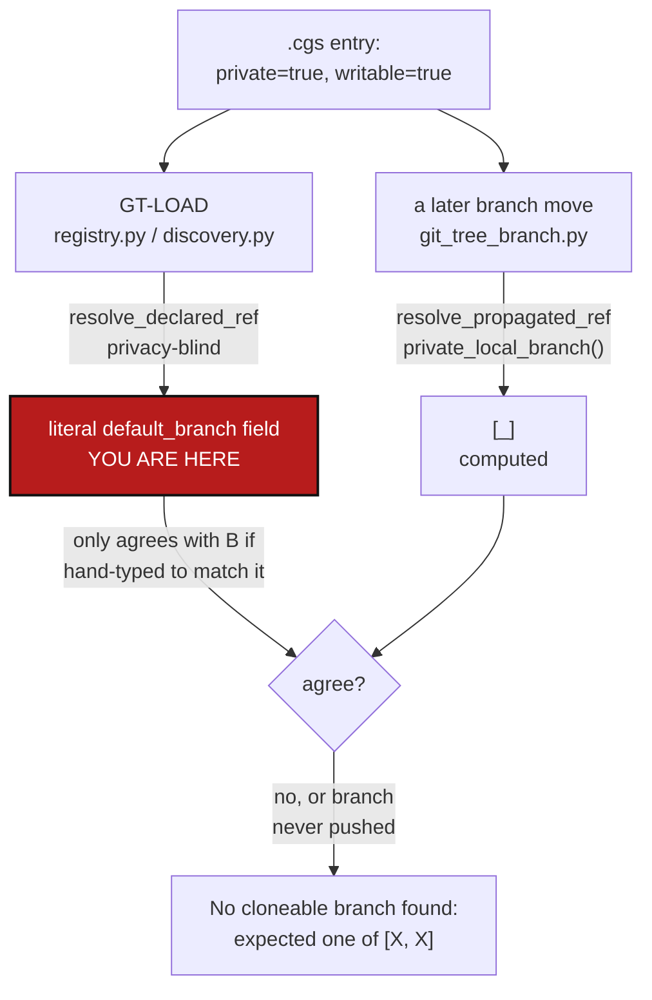

# PrivateLocalBranchAtClone — the private/local branch rule has two implementations, and only one runs before the first clone

*Created: 2026-09-22*

*Branch: main*

> **Ticket review — 2026-09-23.** Renumbered again, `main_1-6` → `main_1-5`:
> [AgentContract](../archive/20260923_AgentContract_DevPlanTicket.md)
> finished and archived, compacting the pile by one. Everything below is
> otherwise unchanged.

> **Ticket review — 2026-09-22, part 2.** Renumbered again, `main_1-6` →
> `main_1-7`: [Autofix](../archive/20260923_Autofix_DevPlanTicket.md) — merged from
> two memory-dev tickets into one, on `main` — is queued first, on the
> owner's explicit instruction, pushing this ticket back to the rank it
> was first appended at. Everything below is otherwise unchanged.

> **Ticket review — 2026-09-22.** Renumbered on merge, `main_1-7` →
> `main_1-6`: this ticket was appended at `main_1-7` against the pile as it
> stood before a parallel session archived
> [ProjectSpecSplit](../archive/20260922_ProjectSpecSplit_DevPlanTicket.md)
> and compacted `main`'s priority-1 pile down to `main_1-5`, leaving a gap
> at `1-6` once both histories merged. No other content changed.

> **Diagnosis ticket**, opened from `shortTickets/bug-cgs.md` per the
> owner's instruction: *"Diagnosis first, then corrPlan."* §1–§2 are the
> diagnosis; §3 is the correction plan. No code changes accompany this
> ticket — see [DevTickets/README.md](../README.md) §2.2: the agent's job
> on a short ticket is to make the plans agree with it, not to implement in
> the same pass.

## Abstract — read this first

**The one-line version.** `git_branch.py` names itself "the only
implementation" of the `.cgs` branch fallback chain and the privacy rule,
but a private/local repository's branch is actually computed two different
ways depending on *when* you ask: `resolve_propagated_ref`
(privacy-aware) once the tree exists, and the privacy-blind
`resolve_declared_ref` chain at the one moment that matters most — the
very first `initialise`, before there is anything to propagate a branch
onto.

**What this document is.** The diagnosis of `cgitsync initialise
../molonari-light.cgs` failing with `No cloneable branch found for
ComplexGitSync: expected one of ['lMOLO', 'lMOLO']`, and the correction
plan for it — work packages, not a patch.

**Why it exists.** The owner hit this running `initialise` against a real
tree (`molonari-light.cgs`, mounting `ComplexGitSync` itself as a
private/writable dependency) and asked for the root cause before a fix.
The duplicate `['lMOLO', 'lMOLO']` in the error is the tell: two clone
candidates that were supposed to be independent (a target branch and a
fallback) collapsed into the same string, because both were read from one
hand-typed `.cgs` field instead of computed.

**What you will find.** §1 what happens today, reproduced against this
tree's own remote. §2 the root cause — one rule, two implementations,
disagreeing at load time. §3 five work packages. §4 acceptance criteria.

**Who it is for.** Whoever picks up branch-model work next — the same
workstream as the archived
[PrivateBranchFollowsCheckout](../archive/20260909_PrivateBranchFollowsCheckout_DevPlanTicket.md)/
[MergeAndPrivateBranch](../archive/20260909_MergeAndPrivateBranch_DevPlanTicket.md)
tickets, which built the *moving* half of this rule; this ticket is about
the half that runs before there is anything to move.

**What you need to do with it.** Read §2 for why `resolve_declared_ref`
and `resolve_propagated_ref` disagree, then WP1 in §3 — the rest follow
from it.



---

## 1. What happens today

```
pixi run cgitsync initialise ../molonari-light.cgs
...
{"operation": "GT-CLONE", "event": "command_end", "command": "initialise",
 "status": "error",
 "error": "No cloneable branch found for ComplexGitSync: expected one of
           ['lMOLO', 'lMOLO'] on git@github.com:flipoyo/ComplexGitSync.git"}
```

`examples/molonari-light.cgs` declares the dependency as:

```toml
project = "lMOLO"
...
{ repository = "github:flipoyo/ComplexGitSync", relative_path = "dev-hub",
  default_branch = "lMOLO", private = true, writable = true },
```

`_select_clone_ref` (`orchestre.py:5942-5961`) tries, in order:

1. `entry.target_ref_name or entry.default_branch` — here, `"lMOLO"`
   (the declared field, verbatim).
2. `entry.fallback_branch` — also `"lMOLO"`, because
   `git_branch.apply_declared_defaults` (`git_branch.py:209-225`) defaults
   an undeclared `fallback_branch` to whatever `default_branch` already
   resolved to.

Both candidates are the same string, so the error prints it twice. Checked
against the real remote:

```
$ git ls-remote --heads git@github.com:flipoyo/ComplexGitSync.git
refs/heads/agentic-mounts   refs/heads/alpha-tech   refs/heads/apoub
refs/heads/copilot/...      refs/heads/goc-operation-spec
refs/heads/main             refs/heads/memory-dev
refs/heads/multi-branch     refs/heads/step3-cleanup-spec
```

No `lMOLO`, no `MOLONARI`. There is nothing to fall back to, so
`initialise` refuses outright.

`examples/molonari.cgs` (project `"MOLONARI"`, a straight copy of
`molonari-light.cgs`'s repo list) declares the *same* dependency with the
*same* literal field: `default_branch = "lMOLO"` — a leftover from the
file it was copied from, not `"MOLONARI"`. Nothing caught this because
nothing computes the expected value independently to compare it against.

## 2. Root cause: two implementations of one rule, disagreeing at load time

`git_branch.py`'s own module docstring calls itself "the only
implementation" of the `.cgs` branch fallback chain and the privacy rule,
and `CLAUDE.md`'s architecture table repeats it: *"Do not write a second
copy of that chain anywhere."* For an ordinary (non-private) repository
that is true. For a **private/local** one (`private = true, writable =
true`) it is not, and the gap is exactly where this bug lives:

| When | Caller | Function | Privacy-aware? |
|---|---|---|---|
| GT-LOAD (`initialise`, `registry.py:279`) and GT-DISCOVER (`discovery.py:117`) — the *first* time a repository's target branch is decided | `resolve_declared_ref` | No — reads `branch`/`default_branch`/`project.default_branch`/`DEFAULT_BRANCH`, in that order, off whatever the `.cgs` literally says |
| Every branch move after the tree exists (`git_tree_branch.py:179`, via `operations.py:831`) | `resolve_propagated_ref` | Yes — for `private, writable`, returns `private_local_branch(project_name, ref_name)`: `<project_name>` on `main`, `<project_name>_<branch>` otherwise |

`resolve_declared_ref` has no `private`/`writable` parameter at all — it
cannot apply `private_local_branch` even in principle. The only way its
answer matches `resolve_propagated_ref`'s is for the `.cgs` author to
**hand-compute** `private_local_branch(project_name, project_branch)` and
type the result into the entry's `default_branch` field, which both
example files do (`"lMOLO"` — `private_local_branch("lMOLO", "main")`,
since `"main" == DEFAULT_BRANCH` takes no suffix). That is fragile
busywork with two independent failure modes, both hit here at once:

- **It silently goes stale.** `molonari.cgs` was copied from
  `molonari-light.cgs` without updating this one field, and nothing
  validates that a private/writable entry's declared `default_branch`
  still matches what `private_local_branch` would compute for its actual
  project name.
- **It has to exist before it can be cloned.** Even typed correctly, a
  private/local branch is meant to be created lazily — by a private
  commit/push, the mechanism `MergeAndPrivateBranch` built — not
  pre-provisioned by hand. The very first `initialise` for *any* new
  project mounting this pattern targets a branch that, by construction,
  does not exist yet, and `_select_clone_ref` has no rung below the
  (identical) declared/fallback pair to catch that.

**Why "standalone" never shows this.** When ComplexGitSync is the tree's
own root (`examples/complexgitsync4dev.cgs`), the entry is the project
itself, not `private` — `resolve_declared_ref`'s ordinary chain is the
right answer and there is no second implementation to disagree with it.
**"Nested"** — ComplexGitSync, or any repository, mounted as `private,
writable` inside someone else's tree — is the one shape where the two
implementations can give two different answers, and today only the
privacy-blind one runs before the first clone exists to check the other
against.

## 3. Correction plan

| WP | Touches | Deliverable |
|---|---|---|
| **WP1** | `registry.py::build_registry_from_cgs_document`, `discovery.py`'s nested loader | Route a `private, writable` entry's *initial* target branch through the same computation `git_tree_branch.py` uses after load — `git_branch.private_local_branch`/`resolve_propagated_ref` — instead of the privacy-blind `resolve_declared_ref` chain. One function answers "which branch does this private/local repository target," at every point in the lifecycle, closing the second-implementation gap `git_branch.py` was written to prevent. |
| **WP2** | `orchestre.py::_select_clone_ref` | Give the clone path a real third rung for a private/local branch that has never been pushed: when `private_local_branch(...)`'s computed name is absent on the remote, fall back to the *shared repository's own* actual default (its real `HEAD`/`DEFAULT_BRANCH`, not the mounting project's name) rather than repeating the same unavailable name a second time. A first `initialise` then succeeds by cloning that; creating the private branch stays an explicit act, as `PrivateBranchFollowsCheckout` §3 Option A already decided for the *moving* case. |
| **WP3** | `examples/molonari-light.cgs`, `examples/molonari.cgs`, `tutorials/04_private_repos.md` | Once WP1 makes the literal `default_branch` field unnecessary for a private/writable entry, decide whether it becomes ignored/rejected there or stays as a documented override — then fix both example files (`molonari.cgs`'s `"lMOLO"` should never have been copied over `"MOLONARI"`) and any tutorial prose that hand-computes this string today. |
| **WP4** | `cgs_format.py` static validation | Defence in depth for however long WP3's field stays authored by hand: a `private, writable` entry whose declared `default_branch` disagrees with `private_local_branch(project_name, ...)` is a near-certain authoring mistake (exactly this bug) and should fail `cgitsync status`/document validation, not clone silently. |
| **WP5** | `tests/` | An integration test building a registry (or running `initialise` against a local bare remote) for a `.cgs` mounting a `private, writable` dependency with no pre-existing project branch — once in a standalone arrangement (the repo is the project root) and once nested (the repo is a private mount inside another project) — asserting both resolve to the same target branch. Today `test_git_branch.py`/`test_repo_scope.py` unit-test `git_branch.py`'s pure functions in isolation only; nothing exercises `registry.py`/`discovery.py`'s load-time path for a private/writable entry end to end, which is how this shipped unnoticed. |

## 4. Acceptance criteria

- A `private, writable` entry's target branch, computed at GT-LOAD/
  GT-DISCOVER (before any clone), is identical to what
  `git_tree_branch.py` would compute for it immediately after — for the
  same project name and project branch, in both a standalone and a nested
  arrangement.
- `cgitsync initialise` against a `.cgs` mounting a `private, writable`
  dependency whose derived branch has never been pushed succeeds (clones
  the shared repository's real default) instead of raising "No cloneable
  branch found."
- `examples/molonari.cgs` and `examples/molonari-light.cgs` no longer
  disagree about what `flipoyo/ComplexGitSync`'s dev-hub mount targets
  when a project name changes between them.
- A test fails if the load-time and propagated computations diverge again.
- `.localSpec/AdditionalSpecs.md`'s `registry.py`/`git_branch.py`/
  `discovery.py` rows are updated to state the single code path, per
  `CLAUDE.md`'s *before-committing* checklist item 6.
- `pixi run lint` and `pixi run test` pass; `cgitsync status` shows
  `errors=0`.
