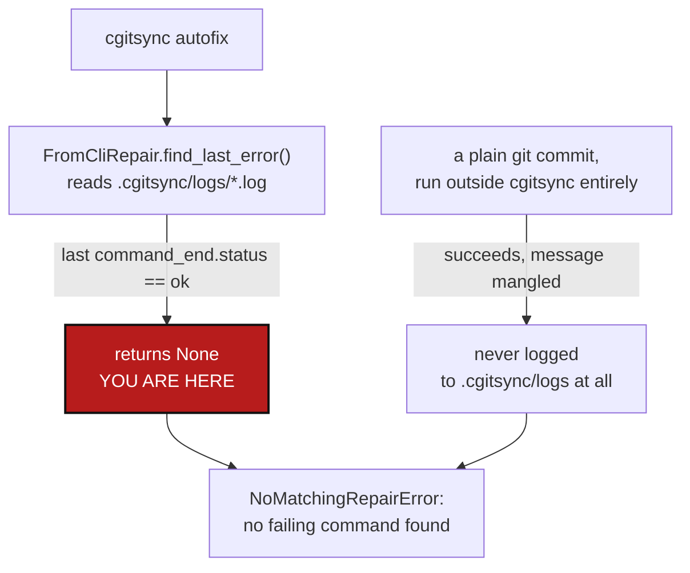

# AutofixCommitHygiene — autofix only reacts to an error cgitsync already logged; a mangled commit message never raises one

*Created: 2026-09-24*

*Branch: main*

> **Diagnosis ticket**, opened from a live incident on this project's own
> tree, per the owner's instruction to correct what happened and write up
> autofix's gap rather than patch around it silently. §1-§2 are the
> diagnosis; §3 is the correction plan.

## Abstract — read this first

**The one-line version.** `cgitsync autofix` starts from "the former
error" — the last `command_end`/`status=error` line in
`.cgitsync/logs/*.log` — but a commit whose *message* got mangled by the
shell it was pasted into is not an error `git commit` ever raises: the
commit succeeds, `git` is satisfied, and `find_last_error` finds nothing
because the last logged command's own `status` was `"ok"`.

**What this document is.** The diagnosis of a real commit on this
project's own `main` (`701a98f`, already pushed to
`git@github.com:flipoyo/ComplexGitSync.git`) whose message lost every
backtick-quoted phrase — replaced by whatever a shell substituted for it,
including the literal output of `git rev-parse --abbrev-ref HEAD` — and
collapsed from several paragraphs to one line, plus a correction plan.

**Why it exists.** An agent drafted the commit message with inline code
spans (`` `git rev-parse --abbrev-ref HEAD` ``, `` `bump-version` ``, and
similar) the way technical prose ordinarily marks up a command name. The
owner pasted it into a shell. Backticks are command substitution in a
shell, quoted or not, and unlike a name genuinely quoted in a way a shell
would leave alone, these were executed for real: `` `git rev-parse
--abbrev-ref HEAD` `` really did run, in that repository, and really did
print `main`, which is exactly what took its place. Every other
backtick-quoted phrase named a program that does not exist standalone
(`bump-version`, `.versioning`, `release/`) and silently substituted to
nothing. `cgitsync autofix` was then asked to fix it and found nothing to
do, correctly, given what it currently is: a dispatcher over one
`Situation` shape — an already-raised, already-logged error string — and
this incident produced none.

**What you will find.** §1 the incident, reproduced from the real
repository. §2 the root cause: `autofix`'s `Situation`/`matches()` model
has exactly one way to learn about trouble, and this class of defect never
reaches it. §3 four work packages. §4 acceptance criteria.

**Who it is for.** Whoever picks up `autofix` work next — a peer
workstream to [Autofix](../archive/20260923_Autofix_DevPlanTicket.md),
which built the one repair `autofix` currently knows (a diverged,
chain-shaped private repository); this ticket is about the detection side
autofix has never had at all: a defect with no logged error to start from.

**What you need to do with it.** Read §2 for exactly which line in
`repair_from_cli.py` says "no failing command found" and why that is the
right answer today, then WP1 in §3 — the rest follow from it.



---

## 1. What happened today

A commit landed on this project's own `main`, already pushed:

```
$ git show -s --format=%B 701a98f
cgitsync3.1.1 Fixes a live crash: self-history's push path assumed any
adopted mount already had a commit, but an unborn branch makes main raise
instead of answering none the way a detached HEAD does; / before the
first  is now a harmless no-op. Also repoints pixi.toml's  task at ,
its actual mount path since the release skill was renamed — the stale
 path had been silently breaking every  run
```

Drafted, before it met a shell:

```
cgitsync3.1.1

Fixes a live crash: self-history's push path assumed any adopted mount
already had a commit, but an unborn branch makes `git rev-parse
--abbrev-ref HEAD` raise instead of answering "none" the way a detached
HEAD does; `memory push`/`memory reboot` before the first `self-history
add` is now a harmless no-op. Also repoints pixi.toml's `bump-version`
task at `.versioning`, its actual mount path since the release skill was
renamed — the stale `release/` path had been silently breaking every
`bump-version` run.

Co-Authored-By: Claude Sonnet 5 <noreply@anthropic.com>
```

Every backtick-quoted span is gone. `` `git rev-parse --abbrev-ref HEAD` ``
became the literal word `main` — that command really ran, in that
repository, on that branch, and its real stdout took the phrase's place.
The others (`` `memory push`/`memory reboot` ``, `` `self-history add` ``,
`` `bump-version` ``, `` `.versioning` ``, `` `release/` ``) named nothing
runnable and substituted to empty. The blank-line paragraph breaks and the
trailer are gone too — the whole message is one physical line. This is
what a shell does to an unescaped backtick inside a double-quoted (or
unquoted) `-m` argument: not a `cgitsync` error, not a `git` error, a
correct commit made from a corrupted string.

This is also, separately, a rule violation independent of the shell
damage: [AgentConduct.md](../../../.distant/dev-sync/AgentConduct.md) §2-3
requires plain English, three lines at most, and no co-authorship trailer
on any commit — the drafted message before it even reached a shell was
already too long and already carried a forbidden trailer.

`pixi run cgitsync autofix` was run against this. It raised
`NoMatchingRepairError("autofix: no failing command found in the run
log.")` — see `repair_from_cli.py:114` — because the tree's own
`.cgitsync/logs/` most recent entry was an unrelated `push` that had
already completed with `"status": "ok"` before this commit was even made
outside `cgitsync` entirely. There was nothing wrong from `cgitsync`'s own
point of view to find.

## 2. Root cause: `autofix` has exactly one door in, and this defect never uses it

`autofix/base.py`'s `Situation` carries a `repo` and a `source_error: str`
— nothing else. Every `Repair.matches()` in the registry, today just
`DivergentUserRepair`, pattern-matches on that one string. `Situation` is
only ever constructed one way: `FromCliRepair.run()`, from
`find_last_error()`, which reads the newest `.cgitsync/logs/*.log` and
returns `None` — refused outright, per `NoMatchingRepairError`'s own
docstring: *"I don't know what this is" is the safe answer, never a reason
to guess* — whenever the last recorded command there succeeded.

Two independent gaps compound here, either one enough on its own:

- **A commit made outside `cgitsync` is invisible to it.** `cgitsync
  commit` (`orchestre.py:3285`) takes `message: str` as a real Python
  argument — no shell involved, no backtick hazard — and logs
  `commit_start`/`commit_end` events. A plain `git commit -m "..."`, run
  directly against a mounted repository the way this incident's commit
  was, produces nothing in `.cgitsync/logs/` at all, successful or not:
  `cgitsync` has no visibility into a Git operation it did not itself
  run.
- **Even a *logged* commit carries no message-shape check.** `commit()`
  never validates its own `message` argument against
  `AgentConduct.md` §2 (starts with `<project><version>`, three lines,
  plain English, no trailer) before or after committing. A caller — human
  or agent — that hands it an already-malformed string gets no signal
  back either.

`autofix`'s entire model assumes trouble announces itself as a raised,
logged error. This class of defect is the opposite: `git` accepted the
string it was given without complaint, and the only way to notice
something is wrong is to read the *result* — the tip commit's own message
— against a rule, not against a stack trace.

## 3. Correction plan

| WP | Touches | Deliverable |
|---|---|---|
| **WP1** | `orchestre.py::commit` | Validate `message` against `AgentConduct.md` §2 before running `git.commit(...)`: starts with `<project_name><version>` (from `pyproject.toml`), at most three lines, and contains none of `` ` ``, `$(`, or a bare trailing `Co-Authored-By:`/`Generated with` line. Raise `GitSyncError` naming exactly which rule failed rather than committing a string already known to be wrong — the same "refuse rather than guess" stance `NoMatchingRepairError` already takes. This closes the loophole at the one place `cgitsync` actually controls, though it cannot help a commit made by a bare `git commit` outside it (WP2 is for that case). |
| **WP2** | `autofix/base.py`, a new `autofix/repair_commit_message.py` | A second, non-error-driven entry point: `FromCliRepair` (or a sibling dispatcher) gains a mode that inspects the *tip commit* of every writable/project repository directly — `git log -1 --format=%B` — rather than only `.cgitsync/logs/*.log`. `Situation` gains an optional `commit_message: str \| None` alongside `source_error`, so a `Repair.matches()` can pattern-match on either source without every existing repair needing to change. `MalformedCommitMessageRepair.matches()` flags a message that violates AgentConduct §2's shape or looks shell-mangled (a bare word where a backtick-quoted phrase would be — heuristically, a bare `` `<runnable-name>` `` reduced to something matching `git rev-parse --abbrev-ref HEAD`'s own output space, i.e. an existing branch name, is the strongest signal this incident actually offers; a run of two consecutive spaces where a phrase silently substituted to empty is the second). |
| **WP3** | `autofix/repair_commit_message.py`, `git_runner.py` | `repair()` offers a corrected message (reconstructed from context where recoverable, otherwise asks the caller to supply one) via `git commit --amend -m <message>` — but only after checking the commit is not already the same as its upstream (mirroring `clone_guard.py`'s "which commits does no remote hold" question in reverse: here the concern is a commit *is* already shared). A commit whose ref matches its remote's is amend-and-force-push territory — hard-to-reverse, shared-state — so `repair()` must refuse by default and require an explicit `force=True` the caller only sets after the owner has actually said yes, the same posture `initialise_cgs`'s `force_reclone` already uses for a comparably destructive default-off action. Never silently rewrites already-pushed history. |
| **WP4** | `tests/`, `.agent/.local/.localSpec/AdditionalSpecs.md` | Unit tests for WP1's validator (each AgentConduct §2 rule, individually violated, is rejected; a conforming message passes) and an integration test for WP2/WP3 building a repository with a tip commit that violates the rule, confirming `autofix` finds and offers to repair it without touching an already-shared commit uninvited. `AdditionalSpecs.md`'s `orchestre.py`/`autofix/` rows updated to state the new validation point and the second `Situation` source, per `CLAUDE.md`'s *before-committing* checklist item 6. |

WP1 alone would have caught this incident's rule violations (length,
trailer) before any shell ever saw the message — it does not, and cannot,
catch shell-substitution damage that happens after `cgitsync` has already
handed the string to `git`. WP2-3 are for exactly that residual case, and
for any commit made by a bare `git commit` outside `cgitsync` entirely,
which WP1 can never see no matter how strict it gets.

## 4. Acceptance criteria

- `cgitsync commit` refuses a message that violates AgentConduct.md §2
  (too long, wrong prefix, forbidden trailer, contains `` ` `` or `$(`)
  before committing anything, naming which rule failed.
- `cgitsync autofix` can be pointed at a repository's own tip commit, not
  only at the last logged error, and correctly identifies a message that
  violates the house style or shows signs of shell-substitution damage.
- A repair for an already-pushed commit never amends or force-pushes
  without an explicit, separately-given confirmation; a repair for a
  not-yet-pushed commit may amend directly.
- The real `701a98f` incident (or an equivalent fixture built from it) is
  covered by a regression test.
- `.localSpec/AdditionalSpecs.md`'s `orchestre.py`/`autofix/` rows describe
  the new validation point and the second `Situation` source.
- `pixi run lint` and `pixi run test` pass; `cgitsync status` shows
  `errors=0`.
