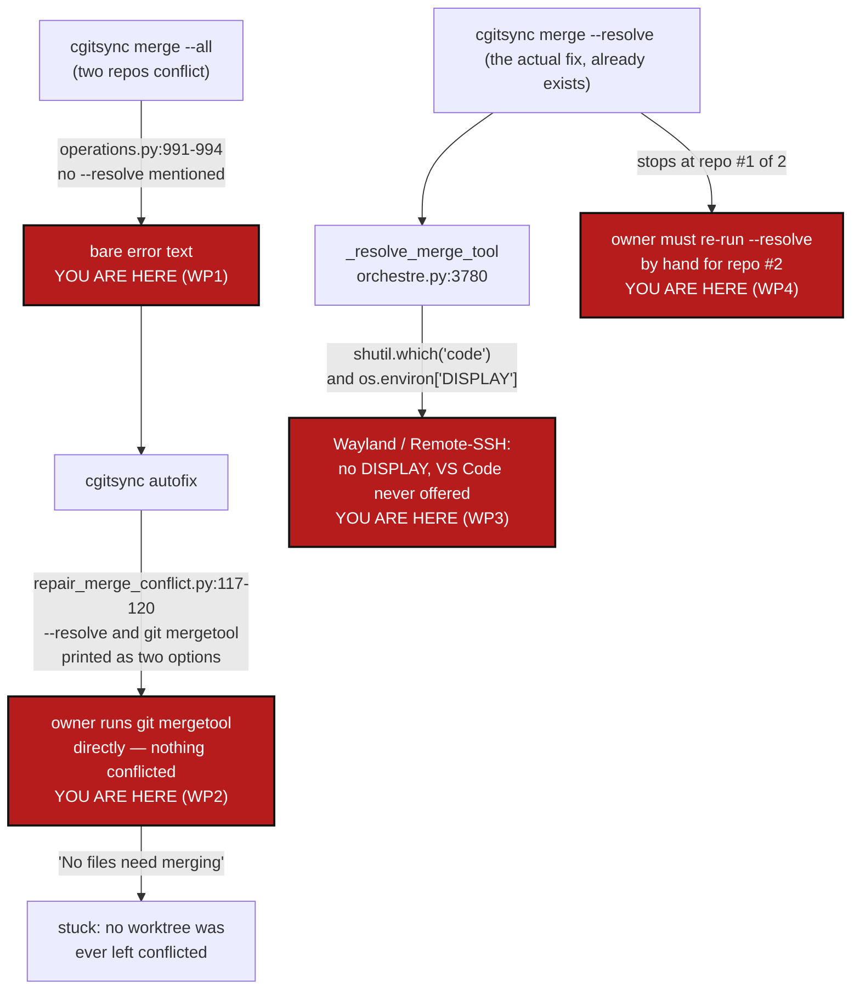

# MergeUX — a refused merge never tells you `--resolve` exists, and the one command that does open VS Code hands you a `git mergetool` line first

*Created: 2026-09-28*

*Branch: main*

> **Diagnosis + correction ticket**, opened from a live incident on this
> project's own tree (owner ran `cgitsync merge --all`, then `cgitsync
> autofix`, then a bare `git mergetool` that found nothing to do), per the
> owner's request to fix the merge UX and make the owner's own preferred
> tool — VS Code's interactive 3-way merge editor — reachable from
> `cgitsync` directly. §1 the incident. §2 what already exists and where it
> stops short. §3 the correction plan. §4 acceptance criteria.

## Abstract — read this first

**The one-line version.** `cgitsync` already knows how to stop a merge at
the first conflict and open VS Code for it (`merge --resolve` →
`open_merge_tool` → `orchestre.py`'s `_resolve_merge_tool`), but three gaps
between a refusal and that command mean an owner following the tool's own
output never reaches it: the plain `merge` refusal never mentions
`--resolve` exists, `autofix`'s advice lists a manual `git mergetool` line
right next to it in a way that reads as an alternative rather than what
`--resolve` already does for you, and the VS Code auto-detection itself
only fires when `$DISPLAY` is set — which misses Wayland and headless
VS Code Remote-SSH/Tunnel sessions, where `code --wait --merge` works fine
without any X11 display at all.

**What this document is.** The diagnosis of a real sequence on this
project's own tree today (`cgitsync merge --all` →
`cgitsync autofix` → `git mergetool` reporting "No files need merging"),
tracing exactly where each step's advice fell short of the command that
would have worked, plus a plan to close each gap and add a tree-wide
"resolve everything that conflicts, in one pass" entry point for the case
this incident actually hit: two repositories conflicting at once
(`DocComplexGitSync`, `ComplexGitSync`).

**Why it exists.** The owner's own words: "cgitsync merge UX is very poor
... I personally like the VSCode interactive merge. Would it be possible
to trigger such a thing from cgitsync." The mechanism to do exactly that
already ships (`orchestre.py:3780`, `_resolve_merge_tool`) — this is not a
build-from-nothing ticket, it is a "the path to the thing that already
works is blocked at every step" ticket.

**What you will find.** §1 reproduces the incident command-by-command
against what the code actually does at each step. §2 maps what
`merge --resolve`/`open_merge_tool` already deliver and precisely where
each of the three gaps sits, with file:line references. §3 is four work
packages: WP1 fixes the plain refusal message, WP2 restructures autofix's
advice into an unambiguous sequence, WP3 widens VS Code detection past
`$DISPLAY`, WP4 adds a tree-wide resolve-all-conflicts loop so a
multi-repository conflict does not need the command re-run and re-explained
per repository. §4 is the acceptance bar.

**Who it is for.** Whoever picks up merge-UX work next. Related but
distinct from [MergeLogGap](../archive/20260927_MergeLogGap_DevPlanTicket.md)
(archived), which gave `autofix` something to diagnose after a refused
merge in the first place; this ticket is about what happens *after* that
diagnosis is correctly printed, which MergeLogGap's own scope (§ design
reference in `repair_merge_conflict.py`'s docstring) never covered.

**What you need to do with it.** Read §2 first — it is three separate,
independently fixable gaps, not one — then WP1-WP4 in §3, which can land in
any order except that WP4 depends on WP1's message change (it reuses the
same "how do I get into a merge tool" phrasing) and should follow it.



---

## 1. The incident, reproduced against the code

```
$ pixi run cgitsync merge --all tmp-main-1-2_DiscoverRoundTrip
...
{"...": "error", "error": "merge refused; no repository was merged: DocComplexGitSync: merging 'tmp-main-1-2_DiscoverRoundTrip' conflicts; ComplexGitSync: merging 'tmp-main-1-2_DiscoverRoundTrip' conflicts", ...}
cgitsync merge: merge refused; no repository was merged: DocComplexGitSync: ...; ComplexGitSync: ...

$ pixi run cgitsync autofix
repaired=False detail=ComplexGitSync: merging 'tmp-main-1-2_DiscoverRoundTrip' still conflicts (git named no file: an unmergeable tree). This needs a person, not a repair — nothing here can guess which side of a conflict is right.
  cgitsync merge --resolve tmp-main-1-2_DiscoverRoundTrip   # stops here with the conflict in the worktree
  cd .../cgs320 && git mergetool   # or edit the markers by hand if no tool is configured
  cgitsync add && cgitsync commit
...

$ git mergetool
This message is displayed because 'merge.tool' is not configured.
...
No files need merging
```

Every step behaved exactly as coded, and the owner still ended up stuck:

1. `merge --all` correctly refuses tree-wide — `merge_tree` checks the
   whole scope before merging any of it (per `AdditionalSpecs.md`'s
   `operations.py` row), so *nothing* in the worktree is actually
   conflicted after this step. Its error text
   (`operations.py:991-994`) says which repositories blocked it and
   nothing else.
2. `autofix` correctly diagnoses which repository still conflicts and
   re-checks against Git rather than trusting the stale log
   (`repair_merge_conflict.py:79-128`, exactly as `MergeLogGap` built it to
   do). Its advice is three lines: `merge --resolve` (which *would* have
   left a conflicted worktree and auto-opened a tool), then a bare
   `git mergetool` line captioned "or edit the markers by hand if no tool
   is configured", then `add`/`commit`.
3. The owner ran the second line, `git mergetool`, directly — reasonably,
   since it is the very next line printed and reads as the next step, not
   as an alternative to a step already completed. But no `merge --resolve`
   had run, so no worktree was ever left conflicted; plain `git mergetool`
   correctly reports nothing to do.

Nobody misread anything. The printed sequence simply does not distinguish
"this is what actually starts a mergetool session" (`merge --resolve`,
which stops with a real conflicted worktree and calls `open_merge_tool`
for the owner automatically) from "this is what to fall back to if no tool
is configured, after `--resolve` has already put you in a conflicted
worktree" (the bare `git mergetool` line). Both read as commands to try.

## 2. What already exists, and where it stops short

The VS Code path the owner asked for is already built:

- `cgitsync merge --resolve <branch>` (`cli/expert.py:1962`,
  `_execute_merge_resolve`) merges repositories one at a time and stops at
  the first conflict, per `orchestre.py::merge_resolve`
  (`orchestre.py:3708-3746`), which calls
  `WorkingGitTree.git.merge_one_at_a_time` — the one merge mode documented
  in `AdditionalSpecs.md`'s `operations.py` row as deliberately leaving a
  conflicted worktree for a merge tool to open.
- On stopping, `_execute_merge_resolve` (`cli/expert.py:2133`) calls
  `client.open_merge_tool(outcome.stopped_at_id)`
  (`orchestre.py:3748-3778`), which asks `_resolve_merge_tool`
  (`orchestre.py:3780-3789`) for a tool and, if one is found, runs
  `git_runner.mergetool(...)` (`git_runner.py:1155-1178`) — this *is* "an
  interactive merge, triggered from cgitsync," already wired end to end.
- `_resolve_merge_tool` already prefers VS Code specifically when the user
  has configured no `merge.tool` of their own:
  `shutil.which("code") and os.environ.get("DISPLAY")` →
  `("vscode", "code --wait --merge $REMOTE $LOCAL $BASE $MERGED")`.

Three gaps sit between "this exists" and "the owner reached it":

- **Gap A (WP1).** The plain, non-dry-run `merge` refusal
  (`operations.py:991-994`) never mentions `--resolve`. The *dry-run* path
  for the same refusal (`cli/expert.py`'s `_print_merge_plan`, the
  `"note: merge would refuse ... or run 'cgitsync merge --resolve'"` line
  at `cli/expert.py:2176-2179`) already says it — the hint exists in the
  codebase, just not on the code path the owner actually hit, since
  `merge --all` without `--dry-run` raises `GitSyncError` straight from
  `operations.py` before `cli/expert.py` ever gets to print anything past
  the bare message.
- **Gap B (WP2).** `repair_merge_conflict.py:113-121`'s three-line advice
  puts `merge --resolve` and a bare `git mergetool` on adjacent lines with
  no marker that the second is conditional on the first already having run
  — exactly what the incident's §1 step 3 shows going wrong.
- **Gap C (WP3).** `_resolve_merge_tool`'s `os.environ.get("DISPLAY")`
  check is an X11-specific heuristic. It misses two increasingly common
  cases where `code --wait --merge` still works correctly: a Wayland
  session (`$WAYLAND_DISPLAY` set, `$DISPLAY` unset on a pure-Wayland
  compositor) and a VS Code Remote-SSH or Remote-Tunnel session, where the
  `code` CLI shim talks to the running VS Code window over its own IPC
  socket and needs no display variable of any kind on the remote host.
  Nothing in this codebase or its tests currently exercises this branch
  (`grep` finds no test for `_resolve_merge_tool`) — a gap the incident
  does not itself prove was hit (the owner's transcript does not show
  `merge --resolve` ever being run), but one worth closing on its own
  merits before it silently fails someone working exactly the way the
  owner says they prefer to.

A fourth issue, not a gap in existing code but a missing capability: the
incident's own tree had **two** repositories conflicting
(`DocComplexGitSync` and `ComplexGitSync`). `merge --resolve` stops at the
first, and reaching the second requires the owner to notice the merge
finished only one of two, re-invoke `cgitsync merge --resolve <branch>`
a second time by hand, and read the same advice again. This is WP4.

## 3. Correction plan

| WP | Touches | Deliverable |
|---|---|---|
| **WP1** | `operations.py::merge_tree` (the `GitSyncError` raised around line 991-994), `merge_into_tree`'s equivalent (line ~1160) | Append the same hint `_print_merge_plan` already prints — `"...or run 'cgitsync merge --resolve <branch>' to merge one repository at a time and open a merge tool on the first conflict"` — to the raised message itself, so the hint reaches the owner whether or not `--dry-run` was used first. One string, reused by both raise sites and by `_print_merge_plan`'s existing note, so wording cannot drift between the two paths the way it has (a hidden duplicate is exactly the kind of thing `AdditionalSpecs.md`'s architecture-boundary rules exist to catch — factor it once, e.g. as a small helper in `operations.py`, rather than copy the sentence). |
| **WP2** | `autofix/repair_merge_conflict.py::repair` (lines 111-121) | Restructure the three-line advice so the sequence is unambiguous: state that `merge --resolve` is the step to run, that it already opens a merge tool automatically when one is configured or VS Code is found (per §2), and move the bare `git mergetool`/"edit markers by hand" line to read explicitly as *what `--resolve` will do for you if no tool is found* rather than a separate command to try — e.g. nest it under a "if that leaves you with no tool open" clause instead of printing it as its own top-level line. |
| **WP3** | `orchestre.py::_resolve_merge_tool` (lines 3780-3789) | Widen the VS Code auto-detection past `$DISPLAY` alone: also accept `$WAYLAND_DISPLAY`, and — the stronger and more direct signal for the Remote-SSH/Tunnel case, since it does not depend on guessing at a display variable at all — treat `$TERM_PROGRAM == "vscode"` (set inside every VS Code integrated terminal, local or remote) as sufficient on its own, checked before falling back to the `DISPLAY`/`WAYLAND_DISPLAY` heuristic for a plain terminal outside VS Code. The user's own `merge.tool` still always wins, unchanged. |
| **WP4** | `orchestre.py` (new method alongside `merge_resolve`), `cli/expert.py` (`_execute_merge_resolve` or a new `--resolve-all` mode) | A tree-wide "resolve every conflict in this merge, not just the first" loop: repeatedly call the same one-at-a-time merge primitive, opening a merge tool at each stop, continuing only after the owner has resolved and the repository's conflict is confirmed gone (`can_merge_cleanly`, the same read-only check `repair_merge_conflict.py` already uses) — never silently skipping an unresolved repository. Surfaced as `cgitsync merge --resolve <branch> --all-conflicts` (name to be settled against README's Minimalist/Expert grouping), so the incident's own two-repository case takes one command instead of noticing, re-reading the advice, and re-invoking by hand. |

WP1 and WP2 alone would have gotten the owner to a working `merge --resolve`
run in this exact incident. WP3 closes a latent gap the incident's
transcript does not prove was hit but that the owner's own stated
preference (VS Code, likely over SSH given this project's own dev
environment) makes worth closing regardless. WP4 is the one true UX gap
beyond "the existing path is hard to find" — even a fully-informed owner
hits it the moment more than one repository conflicts at once.

## 4. Acceptance criteria

- `cgitsync merge --all` (or plain `cgitsync merge`), run against a tree
  where at least one repository conflicts, prints a refusal that names
  `cgitsync merge --resolve` as the next step, with no `--dry-run` needed
  to see that hint.
- `cgitsync autofix`'s merge-conflict advice reads as one sequence, not two
  alternatives: running `merge --resolve` and, only if no tool opened,
  falling back to a bare `git mergetool`.
- `_resolve_merge_tool` offers VS Code under `$WAYLAND_DISPLAY` and under
  `$TERM_PROGRAM == "vscode"` (a VS Code integrated terminal, local or
  remote-SSH), not only under `$DISPLAY`, with a regression test for each
  new branch and for the existing `$DISPLAY` and no-tool-found cases.
- A tree-wide resolve-all-conflicts command exists, documented in the
  README command table and `docs/Text/user_guide.tex` per `CLAUDE.md`'s
  before-committing checklist item 7, and a client method exists for it
  per `docs/Text/api_python.tex`.
- `.agent/.local/.localSpec/AdditionalSpecs.md`'s `orchestre.py`/`autofix/`
  rows updated to describe WP3's widened detection and WP4's new loop.
- `pixi run lint` and `pixi run test` pass; `cgitsync status` shows
  `errors=0`.
