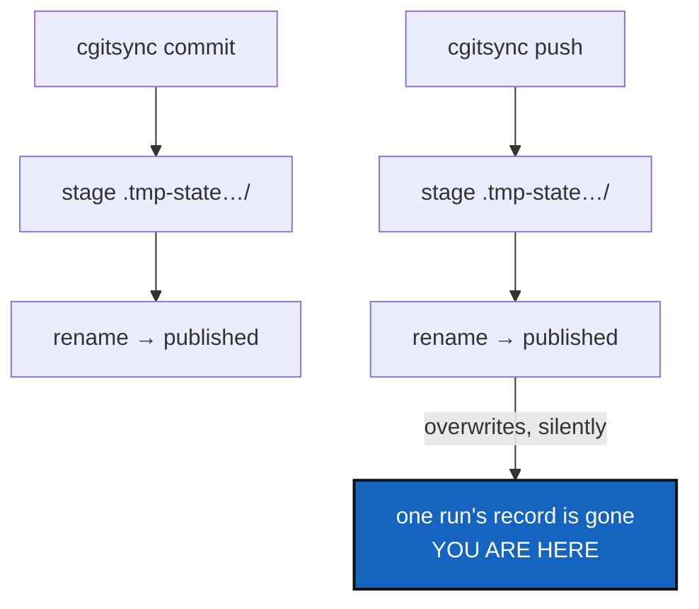

# StateLocking — two cgitsync processes, one workspace, no referee

*Created: 2026-09-12*

*Branch: main*

> **Ticket review — 2026-09-22.** §1's prediction happened for real: two
> machines ("cgsN"/"cgsDbg") both wrote `.memory`'s ledger seq 16 after
> the same ancestor, forking the chain exactly as this ticket's own words
> called it, back on 2026-09-12 — *"two entries claim the same parent, and
> the chain forks."* This ticket's own fix (a local advisory lock) could
> not have prevented it: the two machines were never in the same lock
> domain, each finished and pushed before the other could see it. What
> actually happened and how it was fixed by hand, then generalised, is
> [Autofix](../archive/20260923_Autofix_DevPlanTicket.md) — queued first in `main`'s
> priority-1 pile, merged the same day from the two tickets that first
> recorded the incident and the design — the cure for a fork that already
> happened across machines, complementary to this ticket's prevention of
> one happening on a single machine. Rank and priority unchanged; still
> the least urgent of the three, and still true regardless.

> **Ticket review — 2026-09-19.** Still last, and now behind
> [TreeEnvironment](../archive/20260920_TreeEnvironment_DevPlanTicket.md) as well.
> That ticket's WP3 adds a third member to the state area,
> `.cgitsync/env/`, so a concurrency design written before it would be
> written against a layout about to change. The new writes are the least
> race-prone kind this project has — content-addressed and write-once, so
> two processes observing one machine produce one file with one name,
> rather than two runs racing to publish under one — but §1's inventory of
> what races should cover them once they exist.

> **Ticket review — 2026-09-18.** Moved from `memory-dev_2-2` to
> `main_2-3`: [MemoryArchitecture](main_2-1_MemoryArchitecture_DevPlanTicket.md)
> moved onto `main` in the same pass, and this ticket's own concurrency
> work is scoped to the State area and ledger, not to anything still
> exclusive to `memory-dev`. It stays last in the pile — still stand-by,
> and still the least urgent of the three.

> Split out of `.localSpec/DevTickets/archive/20260912_StateMemory_DevPlanTicket.md`
> §3.5, which declared it out of scope and asked for a ticket of its own.
> Stand-by, and it gets more important with every memory milestone — see
> [MemoryArchitecture](main_2-1_MemoryArchitecture_DevPlanTicket.md).

## Abstract — read this first

**The one-line version.** Run two `cgitsync` commands in one workspace at
the same time and they race on the state area and the ledger; because each
one stages into a temporary directory and then renames, the loser wins
silently.

**What this document is.** A known gap, written down so it stops living in
a paragraph of an archived ticket. Nothing has been built.

**Why it exists.** Single-user, one-terminal use hides this completely,
which is why it has never bitten anyone here. It stops hiding as soon as
something else runs `cgitsync` — a Make target, an editor task, a CI job,
or a memory push running while the user works.

**What you will find.** §1 what races. §2 why staged-then-rename makes it
quiet instead of loud. §3 what a fix has to respect. §4 acceptance.

**Who it is for.** Whoever picks it up, probably prompted by a real
concurrent workload rather than by this file.

**What you need to do with it.** Nothing yet. Read it before adding any
automatic or scheduled memory operation.

---

## 1. What races

Two things, both under `.working/` — the live-write area
([WorkingTransitionState](memory-dev_1-2_WorkingTransitionState_DevPlanTicket.md)
gives it a directory of its own, separate from `.working/.memory/`, which
only a `memory push` fold ever touches. Two concurrent `memory push`
calls can still race on the fold itself; the same lock this ticket
proposes for `.working/` covers that case too, taken for the duration of
the fold rather than the whole command):

- **The state area.** Two runs allocate and publish a state at the same
  time. There is no `locks/` directory and no advisory lock anywhere in
  `src/`.
- **The ledger.** Two runs append. Under today's single-file register that
  is a whole-file rewrite, so one run's entries simply vanish. Under a
  hash chain ([OneRegister](../archive/20260916_OneRegister_DevPlanTicket.md)) it is worse
  in a more useful way: two entries claim the same parent, and the chain
  forks. A fork is at least *detectable*, which is an argument for doing
  the chain first and the locking after.

## 2. Why it is quiet

The atomic-publish design is good and is not the problem.
`write_gts_snapshot` stages into `.tmp-state(<hash>)_<n>/` and publishes
with a single `rename`; `ledger_store` does the same per entry. Each
individual publish is atomic, so nothing is ever half-written.

What atomicity does not give you is exclusion. Two atomic publishes of
different content to the same name produce one winner and no error, and
neither process learns that the other existed. The user sees two successful
commands and one result.

## 3. What a fix has to respect

- **No daemon, no lock server.** An advisory lock file under `.working/`,
  taken and released by the process, is the shape that fits this tool —
  and fits `.working` particularly well: a lock is local-only and never
  pushed, which is exactly what everything else under `.working` already
  is.
- **A stale lock must be recoverable.** A machine that lost power holds a
  lock forever unless the lock records enough to be judged dead — and the
  judgement has to work without an OS user name or a machine identity,
  which [MemoryRepoLocal](../archive/20260916_MemoryRepoLocal_DevPlanTicket.md)'s G5
  forbids in anything that gets pushed. A lock file is local-only and never
  pushed; state that in the design rather than discovering it later.
- **Read-only commands must not block.** `status`, `view-tree` and
  `verify` answer questions and write nothing; making them wait on a lock
  would be a regression in the common case.
- **Refusing is an acceptable answer.** "Another cgitsync is working in
  this workspace" with the lock's age is a better outcome than waiting, and
  much better than proceeding.

## 4. Acceptance

- Two concurrent write commands in one workspace: one completes, the other
  refuses with a message naming the workspace and the lock's age. Neither
  loses a record.
- A lock left behind by a killed process is recognised and recoverable, and
  the recovery is a documented command rather than "delete this file if you
  think it is safe".
- `status`, `view-tree` and `verify` run while a write holds the lock.
- No lock file is ever committed or pushed to a memory repository.
- `pixi run lint` and `pixi run test` pass.
