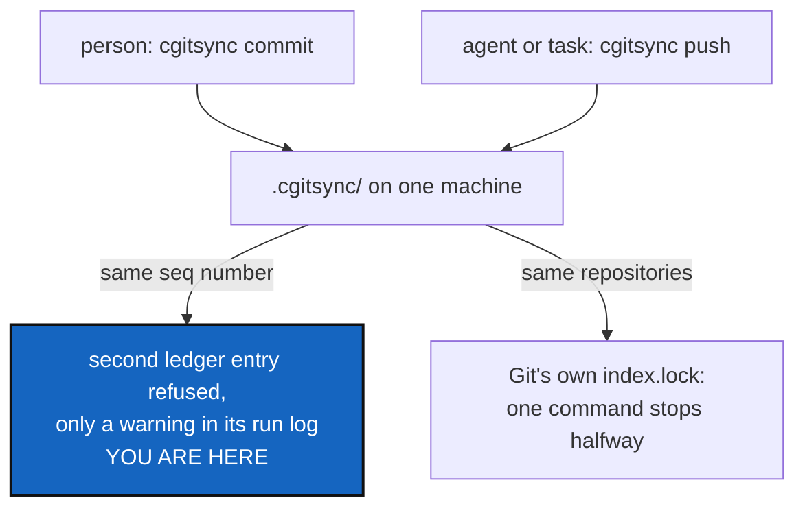

# StateLocking — two cgitsync processes, one workspace, no referee

*Created: 2026-09-12*

*Branch: main*

> **Ticket review — 2026-10-01, owner's decision.** Moved `main_2-1` → `main_2-5`, the end of the priority-2 pile; the other tickets were deliberately not renumbered, so rank 2-1 stays empty until the next review. The owner's reading: very specific, and of interest once there is a proper `cgitsync` install and an agentic deployment that runs commands on its own. The body below was **rewritten against the code as of 2026-10-01**: the `.working/` area was never created (it is still `.cgitsync/`), the ledger is no longer one file, and States are named by their content, so several races the first version described no longer exist. The review notes above are kept as written.

> **Ticket review — 2026-09-30, from the owner's short ticket `archive/.closedUserTicket/20260930_ReorderPriority-mem-multiUser.md`.** Renumbered `main_2-3` → `main_2-1`: ranked above AsOfRetrieval and AutofixBlindSpot per the owner's order. The owner's multi-developer case ([UserDevProfile](../archive/20260930_UserDevProfile_DevPlanTicket.md) §3) makes a sync running while someone works more likely, which is the workload §1 said would prompt this.

> **Ticket review — 2026-09-22.** §1's prediction happened for real: two
> machines ("cgsN"/"cgsDbg") both wrote `.memory`'s ledger seq 16 after
> the same ancestor, forking the chain exactly as this ticket's own words
> called it, back on 2026-09-12 — *"two entries claim the same parent, and
> the chain forks."* This ticket's own fix (a local advisory lock) could
> not have prevented it: the two machines were never in the same lock
> domain, each finished and pushed before the other could see it. What
> actually happened and how it was fixed by hand, then generalised, is
> [Autofix](../archive/20260923_Autofix_DevPlanTicket.md) — queued first in `main`'s
> priority-1 pile, merged the same day from the two tickets that first
> recorded the incident and the design — the cure for a fork that already
> happened across machines, complementary to this ticket's prevention of
> one happening on a single machine. Rank and priority unchanged; still
> the least urgent of the three, and still true regardless.

> **Ticket review — 2026-09-19.** Still last, and now behind
> [TreeEnvironment](../archive/20260920_TreeEnvironment_DevPlanTicket.md) as well.
> That ticket's WP3 adds a third member to the state area,
> `.cgitsync/env/`, so a concurrency design written before it would be
> written against a layout about to change. The new writes are the least
> race-prone kind this project has — content-addressed and write-once, so
> two processes observing one machine produce one file with one name,
> rather than two runs racing to publish under one — but §1's inventory of
> what races should cover them once they exist.

> **Ticket review — 2026-09-18.** Moved from `memory-dev_2-2` to
> `main_2-3`: [MemoryArchitecture](../archive/20260930_MemoryArchitecture_DevPlanTicket.md)
> moved onto `main` in the same pass, and this ticket's own concurrency
> work is scoped to the State area and ledger, not to anything still
> exclusive to `memory-dev`. It stays last in the pile — still stand-by,
> and still the least urgent of the three.

> Split out of `.localSpec/DevTickets/archive/20260912_StateMemory_DevPlanTicket.md`
> §3.5, which declared it out of scope and asked for a ticket of its own.
> Stand-by, and it gets more important with every memory milestone — see
> [MemoryArchitecture](../archive/20260930_MemoryArchitecture_DevPlanTicket.md).

## Abstract — read this first

**The one-line version.** Two `cgitsync` commands writing to one workspace
at the same moment, on one machine, are not stopped from doing so. Most of
what they write can no longer overwrite each other, but one run's ledger
entry can still be dropped with only a line in its run log, and two
tree-wide Git commands can still collide halfway through a tree.

**What this document is.** A known gap, measured against today's code, with
the shape of a fix. Nothing is built.

**Why it exists.** One person typing in one terminal never meets this. It
starts to matter when something else runs `cgitsync` in the same workspace
while the person works — an agent, an editor task, a Make target, a
scheduled job. That is the deployment this ticket waits for.

**What you will find.** §1 what is already safe. §2 what still races. §3
the trigger. §4 what a fix must respect. §5 acceptance.

**Who it is for.** Whoever sets up an agentic or automated deployment of
`cgitsync`, and the owner, who decides when.

**What you need to do with it.** Nothing until that deployment is planned.
Read it before letting any process run `cgitsync` unattended.

---

## 1. What is already safe, and why

Checked against the code on 2026-10-01.

| What two runs write | Why they cannot overwrite each other |
|---|---|
| A State, `.cgitsync/state/<hash>.gts` | Named by its own content hash: two different States get two different names, and two identical ones are the same file |
| An Environment record, `.cgitsync/env/` | Content-addressed and write-once, the same way |
| A ledger entry, `.cgitsync/lgr/<seq>.toml` | One file per entry, published with `os.link`, which fails if the file exists (`ledger_store.py`, `LedgerSeqCollisionError`): the second writer is refused, never silently written over |
| A run log, `.cgitsync/logs/` | Named for the run, with a microsecond stamp |

## 2. What still races

- **A ledger entry can be lost quietly.** Two runs read the same last entry
  and both build entry *N+1*. The second one's write is refused (§1), and
  `_append_ledger_entry` (`orchestre/memory_commands.py`) catches the error,
  writes `ledger_append_failed` to its run log and carries on. The command
  reports success; its State exists, but no ledger entry records it, and the
  person is never told.
- **Git collides first.** Two tree-wide commands (`commit`, `push`,
  `checkout`, `merge`, …) on the same repositories meet Git's own
  `index.lock`. Git refuses the second command in whichever repository it
  reaches first, which can leave a tree-wide operation done in some
  repositories and not others. This is the likeliest failure in practice,
  and nothing in `cgitsync` sees it coming.
- **A fold while a command writes.** `memory push` — and the fold `push`,
  `tag` and `freeze` run first — moves `.cgitsync/lgr`, `state`, `env` and
  `commit-logs` into `.cgitsync/.memory`. A command writing into those
  directories at that moment can end up with its file on either side of the
  move.
- **A shared temporary name.** `MemoryStates.write_atomically` stages
  through a fixed `.<name>.tmp`, so two writers of the same file share that
  temporary. Harmless when the content is identical (the same State); a
  real clash for a file every run rewrites, such as the stable
  `.cgitsync/.cgs/` copy of the spec. (The ledger's `HEAD` pointer is not
  at risk: its temporary name is unique, and `verify` recomputes it from
  the entry files.)

What this ticket does **not** cover: two *machines*. Two machines each
writing their own next entries (the fork of 2026-09-22, or a memory branch
left on another project branch) are never in the same lock domain. That is
`autofix`'s `repair_divergent_user` for repair, and Omniscience for design.

## 3. The trigger

Build this when one of these is planned, not before:

- an agent or scheduled job running `cgitsync` in a workspace a person also
  uses;
- an editor or Make integration that runs `cgitsync` on save or on build;
- any automatic `memory push` (MemoryArchitecture D4 currently forbids one:
  every network operation is a command someone typed).

## 4. What a fix must respect

- **One advisory lock per workspace, no daemon, no lock server.** A lock
  file under `.cgitsync/`, taken by a writing command for its whole run and
  released at the end. `.cgitsync/` already holds only local things beside
  the memory mount, and a lock must be one of them: local, never folded,
  never pushed (like `.cgitsync/logs/`).
- **A stale lock is recoverable by a command.** A killed process must not
  hold the workspace forever. The lock records enough to judge it dead — its
  process id and start time, read through `universal_clock.py` — and a
  documented command clears it, rather than "delete this file if you think
  it is safe". No user name and no machine identity in it.
- **Read-only commands never wait.** `status`, `view-tree`, `verify`,
  `memory status`, `memory list`, `memory show`, `memory explore` and
  `autofix`'s diagnosis write nothing and must run while a write holds the
  lock.
- **Refusing is the answer, not waiting.** "Another cgitsync is working in
  this workspace since <time>" is better than queuing, and far better than
  proceeding.
- **Lose nothing loudly.** Independently of the lock, a refused ledger
  append must reach the person, not only the run log.

## 5. Acceptance

- Two concurrent write commands in one workspace: one completes, the other
  refuses before touching any repository, naming the workspace and the
  lock's age. Neither loses a State or a ledger entry.
- A lock left by a killed process is recognised as stale and cleared by a
  documented command.
- The read-only commands of §4 run while a write holds the lock.
- No lock file is ever folded into, committed to or pushed with a memory
  repository.
- A refused ledger append is reported to the person by the command that
  lost it.
- `pixi run lint`, `pixi run test`, `cgitsync status` with `errors=0`.
