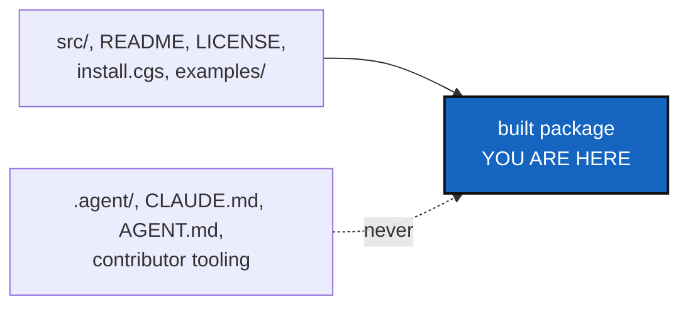

# PackageHygiene — what this repository builds carries only what a user needs

*Created: 2026-10-02*

*Branch: main*

> **From TmpBranchClosure**, the CorrTicket closing the `tmp` branches. It
> takes back the part of `tmpPyPi` that conforms to the core rules. The
> rest of that branch (`pipx`, PyPI publishing) is not taken back.

## Abstract — read this first

**The one-line version.** Whatever route users end up installing by,
the package built from this repository must hold the tool and its user
documentation, and never the developer mounts.

**What this document is.** The plan for building the package cleanly,
through Pixi only.

**Who it is for.** The worker and the orchestrator.

**What you need to do with it.** Take the pieces in §1 from `tmpPyPi`'s
commit `e8d8749` (it will be `closed/tmpPyPi` once closed), and check
against §2.

---

## 1. What to take back

- `pyproject.toml`: the source-archive include list (the package,
  `README.md`, `LICENSE`, `CHANGELOG.md`, `install.cgs`, `examples/`), the
  project URLs and the classifiers (Linux only, the platform CI checks).
- `tests/unit/test_packaging.py`, adapted so the package is built by a
  Pixi task, never by `pipx run build`.
- `CHANGELOG.md`, written by a person; `bump-version` never touches it.

## 2. What it must not bring

- No `pipx`, `pip install` or other installer, in code, docs or CI. Pixi
  only, including in how the package is built (`digest.md`, Python work).
- No user install instructions. The route is the owner's open question
  (short ticket `pixi-global-install.md`).
- No publishing workflow and no PyPI release. Publishing is the owner's
  decision.

## 3. Acceptance

- A Pixi task builds the package, and a test checks that the source
  archive holds no `.agent/`, `CLAUDE.md` or `AGENT.md`.
- `pixi run lint`, `pixi run test`, `pixi run check-ceilings` pass, and
  `cgitsync status` shows `errors=0`; `bump-version patch` at least.
