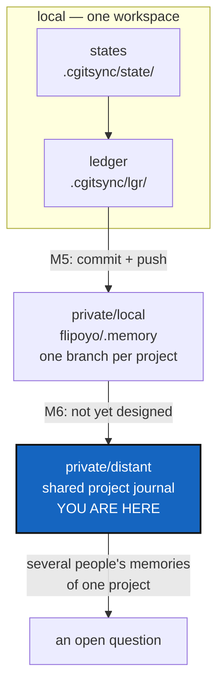

# MemoryArchitecture — a project's memory, kept locally and answerable from one place

*Created: 2026-09-12*

*Branch: memory-dev*

> **Owner direction — 2026-09-12.** From
> `.localSpec/DevTickets/archive/.closedUserTicket/20260912_memorySpecs.md`. This ticket is the design the
> six that follow implement; it is priority 1-1 because every one of them
> cites it for what a memory is and where it lives.

## Abstract — read this first

**The one-line version.** What a workspace remembers should outlive the
machine it was remembered on: each project keeps its states and its ledger
in a memory repository of its own, and one distant reference ledger knows
which projects exist and where their memories are.

**What this document is.** The architecture, the vocabulary, and the
milestone map. It designs; it does not build. Each milestone is its own
ticket, listed in §4 with the order they must land in.

**Why it exists.** `.cgitsync/` is the only thing in ComplexGitSync that
remembers anything, and today it is a gitignored scratch directory on one
disk. Lose the disk and the project's history of synchronised states is
gone; move to a second machine and the same tree remembers nothing. Every
other part of this tool exists to keep repositories in step across
machines. Its own memory is the one thing that never leaves home.

**What you will find.** §1 the vocabulary, which is where most confusion
comes from. §2 the three layers, and what a record says about the tools
that made it. §3 the decisions the owner has to make.
§4 the milestone map — the six tickets and their order. §5 what this
architecture refuses to do. §6 how we will know it works.

**Who it is for.** Whoever picks up any memory ticket, and the owner, who
answers §3 before milestone M4 starts.

**What you need to do with it.** Read §1 and §2, then go to your own
ticket. Answer §3 before M4 — except D6, which is answered already, bar
its two sub-questions that M3 needs.



---

## 1. The words, fixed here and used everywhere

Four things are easy to confuse, and three of them are called "the
register" somewhere in today's code. Fixed meanings:

| Word | What it is | Where it lives |
|---|---|---|
| **State** | One `.gts` snapshot: what the tree contained at one moment | `.cgitsync/state/` |
| **Ledger** | The ordered, hash-chained record of when each State was seen | `.cgitsync/lgr/` |
| **Memory** | One project's States, its Ledger and its commit logs — everything `.cgitsync/` holds | `.cgitsync/`, and its memory repository |
| **Commit log** | What one State's commits said, and whether they were published | `.cgitsync/commit-logs/` |
| **Reference ledger** | The distant index of which projects have a memory, and where | its own repository, one for all projects |

A **memory repository** is an ordinary private/local repository in the
`.cgs` sense — shared with your other projects, on a branch of its own,
written only with `--private`. It is not a new kind of mount, and it needs
no new transport: the provider registry in `git_repo.py` already carries
everything a memory repository needs.

## 2. The three layers

### 2.1 Local — what a project remembers

From the owner's note: *"a project has his states (ie .gts) back-up in
`.cgitsync/state/hash.gts`, where hash is sha256 of the GitTree content
@timestamp. the project/state/hash.gts is recorded in its ledger with
@timestamp."*

Two rules in one sentence, and they are the foundation everything else
stands on:

1. **A State is named by what it contains.** `sha256` of the tree's
   content, so the same tree yields the same name on any machine. Today it
   is named after a timestamp instead — see the audit in
   `.localSpec/DevTickets/archive/20260912_StateMemory_DevPlanTicket.md` §0.2.
2. **The ledger says when.** The timestamp belongs to the record of the
   event, not to the name of the thing.

Note what the flat `state/<hash>.gts` shape settles for free: the `_n`
occurrence counter in today's `state(<hash>)_<n>/` has nothing left to
count, because the same content is the same file and being seen twice is
two ledger entries. Milestone M2 carries that decision.

### 2.2 Private/local — a memory that survives the machine

`.cgitsync/` becomes a repository, mounted in the tree exactly like
`.localSpec` or `.claude` is today:

```toml
memory = { repository = "github:flipoyo/.memory", relative_path = ".cgitsync", private = true, writable = true }
```

**One repository, one branch per project** — exactly how `.localSpec` and
`.claude` already work. `flipoyo/.memory` exists as of 2026-09-16, and a
project's memory is its branch of it: `ComplexGitSync` while the project is
on `main`, `ComplexGitSync_memory-dev` while it is on `memory-dev`, by the
same `private_local_branch` rule every private/local mount follows. See
§3's D2, which this reverses, and why.

The parent's `.gitignore` keeps listing `.cgitsync/` — that is the
ordinary rule for every child mount, the same line that keeps `docs/` out
of ComplexGitSync's own index. **The line stays and its meaning changes**,
from "suppressed scratch" to "a mounted repository with a history of its
own". Nothing in the gitignore-leak fix
(`archive/20260903_CgitsyncGitignoreLeak_DevPlanTicket.md`) is undone: that
fix said the memory must not be committed *into the project repository as
untyped content*, which stays true.

### 2.3 Private/distant — the shared journal, not yet designed

> **Owner direction — 2026-09-16**, from
> `.localSpec/DevTickets/archive/.closedUserTicket/20260916_memoryRepo.md`:
> *"There will be later a private/distant memory repo to design in order to
> ensure the multi-user contribution to the global memory of a project. I do
> not have a clear view yet, and it will be a problem of multi private/local
> sync into a single private/distant project journal."*

This layer was designed as an **index**: one repository naming, for each
project, where its memory lived. With one shared `.memory` repository that
question mostly answers itself — a project's memory is a branch, and the
branch list is the index.

What replaces it is a harder problem and an honestly open one: **several
people, each with their own private/local memory of the same project,
contributing to one shared journal of it.** Two people synchronise the same
tree on the same day; both memories are valid; neither is a prefix of the
other. A hash chain gives tamper-evidence, not a merge rule, and this
architecture has said from the start that it does not merge chains.

Nothing here is decided. [MemorySyncDistant](memory-dev_2-10_MemorySyncDistant_DevPlanTicket.md)
holds the question and has moved to stand-by until there is an answer to
build.

Keeping it distant and separate remains the point when it is designed. The
account that can rewrite the evidence of what was synchronised should not
be the account that holds the code.

### 2.4 What a record says about the tools that made it

> **Owner direction — 2026-09-16**, from
> `.localSpec/DevTickets/archive/.closedUserTicket/20260916_memory-dependencies.md`:
> *"The memory system of cgitsync must record the version of the
> dependencies that were used for state genesis and at the time of the
> records: pixi, git, dvc, git-lfs, cgitsync version."*

A memory is evidence, and evidence that does not say what produced it is
worth less than it looks. Five versions matter: **cgitsync**, **git**,
**pixi**, and — where the repository uses them — **dvc** and **git-lfs**.
"A tree was synchronised on 4 March" answers much less than "…by cgitsync
2.41 driving git 2.39.5", when the question two years later is why a
restored release does not match.

Two moments, both named by the owner: **genesis**, the first record a
memory ever holds, and **each record**, so a chain that spans a year of
upgrades says where each upgrade fell.

### What else a record carries

Versions answer "by what". The owner's second request
(`.localSpec/DevTickets/archive/.closedUserTicket/20260916_addCommitMsgToMem.md`)
answers **"what was written"**: the messages of the commits an operation
made, for the project and for the private repositories, linked to the push
that published them and reachable from a State's hash.

That is one file per State beside the ledger, not a field in an entry — a
message has no length limit and an entry must stay small and fixed. The
entry carries a digest of it, so the file cannot be edited without trace.
[CommitMemory](memory-dev_1-8_CommitMemory_DevPlanTicket.md) is the
milestone; §3's D5 is where "what may a memory contain" settles it.

**Versions are provenance, never identity.** They describe the machine
that observed the tree, not the tree. Folding them into the content hash
of a State would give one tree two names on two machines, which is exactly
what M2 exists to stop — so they live in the **ledger entry**, where
"when, by what, with what result" already lives, and the entry hash makes
them tamper-evident for free. M2 states the rule; M3 carries the field.

A version string is not a secret, but it is a fingerprint of a machine, so
D5's rule applies to it unchanged: record the version, never the path the
tool was found at, and never the user it ran as.

## 3. Decisions — the owner's call, needed before M4

### D1. What is pushed to a memory repository — everything, or the ledger?

The ledger is small and grows by one entry per operation. States are whole
`.gts` documents, and a busy workspace writes many.

| Option | What happens |
|---|---|
| **Ledger always, States by policy** (recommended) | The ledger is pushed on every sync; States are pushed according to a declared policy — all, or only those a `freeze` named. The ledger still records every State by hash, so a missing one is a known gap rather than a silent hole |
| Everything, always | Simplest to explain and unbounded in size: a year of `status` calls is a year of snapshots |
| Ledger only | Smallest, and it throws away the ability to restore a tree from its memory, which is half the reason to keep one |

### D2. One memory repository per project, or one for all?

**Answered by the owner, 2026-09-16: one for all** — `flipoyo/.memory`,
mounted at each project's `.cgitsync/`, with one branch per project. It
works exactly as every other private/writable mount does, which is the
argument for it: no new mount semantics, no new branch rule, nothing to
learn. The repository exists already.

This reverses the recommendation below, which is kept because a reversed
decision is only safe when what it cost is written down.

| | One per project (recommended, not taken) | One for all (taken) |
|---|---|---|
| Mount semantics | Already exist | Already exist |
| Sharing one project's memory | Hand over one repository | **Hand over access to every project's** — a reader of `.memory` can read every branch |
| Finding them all | Needs the reference ledger | The branch list |
| New repository per project | Yes, one each | None ever again |

The cost is the sharing row, and it is real: memory is not a secret, but
"who may read this project's history" stops being a per-project answer. The
owner has taken that trade knowingly and for now; splitting later means
moving branches into their own repositories, which is a day's work and no
data loss.

### D3. How is a memory repository addressed?

Settled with D2: declared in the `.cgs` like any other private entry —
`github:<owner>/.memory`, `relative_path = ".cgitsync"`, `private`,
`writable` — and the branch derived by the ordinary private/local rule.
`cgitsync memory init` proposes that entry and mounts it once the user
accepts. **No repository is ever created by ComplexGitSync**: nothing here
talks to a provider's API, so `init` prints the name and the command that
creates it, and waits.

**The branch forks with the project's branch, and that is the intended
behaviour.** On `memory-dev` a project's memory is `ComplexGitSync_memory-dev`;
it merges back into `ComplexGitSync` when the project branch merges, the
same as `.localSpec`. It also means the same hazard: work recorded on one
branch is not visible from the other until the merge, which this project
has already hit once and recovered from by merging rather than by copying.

### D4. When does a sync happen?

Recommended: never automatically at first. An explicit `cgitsync memory
push` in M5, with the cadence question — every operation, or only on
`freeze` — answered from evidence once there is a working protocol to
measure. Pushing a ledger entry per `status` call is noise; pushing only
per `freeze` may lose the intermediate history that makes a chain worth
keeping.

### D5. What may a memory contain?

This is the one that must be settled before anything leaves the machine.
Today's ledger records `snapshot_path = "$HOME/.cgs/CGS…/…"` and `actor =
"flipoyo"`. Publishing that publishes one developer's directory layout and
login name. **No absolute path, no OS user name, no credential** — paths
relative to the tree root, and `actor` a deliberate, documented, opt-in
field. M4 does not ship until this holds.

**Commit messages are the exception that proves the rule.** They are
authored content and travel exactly as written — never scrubbed, reflowed
or truncated, because rewriting somebody's words is the one thing a record
must not do. What is forbidden is the machine around them: no absolute
path, no OS user name, no diff. A memory says what happened and what it was
called; it is not a second copy of the repository.

### D6. How much toolchain does an entry carry, and what does it cost?

**Answered by the owner, 2026-09-16: every entry carries all five, every
time.** The alternatives and why they lost are kept below, because a
decision without its reasoning is a decision that gets reopened.

| Option | What happens |
|---|---|
| **Every entry carries all five** — **chosen** | An entry answers the question on its own. A truncated or partly synced chain still says what made each record. Costs roughly a hundred bytes per entry |
| Only when it changes | The smallest ledger, and reading one entry now means replaying the chain back to the last change — so a partial chain cannot answer at all |
| Genesis only | Answers the owner's first half and not the second; a year of upgrades leaves no trace |

Two sub-questions remain open, and M3 needs them:

- **What is recorded when a tool is not installed?** A workspace with no
  DVC has no DVC version. **Answered by the owner, 2026-09-16: the word
  `none`.** Never an empty string, which reads like "not asked" rather
  than "asked, and there is none".
- **What does asking cost?** `git --version` is a cheap subprocess.
  `dvc --version` starts a Python interpreter and can take about a second,
  which on every `cgitsync status` in a data workspace is not acceptable.
  **Answered by the owner, 2026-09-16:** each tool is asked at most once
  per command and the answer reused, and a data backend is asked only when
  the command actually touched a repository that uses it. A Git-only
  workspace never pays to record that it has no DVC. The data workstream's
  [DataBackendContract](data-repo_2-5_DataBackendContract_DevPlanTicket.md)
  owns the discovery itself.

With those two settled, D6 is closed.

## 4. The milestone map

Eight tickets, this one included. Each is a milestone: something that
works and can be shown, not a layer that only makes sense once the next
one lands.

| M | Ticket | Milestone reached |
|---|---|---|
| **M0** | MemoryArchitecture (this one) | The words mean one thing each, and everyone is building the same system |
| **M1** | VerifyHonesty | The tool stops reporting history it never checked |
| **M2** | StateIdentity | A State is named by its content, so two machines agree on what they hold |
| **M3** | OneRegister | One ledger, hash-chained, actually written, and able to fail |
| **M4** | MemoryModule | `memory/` exists with a CLI to match: a local memory can be inspected |
| **M5** | MemoryRepoLocal | A project's memory is a repository, pushed, and survives the machine |
| **M6** | MemorySyncDistant — **stand-by** | Several people's memories of one project, in one shared journal. Reframed by D2 and not yet designed |
| **M7** | CommitMemory | A memory says what was committed, and whether it was ever pushed |

The order is a dependency chain, not a preference. M2 before M3 because a
chain of entries pointing at timestamp-named directories records nothing
portable. M3 before M5 because pushing a register nothing writes is
pushing an empty directory. M4 before M5 because the code needs a home
before it grows a protocol.

M6 is no longer next in the chain: with one shared `.memory` repository its
original subject — an index of where each memory lives — is answered by the
branch list, and what remains is the multi-user merge problem §2.3 states
and nobody has solved. It is stand-by until it has a design.

M7 is the one that is not in the chain. Recording what a commit said needs
nothing from M5 or M6 — only the ledger M3 built — so it is placed after
M5 by preference, not by need: a memory that is already a repository
carries its commit logs from its first push rather than gaining them in a
later one.

**`memory/` is a new top-level area of `src/ComplexGitSync/`**, the
owner's own suggestion and the right one: `cli/` earned its own package
when it outgrew one file, and memory is a larger subject than the CLI. M4
places it, and `.localSpec/AdditionalSpecs.md`'s ring table gains its row
in that ticket, not this one.

### 4.1 Where the work lands

**Every one of the seven is developed on the `memory-dev` branch of
ComplexGitSync**, not on `main`. Six milestones that each change the state
area, the ledger, or both would otherwise interleave on `main` with
unrelated releases, and a half-migrated memory format is the one thing
this architecture cannot afford to ship by accident. `memory-dev` merges
back when a milestone is finished and the suite is green.

Their filenames say so: an open memory ticket is
`memory-dev_<priority>-<rank>_<Name>_DevPlanTicket.md`, and each one
carries a `*Branch: memory-dev*` line under its `*Created:*` line. A ticket
whose filename opens with `main_` is `main` work — including
[CliContract](../archive/20260916_CliContract_DevPlanTicket.md),
[UserInstallPath](main_2-1_UserInstallPath_DevPlanTicket.md) and
[CgshomeDefault](../archive/20260916_CgshomeDefault_DevPlanTicket.md), which the
milestones ask questions of without being memory work themselves. The
convention is stated in
[TICKETLIFECYCLE.md](../../../.agentSpec/TICKETLIFECYCLE.md) §3 and named for
this project in `.localSpec/AdditionalSpecs.md`.

## 5. What this architecture refuses to do

- **It is not a backup product.** A memory repository holds what
  ComplexGitSync recorded, not the working tree. Restoring a project means
  re-cloning from a State, not unpacking files.
- **It is not a sync service.** No daemon, no background push, no
  scheduler. Every network operation is a command someone typed.
- **It must work offline.** Local-first, pushed later, is the only
  acceptable answer. A machine with no network keeps a complete, valid,
  verifiable local memory.
- **It does not merge chains.** Two people writing one memory repository
  concurrently is a real problem with no answer here. D2's one-per-project
  shape keeps it rare; a real merge rule for concurrent chains is its own
  ticket, opened when someone actually needs it.

## 6. Acceptance

This ticket is done when all of the following are true — none of them is
code:

- `.localSpec/AdditionalSpecs.md` carries §1's four definitions, and no
  docstring in `src/` contradicts them.
- §3's six decisions are answered in this file, by the owner, with the
  reasoning kept. D6 is answered as of 2026-09-16; five remain.
- The seven tickets in §4 exist, each naming this file for its design and
  stating which milestone it delivers.
- Every one of them states what it does *not* do, so the seams between
  them are visible from inside each ticket.

It stays open until the last milestone lands, because it is the one
document a reader should be able to open to find out what the memory system
is.
