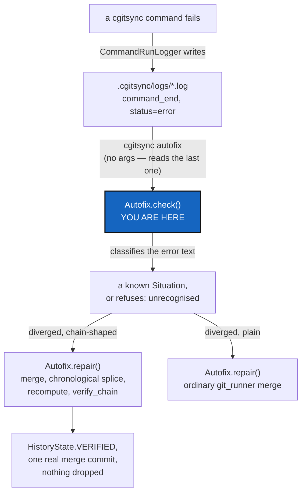

# LedgerAutofix — turning the hand-run rescue into `autofix.py`: a generic fix for a forked hash chain

*Created: 2026-09-22*

*Branch: memory-dev*

> **Owner direction — 2026-09-22, in conversation.** *"The script is a
> basis for this issue solving. I think we had a DevPlanTicket for such
> issues, ie to protect the GitTree from simultaneous ops done by two
> users. [...] Write a Ticket concerning the actual problem and propose a
> generic resolution as you did with merge followed by a sort of memory
> rebase i would say and recalculation of the ledger. This would be part
> of the autofix.py part of the src."* §1 answers the "did we already have
> this" question — two related tickets exist, and neither one is this. §4
> is the design this ticket asks for.

> **Owner direction — 2026-09-22, in conversation, same day.** *"autofix.py
> should mobilize a class called autofix that run a check on the situation
> of a git. Let start from cgitsync errors for launching the proper
> sequence of actions. The repair is called by pixi run cgitsync autofix
> (it takes the former error as an entry)."* Three concrete requirements
> folded into §4: one class, not a bag of functions; diagnosis keyed off
> **the error `cgitsync` already produced**, not a fresh proactive scan;
> and one CLI verb, `cgitsync autofix`, whose normal input is "whatever the
> last command failed with," not a repository name typed by hand. D2 is
> rewritten to match — the earlier `cgitsync memory rebase` proposal is
> withdrawn in its favour.

## Abstract — read this first

**The one-line version.** `scripts/rescue_20260922_memory_ledger_splice.py`
fixed one incident by hand, with this incident's commit hashes wired in as
constants. This ticket is that script's generalisation into
`src/ComplexGitSync/autofix.py`: a real, tested, CLI-reachable operation
that detects a forked hash chain and repairs it the same way — merge,
chronological re-sequencing, hash recalculation — without a human reading
TOML files first.

**What this document is.** A design for one new module and the command
that reaches it, built from a worked example that already exists and
already verified clean.

**Why it exists.** The rescue script proved the *algorithm* is sound
(`integrity.verify_chain` returned `HistoryState.VERIFIED`, zero findings,
on the real incident) but it is not a *fix*: it hardcodes two commit
hashes as module constants, and a future occurrence — which will happen
again, the moment two machines both run `cgitsync` against the same
`.memory` between pushes — gets nothing from having solved this once.

**What you will find.** §1 the two existing tickets this could be
mistaken for, and why neither one is it. §2 what the rescue script proved
and what it hardcoded. §3 the shape of a general fix. §4 `autofix.py`'s
design: detection, the algorithm, safety properties, and where it is not
allowed to guess. §5 decisions. §6 work packages. §7 acceptance.

**Who it is for.** The owner, for §5. Then whoever builds `autofix.py`.

**What you need to do with it.** Read §2 first — it is the concrete
example everything else generalises from — then §4.



---

## 1. The two tickets this could be mistaken for, and why neither is it

**[StateLocking](main_2-3_StateLocking_DevPlanTicket.md)**
— "two `cgitsync` processes, one workspace, no referee" — is *prevention*,
scoped to one machine: an advisory lock file so two local processes never
race on the state area or ledger in the first place. It already names
this exact failure mode in its own §1 — *"Under a hash chain... two
entries claim the same parent, and the chain forks. A fork is at least
*detectable*, which is an argument for doing the chain first and the
locking after"* — written 2026-09-12, before the chain existed, as a
prediction. **A lock cannot fix this ticket's problem, because a lock only
protects processes that can see each other.** Two machines pushing to the
same `.memory` branch between pulls are never in the same lock domain; by
the time either one would take a local lock, the other has already
finished and pushed. Locking and this ticket are complementary, not
overlapping: StateLocking stops a fork from happening on one machine;
this ticket fixes one that already happened across two.

**[Omniscience](memory-dev_2-1_Omniscience_DevPlanTicket.md)**
§4, "two people appending at once", looks like the same question and
answers it completely differently: *"the two records are two different
files. Git's own merge handles it — no strategy, no driver, no merge rule
of ours."* That works **because Omniscience's records are one-file-per-
record with no shared sequence field** — a deliberate design choice for a
register that does not exist yet. `.memory`'s ledger already exists, was
built with sequential `<seq:06d>.toml` filenames before that lesson was
available, and two writers computing the same "next seq" is exactly the
collision Omniscience's design avoids. This ticket is what to do given
that the sequential shape is already shipped and cannot be wished away —
Omniscience gets to avoid the problem; `.memory` has to solve it.

**Neither ticket, nor anything else found by searching every open and
archived ticket for "simultaneous"/"concurrent"/"two users"/"two
machines"/"race", proposes an automated fix for an already-forked chain.**
This is real, new scope.

## 2. What the rescue script proved, concretely

Fixing `memory-dev_1-1`'s incident (`.memory` diverged: local session
"cgsN" wrote ledger seq 16-19 after ancestor seq 15; origin's session
"cgsDbg" wrote a *different* seq 16-17 after the same ancestor) took:

1. `git merge origin/ComplexGitSync --no-commit` — surfaces an add/add
   conflict on exactly the colliding filenames (`lgr/000016.toml`,
   `lgr/000017.toml`) and nothing else; everything content-addressed
   (`state/`, `env/`, `logs/`) merges as a clean union on its own, since
   two different contents never produce the same filename there.
2. Read all six entries "new since the ancestor" from both sides (`git
   show <tip>:lgr/<seq>.toml`), across both branches.
3. Sort by `recorded_at`, not by which branch — the two sessions
   interleaved in real time, so grouping "one side, then the other" would
   have produced a chain that reports `TIME_REGRESSION` on the next
   verification, which is not corruption but is not clean either. There
   is no reason a real fix should produce a worse answer than it has to.
4. Rebuild each entry at its new position: same `command`/`argv`/
   `state_id`/`recorded_at`/everything else, only `seq`/`prev`/
   `entry_hash` recomputed via `memory.ledger_entry.compute_entry_hash` —
   the exact function a live write already uses, so the result is
   indistinguishable from a chain nothing ever forked.
5. `memory.integrity.verify_chain` over the rebuilt, 21-entry chain:
   `HistoryState.VERIFIED`, zero findings, before anything was committed.
6. `git add` + `git commit` — a real merge commit, two parents, nothing
   force-anything.

**What was hardcoded, and is exactly what a generic version must not
be:** `_LOCAL_TIP = "02c9375"`, `_ORIGIN_TIP = "8846dd9"`, and
`_ANCESTOR_HEAD_HASH` as three module-level constants naming this one
incident. Step 1's conflict-file list (`000016`, `000017`) was also read
by eye, not computed.

## 3. The shape of a general fix

Everything steps 2-6 above did is already parametric in principle — "read
entries new since the merge base, on both sides", "sort by time", "rebuild
the chain", "verify", "commit" — none of it actually needs *this*
incident's hashes, only *a* merge base and *two* tips. What is missing is
turning "read from `_LOCAL_TIP`/`_ORIGIN_TIP`" into "read from wherever
`git merge-base` and the two current branch tips say," and turning "the
add/add conflict is on `000016`/`000017`" into "ask git which paths under
`lgr/` are conflicted, or — better — recompute which `seq` values exist on
both sides of the merge base with different content, without needing git
to have attempted the merge and failed first."

**Why this is not, and should not try to be, a git merge driver.** A merge
driver operates on one file's three versions (ours/theirs/base) at a time
with no visibility into any other file. This fix is not a per-file
operation — repairing one colliding `seq` shifts every entry that comes
after it, on both sides, which is knowledge no single-file driver has.
Considered and rejected; the right shape is a command that runs *instead
of* (or immediately after) a failed `pull`/`merge`, operating on the whole
`lgr/` directory across both refs.

## 4. `autofix.py`'s design

**Where it lives, and why not inside `memory/`.** `memory/`'s own module
contract is explicit: *"Nothing here runs Git."* This fix has to run
`git merge-base`, read blobs from two refs, and complete a merge commit —
real Git operations, which by this project's own rule (`git_runner.py` is
"the sole `import subprocess` module") must go through `git_runner.py`,
never a new subprocess call of this module's own. That makes
`src/ComplexGitSync/autofix.py` a peer of `operations.py`: it orchestrates
`git_runner.py` calls for the Git half and `memory.ledger_entry`/
`memory.ledger_store`/`memory.integrity` calls for the chain half, the
same way `operations.py` orchestrates `git_runner.py` and `git_tree.py`.
It does not become part of `memory/`, and it does not give `memory/` a
reason to import `subprocess`.

**One class, `Autofix`, two responsibilities — check, then repair.** Per
the owner's own framing: `Autofix` "runs a check on the situation of a
git[repository]", and that check is what decides the repair, not the
other way round.

```python
class Diagnosis(Enum):
    """What Autofix.check() found, or why it found nothing actionable."""
    NON_FF_REJECTED = auto()   # push refused: "fetch first"
    DIVERGED_PLAIN = auto()    # pull refused: diverged, content is plain text
    DIVERGED_CHAINED = auto()  # pull refused: diverged, content is a seq/prev chain
    UNRECOGNISED = auto()      # a real error, but not one this class repairs

@dataclass(frozen=True, slots=True)
class Situation:
    diagnosis: Diagnosis
    repo: GitRepo
    source_error: str          # the exact text Autofix.check() classified

class Autofix:
    def __init__(self, registry: WorkingGitTree, runner: GitRunner) -> None: ...

    def check(self, error: str, *, repo_name: str | None = None) -> Situation:
        """Classify one already-raised error into a Situation. Pure
        pattern-matching over `error`'s text plus the named repo's mounted
        content shape — runs no Git itself."""

    def repair(self, situation: Situation) -> RepairOutcome:
        """Execute the sequence Situation.diagnosis calls for. Raises
        rather than guesses if a precondition (§4's disjointness check,
        for DIVERGED_CHAINED) fails."""
```

**Where "the former error" comes from.** `cgitsync` already writes one
structured JSON line per event to `.cgitsync/logs/<command>-<timestamp>.log`
via `orchestre.CommandRunLogger` — a failed run's last line is
`{"event": "command_end", "status": "error", "error": "...", "command":
"..."}` (this is exactly the `log_file=...` path every failing command in
this incident already printed). `cgitsync autofix`, run with no arguments,
finds the most recent such log under the active workspace, reads that
line, and calls `Autofix.check(error=..., repo_name=...)` with it — the
owner's *"it takes the former error as an entry"* — so the normal
workflow is: a command fails, the owner runs `cgitsync autofix` next, and
nothing has to be typed twice. `check()` also accepts an explicit `error`
string directly, for tests and for a caller that already has one in hand.

**Detection of *which* situation, given the error text.** `errors.py`'s
own hierarchy is shallow — `push`/`pull`/`merge` failures all raise the
same generic `GitSyncError` — so today the only way to tell "rejected,
fetch first" apart from "diverged, cannot fast-forward" is the message
text `git_runner.py` captured, which is exactly what `check()` pattern-
matches on (the two literal strings already seen twice in this project's
own incidents: `"[rejected]"` for a push, `"Diverging branches can't be
fast-forwarded"` for a pull). Once a message is recognised as a
divergence, a second question decides `DIVERGED_PLAIN` vs
`DIVERGED_CHAINED`: does the named repository mount a `lgr/` directory of
`<seq:06d>.toml` files? A short, explicit registry (repository name → the
directory/filename pattern that means "this one is a chain"), not
content-sniffing every file — recommendation in D1. Today it has exactly
one entry: `.memory`'s `lgr/`.

**`repair()`'s `DIVERGED_CHAINED` sequence** — the algorithm the rescue
script proved by hand, made parametric over `situation.repo` and its
current tracking branch instead of two hardcoded commit hashes:

1. `git_runner`: compute the merge base of the local branch and its
   upstream.
2. Read every `lgr/<seq>.toml` that exists on either ref but not at the
   merge base — the two sides' "new since divergence" entries, via
   `git show <ref>:lgr/<seq:06d>.toml`, not by checking either ref out.
3. **Refuse, do not guess, if the two sides' new entries are not disjoint
   at the field level** — i.e., if `recorded_at` ties, or if anything
   beyond `seq`/`prev`/`entry_hash` differs from what a real append could
   produce. This is the one judgement call a human, not `Autofix`, should
   make; see *what it never does*, below.
4. Sort the union of both sides' new entries by `recorded_at`.
5. Recompute `seq`/`prev`/`entry_hash` for each, chained from the merge
   base's tip, via `memory.ledger_entry.compute_entry_hash` — never a
   hand-rolled hash.
6. Write via `memory.ledger_store.write_entry`, after clearing whatever
   stale, wrongly-numbered files the pre-fix state left (mirroring the
   rescue script's own cleanup step).
7. `memory.integrity.verify_chain` over the full, rebuilt chain.
   **`HistoryState.VERIFIED` is the only passing result** — `CORRUPT`
   aborts outright (leaves the merge conflicted, nothing written, exactly
   as if `repair()` had never run); `TIME_INCONSISTENT` also aborts, even
   though it is "not corruption", because §2 already showed a
   chronological sort avoids it whenever the entries are genuinely
   independent — reaching it anyway means step 3's disjointness check was
   too weak, not that the result is acceptable.
8. Only on `VERIFIED`: `git_runner` stages and completes the merge commit,
   with a message naming this operation, the seq range it repaired, and
   that `verify_chain` passed — machine-generated, so it is not the
   commit-message rule's "written by hand" case (`AgentConduct.md` §2's
   own carve-out for tooling-generated messages).

**`repair()`'s `DIVERGED_PLAIN` and `NON_FF_REJECTED` sequences** are
thin: `git_runner.merge`/`fetch`-then-`push` with no chain-specific step
at all — the ordinary case `.localSpec` already went through by hand
earlier the same day, now automated because nothing about it needed a
human either.

**What it never does.** Never force-pushes (Omniscience's own D5 already
settled this for the register this will one day also serve: *"pull, then
push again — never force, never rebase"*). Never resolves a genuine
content conflict by picking a side — step 3 refuses instead, and refusing
with a clear reason is `StateLocking`'s own acceptance bar (*"refusing is
an acceptable answer"*) applied one layer up, from a local lock to a
cross-machine fork. Never runs on an `UNRECOGNISED` diagnosis — `check()`
saying "I don't know what this is" is itself the safe answer, not a
reason for `repair()` to attempt something anyway.

## 5. Decisions

| D | Question | Recommendation | Whose call |
|---|---|---|---|
| **D1** | How does `autofix` know a repository is chain-shaped? | A short, explicit registry (repository name → the directory/filename pattern to treat as a sequenced chain), not content-sniffing. Today it has exactly one entry: `.memory`'s `lgr/`. `Omniscience`'s own register never needs an entry, by its own design (§1) | Owner |
| **D2** | CLI surface: extend `pull`/`pull-force`, or a new verb? | **Settled by the owner, 2026-09-22: a new verb, `cgitsync autofix`.** Not memory-specific by name, because `Diagnosis` isn't either — `NON_FF_REJECTED`/`DIVERGED_PLAIN` cover any repository, `DIVERGED_CHAINED` is the only one `.memory`-specific today. Run with no arguments, it reads the *last* error from the run log (§4) rather than requiring a repository name; `--repo NAME` and `--error "..."` stay available for a caller that already knows what failed (tests, or a script piping a captured error straight in). Extending `pull-force` was considered and rejected: its already-destructive default behaviour would then do something conditionally different depending on file contents, exactly the implicit branching this project's own rules elsewhere warn against | Owner — decided |
| **D3** | What happens on refusal (step 3 or a `CORRUPT`/`TIME_INCONSISTENT` result)? | Leave the merge exactly as `git merge --no-commit` left it — conflicted, nothing written — and print what was found and why it was not safe to proceed automatically, i.e. hand the operator exactly what `memory-dev_1-1`'s WP1 worked from by hand. Never partially write | Owner |
| **D4** | Does `autofix` also cover the ledger's `HEAD` cache file? | Yes, trivially — `ledger_store.verify_and_repair_head` already recomputes it from the entry files and never trusts the cached value, so no extra logic is owed to it here | Implementer |

## 6. Work packages

| WP | Does | Depends on |
|---|---|---|
| **WP1** | `autofix.py`: the `Autofix` class, `Diagnosis`/`Situation`, and `check()`/`repair()` from §4, parametrised (no hardcoded refs/hashes), covering `NON_FF_REJECTED`, `DIVERGED_PLAIN`, and `DIVERGED_CHAINED` for `.memory`'s `lgr/` shape. Unit tests: `check()` against real captured error strings from this incident and from the `.localSpec` one earlier the same day; `repair()` against two small synthetic diverged chains (disjoint-time, and separately a case step 3 must refuse) asserting `verify_chain` on the result | D1 |
| **WP2** | `cgitsync autofix` (D2): the run-log reader that finds "the former error" with no arguments, a `ComplexGitSyncClient.autofix(error, repo_name)` method carrying the semantics, and a thin `_handle_*`/`_execute_*` pair in `cli/` — `cli/` itself never touches `git_runner`/`memory` directly, only the client method | WP1, D2 |
| **WP3** | Re-run this ticket's own worked example against `autofix.py` (a synthetic replay of `memory-dev_1-1`'s incident, not the real one — that one is already fixed) and confirm it reaches the same `HistoryState.VERIFIED` result the hand-run rescue did, byte-for-byte on every entry but the seq/prev/hash fields recomputation covers | WP1 |
| **WP4** | Point `memory-dev_1-1_DivergedPrivateRepo`'s own WP2 at this ticket instead of holding the design itself — that ticket's WP2 row becomes one line: "superseded by `LedgerAutofix`" — and its WP3 (the user guide) cites `cgitsync autofix` by name once WP2 above ships | WP2 |

## 7. Acceptance

- `autofix.py` exists, imports no `subprocess` itself, and every Git
  operation it performs goes through `git_runner.py`.
- A synthetic two-branch divergence with disjoint `recorded_at` values
  reconciles automatically to a `HistoryState.VERIFIED` chain with a real
  merge commit; nothing is force-pushed, nothing is dropped.
- A synthetic divergence that fails step 3's disjointness check is
  refused, with the merge left conflicted and nothing written — not a
  guess, not a silent pick.
- `cgitsync autofix` exists as a real CLI command, runnable with no
  arguments (reads the last error from `.cgitsync/logs/`), documented in
  the README's command table per this project's own rule, and mirrors a
  `ComplexGitSyncClient.autofix` method.
- `Autofix.check()` correctly classifies both real captured error strings
  this project already has on file: the `.localSpec` `"[rejected]"`/
  non-fast-forward case (→ `DIVERGED_PLAIN`) and the `.memory` "Diverging
  branches can't be fast-forwarded" case (→ `DIVERGED_CHAINED`).
- `pixi run lint` and `pixi run test` pass; `cgitsync status` shows
  `errors=0`.
