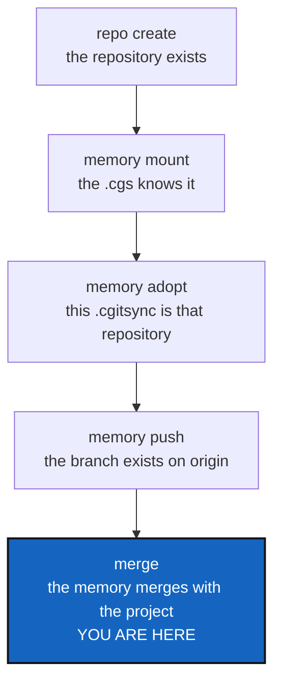

# MemoryOnboarding — a memory repository from nothing, without leaving cgitsync

*Created: 2026-09-17*

*Branch: memory-dev*

> **Owner direction — 2026-09-17, in conversation:** *"write a ticket for
> adding a workflow add-memory-repo-cgs as a class method for cgitsync. Use
> examples/complexgitsync4dev.cgs as a demo case. Then already manage the
> merging of the memory repo from memory-dev to main, knowing that the
> branch main doesn't exists in origin neither project-name. They are almost
> never used functionality but they are crucial for an early adoption. One
> should be able to build up its ComplexGitSync project step by step. Add a
> Tutorial5 for memory management. I want you to integrate what I have to do
> now before being able to merge as a core example. We should also have a
> cgitsync command for creating a new repo on a gitProvider@owner or @group,
> what i did manually. A user shouldn't go out of ComplexGitSync."*

## Abstract — read this first

**The one-line version.** Today, getting a memory from "nothing" to "pushed
and mergeable" takes five manual steps outside the tool; this ticket makes
each of them a command, and writes the tutorial that walks through them in
order.

**What this document is.** The plan for the steps a person runs **once per
project**, in the order they run them: create the repository, mount it,
push it the first time, and merge it when the project branch merges.

**Why it exists.** Everything after the first time works already — a mounted
memory is an ordinary private/local repository and every tree command covers
it. It is the first time that does not work, and the first time is the one
every new user meets. A tool that says *"the repository is yours to create,
with `gh repo create …`"* has sent its user somewhere else at the exact
moment they were deciding whether to keep using it.

**What you will find.** §1 what is missing today, measured on this
workspace. §2 the sequence the owner must run now — which is the tutorial's
worked example and this ticket's acceptance test. §3 creating a repository
from `cgitsync`, and the rule it reverses. §4 adding an entry to a `.cgs`
that already exists. §5 the first branch, and a merge whose target has never
existed. §6 the decisions. §7 the work packages. §8 acceptance. §9 what this
refuses.

**Who it is for.** The owner first, for §6. Then whoever builds it.

**What you need to do with it.** Read §2. It is the whole ticket in eleven
commands; everything else says how each of them is built.



---

## 1. What is missing today

Measured on this workspace, 2026-09-17:

| Step | Command today | What actually happens |
|---|---|---|
| Create the repository | none | `memory init` prints `gh repo create flipoyo/.memory --private` and stops |
| Add the entry to a `.cgs` | none | `memory init` prints the line and says *"add this entry to your .cgs"* — by hand, in an editor |
| Make `.cgitsync` that repository | none | `memory clone` refuses: the branch has *"never been pushed"*. `memory push` refuses: *"not a repository yet"* |
| Push the first branch | none | there is nothing to push from |
| Merge it with the project | `merge` | the target branch of the memory has never existed, so there is nothing to merge into |

Two of those refusals are correct and stay: `memory clone` must not invent a
branch from a typo, and `memory push` must not push a directory that is not
a repository. **What is missing is the step between them**, and it has no
name yet.

The state of the real repository, which §2 works against:

```
$ git ls-remote --heads git@github.com:flipoyo/.memory
ee601f22…  refs/heads/main          # created by hand, holds one commit

$ pixi run cgitsync memory init
branch=ComplexGitSync_memory-dev     # the branch this project branch needs
mounted=false                        # .cgitsync is a plain directory
```

So `main` exists, `ComplexGitSync_memory-dev` does not, and `ComplexGitSync`
— the branch the memory merges **into** when `memory-dev` merges into `main`
— does not either. That last one is the case §5 is about, and it is the one
that cannot be reached by doing the normal thing twice.

Finally, **no command adds a repository to a `.cgs` that already exists.**
`create-cgs` writes a whole new file from arguments; `configure` builds one
interactively from scratch. Both replace; neither appends.

## 2. The sequence — the owner's, and the tutorial's

This is what has to be run on ComplexGitSync itself before `memory-dev` can
merge into `main`. It is the acceptance test of §8 and the worked example of
Tutorial 5, and it is written here once so the three cannot drift apart.

```bash
# 0. Where we are: project on memory-dev, memory not yet a repository.
pixi run cgitsync status            # cgitsync_branch=memory-dev
pixi run cgitsync memory status     # states=…, entries=…, verification=verified

# 1. The repository, created without leaving cgitsync (§3).
pixi run cgitsync repo create github:flipoyo/.memory --private
#    Already created by hand on 2026-09-16 — the command must say so and
#    succeed, not fail. See §3's "already there" rule.

# 2. The .cgs learns about it (§4). The demo case the owner asked for.
pixi run cgitsync memory mount --cgs examples/complexgitsync4dev.cgs
#    Appends one entry under repos, keeping the file's own formatting:
#    { repository = "github:flipoyo/.memory", relative_path = ".cgitsync",
#      default_branch = "ComplexGitSync", fallback_branch = "main",
#      private = true, writable = true },

# 3. This .cgitsync becomes that repository, on this branch's memory (§5).
pixi run cgitsync memory adopt
#    Keeps every State and ledger entry already on disk. Creates the branch
#    ComplexGitSync_memory-dev locally, from origin/main.

# 4. The branch reaches origin.
pixi run cgitsync memory push
#    refs/heads/ComplexGitSync_memory-dev now exists.

# 5. The memory of the branch we are merging *into* is created (§5).
pixi run cgitsync memory branch --project-branch main
#    Creates and pushes ComplexGitSync, so the merge has a target.

# 6. The ordinary merge, which now covers the memory like any private repo.
pixi run cgitsync checkout main
pixi run cgitsync merge memory-dev --private
pixi run cgitsync merge memory-dev
pixi run cgitsync push --private && pixi run cgitsync push
```

Steps 1 to 5 happen **once per project, ever**. Step 6 is the ordinary
release flow, unchanged. That ratio is the whole argument for this ticket:
rarely used, and met by everyone.

## 3. Creating a repository from `cgitsync`

### 3.1 The rule this reverses

`memory/repository.py`'s `creation_command` states the current position:

> ComplexGitSync never creates a repository on a host: it speaks Git and
> nothing else, and teaching it a provider's API would mean a network call
> and a stored credential where there is neither.

The owner's answer is direct: *"A user shouldn't go out of ComplexGitSync."*
The reasoning behind the rule was never about creation being wrong — it was
about **credentials**. So the rule is amended, not dropped:

> ComplexGitSync stores no credential and implements no provider's API. When
> a repository must be created, it runs the provider's own command-line
> tool, which the user has already signed in to.

Nothing is stored, nothing is invented, and the network call is made by the
program that already owns the token.

| Provider | Tool it runs | Signed in with |
|---|---|---|
| `github` | `gh repo create <owner>/<name> [--private]` | `gh auth login` |
| `gitlab` | `glab repo create <group>/<name> [--private]` | `glab auth login` |
| `codeberg` / Gitea | `tea repo create --name <name> --owner <owner>` | `tea login add` |

**The owner or group comes from the identifier**, parsed by `parse_repo_id`
and by nothing else: `github:flipoyo/.memory` is owner `flipoyo`, and
`gitlab:some/group/project` is group `some/group`. That answers the owner's
*"on a gitProvider@owner or @group"* without a second spelling to learn.

### 3.2 When the tool is missing, or the repository is already there

Two cases, and both must be ordinary rather than a failure the user has to
interpret:

- **The tool is absent or not signed in.** Print exactly the command to run
  — today's `memory init` behaviour, which was never wrong, only
  incomplete — and exit `2` (*could not run*). The user is told what is
  missing, once, with the fix.
- **The repository already exists.** Say so and exit `0`. Creating what is
  already there is the normal state of step 1 for anybody who did it by
  hand — as the owner did — and a tutorial whose first command fails on the
  second reading is a bad tutorial.

### 3.3 Where the subprocess lives

`git_runner.py` is the only module that imports `subprocess`, and it already
runs non-Git executables there — `tool_version` asks `pixi` and `dvc` their
versions for the ledger. So `git_runner.py` gains one function that runs a
provider tool and reports what it said, and a new Ring-1 `provider.py`
decides *which* tool and *which* arguments. That is the same split
`memory/repository.py` already uses: decide here, run there. No architecture
rule moves.

## 4. Adding an entry to a `.cgs` that already exists

The owner named this one: **`add_memory_repo_cgs`**, a client method.

It takes the `.cgs` to edit and the proposal `memory init` already computes,
and appends one entry under `repos`. Three things it must get right:

- **Keep the file the way it was written.** A `.cgs` is hand-written, with
  comments explaining every entry — `examples/complexgitsync4dev.cgs` is
  thirty lines of comment and five of `repos`. Re-serialising it through
  `cgs_format.to_cgs()` would produce a valid file that has lost every one
  of them. So the entry is **inserted as text**, in the file's own layout,
  and the result is then parsed and validated before it replaces anything.
- **Refuse to add it twice.** An entry for the same repository at the same
  `relative_path` means the file already says this; say so and change
  nothing.
- **Say what it wrote.** Print the line and the file, because the user is
  about to commit it.

The demo case is the one the owner named: `examples/complexgitsync4dev.cgs`,
which is *"the only checked-in spec that uses every kind of private entry"*.
A memory mount is the newest kind, so it belongs there — see D5 for what
that costs CI.

## 5. The first branch, and a merge whose target has never existed

### 5.1 Adopting a memory that is already on disk

By the time anybody mounts a memory, `.cgitsync` is full: States, a ledger,
commit logs, logs. **None of it may be lost**, which rules out cloning over
the directory — `memory clone` already refuses that, correctly.

So `memory adopt` does what a person would do by hand and what the
integration tests already do the long way: fetch the repository, put its
`.git` beside the files that are already there, create this project branch's
memory branch from the remote's default branch, and leave everything on disk
untouched and uncommitted. `memory push` then commits and pushes it, which
it already knows how to do.

### 5.2 A merge target that has never existed

When `memory-dev` merges into `main`, every private/local repository merges
`<base>_memory-dev` into `<base>` — `git_branch.private_local_branch` owns
that rule and nothing restates it. For `.localSpec` and `.claude` both
branches have existed for months. For the memory, **the target has never
existed at all**, because the memory was born on a feature branch.

`merge` must not paper over this. Merging into a branch that does not exist
is not a merge, and a command that silently creates one is a command that
hides a typo. Instead:

- **`memory branch --project-branch <name>`** creates the memory branch for
  another project branch and pushes it, from the memory's current head. It
  is explicit, it is one command, and it names what it did.
- **`merge` reports the missing branch by name** and names that command,
  instead of failing with Git's own message about an unknown ref.

The restriction that keeps this honest: this only ever applies to a
**private/local repository whose branch the rule derives**. A project
repository whose branch is missing is a real problem and stays one.

## 6. Decisions — your call

### D1. What is the command that adds the entry called?

The method keeps the owner's name, `add_memory_repo_cgs`. The question is
the CLI spelling. Recommendation: **`cgitsync memory mount`**, in the
`memory` group beside `init`, `clone`, `push` — it is the same subject, and
`mount` is the word the specs already use for a repository placed inside a
tree. The alternative, a top-level `add-memory-repo-cgs`, matches the
method's name but leaves the `memory` group incomplete for no gain.

### D2. Is `repo create` its own command group?

Recommendation: **yes** — `cgitsync repo create <provider:owner/name>
[--private] [--description TEXT]`, a new top-level group whose first verb
this is. Creating a repository is not a memory operation; the memory is only
its first caller. Putting it under `memory` would mean moving it later.

### D3. Is adopting a memory a new verb, or a flag on `clone`?

Recommendation: **a new verb, `memory adopt`**. `memory clone`'s refusals
are its value — it will not overwrite a memory that is here, and will not
clone a branch nobody has pushed. A flag that switches both off is a
different command wearing the same name.

### D4. May `merge` create a missing private/local branch by itself?

Recommendation: **no.** It reports and names `memory branch`. A merge that
creates its own target cannot tell "this project branch is new" from "you
typed the branch name wrong", and the second is the common case. Say this
plainly, because it is the one place this ticket chooses a second command
over a silent one.

### D5. Does `examples/complexgitsync4dev.cgs` mount the memory?

The owner asked for it as the demo case, so: **yes**, with one thing to
know. CI runs `initialise examples/complexgitsync4dev.cgs` with read-only
permissions and no secrets, so it already cannot clone the three private
repositories in that file; `.memory` makes four. The entry must therefore be
added **only after `ComplexGitSync` exists on origin** — step 5 of §2 —
because a mount whose branch does not exist fails differently from one that
is merely unreachable, and the second is what CI already tolerates.

### D6. Does the ledger record which tool created a repository?

Recommendation: **no.** The toolchain is the five tools that produce a
State; `gh` produces none. The command and its arguments are already in the
entry's `argv`, which is where "what was run" belongs.

## 7. Work packages

| # | Depends on | Touches | Delivers |
|---|---|---|---|
| **WP-1** | D2 | `provider.py` (new), `git_runner.py`, `cli/configuration.py` | `cgitsync repo create` for GitHub, GitLab and Codeberg, with §3.2's two ordinary cases |
| **WP-2** | D1 | `memory/repository.py`, `orchestre.py`, `cli/expert.py` | `add_memory_repo_cgs` and `memory mount`: one entry appended to an existing `.cgs`, comments intact, validated before it replaces the file |
| **WP-3** | D3 | `orchestre.py`, `operations.py`, `cli/expert.py` | `memory adopt`: a `.cgitsync` full of States becomes the memory repository, losing nothing |
| **WP-4** | D4 | `orchestre.py`, `cli/expert.py` | `memory branch --project-branch`: the memory branch for another project branch, created and pushed |
| **WP-5** | D4 | `operations.py` | `merge` names the missing private/local branch and the command that makes it, instead of reporting Git's unknown-ref error |
| **WP-6** | WP-1…WP-5 | `examples/complexgitsync4dev.cgs` | The memory entry, added by `memory mount` itself rather than by hand — the demo case, and its own first test |
| **WP-7** | WP-1…WP-6 | `tutorials/05_memory.md`, `tutorials/README.md`, `tutorials/01`…`04` | Tutorial 5, §2 as its worked example; the four existing tutorials renumbered from "of 4" to "of 5" |
| **WP-8** | all | `tests/` | §2 run end to end against a bare repository, plus each refusal in §3.2 and §5.2 |
| **WP-9** | all | `README.md`, `docs/Text/user_guide.tex`, `docs/Text/api_python.tex`, `.localSpec/AdditionalSpecs.md`, this ticket | Every new command documented in both layers, the amended rule of §3.1 written into the spec, then archived under [TICKETLIFECYCLE.md](../../../.agentSpec/TICKETLIFECYCLE.md) |

## 8. Acceptance

- The eleven commands of §2 run in order, on this workspace, and end with
  `memory-dev` merged into `main` with its memory merged too.
- `cgitsync repo create` creates a repository on GitHub; run a second time
  it says the repository is already there and exits `0`; with `gh` absent it
  prints the command to run and exits `2`.
- `cgitsync memory mount --cgs examples/complexgitsync4dev.cgs` adds one
  entry and leaves every comment in that file exactly as it was.
- `cgitsync memory adopt` turns a `.cgitsync` holding States into the memory
  repository without losing one of them, and `cgitsync verify` still answers
  `verified` afterwards.
- `cgitsync merge` against a private/local repository whose target branch
  does not exist names the branch and names `memory branch`.
- Tutorial 5 walks §2 from an empty account to a merged memory, and the
  other four tutorials say "of 5".
- No step in the tutorial asks the reader to run a command that is not
  `cgitsync`.
- `pixi run lint` and `pixi run test` pass.

## 9. What this is not

- **A provider API client.** No token is read, stored or sent by this
  project. It runs a tool the user already signed in to, or it says it
  cannot.
- **An automatic anything.** Every step of §2 is typed by a person. A memory
  that mounts itself is a memory that mounts itself on the wrong machine.
- **A change to how a mounted memory behaves.** Once mounted, it is an
  ordinary private/local repository and every tree command already covers
  it. This ticket only builds the path to that state.
- **A replacement for `memory init`.** `init` still proposes and explains;
  the new commands are what a reader does with what it proposed.
