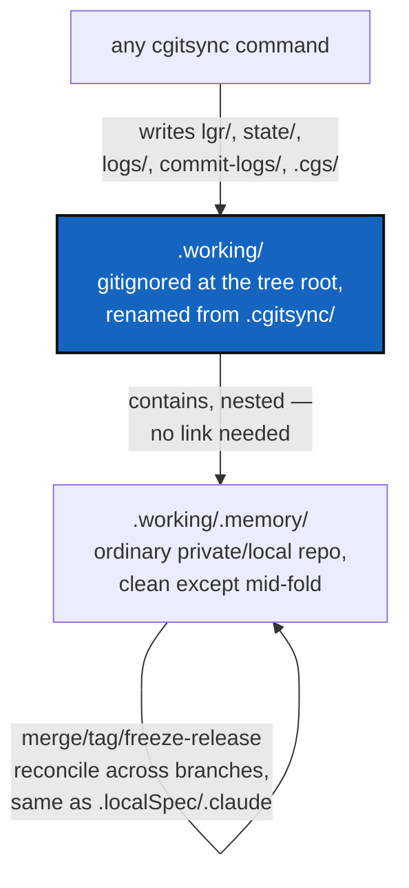

# WorkingTransitionState — .working, the frontier between what is and what will be

*Created: 2026-09-17*

*Branch: memory-dev*

> **Owner direction, in the short ticket
> (`.localSpec/DevTickets/shortTickets/working-transition-state.md`),
> answered further in conversation:** *"Do not exclude .memory from
> private/local scope for merge/checkout/tag. [...] Create a .working area
> that is exactly what is at the heart of the issue. The frontier between
> .memory and .working is exactly between what is and what will be.
> .working is just a transition state between 2 memory syncs that leads to
> a new stable .memory state. .working is not part of what is merged, add
> or pushed, is what will become the next .memory increment for the next
> action on the GitTree."* — followed by two confirmed decisions: `memory
> push` is what folds it in, and reads should reach `.memory`'s
> already-folded content without a second copy of it.
>
> **Revised the same day, layout only:** *"a mount .working/.memory would
> be way clearer than .working next to .cgitsync with a link towards
> .cgitsync in .working. having .memory rather than .cgitsync is much
> clearer for anyone."* `.memory` nests **inside** `.working`, at
> `.working/.memory`, rather than sitting beside it with a symlink between
> them — nesting *is* the link, so no separate link mechanism is needed at
> all (§2's original symlink proposal is withdrawn). `.cgitsync` is also
> renamed to `.working` throughout: the historical name described the tool
> that wrote there, not what the directory is.

## Abstract — read this first

**The one-line version.** `.cgitsync` has been doing two jobs at once: it
is `.memory`'s git repository, and it is also ComplexGitSync's own live
state directory, written by every command. Those two jobs cannot share one
directory — a repository that is *always* being written to can never be
safely checked out or merged, which is exactly what broke
`merge --all memory-dev --into main` on this project's own tree today
(`memory-dev_MergeMemoryExclusion`, archived the same day, fixed the wrong
half of the problem). `.working` — the renamed, front-facing successor to
`.cgitsync` — becomes the second job's home; `.memory`, git-tracked, nests
one level inside it at `.working/.memory`, folded by `memory push` at the
moments the owner chooses. Once live writes stop landing inside
`.working/.memory`'s own worktree, it goes back to being an ordinary
private/local repository — reconciled across branches by
`merge`/`tag`/`freeze-release` exactly like `.localSpec`/`.claude`, no
special-casing needed anywhere.

**What this document is.** The design for `.working` and the `.memory`
mount nested inside it, what moves where, what `memory push` does
differently, and what today's exclusions (`is_memory_mount`,
`iter_write_scope`) this milestone removes because they are no longer
needed.

**Why it exists.** `MergeMemoryExclusion`'s preflight fix was necessary but
not sufficient: it stopped `merge` from *refusing* over `.memory`'s
dirtiness, but the merge *action* still runs a real `git checkout` inside
`.memory`, and `.memory`'s worktree is never actually clean — `.cgitsync`
keeps gaining new `lgr/`, `state/`, `logs/`, `commit-logs/`, `.cgs/` files
for as long as any command is running. On this project's own tree, with 94
accumulated ledger entries, that checkout failed for real — Git correctly
refusing to discard uncommitted content — and left `docs`/`.localSpec`/
`.claude` on `main` while root and `.memory` stayed on `memory-dev`,
mid-merge. Recovered by hand the same day: `memory push` to clear
`.memory`, then a direct `git checkout`/`merge --ff-only` inside
`.cgitsync`, then `merge --all` finished the rest idempotently. `.working`
is the fix that makes that recovery unnecessary in the first place.

**What you will find.** §1 what moves where, and why. §2 nesting instead
of a link — what changed from the first draft. §3 what `memory push` does
now. §4 what this milestone undoes from today's earlier fixes, and why
that is correct rather than wasted work. §5 open questions the owner
should confirm before implementation starts, including migrating this
project's own tree. §6 acceptance.

**Who it is for.** Whoever implements this milestone, and whoever next
wonders why `.memory`'s worktree is clean where it used to be dirty.

---

## 1. What moves where

Today, everything under `.cgitsync/` except `.git/` is live-written by
ordinary command execution and tracked directly in `.memory`'s history:

| Directory | Written by | Where it lives now |
|---|---|---|
| `lgr/` | every command, one entry per operation (`memory/ledger_store.py`) | `.working/lgr/` — pending; folds into `.working/.memory/lgr/` |
| `state/` | `orchestre.write_gts_snapshot`, every command that writes a `.gts` | `.working/state/` — pending; folds into `.working/.memory/state/` |
| `logs/` | `CommandRunLogger`, every command | `.working/logs/` — pending; folds into `.working/.memory/logs/` |
| `commit-logs/` | `commit`/`push`, what they published (`memory/commit_log.py`) | `.working/commit-logs/` — pending; folds into `.working/.memory/commit-logs/` |
| `.cgs/` | `write_gts_snapshot`'s stable per-branch copy | `.working/.cgs/` — pending; folds into `.working/.memory/.cgs/` |
| `README.md` | written once, by `memory init`/`memory adopt` | stays put — written directly into `.working/.memory/`, never pending |

`.cgitsync` is renamed to `.working` throughout — the tree root's
`.gitignore` line changes from `.cgitsync` to `.working` (`git_tree.py`'s
`sync_gitignore`), and every path constant that named `.cgitsync` is
renamed with it. `.memory`, the git-tracked mount, nests one level inside:
`.working/.memory/`. `memory_mount_path(workspace)`
(`memory/repository.py`) returns `workspace / ".working" / ".memory"`;
`MOUNT_PATH` becomes `".working/.memory"`. A new `working_path(workspace)`
beside it names the outer, non-git root — `.memory`'s own parent.

Nesting means `merge`/`checkout`/`commit`/`push`/`pull` still never need
to know `.working`'s pending content exists: none of them look above
`.working/.memory` (the mount's own `relative_path`, from the `.cgs`
entry), so the sibling directories one level up are simply outside every
repository's boundary, `.memory`'s included — its own `git status` only
ever sees `.working/.memory/`, unaffected by whatever `.working/lgr/`
holds at any moment. No `is_memory_mount` check, no `iter_write_scope`,
nothing to exclude — the exclusion is geography, not logic, same
conclusion as the first draft, reached by nesting instead of a sibling
plus a symlink.

## 2. Nesting instead of a link

The first draft of this ticket proposed `.working` and `.memory` as
siblings with a symlink between them, so a reader needing the *complete*
picture — folded plus pending — could compose both without `.working`
holding a second copy of `.memory`'s growing history. Nesting reaches the
same place more directly: `.working/.memory/lgr/` **is** the folded
history and `.working/lgr/` **is** the pending increment, both ordinary
subdirectories of `.working`, no indirection required. A person with a
plain `ls`/`cd` sees the relationship without being told about it, which
was the whole benefit the symlink was reaching for.

Every reader that today does `read_all_entries(workspace / ".cgitsync" /
"lgr")` becomes two calls — `read_all_entries(workspace / ".working" /
".memory" / "lgr")` for the folded history and `read_all_entries(workspace
/ ".working" / "lgr")` for the pending increment — merged by the ledger's
own ordering (`lgr/000094.toml` before `lgr/000095.toml`, continued
numbering — see §5's open question on this).

## 3. What `memory push` does now

`memory_push` (`orchestre.py`) currently does, inside `.cgitsync` directly:
stage everything pending, commit, push. It becomes, in order:

1. Move (not copy — `.working`'s whole point is to empty out) every file
   under `.working/{lgr,state,logs,commit-logs,.cgs}` into the matching
   path one level down, under `.working/.memory/{lgr,state,logs,commit-logs,.cgs}`.
2. `git add -A`, commit, push — exactly as today, now inside a
   `.working/.memory` worktree that had nothing else pending, because
   nothing else ever writes there.
3. `.working`'s own top level (everything but `.memory/`) is empty again,
   ready for the next command to start refilling it.

This is still the same one explicit, never-automatic command
(`memory_push`'s own docstring: *"Offline is not a failure mode, it is the
normal case"*) — folding is part of what "send what the memory gained"
already means, not a new step the owner has to remember to run first.

`.working/.memory`'s worktree is dirty only for the moment inside step
1–2 above, never for the lifetime of an unrelated command — which is what
makes it safe for `merge`/`checkout`/`tag`/`freeze-release` to check it
out and merge it like any other private/local repository again.

## 4. What this undoes, and why that is correct

Three fixes landed earlier today exist only because `.memory`'s worktree
was permanently dirty. Once `.working` ships, none of them are wrong to
have built — dirtiness was real at the time — but all three become dead
weight once nothing writes into `.memory`'s tree between folds:

- `WorkingRepo.is_memory_mount` and `operations.iter_write_scope`
  (`MemoryScopeExclusion`) — `add`/`commit`/`push` stop needing to skip
  `.memory`; there is nothing there for them to wrongly sweep up any more.
- `_restart_tree`'s use of `iter_write_scope` (`PullMemoryExclusion`) —
  `pull` can check out `.memory` like any other private/local repo.
- The worktree/tracking preflight exemptions in `_collect_worktree_diagnostics`/
  `_collect_tracking_diagnostics`, and `_refresh_memory_mount_state`'s
  READY-marking (`MergeMemoryExclusion`) — `.memory` reaches `READY` the
  same way every other repository does, through the ordinary checkout
  refresh, because it is actually checked out and merged again.

Removing these is part of this milestone's own acceptance, not a follow-up:
a `WorkingRepo.is_memory_mount` field that nothing reads is exactly the
kind of leftover this project's own architecture boundary asks not to
leave behind. `status`'s dirty-note (`_StatusView.memory_dirty`) also
becomes rare rather than routine — worth keeping (a mid-fold dirty read is
still real and still deserves the explanation), but it will stop being the
first thing every `status` call prints.

## 5. Open questions for the owner, before implementation

1. **Ledger numbering across the fold.** `lgr/000094.toml` sits in
   `.working/.memory`; the next command's entry is `000095.toml` — written
   directly into `.working` at that number, or renumbered at fold time?
   Proposed: whatever writes a new `lgr` entry asks `.working/.memory/lgr`
   for the highest number already folded and continues from there, so
   numbering stays one sequence across both halves and a fold never
   renumbers anything it moves.
2. **What happens to `.working` on a fresh clone / `memory clone`?**
   `.working/.memory` clones with `git clone` (into that nested path
   directly, so nothing needs moving afterward); `.working`'s own top
   level is not git content at all, so a second machine starts with
   nothing pending there — created empty by whatever command first writes
   into it, or eagerly by `memory_adopt`/`memory_clone` themselves. Either
   is fine; whichever is simpler to implement.
3. **Migrating this project's own tree.** `examples/complexgitsync4dev.cgs`
   declares `relative_path = ".cgitsync"` today, and this project's own
   workspace holds real history there — 94+ ledger entries, the merge this
   ticket exists because of. Landing this milestone means: move
   `.cgitsync/` to `.working/.memory/` on disk (a plain `git mv`-style
   move inside the mount, not a re-clone — the `.git` directory and its
   history travel unchanged), update the `.cgs` entry's `relative_path`,
   and update the root `.gitignore` line. Whether that is a manual,
   documented one-time step for this project (and anyone else who already
   mounted a memory before this milestone) or a small `cgitsync memory
   migrate` command that does the move generically is the owner's call —
   this project is the only tree that needs it today, which argues for
   documenting it once rather than building a command for an audience of
   one, but a second early adopter would want the command.

## 6. Acceptance

- A workspace with a mounted memory and real accumulated history — this
  project's own tree is the test case that broke today — runs
  `merge --all memory-dev --into main` (or `--private`, or `checkout` alone)
  without `.memory` ever refusing a checkout, live, no dry-run needed to
  prove it.
- `.working`'s own top level (outside `.memory/`) holds only what has
  accumulated since the last `memory push`; `.working/.memory`'s own
  worktree is clean immediately before and immediately after every command
  except during a `memory push` itself.
- `memory status`/`memory list`/`memory show`/`verify` answer identically
  to today, reading folded and pending content from their respective
  nested paths.
- This project's own workspace is migrated: `.cgitsync/` moved to
  `.working/.memory/`, `examples/complexgitsync4dev.cgs` and the root
  `.gitignore` updated, verified with the same live `merge --all
  memory-dev --into main` that broke today.
- `is_memory_mount`, `iter_write_scope`, and the preflight/READY exemptions
  named in §4 are removed, not merely unused — with the tests that
  exercised them (`tests/unit/test_repo_scope.py::TestIterWriteScope`,
  the `.memory`-specific cases in `tests/integration/test_memory_onboarding.py`)
  replaced by tests that exercise `.working` instead.
- `.localSpec/AdditionalSpecs.md`'s `git_repo.py`/`operations.py`/`memory/`
  rows are rewritten to describe `.working`, not the exclusions it
  replaces.
- `pixi run lint` and `pixi run test` pass.
