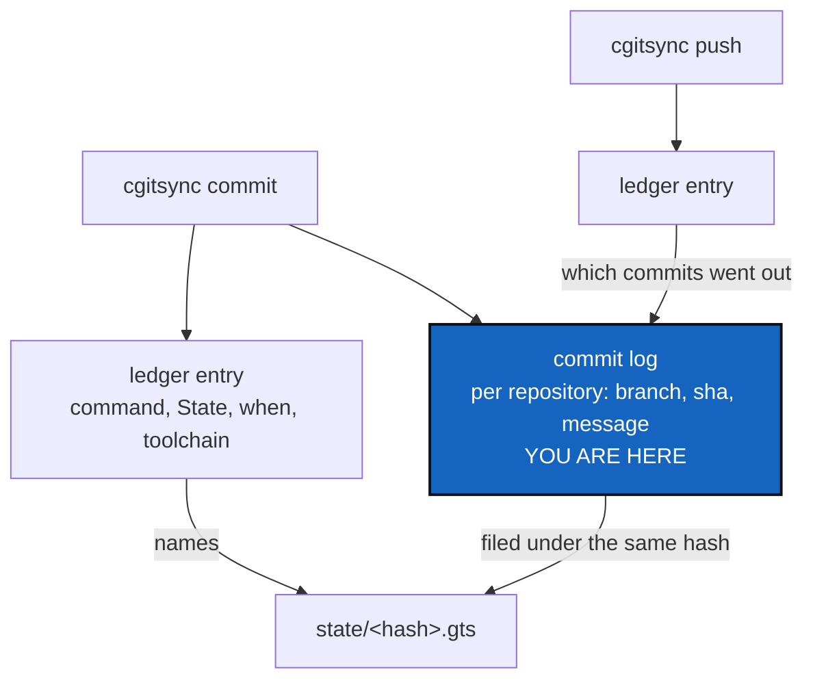

# CommitMemory — a memory should say what was committed, not just that something was

*Created: 2026-09-16*

*Branch: memory-dev*

> **Milestone M7** of [MemoryArchitecture](memory-dev_1-1_MemoryArchitecture_DevPlanTicket.md).
> From the owner's short ticket
> `.localSpec/DevTickets/archive/.closedUserTicket/20260916_addCommitMsgToMem.md`:
> *"Add a memory of cgitsync committed messages for project and private.
> This may be a special section of .cgitsync/commit-logs. commits messages
> should be linked to their push and accessible via the knowledge of state
> hash.gts."*

## Abstract — read this first

**The one-line version.** The ledger records that a `commit` happened and
which State it produced; it does not record what was written, in which
repository, or whether it was ever published — so the memory cannot answer
the first question anybody asks of it.

**What this document is.** A milestone that adds one thing a memory holds,
and the two links that make it worth holding: a commit to its State, and a
commit to the push that published it.

**Why it exists.** Read a ledger today and you learn that on 16 September a
`commit` ran and produced `state(2acdc98…)`. You cannot learn what it said.
The message is the part a human recognises the work by, and it is the part
that disappears first: a branch is deleted, a fork goes away, a repository
is archived, and the commit is gone while the memory still claims to
remember the operation.

**What you will find.** §1 what is recorded today and what is missing. §2
where the commit log lives and how it is reached. §3 the link to the push,
which is the hard half. §4 what must never go in it. §5 decisions. §6 work
packages. §7 acceptance. §8 what this is not.

**Who it is for.** Whoever takes M7. It needs
[MemoryRepoLocal](../archive/20260916_MemoryRepoLocal_DevPlanTicket.md) only for
the push half; the recording half is local and could land first.

**What you need to do with it.** Answer §5, then §6. D1 decides the shape
of everything after it.



---

## 1. What a memory records today, and what it does not

One ledger entry per operation, carrying `seq`, `prev`, `recorded_at`,
`command`, `argv`, `state_id`, `state_dir`, `outcome`, `toolchain` and
`entry_hash`. The State it names records each repository's `commit_sha`.

So a memory already knows **which commit** each repository was on. It does
not know:

| Missing | Why it matters |
|---|---|
| The message | The only part a person recognises the work by |
| Which repositories that one `commit` actually wrote | `commit` writes the project's repos; `commit --private` writes the configuration ones. One ledger entry, two very different acts |
| Whether it was ever pushed | A commit that exists on one disk is not history yet, and the memory currently cannot tell the difference |
| Its author and date | Recoverable from Git — while the repository still exists |

**Why not just read Git.** Because the memory is supposed to outlive the
machine and the repositories: that is the whole architecture. A memory that
can only be read with every repository still cloned and every branch still
alive is a memory that answers nothing on the day it is needed.

## 2. Where a commit log lives

The owner's shape: `.cgitsync/commit-logs`, reachable from a State's hash.
Proposal, to confirm in §5:

```
.cgitsync/commit-logs/<state hash>.toml
```

One file per State, named by the same content hash the State is filed
under — so "given `state/2acdc98….gts`, what was committed?" is answered by
swapping one directory name, with nothing to look up and no index to keep
in step.

```toml
[[commit]]
repository = "ComplexGitSync"
scope = "project"          # or "private"
branch = "memory-dev"
sha = "f336ecc5…"
message = "cgitsync2.63 A snapshot is now named by what it contains…"
authored_at = "2026-09-16T14:02:11Z"
```

Two entries in the ledger can name one State, so a commit log is **append-
only within its State**: a second `commit` that leaves the tree identical
adds rows, it does not replace the file.

## 3. The link to the push — the hard half

The owner asks that a message be "linked to their push". A commit and its
push are two operations, two ledger entries, and usually two different
States. The link has to be recorded when the push happens, because that is
the only moment both facts are in hand.

The shape that follows from what already exists: when `push` publishes a
repository, it knows the repository, the remote, the branch and the commits
that went out. It records that against the commits it published:

```toml
[[commit]]
sha = "f336ecc5…"
published = { at = "2026-09-16T16:43:32Z", remote = "origin", ref = "refs/heads/memory-dev", entry = 7 }
```

`entry` is the `seq` of the ledger entry for that push, so the chain and
the commit log point at each other and neither can be read as the whole
story on its own.

**A commit that was never pushed says so by having no `published` block.**
That is the difference the memory cannot express today, and the reason to
build this at all.

## 4. What must never go in it

`MemoryRepoLocal`'s gate G5 governs this file the moment it is pushed —
and where it is pushed to is now one shared `.memory` repository, one
branch per project, so a reader of any project's memory is a reader of the
repository. That raises the cost of getting this wrong, not the rules:

- **No absolute path, no OS user name.** A commit's author is a name and an
  email the repository already publishes; the *machine* the commit was made
  on is not recorded.
- **A commit message is authored content and travels as written.** It is
  not scrubbed, reflowed, or truncated: rewriting somebody's words to make
  them fit is the one thing a record must not do. If a message contains a
  secret, that secret is already in the repository's own history, and this
  file is not where that is fixed.
- **No diff, ever.** A memory records that a change happened and what it
  was called. It is not a second copy of the repository.

## 5. Decisions — your call

### D1. One file per State, or one section inside the ledger entry?

| Option | What happens |
|---|---|
| **A file per State** (recommended) | `.cgitsync/commit-logs/<hash>.toml`, reached by swapping a directory name. The chain stays small and fixed-size; a message of any length costs the ledger nothing |
| Inside the entry | One place to read, and the entry hash covers it for free — at the cost of a variable-size payload in every entry, and a schema change to a format that was fixed two milestones ago |

If A: **the entry must carry a digest of the commit log**, or the file is
the one part of a memory that can be edited without trace. That is one
fixed-size field, and it is what keeps the tamper-evidence honest. Adding
it is a change to `.localSpec/AdditionalSpecs.md`'s register schema, which
is exactly the ceremony that section exists for.

### D2. Does `commit --private` share the file, or get its own?

Recommendation: **one file per State, with a `scope` column**. The project
and the configuration repositories are two halves of one change — the same
reasoning that makes `CLAUDE.md` require one commit message for both — and
splitting them into two files makes the reader join them back.

### D3. What does `memory show` print?

Recommendation: the messages, one line per repository, under the entries
that produced them. A `--full` flag for bodies longer than a line, because
the common case is a subject line and the uncommon one should not make the
common one unreadable.

### D4. What happens to a commit log whose State is gone?

`verify` already reports `MISSING_STATE` for an entry naming a State that
is not there. Recommendation: a commit log with no State is the same class
of finding, reported and not deleted. Deleting evidence because its
neighbour is missing is how a record stops being one.

### D5. Does this land before or after MemoryRepoLocal?

The recording half needs nothing from M5. The `published` block needs
`push` to record what it published, which is also local. Only *sending* the
file anywhere is M5's business. Recommendation: **after M5**, so that the
first memory ever pushed already carries its commit logs — but it can move
earlier if the messages are wanted sooner than the repository.

## 6. Work packages

| WP | Depends on | Touches | Deliverable |
|---|---|---|---|
| **WP-C1** | D1, D2 | `memory/`, `.localSpec/AdditionalSpecs.md` | The commit-log format and its path, written into the spec beside the register schema before any code writes one |
| **WP-C2** | D1 | `memory/ledger_entry.py`, `memory/ledger_store.py`, the schema section | The digest field, if D1 says a file: one fixed-size field, and the migration note the schema section owes |
| **WP-C3** | WP-C1 | `operations.py`, `orchestre.py` | `commit` and `commit --private` record what they wrote: repository, scope, branch, sha, message, authored date |
| **WP-C4** | WP-C3 | `operations.py`, `orchestre.py` | `push` records what it published, against the commits it published, with the ledger `seq` that did it |
| **WP-C5** | D3 | `memory/`, `cli/expert.py` | `memory show` prints the messages; a client method carries the semantics, per the mirror rule |
| **WP-C6** | D4 | `memory/integrity.py`, `orchestre.py` | A commit log with no State, and a State whose commit log is edited, are both findings |
| **WP-C7** | all | `tests/` | §7's cases, each provoked: an unpushed commit, a pushed one, a private one, an edited log |
| **WP-C8** | all | `README.md`, `docs/`, this ticket | Documented, then archived under [TICKETLIFECYCLE.md](../../../.agentSpec/TICKETLIFECYCLE.md) |

## 7. Acceptance

- After `cgitsync commit "message"`, the memory holds that message, against
  the repository and branch it was written to, reachable from the State's
  hash alone.
- `commit --private` is recorded the same way and marked as the
  configuration half.
- A commit that has not been pushed is distinguishable from one that has,
  without asking Git.
- After `cgitsync push`, the commits it published carry the remote, the ref
  and the ledger entry that published them.
- Editing a commit log is detected by `verify`.
- `cgitsync memory show <hash>` prints the messages that belong to that
  State.
- No absolute path and no OS user name appears in any commit log.
- `pixi run lint` and `pixi run test` pass.

## 8. What this is not

* **A mirror of the repositories.** No diffs, no trees, no blobs. The
  memory says what happened and what it was called.
* **A commit message generator.** `CLAUDE.md` says who writes a message and
  how; this ticket only records what was written.
* **A replacement for `git log`.** While a repository is present, Git is
  the better answer. This is for when it is not.
