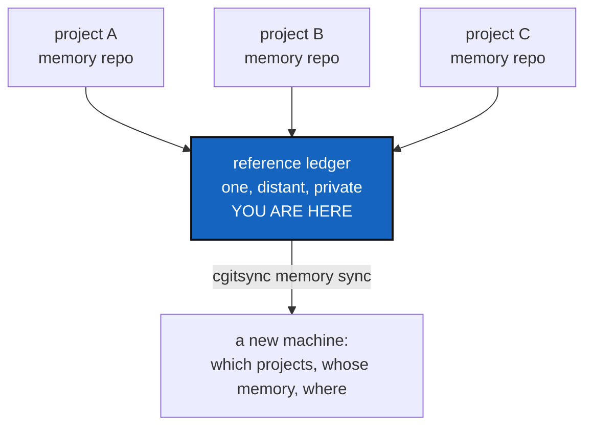

# MemorySyncDistant — one shared journal for several people's memories

*Created: 2026-09-12*

*Branch: memory-dev*

> **Milestone M6** of [MemoryArchitecture](memory-dev_1-1_MemoryArchitecture_DevPlanTicket.md).
> From the owner's
> `.localSpec/DevTickets/archive/.closedUserTicket/20260912_memorySpecs.md`: *"cgitsync should be capable of
> synchronizing local memory repos with its own private/distant global
> reference ledger that records all cgitsync administrated pushed
> private/local project-name/.cgitsync"*.

> **Reframed and moved to stand-by — 2026-09-16.** The owner's
> `.localSpec/DevTickets/archive/.closedUserTicket/20260916_memoryRepo.md`
> made every project's memory a branch of one shared `.memory` repository.
> That answers most of what this ticket was for — "which projects, and
> where is their memory" is now the branch list — and leaves the part
> nobody has designed: *"multi-user contribution to the global memory of a
> project … a problem of multi private/local sync into a single
> private/distant project journal"*, in the owner's words, with *"I do not
> have a clear view yet"*.
>
> So this is **priority 2**: real work, correctly identified, and not
> buildable until the question in §0 has an answer. Everything below §0 is
> the earlier design, kept because half of it — what such a repository must
> never hold, and how a client talks to one — survives whatever shape the
> answer takes.

## 0. The question this ticket now has to answer

Several people work on one project. Each has a private/local memory of it —
their own States, their own chain, their own commit logs — and each is
**valid**: nothing in them is wrong, they simply saw different things on
different machines at overlapping times.

The shared journal has to hold what the project as a whole did. So:

1. **Two chains, one journal.** A hash chain gives tamper-evidence, not a
   merge rule. Two people's entry `#7` are both legitimately `#7`. What
   does the journal's sequence mean, and who assigns it?
2. **What survives the merge.** A State is content-named, so the same tree
   seen by two people is one file — that part is solved, and it is why M2
   mattered. The ledger is the hard half.
3. **Who may write.** A journal everyone can append to is a journal anyone
   can lie in; a journal one person owns is a bottleneck and a single point
   of rewriting.
4. **What a reader gets.** Is the journal a merged history, an append-only
   pile of per-person chains, or an index pointing at each person's memory
   branch?

This architecture has said from the start that **it does not merge chains**
(§5 of MemoryArchitecture). If that stands, option 3 or 4 is the answer and
the journal is a set of chains side by side, not one chain. If it does not
stand, that refusal has to be withdrawn deliberately, here, in writing.

Nothing below settles any of this. Do not build from §1 until §0 is
answered.

## 0.1 A proposed answer — the journal is a DAG of published states

> **Owner direction — 2026-09-16, in conversation:** *"elaborate a solution
> that mimics blockchain behaviour for maintaining a unique register that
> are organised around hash… generate a distant project state that includes
> gitRepo explicitly in the hash, so that the distant repos chains more
> information than the local one"*. What follows is that idea worked out.
> It is a proposal for the owner to accept, amend or reject; nothing here
> is settled.

### What to take from a blockchain, and what to leave

| Take | Leave |
|---|---|
| **Hash-linked records** — each names its predecessors by hash, so no record can be changed or re-ordered without every later one noticing | **Consensus** — mining, stake, voting |
| **Content addressing** — a record's name is its content, so two people who saw the same thing write the same name | **A single total order** imposed by a protocol |
| **Append-only, verify-from-anywhere** | **A currency, a reward, a peer network** |

**Why consensus is the wrong half to copy.** A blockchain exists to decide
which of two *plausible contradictory* histories is true, because nothing
outside the chain can settle it. Here something can: the remote. Two
observations of `origin/main` at one moment cannot legitimately disagree,
and anyone with read access can ask. So we need the data structure, not the
protocol — and building a consensus mechanism for a problem that has an
arbiter would be ceremony, not safety.

**Why a DAG rather than a chain.** A chain has one parent per record and a
`seq`; two writers both produce `#7` and neither is wrong. A DAG has *zero
or more* parents and no sequence number at all. Git solved this problem
thirty years ago and this project is built on Git: a merge is a record with
two parents, order is partial, and a total order is computed for display
rather than stored. **This is how the architecture keeps its promise not to
merge chains** — it does not merge them; it holds both and records that
somebody saw both.

### The published state — the owner's "distant project state"

A local State answers *what one machine held*. It is a claim about a
working tree, and nobody else can check it.

A **published state** answers *what the remotes held* — and that is
checkable by anyone, from anywhere, with no clone:

```toml
[[repo]]
repository = "github:flipoyo/ComplexGitSync"   # the gitRepo, explicitly
ref        = "refs/heads/main"
commit     = "f336ecc5d1cc3abab0390e999d11818abe60c800"

[[repo]]
repository = "github:flipoyo/.localSpec"
ref        = "refs/heads/ComplexGitSync"
commit     = "9dd67b9e3eb62f4e2abef78dec651b8078ca6991"
```

`published_state_id = sha256(canonical form of the rows above)`.

Three properties fall out of putting the repository identity *inside* the
hash, which is exactly what the owner proposed:

1. **It converges.** Two contributors who observe the same remotes compute
   the same id. Identical observations collapse to one record instead of
   two, without anybody merging anything.
2. **It is falsifiable.** `git ls-remote <repository> <ref>` either returns
   that commit or it does not. A local State can only be trusted; a
   published state can be *checked*, years later, by someone who was never
   there.
3. **It says more than the local State.** The local one records where a
   tree sat and what it held; this one records what the world could see.
   That is the owner's "chains more information than the local one", and it
   is the information a shared journal actually needs.

### One record in the journal

One file per record, named by its own hash — the same shape as the local
ledger, for the same reason (see §2.2's merge property below):

```toml
[record]
id          = "sha256:…"                    # over everything below
parents     = ["sha256:…", "sha256:…"]      # zero at genesis, many at a merge
recorded_at = "2026-09-16T16:43:32Z"
contributor = "flipoyo"                     # named here, never in a local memory
project     = "ComplexGitSync"

[published_state]
id   = "sha256:…"
repo = [ … the rows above … ]

[local]                                     # the link back, not a copy
state       = "state(2acdc98…)"             # the local State this attests
memory_ref  = "refs/heads/ComplexGitSync_memory-dev"
ledger_head = "sha256:…"                    # that memory's chain head at the time
```

The `[local]` block is the join between the two layers: the journal says
"this published state was attested by this contributor, whose own memory
was at that chain head". Neither layer duplicates the other, and a reader
who has access to both can walk from a published commit back to the local
operation that produced it.

### How two people stop colliding

1. Each contributor works offline against their own local memory, exactly
   as today. Nothing in the local write path learns about the journal.
2. `cgitsync memory announce` fetches the journal branch, reads its **heads**
   (records nobody names as a parent), computes the published state from
   `git ls-remote`, and writes one record whose `parents` are those heads.
3. Two people doing that concurrently produce two records with the same
   parent — a fork, and both are true. The next announce names both and the
   fork closes. **No arbitration, no rewriting, no lost record.**
4. Pushing is a plain `git push` of new files. Because every record is a
   separate file named by its hash, **two contributors never touch the same
   file**: Git's own merge resolves it with no strategy, no driver and no
   custom code. A non-fast-forward means fetch and push again, and nothing
   is ever rebased or squashed.

That is the whole protocol. It is small because the hard parts are already
solved by content addressing (no duplicates) and by Git (no merge code).

### What verification becomes

`verify` on a journal can do something no local check can: **ask the
world.** For any record, `git ls-remote` each `repository`/`ref` pair and
compare. Three answers worth telling apart, in the spirit of the four this
project already gives:

| Answer | Means |
|---|---|
| **attested** | The remote still holds what the record says |
| **moved on** | The ref now points elsewhere — expected, and not a fault: history advanced |
| **contradicted** | Two records claim different commits for the same ref *at the same time*, or a commit named by a record is not in the remote at all |

**Contradicted** is the one that matters and the one a chain alone can
never produce. It is also, deliberately, *reported and not resolved*: the
journal records that two contributors disagreed, and a person decides what
that means.

### Decisions this proposal needs

- **D-A. Is the journal a DAG with no sequence numbers?** Recommended yes;
  it is the single change that makes many writers possible, and it keeps
  the local chain exactly as it is.
- **D-B. Does the published state come from `git ls-remote`, or from the
  local `.gts`?** Recommended `ls-remote`: a journal of what was published
  is worth more than a journal of what somebody's disk said, and it is the
  only version anybody else can check. It costs one network call per
  repository per announce.
- **D-C. Who may write to the journal, and how is the writer proved?**
  Recommended: whoever can push the branch, with **Git's own commit
  signatures** as the proof. `contributor` inside the record is a claim;
  the signed commit is the evidence. Do not invent a signature field.
- **D-D. Does "private/distant" still mean read-only here?** In the `.cgs`
  vocabulary `private` without `writable` is read-only, so a journal
  written by `announce` cannot be a `private/distant` mount in the current
  sense. Either the journal is mounted writable (and "distant" means a
  different account and provider, which is the security point), or
  `announce` pushes it outside the tree-wide scope entirely. **This
  collision must be settled before any code is written**, because it
  decides whether the journal is part of the tree at all.
- **D-E. What does a reader get by default?** Recommended: the DAG, shown
  in topological order with `recorded_at` breaking ties — presentation
  only, never stored, so no two readers can be given different histories by
  a stored ordering nobody can check.

### What this does not solve

- **Clock skew.** `recorded_at` is a claim by a machine. It orders
  presentation, never causality; causality is the `parents` edges.
- **A contributor who lies.** A signed record proves who wrote it, not that
  what they wrote was true. `ls-remote` catches a lie about a *current*
  ref; a lie about a ref that has since moved is unfalsifiable, and the
  journal should not pretend otherwise.
- **Deletion.** A record can be removed from the journal by whoever can
  force-push it. The DAG makes that visible — every child naming a missing
  parent is a finding — but visible is not impossible.

## Abstract — read this first

**The one-line version.** Every project's memory is pushed somewhere, and
one distant ledger records where — so a new machine can ask "what do I
administer, and where is its memory" and get a complete answer.

**What this document is.** The protocol milestone: what the distant
reference ledger holds, what it never holds, and what synchronising it
means.

**Why it exists.** After M5 each project's memory survives its machine,
but only if you already know the memory repository's name. A fresh laptop,
a colleague picking up the work, or a person coming back after a year has
no list. The reference ledger is that list, and keeping it on a provider of
its own means the account that holds the code cannot silently rewrite the
record of what was synchronised.

**What you will find.** §1 what the reference ledger holds. §2 what it
must never hold. §3 the protocol. §4 the decisions. §5 the work. §6
acceptance.

**Who it is for.** Whoever takes M6, after
[MemoryRepoLocal](memory-dev_1-5_MemoryRepoLocal_DevPlanTicket.md). Nothing here is
safe to build on a memory that has not passed M5's gates.

**What you need to do with it.** Settle §4, then §5. §2 is not negotiable.



---

## 1. What the reference ledger holds

One repository for every project this installation administers, holding an
index and nothing else. One record per project:

| Field | Example | Why |
|---|---|---|
| project name | `MyProject` | What the user calls it |
| memory repository | `github:you/.memory-MyProject` | Where the memory actually is |
| last pushed head | the ledger head hash at the last push | Lets a reader tell a stale record from a current one |
| recorded at | a timestamp | When this installation last announced it |

That is the whole schema, and keeping it that small is a design choice, not
laziness. Anything more turns a findable index into a second copy of
everything, with its own consistency problem.

It is **read-mostly and write-rarely**: one small record changes when a
project's memory is pushed.

### 1.1 The toolchain and the commit logs travel with the ledger, not with the index

Every ledger entry carries the versions that made it
([OneRegister](../archive/20260916_OneRegister_DevPlanTicket.md) §3.1), so they
reach another machine for free when the memory repository is pushed:
inside the entry, covered by its hash, verifiable by whoever pulls it.

The same holds for the commit messages
[CommitMemory](memory-dev_1-8_CommitMemory_DevPlanTicket.md) records: they
live beside the ledger, in the memory repository, and reach another machine
when that repository is cloned.

The reference ledger records none of it. It answers "which projects, and
where is their memory" — a version and a message belong to a record, not to
an index, and an index that duplicated them would be the second place they
could disagree.

## 2. What it must never hold

- **No States.** A `.gts` lives in its project's memory repository. The
  reference ledger points; it does not store.
- **No credentials, no machine identity.** M5's G5 applies here with no
  exceptions — this repository is the most widely shared thing in the
  system.
- **No private project content.** A project name and a repository address
  are already a disclosure: whoever can read the reference ledger learns
  every project this installation administers. That is a deliberate,
  documented consequence of having one, and the reason it is private and
  distant rather than public.

## 3. The protocol

Three operations, each one a command someone typed:

| Step | What happens |
|---|---|
| **announce** | After a memory push, this project's record in the reference ledger is updated with the new head |
| **discover** | Read the reference ledger and list every project it knows, marking which ones this machine has a workspace for |
| **adopt** | Given a project name from that list, clone its memory and stand up a workspace from the State the ledger names |

**Adopt is the payoff.** Everything before it is bookkeeping; this is the
step where a new machine goes from nothing to a working tree, from a name
alone. If adopt does not work, the whole memory path was an expensive way
to store files.

**Conflict is the hard part and must be answered, not avoided.** Two
machines announcing the same project, whose heads disagree, is the normal
case for a person with a laptop and a desktop. The minimum acceptable
behaviour: the announcement is refused, both heads are named, and the user
is told which command reconciles them. Silently taking the later timestamp
is how evidence gets lost.

## 4. Decisions — the owner's call

### D1. Is there one reference ledger, or one per person?

Recommended: **one per installation**, named in a per-user configuration
rather than in any project's `.cgs` — it is a property of who is
administering, not of what is administered. `master.py` already owns
per-workspace identity in `.cgitsync/master.toml`; this is the same kind
of fact, one level up.

### D2. What happens when a project is renamed or retired?

Recommended: records are never deleted, only marked retired, with the
timestamp. A reference ledger that forgets is a reference ledger you cannot
trust to be complete.

### D3. Does adopt trust the reference ledger?

It cannot, fully — the ledger says where a memory is, and the memory says
what the project was. Recommended: adopt clones the memory, verifies its
chain (M3's `verify`), and refuses to build a workspace from a memory that
does not verify. The reference ledger is an address book, not an authority.

## 5. The work

| WP | Depends on | Touches | Deliverable |
|---|---|---|---|
| **WP-D1** | D1 | `memory/`, `master.py` | Where the reference ledger is configured, and how a user points at theirs |
| **WP-D2** | WP-D1 | `memory/` | The record schema of §1, versioned like M5's G6 requires |
| **WP-D3** | WP-D2 | `memory/`, `operations.py` | announce, with §3's conflict rule |
| **WP-D4** | WP-D2 | `memory/` | discover |
| **WP-D5** | WP-D3, WP-D4, D3 | `memory/`, `orchestre.py` | adopt: clone the memory, verify it, build the workspace |
| **WP-D6** | WP-D5 | `cli/`, `README.md`, `docs/` | `cgitsync memory announce` / `discover` / `adopt`, each in the README table, the user guide and the API doc |
| **WP-D7** | all | `tests/integration/` | §6's cases, including two machines disagreeing |
| **WP-D8** | all | `.localSpec/AdditionalSpecs.md`, this ticket | The architecture section, then archive under [TICKETLIFECYCLE.md](../../../.agentSpec/TICKETLIFECYCLE.md) |

**Explicitly not here.** Any automatic or scheduled synchronisation.
Merging two divergent memory chains — §3 refuses and reports, and a real
merge rule is its own ticket. Anything resembling a hosted service:
everything here is Git repositories and commands.

## 6. Acceptance

- From a machine with no workspace and only a reference ledger address,
  `cgitsync memory discover` lists the projects, and `cgitsync memory
  adopt <name>` produces a working tree that `cgitsync status` reports as
  READY.
- Adopt refuses a memory whose chain does not verify, and says why.
- Two machines announcing divergent heads for one project: the second is
  refused, both heads are named, and the message says what to do.
- The reference ledger contains no `.gts`, no credential, no absolute path
  and no OS user name.
- Everything still works with no network except the three commands that
  are explicitly about the network.
- `pixi run lint` and `pixi run test` pass.
- [MemoryArchitecture](memory-dev_1-1_MemoryArchitecture_DevPlanTicket.md) is archived
  in the same commit: with M6 landed, the design it describes is the system
  that exists, and its content belongs in
  `.localSpec/AdditionalSpecs.md` rather than in an open ticket.
