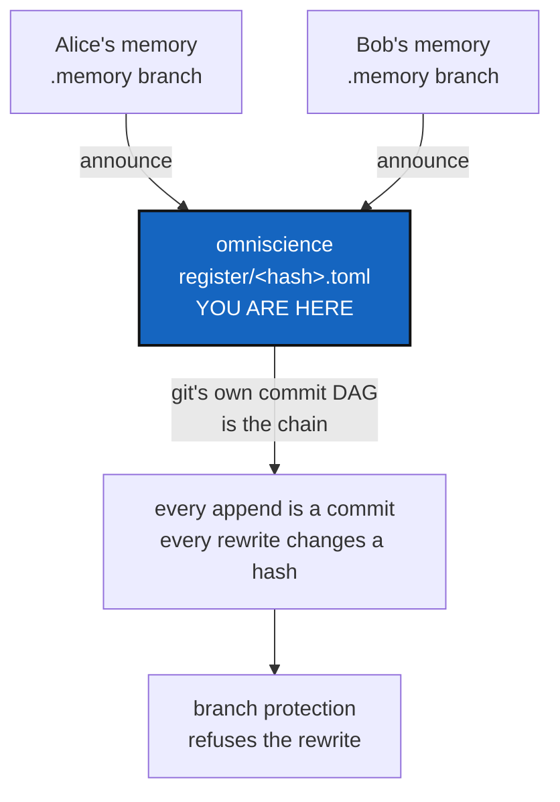

# Omniscience — the global register of a project, which nobody can quietly rewrite

*Created: 2026-09-16*

*Branch: memory-dev*

> **The architecture of the global project register.** It replaces
> MemorySyncDistant, which was designed as an index of where each project's
> memory lived — a question the shared `.memory` repository answered by
> making every memory a branch. What was left is this: several people, each
> with their own memory of one project, and one register that says what the
> project as a whole did.
>
> **Owner direction — 2026-09-16, in conversation:** *"it could be
> structured around a repo called omniscience that will behave in branch and
> P_branch as private writable does but the register that lies in it can be
> append-only by both cgitsync and direct git command, even by the owner"*.
> That sentence sets the whole shape, and one word in it — *even by the
> owner* — is the part Git cannot give for free. §3 is about that word.

## Abstract — read this first

**The one-line version.** One repository, `omniscience`, mounted like every
other private/writable repository, holding a register of what a project did
that grows by appending and that nobody — not even the person who owns it —
can shorten without everyone being able to see that they did.

**What this document is.** The architecture of the global register. It
designs; it builds nothing. Milestones come out of §7 once §5 is answered.

**Why it exists.** A private/local memory answers "what did *I* do to this
project". A project worked on by more than one person has no such answer:
each memory is true, none is complete, and a chain cannot merge with
another chain. The register is where the project's own history lives, and
what makes it worth anything is that it cannot be edited quietly.

**What you will find.** §1 what omniscience is and how it is mounted. §2
what one record holds. §3 append-only — what Git can and cannot promise,
which is the heart of this ticket. §4 how two people appending at once do
not collide. §5 the decisions. §6 what verification means here. §7 the
milestones. §8 what this refuses.

**Who it is for.** The owner first, for §5. Then whoever builds it.

**What you need to do with it.** Read §3 before anything else. If its
answer is not acceptable, the rest of the design changes shape.



---

## 1. What omniscience is

A repository named `omniscience`, mounted in a project's tree exactly as
`.memory`, `.localSpec` and `.claude` are:

```toml
{ repository = "github:flipoyo/omniscience", relative_path = ".omniscience", default_branch = "ComplexGitSync", fallback_branch = "main", private = true, writable = true },
```

**One branch per project, and `P_branch` per project branch.** The ordinary
private/local rule, unchanged: `ComplexGitSync` while the project is on
`main`, `ComplexGitSync_memory-dev` while it is on one of its own. Nothing
new is learned to use it, which is the same argument that settled `.memory`.

| | `.memory` | `omniscience` |
|---|---|---|
| Answers | What **I** did to this project | What **the project** did |
| Written by | One machine, one person | Everyone who works on the project |
| Holds | States, ledger, commit logs | Records of what was published, and who saw it |
| Rewritable | By its owner, detectably | **By nobody, and detectably** — §3 |

The two are layers, not alternatives. A memory is complete and local; the
register is partial by nature — it holds what people chose to announce —
and shared.

## 2. What one record holds

One file per record, named by its own content hash:

```
register/<sha256 of the record>.toml
```

```toml
[record]
recorded_at = "2026-09-16T16:43:32Z"
contributor = "flipoyo"
project     = "ComplexGitSync"

[published_state]
id   = "sha256:…"                               # over the rows below
[[published_state.repo]]
repository = "github:flipoyo/ComplexGitSync"    # the gitRepo, explicitly
ref        = "refs/heads/main"
commit     = "f336ecc5…"

[local]
state       = "state(2acdc98…)"                 # the local State this attests
memory_ref  = "refs/heads/ComplexGitSync"
ledger_head = "sha256:…"
```

**The published state is the load-bearing idea, and it was the owner's.**
Putting the repository identity inside the hash gives three properties at
once:

1. **It converges.** Two contributors who observe the same remotes compute
   the same id, so the same observation is the same file. Identical
   observations collapse instead of duplicating, and nothing has to merge.
2. **It is falsifiable.** `git ls-remote <repository> <ref>` either returns
   that commit or it does not. A local State can only be trusted; a
   published state can be *checked*, by someone who was never there and has
   no clone.
3. **It says more than a local memory.** A memory records what one disk
   held; this records what the world could see.

## 3. Append-only — what Git can promise, and what it cannot

The owner's requirement: *append-only by both cgitsync and direct git
command, even by the owner*. Three distinct claims live in that phrase, and
they have three different answers.

### 3.1 "By both cgitsync and direct git command" — yes, and it shapes the design

A person must be able to append with `git add` and `git commit`, with no
tool and no special knowledge. That single requirement rules out putting a
`prev` field inside each record: a human appending by hand cannot compute a
chain hash, and a format only a program can extend is not one a person can
write to.

**So the chain is Git's own commit DAG.** Each record is a file; each
append is a commit; the history is `git log`. Git has been an append-only,
hash-linked, concurrently-writable store since 2005, and this is exactly
the job it was built for. Nothing in the register re-implements any of it.

```bash
# What cgitsync does, and what a person can do by hand:
cp record.toml .omniscience/register/<hash>.toml
git -C .omniscience add register && git -C .omniscience commit -m "…"
```

### 3.2 "Append-only" — Git makes a rewrite *evident*, not *impossible*

This must be said plainly because the whole design rests on it:

> **No content in a Git repository can be made unrewritable by the
> repository itself.** Anyone who can push can force-push. What a hash
> chain — Git's or ours — gives is that a rewrite *changes every hash after
> it*, so anybody holding a previous copy can prove it happened.

Detection is not prevention. Prevention lives in exactly two places, and
neither is in this project's code:

| Where | What it does |
|---|---|
| **Branch protection on the host** | GitHub, GitLab and Codeberg can all refuse force-pushes and deletions on a branch. This is the enforcement, and it is configuration a person applies once |
| **A server-side hook** (self-hosted) | A `pre-receive` hook can refuse any push that is not a fast-forward, and refuse one that removes a file from `register/` |

`cgitsync` can *check* and *say*. It cannot enforce, because it has no
account, no token and no server — the same reason `memory init` does not
create a repository. **Pretending otherwise would be the worst outcome of
this ticket**: a register that claims to be unrewritable and is not is worse
than one that admits what it is.

### 3.3 "Even by the owner" — the part worth building for

The owner asking to be bound by the rule is the interesting half, and it is
achievable in the sense that matters: the owner cannot rewrite the register
*without everyone seeing it*.

Three things make that true, and all three are cheap:

- **Content-addressed records.** A record's name is its content, so
  changing one means deleting a file and adding another. There is no
  in-place edit that keeps a name.
- **Git's commit DAG.** Dropping a record rewrites every commit after it,
  so every clone in existence disagrees with the remote on the next fetch —
  loudly, because Git refuses to fast-forward.
- **Signed commits.** Who appended what is Git's answer, not a field we
  invent. A `contributor` line in a record is a claim; the signature on the
  commit is the evidence.

That is "append-only" in the only sense a distributed system can offer it:
**not that history cannot be changed, but that changing it cannot be
hidden.**

## 4. Two people appending at once

1. Each works offline against their own `.memory`. Nothing in the local
   write path knows the register exists.
2. `cgitsync memory announce` pulls the register's branch, writes one record
   file, commits, and pushes.
3. Two people doing that concurrently push two different commits. The second
   is refused as a non-fast-forward, pulls, and pushes again.
4. **The pull merges with no conflict**, because the two records are two
   different files. Git's own merge handles it — no strategy, no driver, no
   merge rule of ours.

This is why one-file-per-record matters more than it looks: it is what lets
Git do all of the concurrency work.

## 5. Decisions — your call

### D1. Is §3's answer acceptable?

**Answered by the owner, 2026-09-16: append-only means *impossible to
hide*.** `cgitsync` detects a rewrite and reports it; preventing one is
branch protection on the host, which a person applies once and which this
tool checks but never claims to enforce.

That settles the promise the register makes, and it is the honest one:
history can be changed, and changing it cannot be concealed from anyone
holding a previous copy. `cgitsync omniscience verify` says which of the
two protections you actually have, so nobody has to assume.

The alternative — refusing to announce into a register whose host does not
protect the branch — was rejected: it makes the register unusable on a host
that cannot protect branches, and it buys a guarantee the tool still cannot
give on its own.

### D2. One `omniscience` for all projects, or one per project?

`.memory` went one-for-all with a branch per project, and the same argument
applies — no new mount semantics, no new repository per project. The same
cost applies too: everyone who can read the register can read every
project's branch. Recommendation: one for all, matching `.memory`.

### D3. Who may append?

Recommendation: anyone with push access to the branch, with **signed
commits required** by branch protection. An unsigned append is then refused
by the host, and every record's author is provable without any field of
ours being trusted.

### D4. Does a record's published state come from `git ls-remote`, or from the
contributor's own `.gts`?

Recommendation: `ls-remote`. A register of what was *published* is worth
more than a register of what somebody's disk said, and it is the only
version a reader can check. It costs one network call per repository per
announce.

### D5. What does `announce` do when the register has diverged?

Recommendation: pull, then push again — never force, never rebase. A record
that lost a race is still true, so nothing is ever dropped to make a push
succeed.

### D6. Does omniscience hold States, or only records about them?

Recommendation: only records. A State is a `.gts` document that already
lives in someone's `.memory`; copying it into the register makes the
register a second store with a second copy to keep in step. The `[local]`
block names where it lives, which is enough for anyone with access to fetch
it.

## 6. What verification means here

`cgitsync omniscience verify` answers three questions, and each is worth
telling apart:

| Answer | Means |
|---|---|
| **intact** | Every file's name matches its content, and the branch's history is a fast-forward of the copy you had |
| **rewritten** | The remote's history is not a fast-forward of yours — records you hold are no longer in it. This is the finding the whole design exists to produce |
| **attested** / **contradicted** | For any record, `git ls-remote` agrees, or two records claim different commits for the same ref at the same moment |

**Rewritten is reported, never repaired.** The register does not heal
itself, the same rule the local ledger already follows: a store that can be
edited back into looking clean is evidence of nothing.

## 7. Milestones

Each is a ticket of its own, opened when D1 is answered:

| # | Milestone | Delivers |
|---|---|---|
| **O1** | The register format | `register/<hash>.toml`, the published state, and the spec section that fixes both |
| **O2** | `omniscience init` / `clone` | The mount, the branch rule, and the branch-protection instructions a person applies once |
| **O3** | `omniscience announce` | One record per announce, from `ls-remote`, committed and pushed, with the non-fast-forward retry of §4 |
| **O4** | `omniscience verify` | §6's three answers, including *rewritten* |
| **O5** | Two contributors, end to end | Two workspaces, one register, concurrent announces, a forced rewrite detected |

## 8. What this refuses to do

- **To claim it prevents anything.** §3.2. The tool detects; the host
  enforces; the ticket says which is which.
- **To merge chains.** It does not have to: Git's DAG holds both histories
  and the records are separate files. The architecture's refusal stands
  untouched.
- **To hold States, credentials, or diffs.** Records about published
  commits, and nothing else.
- **To be automatic.** Announcing is a command somebody types, like every
  other network operation in this project.
- **To resolve a contradiction.** Two contributors who disagree are
  reported. A person decides what that means.
