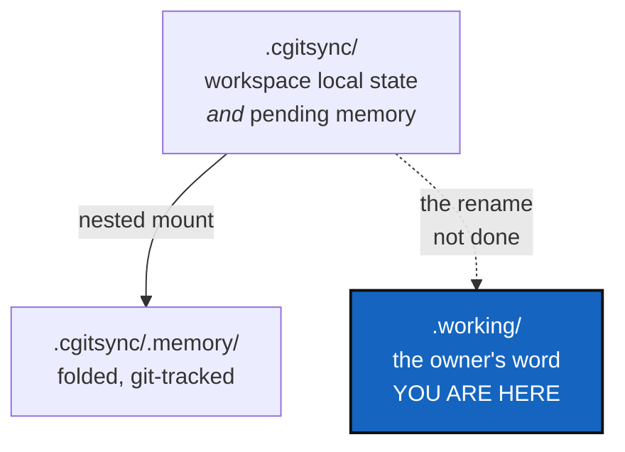

# WorkingAreaRename — the `.cgitsync` → `.working` rename, deferred on purpose

*Created: 2026-09-19*

*Branch: memory-dev*

> **Where this comes from.** The owner's short ticket
> `working-transition-state.md` (closed 2026-09-19 as
> `archive/.closedUserTicket/20260919_working-transition-state.md`) asked
> for a `.working` area. [WorkingTransitionState](../archive/20260917_WorkingTransitionState_DevPlanTicket.md)
> built the frontier it described and **deliberately kept the outer name
> `.cgitsync`**, recording why in its own header: `.cgitsync` names more
> than the memory feature — `settings.py`'s CGSHOME discovery,
> `snapshot_resolver.py` and `master.toml` all use it as the name of
> every workspace's local state, memory or no memory — so renaming it
> would migrate every cgitsync workspace in existence.
>
> That decision was right and this ticket does not reopen it. It exists
> because the decision currently lives only inside an archived document,
> and an archived ticket is a historical record that is never edited. The
> open question deserves a file that can be closed.

## Abstract — read this first

**The one-line version.** The word `.working` was the owner's, the thing
it named got built, and the name did not. This decides whether the name
ever follows.

**What this document is.** A stand-by ticket holding one question: is
`.cgitsync` renamed to `.working`, and if so how does every existing
workspace come across.

**Why it exists.** The frontier works. `.cgitsync/.memory` is the folded,
git-tracked half; `.cgitsync/`'s own top level is the pending half; the
merge failure that prompted all of it is fixed and covered by
`tests/integration/test_merge_into.py` and `test_push_folds_memory.py`.
What is left is vocabulary — and vocabulary that half-matches is its own
cost. Today `.cgitsync` means two things at once: the workspace's local
state area, and the pending increment of a memory. The owner's word for
the second one was `.working`, and it was a better word.

**What you will find.** §1 what the name costs today. §2 the migration,
which is the whole difficulty. §3 the cheaper alternative. §4 the
decision. §5 acceptance, if it goes ahead.

**Who it is for.** The owner, who owns §4.

**What you need to do with it.** Nothing, until the owner answers §4.
Read it before writing anything new that says `.cgitsync` in prose.

---

## 1. What the current name costs

Nothing functional. The cost is that one word carries two meanings:

| Meaning | Who relies on it |
|---|---|
| The workspace's own local state area, whether or not a memory exists | `settings.py` (CGSHOME discovery), `snapshot_resolver.py`, `master.toml`, `paths.py` |
| The *pending* half of a memory, waiting to be folded into `.cgitsync/.memory` | `memory/pending.py`, `memory/repository.py`, `orchestre.py`'s fold |

A reader meeting `.cgitsync/lgr/` beside `.cgitsync/.memory/lgr/` has to
already know which is which. `.working/lgr/` beside `.working/.memory/lgr/`
says it.

**No leak to fix.** `.working` appears nowhere in `src/`, `docs/`,
`tutorials/` or `README.md` — the only matches are `working_tree` in
`git_tree.py`, which is unrelated. The deferral was clean.

## 2. The migration is the whole difficulty

Every workspace anyone has ever created has a `.cgitsync/` directory, and
the tool finds workspaces *by that name*. A rename therefore means:

- Reading both names during discovery, for some period, with a rule for a
  directory that somehow has both.
- Deciding whether an old workspace is migrated in place, on first use,
  silently — and what happens when that fails halfway.
- `master.toml`, per-workspace and outside the `.cgs`/`.gts` spec, moving
  with it.
- The root `.gitignore` line in every tree the tool manages, which
  `git_tree.py`'s `sync_gitignore` writes.

This is exactly the shape of change that `memory-dev` exists for, which
is why this ticket is filed there and not on `main`: it migrates a stored
layout for every existing workspace, which is the narrowed test in
`AdditionalSpecs.md`'s *Branches and ticket topics*.

## 3. The cheaper alternative

**Rename nothing; name the halves in prose.** Keep `.cgitsync` as the
directory, and fix the ambiguity where it actually bites — in the words
the tool and its documents use. `memory/pending.py` already does this
well: it calls them *folded* and *pending*, consistently, and a reader of
that module is never confused. Spreading those two words to
`AdditionalSpecs.md`, `tutorials/05_memory.md` and `memory status`'s own
output would buy most of the clarity for none of the migration.

## 4. The decision

| D | Question | Recommendation | Whose call |
|---|---|---|---|
| **D1** | Rename, or name the halves in prose? | **§3, the cheaper alternative.** The frontier's real names are *folded* and *pending*, and those two words are better than `.working` at saying which side is which — `.working` says "not finished", which is true of both halves at different moments. A migration touching every workspace anyone owns is a large price for an outer directory name that users rarely type | **Owner** |
| **D2** | If D1 says rename: in place on first use, or only for new workspaces? | In place, on first use, with the old name still discovered for a full release cycle | Owner, if D1 goes that way |

## 5. Acceptance, if it goes ahead

- A workspace created before the rename keeps working with no user action,
  and says once what it did.
- A workspace created after it has no `.cgitsync` directory at all.
- `cgitsync status` shows `errors=0` on a migrated tree, and the ledger
  chain still verifies — the migration moves files and must not touch a
  single entry.

If D1 takes §3 instead, this ticket is archived with the decision
recorded, and the prose work lands as an ordinary documentation change on
`main`.
