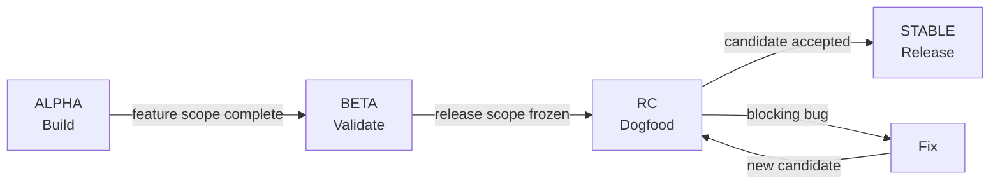
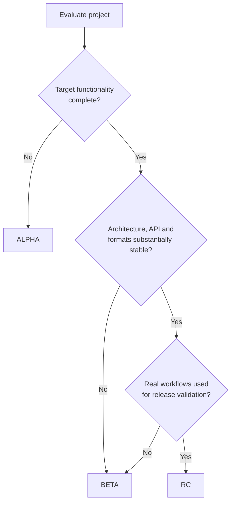
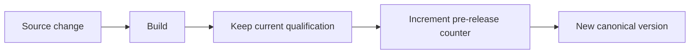
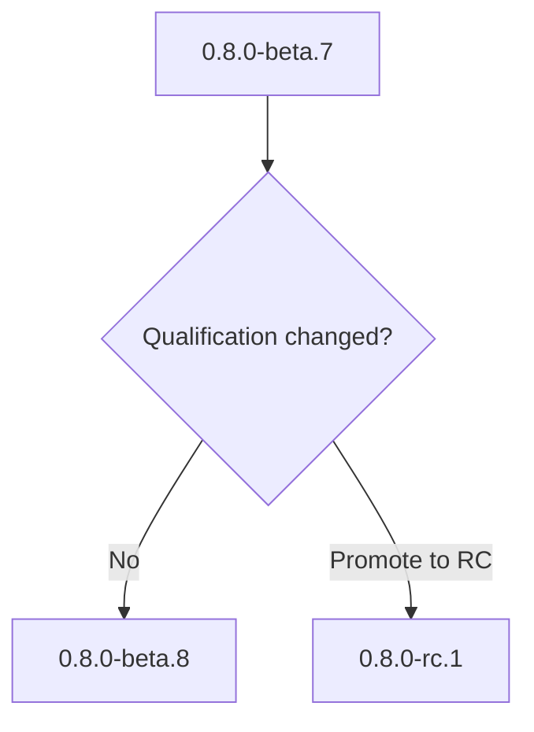
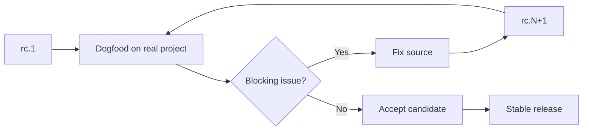

The agents do not follow properly the versioning. Patch is never incremented even following a bump-built that fixes bugs.

 It may be unclear in the specs. 
 
 If no bug fixed but pre-release feature dev. here are specs for versioning. They may be too complex and therefore playing with patch only may be more simple to implement for human only dev. The versioning section must be human understandable in less than 20 lignes of instructions. I don't want to be dependent of ai always. 
 
 They may be split between versioning and dogfooding. 
 # SemVer Pre-release Qualification and Build Bumping

## Goal

Define a simple and deterministic pre-release policy for ComplexGitSync.

The versioning lifecycle is:

```text
alpha → beta → rc → stable
```

The qualification describes the maturity of the target release.

The numeric suffix identifies successive pre-release builds.

Examples:

```text
0.8.0-alpha.1
0.8.0-alpha.2
0.8.0-beta.1
0.8.0-rc.1
0.8.0-rc.2
0.8.0
```

---

## Human-readable rules

### ALPHA — Build

Use `alpha` while the project is still being built.

Typical characteristics:

* architecture may still change;
* features may be missing;
* APIs may change;
* formats and configuration may change;
* major refactoring is acceptable.

Meaning:

> We are still constructing the target release.

Example:

```text
0.8.0-alpha.7
```

---

### BETA — Validate

Use `beta` when the intended feature set is substantially complete.

Typical characteristics:

* architecture is established;
* main workflows operate;
* major features exist;
* development focuses mainly on testing, robustness and correction;
* important API or format changes should become exceptional.

Meaning:

> The project is built. We are validating it.

Example:

```text
0.8.0-beta.3
```

---

### RC — Dogfood

`rc` means **Release Candidate**.

Use `rc` when the current source state is considered capable of becoming the stable release.

ComplexGitSync adopts the following operational rule:

> A project that is functionally complete and is being dogfooded against real workflows enters RC.

RC is not a feature-development phase.

During RC:

* architecture is frozen;
* feature scope is frozen;
* public APIs are frozen;
* persistent formats are frozen;
* normal development consists of fixing defects discovered through dogfooding;
* each corrected candidate produces another RC build.

Meaning:

> We use the project for real work to prove that this exact release is ready.

Example:

```text
0.8.0-rc.1
```

If dogfooding reveals a bug:

```text
0.8.0-rc.1
        ↓
       fix
        ↓
0.8.0-rc.2
```

Dogfooding alone does not make unfinished software RC.

If dogfooding leads to architectural redesign, major feature development or API redesign, the project must return to `beta` or `alpha`.

---

### STABLE — Release

A stable version has no pre-release suffix.

Example:

```text
0.8.0
```

Meaning:

> The release candidate has been accepted.

Promotion to stable must be explicit.

It must never happen only because a certain number of RC builds has been reached.

---

## Lifecycle



The lifecycle is driven by maturity, not by build count.

---

## Qualification rule



When uncertain, keep the less mature qualification:

```text
alpha vs beta uncertainty → alpha
beta vs rc uncertainty    → beta
```

---

## Pre-release counter

The pre-release counter is mechanical.

Within the same qualification:

```text
alpha.N → alpha.N+1
beta.N  → beta.N+1
rc.N    → rc.N+1
```

Examples:

```text
0.8.0-alpha.12 → 0.8.0-alpha.13
0.8.0-beta.4   → 0.8.0-beta.5
0.8.0-rc.2     → 0.8.0-rc.3
```

When the qualification changes, reset the counter:

```text
0.8.0-alpha.18 → 0.8.0-beta.1

0.8.0-beta.9   → 0.8.0-rc.1
```

The counter must never determine the qualification.

There is no rule such as:

```text
alpha.20 → beta
```

The qualification is semantic.

The counter is mechanical.

---

## Build bump rule

Every qualifying source build must have its own pre-release identifier.



Example:

```text
current:
0.8.0-rc.4

source fix
   ↓

next build:
0.8.0-rc.5
```

Two different published source states must not reuse the same pre-release version.

---

## Qualification change

Qualification and build bump must remain separate operations.

Conceptually:

```text
qualify()
    decides alpha | beta | rc

bump_build()
    increments N
```

Example:



This prevents build mechanics from silently changing project maturity.

---

## RC dogfooding loop

For ComplexGitSync, RC is specifically associated with operational dogfooding.



A valid RC fix should normally correct the candidate without changing its intended release architecture.

If the required correction introduces:

* architectural redesign;
* substantial new functionality;
* major public API redesign;
* major persistence or protocol redesign;

then RC qualification must be reconsidered.

---

## SemVer target version

The pre-release suffix belongs to the version being developed.

Example:

Current stable:

```text
0.7.4
```

Next minor release:

```text
0.8.0-alpha.1
```

Not:

```text
0.7.4-alpha.1
```

Typical target selection:

```text
bug fix          → PATCH
compatible feature → MINOR
breaking change  → MAJOR
```

Then apply:

```text
TARGET-alpha.N
TARGET-beta.N
TARGET-rc.N
TARGET
```

---

## Build metadata

Optional SemVer build metadata may still be used:

```text
0.8.0-rc.4+git.a91ce72
```

But:

```text
+build
```

does not replace the pre-release counter.

The ordered release sequence remains:

```text
rc.1
rc.2
rc.3
...
```

---

## Agent behaviour

The versioning agent must perform two distinct responsibilities.

### 1. Qualification

Determine:

```text
alpha | beta | rc
```

from the actual project maturity.

### 2. Version bump

Given the qualification:

```text
same qualification
    → increment N

qualification changed
    → reset N to 1

stable explicitly accepted
    → remove pre-release suffix
```

---

## Core invariants

```text
alpha → beta → rc → stable
```

and:

```text
qualification = semantic decision
counter       = mechanical sequence
```

The agent MUST NOT:

* promote a project because the counter is high;
* automatically publish stable after N RC builds;
* reuse a published pre-release version for changed source;
* treat successful compilation as sufficient for promotion;
* treat dogfooding of unfinished software as sufficient for RC;
* introduce normal feature development during RC without reconsidering qualification.

---

## Acceptance criteria

The implementation is complete when ComplexGitSync can:

1. identify the current target SemVer;
2. classify the project as `alpha`, `beta` or `rc`;
3. preserve the current qualification during ordinary builds;
4. increment the pre-release number at each source build;
5. reset the number to `1` after qualification change;
6. explicitly promote an accepted RC to stable;
7. prevent automatic maturity promotion based on build count;
8. expose the resulting canonical SemVer consistently to the source tree and generated artifacts.

Canonical lifecycle:

```text
0.8.0-alpha.1
0.8.0-alpha.2
...
0.8.0-beta.1
0.8.0-beta.2
...
0.8.0-rc.1
0.8.0-rc.2
...
0.8.0
```
