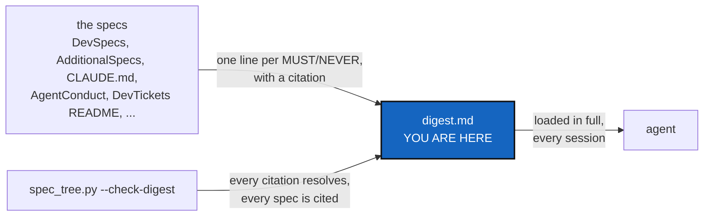

# Digest — every MUST/NEVER rule in the spec tree, one line each

*Created: 2026-09-25*

## Abstract — read this first

**What this document is.** The binding rules of this project's spec tree,
compressed to one line each, with a citation back to its source. No
rationale, no abstract, no example — that stays in the source, on purpose.
**`DevSpecs.md` comes first**, because it states what the package *is* —
one monolithic package, domain logic in classes, one CLI as the only way
in — and every other rule is a rule about changing that thing.

**Why it exists.** `main_1-7_SpecTree_DevPlanTicket.md` §1: a rule that is
correctly stated but two hops behind a pointer, read once, competes badly
against a freshly-repeated instruction sitting one token away from where
it needs to win. This file is what a session loads in full, every time,
so the rule is adjacent instead of buried — see `CLAUDE.md`'s own
pointer to this file for the instruction to do so.

**What you will find.** One bulleted list, grouped by topic, each line
ending in a source citation `` `File.md` §N ``. `scripts/spec_tree.py
--check-digest` verifies every citation still resolves inside the spec
tree, **and that every declared spec is cited by at least one line** — a
spec that states rules and is never cited is the gap this file once had
(it held no line from `DevSpecs.md` at all). A spec that genuinely states
no rule is named in `spec_tree.py`'s `DIGEST_EXEMPT`, with its reason. The
check cannot verify a line still says what its source currently says —
that is this file's own editorial upkeep, not a graph property.

**Who it is for.** Any agent, at the start of any session in this
repository, before drafting a commit, a push, a version bump, or a
ticket.

**What you need to do with it.** Read it in full — it is short by
design. When a line and its source disagree, the source wins; fix this
file to match, in the same change that noticed the drift.

---

## What this package is

- The project is one self-contained deliverable: no plugins, adapters, or loosely coupled extension points unless the project's purpose is to be a framework. — `DevSpecs.md` §Monolithic Canonical API
- Domain concepts are classes that own their own validation, serialisation and lifecycle; no free-standing function mutates shared state. — `DevSpecs.md` §Object-Oriented Design
- Every `.py` has one clear major class that gives the module its name, and at most two or three classes in all. — `AdditionalSpecs.md` §Module shape
- A source file that passes 2000 lines and holds more than one class becomes a directory of that name, split so each file keeps one major class; a file holding a single class is recorded at its size and never grows without the owner's raise. — `AdditionalSpecs.md` §Module shape
- `memory/` and the ledger are class-based: no domain concept there lives in module-level functions. — `AdditionalSpecs.md` §Module shape
- `cli/` is the one exemption from the class rules: it is derived from client methods implemented elsewhere, and it collects arguments and prints. — `AdditionalSpecs.md` §Module shape
- Every entry point shares one implementation — no hidden forks — and CLI behaviour mirrors the Python API one-to-one. — `DevSpecs.md` §Monolithic Canonical API
- A capability exists in both layers or in neither: a `ComplexGitSyncClient` method carries the semantics, `cli/` only collects arguments and prints. — `AdditionalSpecs.md` §Responsibility boundaries
- A CLI follows one grammar: a subcommand is a plain word, a `--name` is only an option (it changes how, never which, action runs), and a `-x` is only the short form of a `--name`. — `DevSpecs.md` §CLI Grammar
- A hyphen never glues a command to its subcommand (`close-branch` is spelled `branch close`), and a command either has subcommands or acts itself, never both. — `DevSpecs.md` §CLI Grammar
- Every exported symbol appears in its module's `__all__` and is documented. — `DevSpecs.md` §Object-Oriented Design
- The module shape is measured by `check_oo_conformance.py` against a baseline that only shrinks; never add a module to one of its lists to make the check pass. — `AdditionalSpecs.md` §Module shape
- A released `.gts` integrity schema is immutable: any change to what a State's name hashes, or how, is a new `integrity_schema` with the old one still verifiable. — `AdditionalSpecs.md` §What a State's name is computed from
- A memory is never merged file by file: a tree-wide merge keeps the target's memory whole and records the source's as history, and two branches with no common commit are refused by name, never offered `--resolve`. — `AdditionalSpecs.md` §Responsibility boundaries
- Configuration and state are exchanged as structured data, never raw string manipulation; every document class carries `to_*`/`from_*` helpers. — `DevSpecs.md` §Interface Conventions
- Python work goes through `pixi` — never bare `pip`, `python -m pip`, or `venv`, in code, docs, or CI. — `DevSpecs.md` §Python Environment and Package Management
- That includes the route a user installs by: no `pipx`, no `pip install`, no other installer, because one consistent tool per project means Pixi end to end. — `DevSpecs.md` §Python Environment and Package Management

## The two levels

- Every agentic topic has one shared pattern and at most one local fill-in; a fill-in opens with a `*Fills in:*` line naming its pattern and states only the project's choices, names and exceptions — it never restates the pattern. — `SpecTree.md` §2
- A rule goes in the digest, and a mount or spec file in the manifest, in the same change that adds it; `pixi run check-spectree` fails on drift. — `SpecTree.md` §3–§5
- The user install (`install.cgs`, at the public repository's root) mounts no private repository; the developer install (`<project-name>4dev.cgs`) adds every agentic mount and the project's memory. — `DevSpecs.md` §Two installs
- An open ticket is cited by name, never by path, because finishing it renames it. — `TICKETLIFECYCLE.md` §2.2
- `pixi run check-ceilings` fails on a dead `.agent/` path cited in `src/`, `scripts/` or (for `DevTickets/`) `tests/`, on an open ticket cited by path, and on a broken link inside an open ticket; a mount that is not checked out is skipped. — `AdditionalSpecs.md` §Spec tree

## Attribution and commits

- An agent is never credited on a commit, merge, or pull request — no co-authorship trailer, no "generated with" line, in any repository of the tree. — `AgentConduct.md` §3
- In the public front (the `project`-scope repositories, `ComplexGitSync` and `DocComplexGitSync`), an example that needs an agent's vendor or model uses the placeholders `vendor-name` and `model-name`; the agent is named publicly only in README's *LLM assistance* section. — `cgitsync-dev.md` §Whose data this is, and attribution
- In private repositories (`private/local`, `private/distant`) specs, tickets and records keep the real vendor and model: that is where the parameters get their values, and they are never replaced by placeholders. — `cgitsync-dev.md` §Whose data this is, and attribution
- A self-history/accounting record of an agent's work must never reach a public repository, and nothing in it may be copied into one. — `AgentConduct.md` §3
- Never push to a remote without being asked; deliver the commit message and let the owner decide whether to commit. — `AgentConduct.md` §1
- A commit message starts with `<project-name><version>`, is one message reused for every repository the change touched, plain English, three lines at most. — `AgentConduct.md` §2
- `cgitsync commit` refuses a message that breaks that rule — wrong prefix, more than three lines, a backtick, a `$(`, or an agent-credit trailer — in a tree that adopts DevSpec, naming the rule it broke. — `cgitsync-dev.md` §Before committing, step 8

- ComplexGitSync rewrites nothing: no command, `autofix` included, amends, rebases, squashes, filters or force-pushes, and none changes a commit message once made, even when handed a corrected one. — `AdditionalSpecs.md` §The hard prohibitions
- `autofix` eases merges and repairs only by adding a commit; for a bad commit message it names the commit and the rule, proposes ways to extract the message intact, and does nothing else. — `AdditionalSpecs.md` §The hard prohibitions
- A ticket that asks ComplexGitSync to rewrite history is wrong: do not build it, send it back to the owner. — `AdditionalSpecs.md` §The hard prohibitions
- `branch close` keeps what a branch alone holds on `ancestors` and records the move before renaming; `ancestors` is never closed, deleted or forced, and `branch delete` deletes nothing until every repository is `safe` or `recorded`. — `AdditionalSpecs.md` §The hard prohibitions

## Before a task is finished

- CI never writes a version: a bump is a release decision made by a reader, through `pixi run bump-version`. — `.agent/.distant/dev-sync/Versioning.md`
- `pixi run lint` and `pixi run test` must both pass before any task is considered closed. — `cgitsync-dev.md` §Before committing, step 1
- Run `pixi run bump-build` for any change under `src/`. — `cgitsync-dev.md` §Before committing, step 2
- Every `bump-build` is followed by `pixi run bump-version`, at `patch` at least, in the same change — even for a follow-up fix to a version not yet committed; a change outside `src/` that changes what a script or command does is released at `patch` too; "patch" from the owner means this. — `.agent/.distant/dev-sync/Versioning.md`
- `cgitsync status`, run from the tree's own root, must show `errors=0` before a task is finished. — `cgitsync-dev.md` §Before committing, step 3
- Never hand-edit a version field; run `pixi run bump-version` — the one command that syncs all of them. — `cgitsync-dev.md` §Before committing, step 4
- Document any new CLI command in `docs/Text/user_guide.tex` and its client method in the API docs — never in `README.md`. — `cgitsync-dev.md` §Before committing, step 7
- The root `README.md` is a short user front page: what the tool is for, install, how `--help` reaches every command, the use cases with their tutorials; never a command table, an option list or internals. — `cgitsync-dev.md` §Before committing, step 7

## Implementing a ticket

- Implementing a ticket takes a worker agent and an independent orchestrator agent; the owner saying `implement <ticket>` is the explicit request to launch the orchestrator with the Agent tool, in the foreground, and needs no further permission. — `CLAUDE.md` §When the owner says implement
- A ticket's Decisions for the owner are asked before the first edit; a recommendation is never taken as the answer. — `AgentConduct.md` §4.1
- The worker never runs `bump-version`, writes a self-history record, or scores its own work; the orchestrator does, and re-quotes after every fix. — `AgentConduct.md` §4.1
- A planning ticket archived on or after 2026-10-09 needs an orchestrator's self-history record naming it: `pixi run check-tickets` fails without one, and `cgitsync commit` refuses to add it. — `AdditionalSpecs.md` §Responsibility boundaries
- A conformity score is out of 100 (33 spec respect, 33 gating, 34 quality), its total is the plain sum, and it is always shown with its maxima. — `AdditionalSpecs.md` §The conformity score
- A planning ticket's filename branch prefix and its own `*Branch:*` line must agree. — `TICKETLIFECYCLE.md` §2.3
- A short ticket is stamped and moved to `archive/.closedUserTicket/` in the same change that satisfies it, and never edited afterwards. — `TICKETLIFECYCLE.md` §6
- Archiving a planning ticket writes two copies in one change: the history ticket in `archive/`, whose only allowed edit is a corrected link, and an immutable deep-archived copy in `archive/.deepArchive/`, never edited at all. — `TICKETLIFECYCLE.md` §4.1
- One concern per commit across agents: a `DELETE`/`MOVE`/`CHANGE` by one role is never bundled with another role's change. — `.agent/.distant/dev-sync/AGENT.md` §Handoff rules

## Documents

- Every Markdown document opens with an abstract carrying a mermaid graph. — `DOCSTYLE.md` §1
- The one exception is the project's root `README.md`, the user's front page; every other document, every other `README.md` included, opens with its abstract and graph. — `CLAUDE.md` §Document conventions
- There is one authoritative file per purpose. — `DOCSTYLE.md` §7
- Documents and finishing reports are plain English. — `DOCSTYLE.md` §5
- A standalone LaTeX document under `docs/` keeps `\date{\today}` on its title page. — `AdditionalSpecs.md` §Document Formats
- Documents never carry dated "recent improvements" blocks that rot. — `DOCSTYLE.md` §6

## Architecture — single-implementation rules

- Every mount under `.agent/` that `examples/complexgitsync4dev.cgs` declares is named in `AgenticManifest.md`, and every spec file in it is listed there; `pixi run check-spectree` fails when they disagree. — `AgenticManifest.md`
- A memory the `.cgs` does not declare is created locally by ComplexGitSync and never pushed, even with a remote added by hand; only `memory adopt` opts in. — `AdditionalSpecs.md` §Architectural Overview
- `initialise` is the nested install and `bootstrap` the standalone one; each refuses the other's job by name before touching the disk. — `AdditionalSpecs.md` §The install frontier
- A tree holding any private repository is DEV and its memory is synced; one holding none is USER and its memory never leaves the disk; `WorkingGitTree.profile` is the only place that rule lives, and a DEV tree with no declared memory is offered one or warned, never refused. — `AdditionalSpecs.md` §The tree profile
- `.gts` prevails over `.cgs`: a hand-edited `.cgs` must never widen write access behind an attested snapshot. — `AdditionalSpecs.md` §Architectural Overview
- `.agent/` is a plain directory and never itself a mounted repository: `propagate_privacy` caps a nested repository's writability at its parent's, and no parent is both writable and distant. — `AgenticManifest.md` §Mounts
- `parse_repo_id()` in `cgs_format.py` is the only repo-identifier parser in the codebase. — `AdditionalSpecs.md` §Responsibility boundaries
- `git_branch.py` is the only implementation of the `.cgs` branch fallback chain and the privacy rule. — `AdditionalSpecs.md` §Responsibility boundaries
- `git_runner.py` is the sole module allowed `import subprocess`. — `AdditionalSpecs.md` §Responsibility boundaries
- `universal_clock.py` is the sole reader of the real wall clock, PID, or entropy source; every other module takes an injected `ClockProtocol`. — `AdditionalSpecs.md` §Responsibility boundaries
